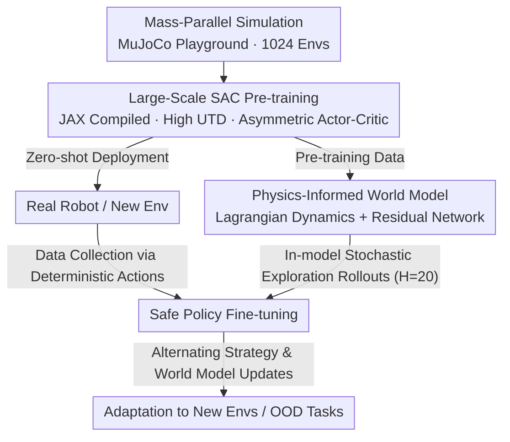

# Towards Bridging the Gap between Large-Scale Pretraining and Efficient Finetuning for Humanoid Control

**Conference**: ICLR 2026  
**arXiv**: [2601.21363](https://arxiv.org/abs/2601.21363)  
**Code**: [https://lift-humanoid.github.io](https://lift-humanoid.github.io)  
**Area**: Reinforcement Learning  
**Keywords**: Humanoid control, Large-scale pre-training, Efficient fine-tuning, SAC, Physics-informed world model, Sim-to-real

## TL;DR
LIFT proposes a three-stage pre-training and fine-tuning framework: (i) large-scale parallel SAC pre-training to achieve zero-shot deployment; (ii) offline pre-training of a physics-informed world model based on Lagrangian dynamics; (iii) efficient fine-tuning with deterministic action execution and stochastic exploration within the world model. The full pipeline from simulation to the real world was verified on Booster T1 and Unitree G1 humanoid robots.

## Background & Motivation

**Background**: PPO has become the mainstream method for humanoid robot control due to its robust convergence in large-scale parallel GPU simulations, enabling zero-shot deployment. However, the low sample efficiency of on-policy methods limits their ability to safely adapt to new environments.

**Limitations of Prior Work**: (1) Insufficient attention has been paid to using off-policy methods for large-scale parallel training; (2) Stochastic exploration during fine-tuning may damage actuators or lead to unsafe states, which is particularly dangerous for humanoid robots with small support polygons; (3) Training model-based methods from scratch is extremely time-consuming and prone to falling into local optima.

**Key Challenge**: Large-scale pre-training requires the stability and parallel efficiency of on-policy methods, while efficient fine-tuning requires the sample efficiency of off-policy methods and the data efficiency of model-based methods.

**Goal**: How to unify the selection of algorithms across the pre-training and fine-tuning stages while ensuring both safety and efficiency?

**Key Insight**: Utilize SAC as a unified backbone. In the pre-training stage, use mass-parallel training with high UTD (Update-To-Data) ratios. In the fine-tuning stage, restrict stochastic exploration to within the world model, executing only deterministic actions in the real environment.

**Core Idea**: SAC runs through the entire pre-training-fine-tuning process, a physics-informed world model bridges simulation and reality, and deterministic execution combined with in-model exploration achieves safe and efficient fine-tuning.

## Method

### Overall Architecture
LIFT is divided into three stages. The central Mechanism is "leveraging GPU parallelism in the pre-training stage for wall-clock efficiency, using the world model in the fine-tuning stage for sample efficiency, and using the same SAC framework throughout": (i) Large-scale SAC pre-training based on JAX (1024 parallel environments, high UTD=10), achieving fast convergence in MuJoCo Playground and zero-shot deployment on real robots; (ii) Offline training of a physics-informed world model using data generated during the pre-training stage; (iii) Collecting data by executing only deterministic actions in new environments, moving all stochastic exploration into the world model to generate synthetic trajectories, and alternating the fine-tuning of the policy and the world model to safely adapt to new environments and out-of-distribution (OOD) tasks.

### Key Designs

**1. Large-Scale SAC Pre-training: Enabling Off-policy Methods to Leverage GPU Parallelism**

PPO became the mainstream for humanoid control because mass-parallel simulation provides stable convergence; however, as an on-policy method, its low sample efficiency makes it difficult to adapt safely to new environments during fine-tuning. LIFT aims to replace it with SAC, an off-policy method. The challenge lies in making SAC match the wall-clock efficiency of PPO. This is achieved by fully compiling SAC using JAX and fixing tensor shapes to trigger efficient operator fusion, allowing for large-batch updates (batch=1024) and high UTD (Update-To-Data ratio = 10) in 1024 parallel environments without introducing extra communication overhead. The architecture uses asymmetric actor-critic—the actor receives only the proprioceptive state $s_t$ (available during deployment), while the critic receives states with privileged information $s_t^p$ (available in simulation). SAC is chosen over PPO also because its off-policy nature naturally integrates with subsequent model-based fine-tuning, and its state-dependent stochastic policy provides richer exploration diversity during world model rollouts.

**2. Physics-Informed World Model: Returning Known Rigid Body Dynamics to Equations**

Pure neural network world models generalize poorly with limited data, often producing physically implausible predictions that cause critic loss to explode. LIFT adopts a hybrid model: the core structure is handled by the Lagrangian equation:

$$M(q_t)\ddot{q_t} + C(q_t,\dot{q_t}) + G(q_t) = B\tau_t + J^\top F^e_t + \tau^d_t$$

Where the inertia matrix $M$, Coriolis items $C$, gravity items $G$, and actuation mapping $B$ are determined by the robot's geometric/inertial parameters and are treated as known. Only the difficult-to-model contact forces and dissipation terms $J^\top F^e_t + \tau^d_t$ are left for the residual network $\tau_\phi(s_t,a_t)$ to approximate. Training uses Gaussian negative log-likelihood (NLL) with variance, where the one-step prediction error of privileged states is weighted by the predicted variance:

$$\mathcal{L}_\phi = \frac{1}{B}\sum_{b=1}^{B}\big((\hat{s}^p_{b,t+\Delta t} - s^p_{b,t+\Delta t})^2 \odot \exp(-\log\sigma^2_{b,t}) + \log\sigma^2_{b,t}\big)$$

This allows the world model to inherit the inductive bias of rigid body dynamics, enabling physically consistent rollouts even when data is sparse, thus preventing critic contamination.

**3. Safe Fine-tuning Strategy: Deterministic Actions in the Environment, Exploration Kept within the World Model**

Humanoid robots have small support surfaces and are extremely sensitive to disturbances during single-support phases. Direct stochastic exploration on real hardware or in new environments can easily damage actuators or lead to falls. LIFT decouples exploration from execution: it executes only deterministic actions (action mean) of the policy in the real environment to collect data, while all stochastic exploration is moved inside the world model. It samples initial states from the replay buffer and performs autoregressive rollouts for $H_{wm}=20$ steps to generate synthetic trajectories for training the actor-critic. Rollouts also include safety resets: if base height, velocity, attitude, or joint states exceed predefined thresholds, the trajectory is terminated immediately. Alternating updates to the policy and world model ensure the real robot maintains safe deterministic behavior while sample efficiency is supplemented by in-model exploration.

### Loss & Training
- **Pre-training**: Standard SAC objective + Optuna hyperparameter optimization (approx. 10 hours). Booster T1 training time was reduced from 7 hours to 30 minutes.
- **World Model**: Gaussian negative log-likelihood loss; end-to-end gradients backpropagate through normalization, coordinate transforms, PD controllers, and Euler integration.
- **Fine-tuning**: Multi-epoch autoregressive training to enhance sample efficiency; autoregressive loss with lengths of 2-4 stabilizes learning.

## Key Experimental Results

### Main Results (Pre-training on 6 Humanoid Tasks)
- LIFT achieves peak returns comparable to PPO/FastTD3 across all flat terrain tasks.
- Stabilizes at peak performance faster on rough terrain.
- Completed Booster T1 pre-training within 30 minutes on a single GPU (RTX 4090).

### Fine-tuning Results (Brax Environment, 8 Seeds)

| Scenario | LIFT | SAC | PPO | FastTD3 | SSRL |
|------|------|-----|-----|---------|------|
| In-Distribution (0.6 m/s) | ✓ Converged | Diverged | Initial success then collapsed | Oscillated then collapsed | Shows convergence but sub-par |
| Long-Tail (1.0 m/s) | ✓ Converged | Diverged | Collapsed | Collapsed | Did not converge |
| OOD (1.5 m/s) | ✓ Converged | Diverged | Collapsed | Collapsed | Did not converge |

Fine-tuning requires only $4 \times 10^4$ environment steps (approx. 800 seconds of online interaction).

### Ablation Study

| Configuration | Result |
|------|------|
| Full LIFT (SAC Pre-train + WM Pre-train) | Converges to target speed within 4×10⁴ steps |
| Without WM Pre-training | Still converges but significantly slower |
| Without SAC+WM Pre-training (=SSRL) | Only learns to stand, near-zero forward speed |
| MBPO ensemble replacing physics-informed WM | Does not converge, critic loss explodes |

### Key Findings in Real-world Fine-tuning
- After 80-590 seconds of real-world data collection, the robot demonstrated a more upright posture, smoother gait, and more stable forward velocity.
- Limitation: Relies on Vicon motion capture for base height estimation; IMU integration suffers from drift.

## Highlights & Insights
- **Advantage of Unified Backbone**: Using SAC throughout pre-training and fine-tuning avoids objective inconsistency and forgetting caused by switching algorithms.
- **Criticality of Physics Priors**: Ablation experiments quantitatively prove that pure neural network world models fail completely with limited data; physics priors provide the necessary generalization and inductive bias.
- **Safe Exploration Paradigm**: The combination of deterministic execution and in-model stochastic exploration is a generalizable paradigm with significant reference value for any robotic system requiring safe fine-tuning.
- **Engineering Contribution**: Identified and corrected state mapping errors in the SSRL code, such as adding base height to privileged states—which is critical for humanoid robots.

## Limitations & Future Work
- Currently utilizes only proprioceptive observations; lacks support for visual input.
- Real-world fine-tuning depends on external motion capture systems and IMU integration.
- The fine-tuning pipeline is synchronous (data collection → training); an asynchronous pipeline could significantly improve efficiency.
- Action residuals may be unbounded (compared to delta-action methods like ASAP).

## Related Work & Insights
- **vs PPO**: PPO degrades and collapses under deterministic data collection and limited data, making it unsuitable for fine-tuning scenarios.
- **vs SSRL**: LIFT is essentially a pre-training-enhanced version of SSRL, validating that training model-based methods from scratch is unfeasible for humanoids.
- **vs FastTD3**: While FastTD3 achieves large-scale off-policy training, it lacks fine-tuning validation and sim-to-real demonstration.
- **vs DreamerV3**: Dreamer uses a latent world model and learned reward, which is unstable under deterministic data collection.

## Rating
- Novelty: ⭐⭐⭐⭐ Systematic solution for humanoid robots combining a pre-training/fine-tuning framework with a physics-informed world model.
- Experimental Thoroughness: ⭐⭐⭐⭐⭐ Simulation + Real-world, multi-platform (T1/G1), multi-scenario (in/out distribution), and detailed ablations.
- Writing Quality: ⭐⭐⭐⭐ Clear motivation and reasonable ablation design, though the paper is quite long.
- Value: ⭐⭐⭐⭐⭐ Provides a complete open-source pipeline with direct practical value for the humanoid robot learning community.

<!-- RELATED:START -->

## Related Papers

- [\[ICLR 2026\] Emergent Dexterity via Diverse Resets and Large-Scale Reinforcement Learning](emergent_dexterity_via_diverse_resets_and_large-scale_reinforcement_learning.md)
- [\[ICLR 2026\] RoboCasa365: A Large-Scale Simulation Framework for Training and Benchmarking Generalist Robots](robocasa365_a_large-scale_simulation_framework_for_training_and_benchmarking_gen.md)
- [\[ICLR 2026\] Rethinking Policy Diversity in Ensemble Policy Gradient in Large-Scale Reinforcement Learning](rethinking_policy_diversity_in_ensemble_policy_gradient_in_large-scale_reinforce.md)
- [\[ICLR 2026\] From Language to Locomotion: Retargeting-free Humanoid Control via Motion Latent Guidance](from_language_to_locomotion_retargeting-free_humanoid_control_via_motion_latent_.md)
- [\[ICLR 2026\] HWC-Loco: A Hierarchical Whole-Body Control Approach to Robust Humanoid Locomotion](hwc-loco_a_hierarchical_whole-body_control_approach_to_robust_humanoid_locomotio.md)

<!-- RELATED:END -->
