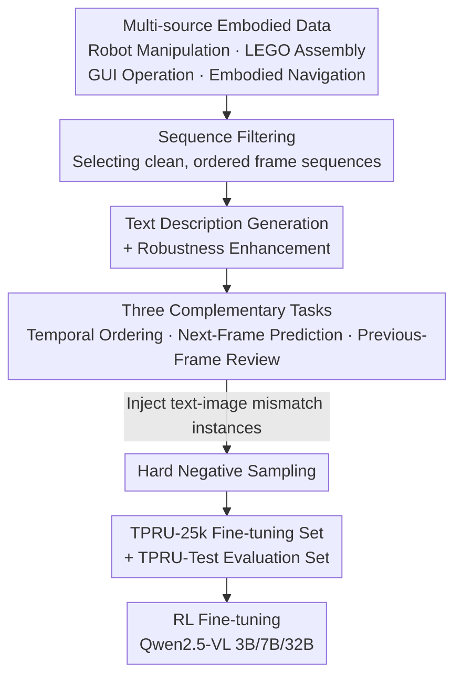

# TPRU: Advancing Temporal and Procedural Understanding in Large Multimodal Models

**Conference**: ICLR 2026  
**arXiv**: [2602.18884](https://arxiv.org/abs/2602.18884)  
**Code**: [https://github.com/Stephen-gzk/TPRU/](https://github.com/Stephen-gzk/TPRU/)  
**Area**: Reinforcement Learning / Multimodal Large Models  
**Keywords**: Temporal Understanding, Procedural Reasoning, Multi-image Understanding, RL Fine-tuning, MLLM, Embodied AI

## TL;DR
TPRU constructs a large-scale multi-image temporal understanding dataset (24,750 QA pairs, 126,000 images) covering 3 complementary tasks (Temporal Ordering, Next-Frame Prediction, and Previous-Frame Review) across 4 embodied scenarios. Through reinforcement learning fine-tuning, the 7B model surpasses GPT-4o in temporal understanding.

## Background & Motivation

**Background**: MLLMs perform excellently on single-image tasks, but small, deployable models exhibit significant deficiencies in understanding temporal and procedural image sequences. This capability gap is a critical bottleneck for Embodied AI deployment (robotics, navigation, instruction following).

**Limitations of Prior Work**: (1) Systematic training paradigm failure—existing datasets treat multiple images as unordered collections, ignoring the crucial distinction between "understanding a set of images" and "understanding a sequence of images"; (2) The community's response has been to create evaluation-only benchmarks to repeatedly confirm failure rather than addressing the root cause (lack of large-scale real-world sequential training data).

**Key Challenge**: Resource-constrained edge devices cannot deploy models with tens of billions of parameters, but the lack of procedural understanding in small models prevents their use in embodied scenarios. Is this an inherent limitation of "model scale" or a "training data" issue?

**Goal**: (1) Provide a large-scale, structured temporal understanding training set to fill the train-test gap; (2) Verify whether small models can achieve large-model-level temporal understanding through correct data and training methods.

**Key Insight**: Collect real sequential data from 4 embodied scenarios, design 3 complementary tasks to cover different aspects of temporal reasoning, and introduce hard negative samples to force models into active verification rather than passive observation.

**Core Idea**: Enable small models to attain temporal and procedural understanding superior to large models through structured data + RL training, proving this is a training challenge rather than an inherent scale constraint.

## Method

### Overall Architecture
TPRU aims to solve the problem where small models cannot "read" image sequences—existing data treats multiple images as unordered sets, so models naturally fail to learn temporal direction. The entire solution results in two products: TPRU-25k (fine-tuning set, 24,750 samples) and TPRU-Test (461 manually annotated evaluation samples). Data is collected from 4 real embodied scenarios (**Multi-source Embodied Data**) and processed through a pipeline: first, sequence filtering selects clean, ordered frame sequences; next, text descriptions are generated for each sequence with robustness enhancement; finally, sequences are translated into QA samples for **three complementary tasks**, incorporating **Hard Negative Sampling** to force the model to truly examine the images. The resulting dataset is ultimately used for Reinforcement Learning (RL) fine-tuning of Qwen2.5-VL. These three designs correspond to "where the data comes from," "what tasks to learn," and "how to force the model to truly observe images."

### Key Designs

**1. Multi-source Embodied Data: Ensuring temporal understanding is a general capability rather than a single-domain pattern**

If sequences from only one scenario were used, the model would easily memorize fixed patterns of that domain instead of truly understanding temporal order. TPRU therefore collects real sequences across 4 unrelated embodied scenarios: Robot Manipulation from ShareRobot planning task video frame sampling; LEGO Assembly using 36 high-quality stop-motion videos with no motion blur and clear states at each step; GUI Operation from 4-step screenshot sequences in GUI Odyssey; and Embodied Navigation from ordered visual observations in the Habitat simulation environment. The dynamic patterns across these four scenarios vary greatly (robotic arm trajectories, block stacking, interface transitions, spatial movement), and training on them simultaneously forces the model to extract cross-scenario shared temporal reasoning capabilities.

**2. Three Complementary Tasks: Forcing procedural understanding from forward, backward, and global perspectives**

A single task can only cover one side of temporal reasoning; TPRU assembles them using three tasks. **Temporal Ordering** shuffles the frame sequence and requires the model to restore the correct arrangement based on text descriptions, testing the grasp of the complete timeline. **Next-Frame Prediction** provides frames 1, 2, and 4, requiring the model to select the correct frame 3 from candidates, where distractors are taken from similar scenes—equivalent to an agent predicting the consequence of an action. **Previous-Frame Review** works backwards, providing the last 3 frames and requiring selection of the correct initial frame from candidates, corresponding to understanding preconditions and event tracing. The superposition of forward prediction, backward review, and global ordering forces out structured dynamic understanding of "how a sequence evolves step-by-step."

**3. Hard Negative Sampling: Forcing the model to truly observe images and not rely on text priors**

A common shortcut for models is to only read text prompts and guess answers without carefully looking at images. To block this path, TPRU intentionally constructs instances where text and images do not match—for example, the text says "pick up a fork" while the image shows "putting down a knife." In such cases, the correct answer is "None of the choices provided." The model must explicitly perform cross-modal verification (what is actually happening in the image vs. what the text claims is happening) to answer correctly. This step directly targets hallucinations and the problem of over-reliance on text priors.

### Loss & Training
Qwen2.5-VL (3B/7B/32B scales) is fine-tuned using Reinforcement Learning (RL), focusing on enhancing the temporal reasoning capabilities of resource-constrained small models. Specific RL training details and reward designs are provided in the paper's appendix.

## Key Experimental Results

### TPRU-Test Main Results

| Model | Parameters | Accuracy |
|------|--------|--------|
| Qwen2.5-VL-7B (base) | 7B | 50.33% |
| **TPRU-7B** | **7B** | **75.70%** |
| GPT-4o | Closed | <75.70% |
| Qwen2.5-VL-72B | 72B | - |
| Gemini-2.5-Flash | Closed | - |

TPRU-7B achieves a 25.37 percentage point improvement over the base version, significantly surpassing GPT-4o.

### MuirBench Results

| Model | Overall |
|------|---------|
| Qwen2.5-VL-7B (base) | 58.35% |
| **TPRU-7B** | Significant Gain |
| **TPRU-32B** | **68.42%** |
| GPT-4o | 68.00% |
| Qwen2.5-VL-72B | 69.35% |

TPRU-32B surpasses GPT-4o and approaches the performance of the 72B model. Improvements in the Ordering category are particularly significant.

### LEGO-Puzzles Evaluation
TPRU-7B demonstrates substantial improvements in multi-step planning and procedural reasoning on LEGO-Puzzles.

### Key Findings
- The temporal reasoning gap is not an inherent limitation of model scale but a challenge that can be addressed through targeted data and RL training.
- The complementarity of the three tasks is crucial—ablation studies show that removing any task degrades performance.
- Negative samples are essential for preventing hallucinations and over-reliance on text priors.
- RL fine-tuning is more effective than SFT for these types of tasks.

## Highlights & Insights
- **Unified Train-Eval**: Breaks the cycle of "create benchmark → confirm failure → create another benchmark" by providing both training data and evaluation tools.
- **Small Model Superiority**: The result of a 7B model surpassing GPT-4o overturns the assumption that "temporal understanding requires massive models."
- **Utility-Oriented Design**: Data originates from real embodied scenarios rather than synthetic data, with task designs directly corresponding to agent capability requirements.
- **RL Training Paradigm**: Demonstrates the effectiveness of RL in enhancing MLLM reasoning capabilities, surpassing traditional SFT.

## Limitations & Future Work
- While diverse, the TPRU-25k scale can be further expanded.
- Current focus is on short sequences (3-4 frames); procedural understanding of longer sequences remains to be explored.
- The connections and differences between video understanding and multi-frame image understanding require further research.
- There may be better solutions for reward design in RL training.

## Related Work & Insights
- **vs Mantis-Instruct/LLaVA-NeXT-Interleave**: These datasets treat multi-images as unordered sets and lack systematic temporal structure.
- **vs MuirBench/LEGO-Puzzles**: These are evaluation-only benchmarks; TPRU fills the gap by providing training data.
- **vs Jigsaw-R1/MiCo**: While these use procedurally generated puzzles to train spatial reasoning, TPRU uses real-world scenarios to train temporal reasoning.

## Rating
- Novelty: ⭐⭐⭐⭐ Dataset design and the three-task framework are innovative; the combination of RL and temporal understanding is valuable.
- Experimental Thoroughness: ⭐⭐⭐⭐⭐ Conducted across multiple benchmarks (TPRU/MuirBench/LEGO), multiple model scales, and multiple method comparisons.
- Writing Quality: ⭐⭐⭐⭐ Clear motivation and well-designed pipeline diagrams, though the dataset description is slightly exhaustive.
- Value: ⭐⭐⭐⭐⭐ Directly valuable to Embodied AI and deployable MLLMs; dataset and code are open-sourced.

<!-- RELATED:START -->

## Related Papers

- [\[ICLR 2026\] PixelVLA: Advancing Pixel-level Understanding in Vision-Language-Action Model](pixelvla_advancing_pixel-level_understanding_in_vision-language-action_model.md)
- [\[ICLR 2026\] Emergent Dexterity via Diverse Resets and Large-Scale Reinforcement Learning](emergent_dexterity_via_diverse_resets_and_large-scale_reinforcement_learning.md)
- [\[ICLR 2026\] RoboCasa365: A Large-Scale Simulation Framework for Training and Benchmarking Generalist Robots](robocasa365_a_large-scale_simulation_framework_for_training_and_benchmarking_gen.md)
- [\[ICLR 2026\] Vision-Language-Action Instruction Tuning: From Understanding to Manipulation](vision-language-action_instruction_tuning_from_understanding_to_manipulation.md)
- [\[ICLR 2026\] CompassNav: Steering From Path Imitation to Decision Understanding In Navigation](compassnav_steering_from_path_imitation_to_decision_understanding_in_navigation.md)

<!-- RELATED:END -->
