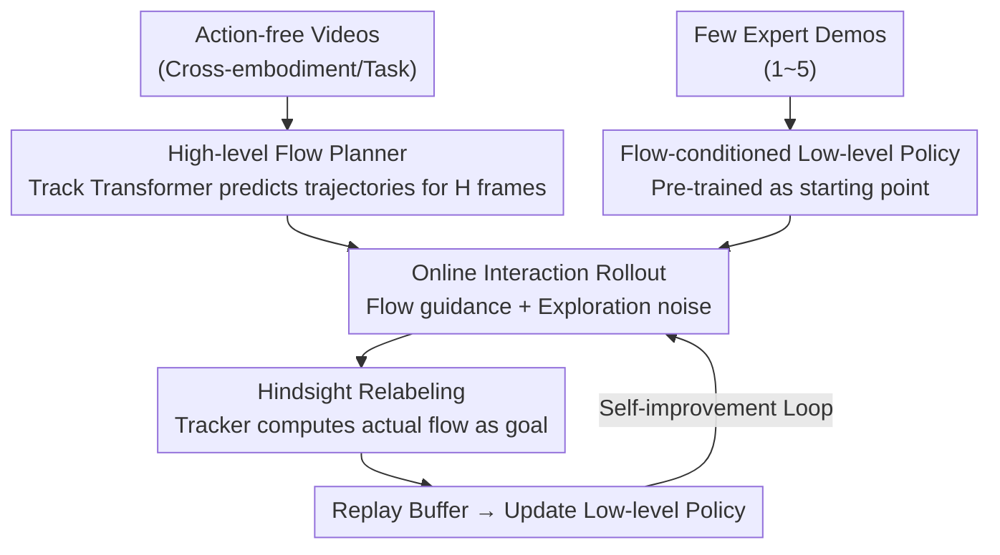

# Translating Flow to Policy via Hindsight Online Imitation

**Conference**: ICLR 2026  
**OpenReview**: [https://openreview.net/forum?id=dQ6d5bgXtM](https://openreview.net/forum?id=dQ6d5bgXtM)  
**Project Page**: [https://dwjshift.github.io/HinFlow](https://dwjshift.github.io/HinFlow)  
**Area**: Robotics / Embodied AI  
**Keywords**: Hierarchical Robotics, Point Flow Planning, Imitation Learning, Hindsight Relabeling, Online Self-Improvement

## TL;DR
HinFlow enables robots to interact with their environment guided by high-level point flow planners. By relabeling the **actual flows achieved** in each rollout as the intended goals, it provides supervision for training goal-conditioned imitation policies online. This approach achieves an 84% success rate with only 1–5 expert demonstrations, outperforming the strongest baseline by $1.45\times$.

## Background & Motivation

**Background**: To bypass the dependency of end-to-end learning on massive amounts of real-world robot data, hierarchical systems decompose control into two layers: a high-level planner breaks tasks into subgoals, and a low-level controller executes them. High-level planners can be trained on large-scale action-free videos (even across different embodiments and tasks). **Point flow** (2D trajectories of keypoints over future frames) is a popular subgoal representation because it explicitly encodes physical motion, is robust to appearance/lighting changes, and is more compact than image goals.

**Limitations of Prior Work**: While high-level planners are easy to train, **translating flow into executable actions (flow-to-policy) is difficult**. Some methods use analytical or optimization-based approaches to inverse actions from flow, but these rely heavily on rigid-body assumptions and fail under occlusion or non-rigid deformation. Others learn data-driven goal-conditioned policies, which are more general but require expensive, high-quality in-domain action data, undermining the original motivation for scalable skill acquisition.

**Key Challenge**: High-level planning capabilities can scale infinitely via cheap videos, yet low-level execution is bottlenecked by expensive real-world action data. Existing online methods (e.g., using video prediction to construct rewards for Reinforcement Learning) face common issues of inefficient exploration under visual rewards and difficult optimization of long-horizon tasks.

**Goal**: Enable low-level policies to learn to execute high-level flow plans with **almost no expert action data**.

**Key Insight**: The authors observe that even if a robot fails to reach the exact goal provided by the planner, the interaction still "produces a certain flow." By treating this **actually achieved flow as the intended goal**, failed exploration is transformed into legitimate supervision. This follows the logic of hindsight relabeling but is applied to the compact representation of point flow.

**Core Idea**: Use "achieved as goal" hindsight relabeling to transform imperfect online rollouts into training data for goal-conditioned imitation. This converts flow planning into an executable policy via a simple, easy-to-optimize supervised learning objective without requiring large expert datasets.

## Method

### Overall Architecture
HinFlow consists of two components: a **hierarchical policy** (high-level flow planner + low-level flow-conditioned policy) and a **hindsight relabeling replay buffer**. First, a flow planner is trained on action-free videos, and a low-level policy is pre-trained on a few expert demonstrations to serve as an initial explorative starting point. Then, a self-improvement loop begins: the robot interacts with the environment guided by the planner, uses an off-the-shelf video tracker to compute the **actually achieved flow** from the rollout, and stores the "observation-action-achieved flow" triplets in the replay buffer to update the policy. Failed experiences become valid signals, creating a virtuous cycle of improvement.

### Key Designs

**1. Point Flow High-level Planner: Task-Relevant Motion as Universal Subgoals**

Low-level policies require a guidance signal that is both general and robust to visual perturbations. HinFlow chooses point flow: a set of initial points $p_0=\{(x_{0,k},y_{0,k})\}$ is selected in the first camera frame, and their future 2D trajectories are tracked using a video tracker (CoTracker3) to serve as training labels. At time $t$, the planner predicts subgoals $G_t=\{\hat p_i\}_{i=t}^{t+H}$ (point positions for the next $H$ frames). To ensure the guidance carries operational information, the authors use a **task-centric sampler**: under a third-person view, the end-effector and key objects are segmented, and points are sampled only within these regions. For wrist cameras where objects might leave the view, a fixed $32$-point grid is used. The planner follows the Track Transformer from ATM, tokenizing images and query points to process them through a multi-modal transformer, trained using a flow prediction loss $\min_\xi \mathbb{E}[L_{\text{flow}}(F_{\text{flow}}(o_t,p_t;\xi),\,p^{t+H}_{t+1})]$. Point flow filters out control-irrelevant factors like appearance and lighting.

**2. Hindsight Relabeling: Turning "Failed Exploration" into Valid Supervision**

This is the core of HinFlow. Due to data scarcity, low-level policies often fail to reach the precise flow targets given by the planner. However, the authors argue that the robot's rollout **objectively produces some flow**. By relabeling this actually achieved flow as the "intended goal," the failed experience becomes a successful demonstration for that specific target. Specifically, after a rollout $\{(o_t,a_t)\}_{t=1}^T$, a video tracker $\Phi$ processes the captured frames to compute the flow actually achieved at each step $\{p_i\}_{i=t}^{t+H}$. The resulting $(o_t,a_t,\{p_i\}_{i=t}^{t+H})$ triplets are stored in the replay buffer. This generates supervision "out of thin air" from the robot's own imperfect experiences. Unlike Online VPT, which uses inverse dynamics models to provide noisy action pseudo-labels for videos, HinFlow avoids this pitfall by using compact and robust point flow targets.

**3. Flow-conditioned Low-level Policy + Online Self-Imitation: Converging via Interaction**

The low-level policy $\pi(o_t, F_{\text{flow}}(o_t,p_t))$ is a transformer: spatial tokens from visual and proprioceptive encoders are concatenated with flow tokens to fuse guidance information, followed by MLPs to output actions (incorporating action chunking). Crucially, during training, **the flow is taken from the relabeled achieved flows in the replay buffer, not the predicted flows from the planner**, using the optimization objective $\min_\theta \mathbb{E}_{(o_t,a_t,\{p_i\})\sim D_r}[L(\pi(o_t,\{p_i\};\theta),a_t)]$. Interaction and optimization occur concurrently: after an initial pre-training to ensure "meaningful rollouts," the system continuously samples, relabels, and updates. Because the objective is essentially MSE imitation, it avoids the exploration challenges of RL under visual long-horizon rewards.

### Loss & Training
- **High-level**: Flow prediction loss (Eq. 2) on the labeled video set $\bar D_h$ using a Track Transformer.
- **Low-level**: Imitation loss (Eq. 3, typically MSE) with data sampled from the hindsight relabeling replay buffer $D_r$; initialized using a few expert demonstrations $D_a$.
- During the online stage, exploration noise is injected into each rollout; **no rewards or success signals are provided by the environment**, as the process is driven purely by self-imitation.

## Key Experimental Results

### Main Results
Seven manipulation tasks (four from LIBERO, three from ManiSkill3) were evaluated across 5 random seeds. Online methods interacted for 80K steps (~300–400 episodes).

| Setting | Avg. Success Rate | Note |
|------|-----------|------|
| HinFlow (Ours) | **84.0%** | **$1.45\times$** higher than strongest baseline |
| BC | Limited by demo count | Poor generalization from few demos |
| ATM (grid) / ATM (seg) | Limited by demo count | Offline flow policy; no online improvement |
| Online VPT | Slight gain in some tasks | High pseudo-label error from IDM |

In difficult tasks like Hide Chocolate and Pull Cube Tool, HinFlow improved policy performance from near 0% to an average of 75%. Real-world experiments (placing a mouse on a mat) further validated the approach:

| Method | Success Rate (20 trials) |
|------|----------------|
| BC | 4/20 |
| ATM (seg) | 8/20 |
| HinFlow | 8/20 → **19/20** |

Using only 100 action-free videos and 2 expert demos, success rates rose from 40% to 95% after 10,000 steps (~1 hour) of online interaction.

### Transfer & Generalization Results

| Experiment | Setup | Ours | Control |
|------|------|------|------|
| Cross-embodiment (Place Book, Franka→Kinova) | With vs. Without videos | 48.1% / 0.6% | — |
| Cross-embodiment (Poke Cube, Franka→xArm) | With vs. Without videos | 61.3% / 24.4% | — |
| Zero-shot (Place Butter, distractors) | Direct evaluation | 92.8% | BC 0.0% |
| Zero-shot (Place Butter, unseen target) | Direct evaluation | 96.2% | BC 6.5% |

Cross-embodiment videos provided a 40+ percentage point gain. The low-level policy remained robust to visual perturbations like distractors or new objects, whereas BC performance collapsed.

### Ablation Study

| Dimension | Configuration | Key Finding |
|----------|------|---------|
| Pre-training Demos | LIBERO 0/1/3, ManiSkill 0/2/5/10 | With 0 demos, exploration fails; with $\ge 1$, **final performance converges** regardless of initial quality. |
| Flow Horizon | 4 / 8 / 12 / 16 (Default 8) | 8/12/16 are all robust; horizon 4 drops significantly due to insufficient guidance. |

### Key Findings
- **Hindsight relabeling is the fundamental source of performance gains**: Removing online self-imitation (reverting to offline ATM) limits performance to the demonstration count.
- **A single demonstration is often enough**: Online improvement smooths out initial policy gaps, reducing the need for manual demonstrations.
- **Compact point flow targets provide robustness**: The abstraction of flow filters out task-irrelevant visual factors, enabling cross-embodiment and zero-shot generalization.

## Highlights & Insights
- **Redefining failure as success for a different goal**: While hindsight relabeling (HER) is a known technique, applying it to compact point flow avoids the high-dimensional errors of image goals or IDM pseudo-labels.
- **Short-range vs. Long-range flow**: Using short-range flows simplifies high-level prediction and frames the problem as "reproducing achieved flow," a subtle but powerful supervised learning design.
- **Reward-free self-supervised improvement**: The system does not require environmental rewards, bypassing the optimization nightmares of RL in visual tasks. This "imitation-based dimensionality reduction" for RL problems is highly transferable.

## Limitations & Future Work
- **Initial demonstrations still required**: The model cannot learn with zero starting demos. Future work could use open-world VLA models (e.g., $\pi 0$, OpenVLA) to provide initial trajectories.
- **Reliance on 2D point flow**: Complex 3D motions may be ambiguous; extending this to 3D motion fields is a potential direction.
- **Potential bias amplification**: Since the policy treats its own rollouts as ground truth, narrow early exploration could lead to suboptimal convergence (not fully explored in the paper).

## Related Work & Insights
- **vs. ATM (Wen et al., 2023)**: ATM uses Track Transformers but stays offline, limited by action data. HinFlow adds online self-imitation to break this bottleneck.
- **vs. Online VPT (Baker et al., 2022)**: HinFlow avoids noisy IDM pseudo-labels on action-free videos by using compact point flow instead of predicted actions.
- **vs. Flow-based RL (Guzey/Yu et al., 2025)**: While they use flow as dense rewards for RL, HinFlow uses short-range flow + self-imitation, reframing the problem as well-posed supervised learning.
- **vs. Image-based hindsight (Luo & Du, Zhou et al., 2025)**: HinFlow replaces video diffusion/VLM-generated image targets with 2D point flow, which is lower-dimensional and less sensitive to visual noise.

## Rating
- Novelty: ⭐⭐⭐⭐ Effective combination of flow and hindsight.
- Experimental Thoroughness: ⭐⭐⭐⭐⭐ Comprehensive coverage (7 tasks, real-world, transfer, ablation, 5 seeds).
- Writing Quality: ⭐⭐⭐⭐ Clear motivation and concise algorithm.
- Value: ⭐⭐⭐⭐⭐ Highly practical for scalable real-world robot learning with minimal supervision.

<!-- RELATED:START -->

## Related Papers

- [\[ICLR 2026\] VITA: Vision-to-Action Flow Matching Policy](vita_vision-to-action_flow_matching_policy.md)
- [\[ICLR 2026\] Geometry-Aware Policy Imitation](geometry-aware_policy_imitation.md)
- [\[ICLR 2026\] Primary-Fine Decoupling for Action Generation in Robotic Imitation](primary-fine_decoupling_for_action_generation_in_robotic_imitation.md)
- [\[ICLR 2026\] Masked Generative Policy for Robotic Control](masked_generative_policy_for_robotic_control.md)
- [\[ICLR 2026\] RFS: Reinforcement Learning with Residual Flow Steering for Dexterous Manipulation](rfs_reinforcement_learning_with_residual_flow_steering_for_dexterous_manipulatio.md)

<!-- RELATED:END -->
