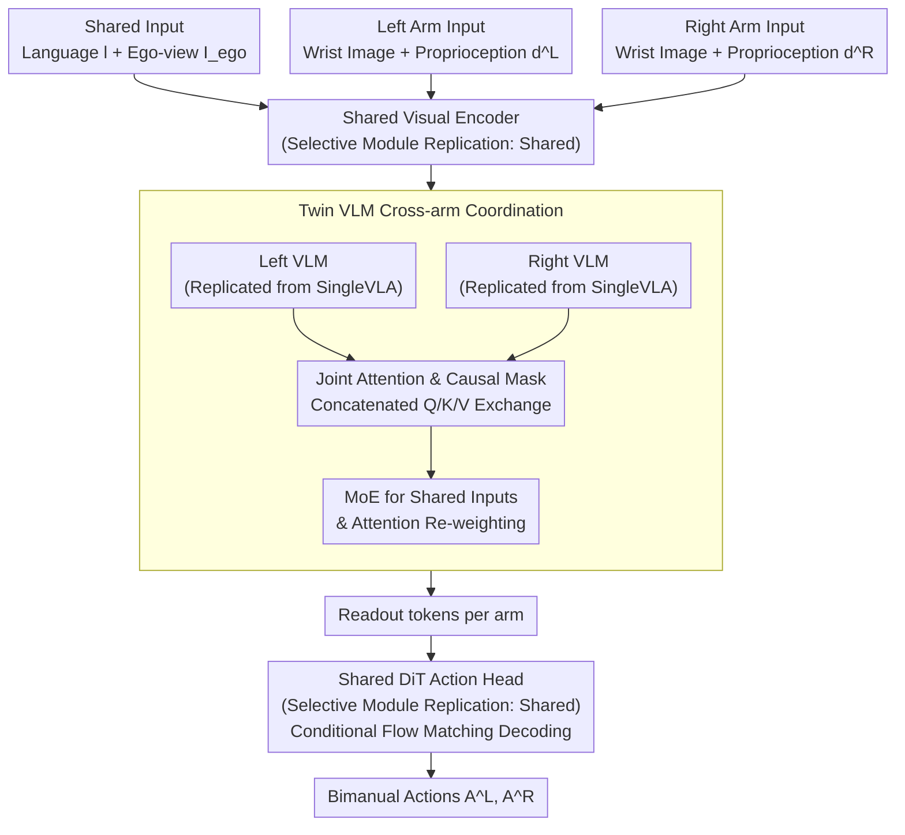

# TwinVLA: Data-Efficient Bimanual Manipulation with Twin Single-Arm Vision-Language-Action Models

**Conference**: ICLR 2026  
**arXiv**: [2511.05275](https://arxiv.org/abs/2511.05275)  
**Code**: [Project Page](https://jellyho.github.io/TwinVLA/)  
**Area**: Robotic Manipulation/Bimanual  
**Keywords**: Bimanual Manipulation, VLA, Modular Composition, Joint Attention, Data-efficient

## TL;DR

TwinVLA introduces a modular framework that combines two pre-trained single-arm VLAs into a bimanual VLA using joint attention and MoE. It achieves performance levels comparable to $\pi_0$ (which utilizes 10,900h of private data and 1,000+ GPU-days) while requiring only ~800h of public single-arm data, 50 bimanual fine-tuning episodes, and 25 H100 GPU-days.

## Background & Motivation

**Background**: Vision-Language-Action (VLA) models have achieved significant success in single-arm robotic manipulation, effectively generalizing across tasks, objects, and environments. However, progress in bimanual manipulation—essential for complex tasks like folding clothes or assembling parts—has been limited by the scarcity of public bimanual datasets.

**Limitations of Prior Work**:

1.  **Severe Data Bottleneck**: $\pi_0$ relies on over 10,000 hours of private bimanual data, and RDT-1B requires ~2,400 hours of mixed datasets; collecting such data is extremely costly and non-reproducible.
2.  **Massive Computational Overhead**: RDT-1B was trained for a month on 48 H100s, while $\pi_0$ requires even higher resources, exceeding 1,000 H100 GPU-days.
3.  **Monolithic Architecture Limitations**: Existing methods train actions for both arms within a single model, failing to exploit the naturally modular structure of bimanual manipulation.
4.  **Cross-Embodiment Transfer Difficulty**: There are large differences in observation and action spaces between single-arm and bimanual setups, requiring monolithic models to be co-trained on heterogeneous data.

**Key Challenge**: While public bimanual data is extremely scarce, current methods require large-scale bimanual pre-training. How can high-performance bimanual policies be constructed using abundant single-arm data?

**Goal**: Inspired by neuroscience—where human bimanual control involves the SMA and corpus callosum coordinating two independent motor systems rather than a single controller—this work proposes the modular TwinVLA: replicate a pre-trained single-arm VLA $\rightarrow$ cross-arm fusion via joint attention $\rightarrow$ efficient shared input processing via MoE $\rightarrow$ fine-tuning with minimal bimanual data.

## Method

### Overall Architecture

TwinVLA reformulates "bimanual manipulation" as the "coordination of two single-arm policies." It follows three steps: first, pre-train a compact 0.8B VLA (SingleVLA) on Open X-Embodiment (OXE) single-arm data (~800h) to learn basic skills like grasping and placing; second, replicate the SingleVLA into left and right instances, coupled via Joint Attention for layer-wise information exchange and Mixture-of-Experts (MoE) for efficient processing of shared language instructions and ego-perspective views; finally, fine-tune with ~50 bimanual episodes without any bimanual pre-training.

Observations are split into three paths: shared language instructions $l$ and ego-view images $I_{ego}$, plus independent wrist images and proprioception $d$ for each arm. Visuals pass through a shared encoder before entering the left and right VLMs. The twin VLMs are coupled by joint attention, each producing a readout token. A shared DiT action head then jointly decodes these tokens into left and right arm actions. The action head is trained using Conditional Flow Matching, with the loss defined as $\mathcal{L}^{T}(\theta) = \mathbb{E}_{p(A_t|o_t),\,q(A_t^\tau|A_t)} \|v_\theta(A_t^\tau, h_t, d_t) - \mathbf{u}(A_t^\tau|A_t)\|^2$. During inference, actions are sampled from noise using forward Euler integration: $A_t^{\tau+\delta} = A_t^\tau + \delta\, v_\theta(A_t^\tau, h_t, d_t)$.

### Key Designs

**1. Selective Module Replication: Sharing and Diversifying Single-arm Priors**

Full replication wastes parameters and loses the transferability of single-arm skills. TwinVLA processes layers based on "embodiment dependence": the visual encoder and DiT head are shared, as visual understanding and low-level motor control are similar for both arms; the VLM backbone is replicated to maintain arm-specific decision-making; proprioception encoders remain independent. This keeps total parameters at 1.3B (similar to RDT-1B's 1.2B) without significant computational increase, allowing "grasp/place/move" skills to transfer naturally. Ablations show that training from scratch without single-arm pre-training causes a 46% drop in real-world success rates.

**2. Joint Attention and Causal Masking: Stitching Single-arm Streams into a Bimanual System**

If the two VLMs operate independently, they fail to coordinate. Borrowing from Mixture-of-Transformers (MoT), TwinVLA shares only the self-attention layers: Q, K, and V from both VLMs are concatenated for unified self-attention before being split back into respective streams. Other components like projections and FFNs remain arm-specific. To maintain causality without context flooding, a specific causal mask is used—maintaining internal causality for each arm while allowing full access to shared modalities (language + ego-view) and partial visibility into the opposite arm's tokens. Removing this drops real-world success rates by 36%.

**3. MoE for Shared Inputs and Attention Re-weighting: Reducing Redundancy and Stabilizing Priors**

Processing shared language and ego-view inputs in both VLMs would nearly double memory usage. TwinVLA uses a soft MoE router for shared inputs: $\text{MoE}(x) = w_{\text{left}} \cdot \text{FFN}_{\text{left}}(x) + (1-w_{\text{left}}) \cdot \text{FFN}_{\text{right}}(x)$, where $w_{\text{left}}$ is calculated via a linear layer and softmax. This processes shared tokens once while integrating both arm experts. Excluding MoE increases VRAM usage by 21% and reduces success rates by 9%. Additionally, Attention Re-weighting is introduced to restore the original importance of modalities diluted by new arm-specific tokens, reducing initial fine-tuning loss by 40%.

## Key Experimental Results

### Main Results: Five Real-world Bimanual Tasks

| Method | Parameters | Pre-training Data | Compute | Avg. Success Rate |
| :--- | :--- | :--- | :--- | :--- |
| Diffusion Policy | 271M | None | - | Lowest |
| RDT-1B | 1.2B | ~2,400h | >1,000 GPU-days | Medium |
| **TwinVLA** | **1.3B** | **~800h** | **25 GPU-days** | **High** |
| $\pi_0$ (Upper Bound) | 3.3B | ~10,900h | >1,000 GPU-days | Highest |

TwinVLA significantly outperforms RDT-1B (+26%) in average success rate, approaching $\pi_0$ performance despite using only 7% of $\pi_0$'s data and less than 3% of its compute.

### Ablation Study: Component Contributions

| Ablation Setting | Simulation Success Change | Real-world Success Change | Note |
| :--- | :--- | :--- | :--- |
| Full TwinVLA | Baseline | Baseline | — |
| w/o Attention Re-weighting | -1.1% | -4.0% | Initial loss increased by 40% |
| w/o MoE | -2.2% | -9.0% | VRAM increased by 21% |
| w/o Joint Attention | -6.2% | -36.0% | Most critical component |
| Train from scratch (no pre-training) | -4.6% | -46.0% | Pre-training is vital |

Joint attention is the most critical component; its removal leads to a 36% drop in real-world success, proving its necessity for cross-arm coordination.

### Data Efficiency

| Demonstration Count | TwinVLA | RDT-1B |
| :--- | :--- | :--- |
| 20 episodes | Starts | Starts |
| 35 episodes | Rapidly exceeds RDT-1B | Slow improvement |
| 50 episodes | Significantly leading | Still catching up |

TwinVLA exhibits a steep learning curve, surpassing RDT-1B (pre-trained on massive data) with only 50 demonstrations.

### Robustness & Language Following

| Scenario | RDT-1B | $\pi_0$ | TwinVLA |
| :--- | :--- | :--- | :--- |
| Low Light (Fold towel) | 15.0% | 40.0% | **45.0%** |
| Distractors (Fold towel) | 15.0% | **60.0%** | 25.0% |
| Language Following (Multi-task) | Baseline | Baseline+x | **Baseline+21.8%** |

TwinVLA is robust to lighting changes and outperforms RDT-1B by 21.8% and $\pi_0$ in language-following evaluations.

## Highlights & Insights

-   **"Replication over Retraining"**: TwinVLA demonstrates that correct architectural inductive biases are more effective than brute-force data collection—achieving 40x computational efficiency and 13x data efficiency gains.
-   **Neuroscience Correspondence**: The mapping between human SMA/corpus callosum coordination and TwinVLA’s Joint Attention provides a biological foundation for the architecture.
-   **Democratization (25 vs. 1,000+ GPU-days)**: This work enables bimanual VLA research for teams lacking massive private datasets or extreme compute resources.
-   **Transferability of Single-arm Priors**: Essential skills (grasping, placing, moving) are shared across single and bimanual contexts; the Twin structure facilitates this natural transfer.

## Limitations

-   Visual Distribution Shift: Differences between bimanual visual inputs and single-arm pre-training distributions limit generalization.
-   Absolute End-Effector (EEF) Control: Less flexible than relative action spaces despite being embodiment-independent.
-   Performance in Distractor Scenarios: Relatively weaker performance (25% vs. $\pi_0$'s 60%).

## Rating

-   Novelty: ⭐⭐⭐⭐⭐ First systematic implementation of modular bimanual VLA composition.
-   Experimental Thoroughness: ⭐⭐⭐⭐ Extensive real-world, simulation, efficiency, and ablation tests.
-   Writing Quality: ⭐⭐⭐⭐⭐ Clear motivation with intuitive neuroscience analogies.
-   Value: ⭐⭐⭐⭐⭐ Paradigm-shifting impact on bimanual VLA research.

<!-- RELATED:START -->

## Related Papers

- [\[ICLR 2026\] VLM4VLA: Revisiting Vision-Language-Models in Vision-Language-Action Models](vlm4vla_revisiting_vision-language-models_in_vision-language-action_models.md)
- [\[ICLR 2026\] Action-aware Dynamic Pruning for Efficient Vision-Language-Action Manipulation](action-aware_dynamic_pruning_for_efficient_vision-language-action_manipulation.md)
- [\[ICLR 2026\] MemoryVLA: Perceptual-Cognitive Memory in Vision-Language-Action Models for Robotic Manipulation](memoryvla_perceptual-cognitive_memory_in_vision-language-action_models_for_robot.md)
- [\[ICLR 2026\] VLBiMan: Vision-Language Anchored One-Shot Demonstration Enables Generalizable Bimanual Robotic Manipulation](vlbiman_vision-language_anchored_one-shot_demonstration_enables_generalizable_bi.md)
- [\[ICLR 2026\] Self-Improving Vision-Language-Action Models with Data Generation via Residual RL](self-improving_vision-language-action_models_with_data_generation_via_residual_r.md)

<!-- RELATED:END -->
