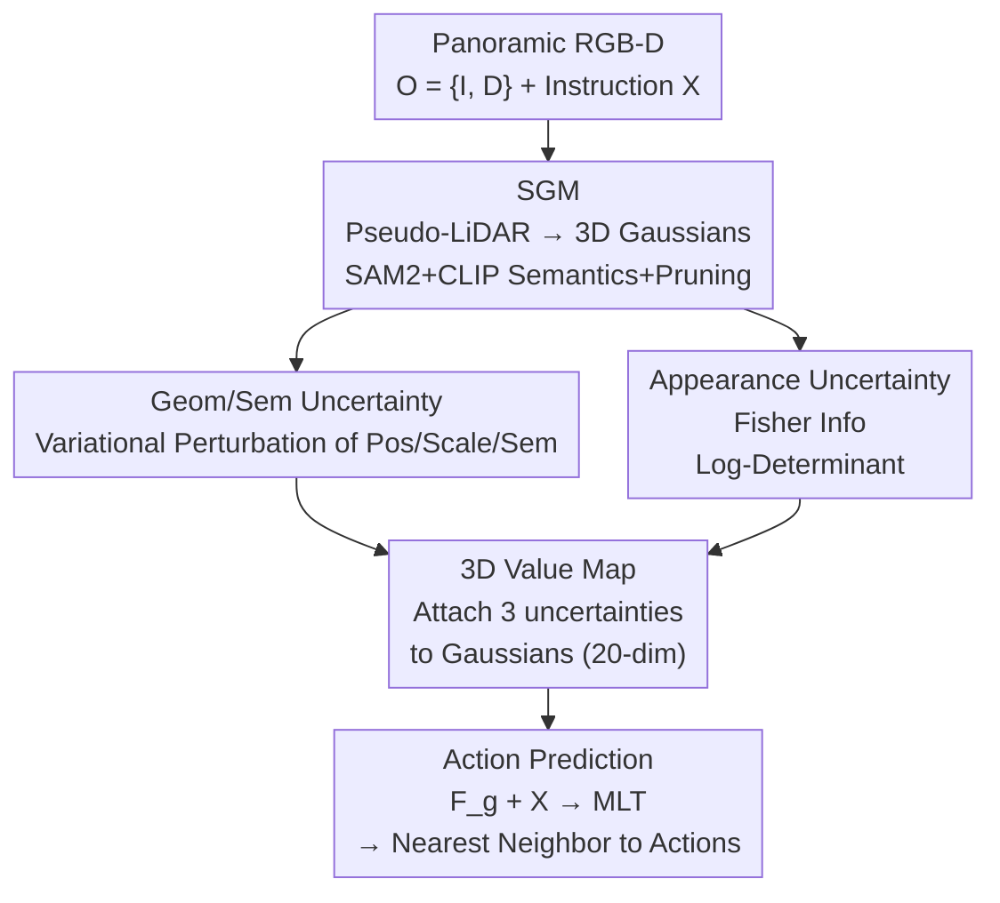

# Uncertainty-Aware Gaussian Map for Vision-Language Navigation

**Conference**: ICLR 2026  
**OpenReview**: [https://openreview.net/forum?id=LPv59noPAy](https://openreview.net/forum?id=LPv59noPAy)  
**Code**: https://github.com/Gaozzzz/Uncertainty-Aware-VLN  
**Area**: Vision-Language Navigation / Embodied AI / 3D Gaussian  
**Keywords**: Vision-Language Navigation, Perceptual Uncertainty, Semantic Gaussian Map, Fisher Information, 3D Value Map

## TL;DR
This paper explicitly models the phenomenon of "perceptual ambiguity" for Vision-Language Navigation (VLN) agents. By estimating three types of perceptual uncertainties—geometric, semantic, and appearance—on a differentiable Semantic Gaussian Map (SGM), the authors package them into a unified 3D Value Map. This map is fed into a decision network, preventing the agent from making blind guesses when evidence is insufficient, thereby consistently outperforming State-of-the-Art (SOTA) methods on the R2R, RxR, and REVERIE benchmarks.

## Background & Motivation

**Background**: VLN requires embodied agents to navigate 3D scenes following natural language instructions. The mainstream paradigm has evolved from early seq2seq models that directly map language and vision to actions, to mapping-based paradigms—using topological graphs to encode connectivity, grid/voxel representations to capture 3D structures, and recently, using 3D Gaussian Splatting as a scene representation. Policy learning has also moved from pure imitation learning toward hybrid imitation+reinforcement schemes, even integrating world models for look-ahead planning.

**Limitations of Prior Work**: Almost all existing agents "ignore perceptual uncertainty" during decision-making. Their training objectives encourage agents to produce an action regardless of confidence levels, offering no mechanism to express "I cannot see clearly." Consequently, when faced with two identical doors or insufficient clues behind a door, agents may confidently misidentify the target. Similarly, if the path ahead is occluded and traversability is questionable, agents might proceed regardless, colliding with obstacles or entering hazardous paths.

**Key Challenge**: Perception inherently varies in reliability—some regions have clear geometric structures, while others may be semantically or visually blurred due to reflections, repetitive textures, or occlusions. However, existing methods treat all observations equally in the decision process, lacking a mechanism to inform the policy "which evidence is trustworthy and which should be discounted." This potentially life-saving signal of uncertainty is entirely discarded.

**Goal**: To explicitly model perceptual uncertainty and project it into the agent's observation space, allowing it to directly participate in action prediction. This is decomposed into three sub-problems: determining an appropriate representation for uncertainty, estimating different forms of uncertainty, and converting these estimates into signals consumable by the policy.

**Key Insight**: The authors choose 3D Gaussians as the carrier. Unlike implicit latent representations where features are globally entangled and difficult for region-level uncertainty reasoning, the explicit structure of 3D Gaussians naturally binds physical attributes—position, scale, and semantics—to each primitive. This allows for perturbing and measuring the reliability of the scene on a per-Gaussian basis.

**Core Idea**: Estimate geometric, semantic, and appearance uncertainties on a Semantic Gaussian Map (SGM), treat them as affordances and constraints injected into each Gaussian, and extend them into a unified 3D Value Map to drive reliable decision-making.

## Method

### Overall Architecture
At each waypoint, the agent first constructs an SGM (§3.1) from panoramic RGB-D observations $O=\{I, D\}$. It then estimates three types of perceptual uncertainty on the SGM: geometric $U^g$, semantic $U^s$, and appearance $U^a$ (§3.2). These uncertainties are attached back to each Gaussian, extending the SGM into a unified 3D Value Map (§3.3). Finally, the Gaussian representation $F^g$ derived from the value map is concatenated with the instruction embedding $X$ and fed into a multi-layer transformer $F_{\text{MLT}}$ to score candidate waypoints and predict the next action. This pipeline repeats at each step, supported by a topological memory for cross-step context.

### Key Designs

**1. Semantic Gaussian Map: An Explicit Carrier for Uncertainty**

To discuss reliability "per region," a scene representation where every part has physical attributes is required—something implicit features cannot provide. The SGM converts multi-view RGB-D into a set of differentiable 3D Gaussians at each waypoint. Initially, pixels are back-projected to 3D using depth and camera intrinsics: $z = D(u,v)$, $x=(u-c_u)z/f_x$, $y=(v-c_v)z/f_y$, resulting in a sparse pseudo-LiDAR point cloud. Each point initializes a Gaussian with parameters including mean $\mu_i\in\mathbb{R}^3$, covariance $\Sigma_i = RE E^\top R^\top$, opacity $\alpha_i$, color spherical harmonics $c_i$, and semantic attributes $s_i$. Semantics are extracted by segmenting the panorama with SAM2 and attaching CLIP embeddings to corresponding Gaussians. The map is optimized by aligning it with current observations through differentiable rendering (obtaining color $\hat I$, depth $\hat D$, and semantics $\hat S$ via depth-sorted $\alpha$-blending). After optimization, pruning is applied to retain only Gaussians satisfying $\|e_i\|_2 > \tau_e \wedge \alpha_i > \tau_\alpha$; small-scale Gaussians usually represent surface noise, and low-opacity ones are background clutter, both of which can mislead decisions. This refined SGM serves as the foundation for all subsequent uncertainty modeling.

**2. Geometric and Semantic Uncertainty: Quantifying Stability via Variational Perturbation**

Geometric uncertainty answers whether the spatial structure of a region is reliable, while semantic uncertainty answers whether the object/area meaning is ambiguous. Both utilize a variational inference mechanism. The position and scale of each Gaussian are treated as random variables with learnable perturbations: $\mu_i' = \mu_i + \chi_i^\mu$, $e_i' = e_i + \chi_i^e$. These perturbations represent "alternative structural hypotheses." Since the true posterior $p(\chi|O)$ is intractable in high-dimensional continuous space, a variational distribution $q_\phi(\chi)$ is introduced and optimized by minimizing its KL divergence with the true posterior—since $\log p(O)$ is constant relative to $\chi$, this is equivalent to maximizing the Evidence Lower Bound (ELBO). The prior for position perturbation is a zero-mean Gaussian $\mathcal{N}(0, \delta^2 I)$, and for scale, it is a scale-dependent uniform distribution $\mathcal{U}(-\eta e, \eta e)$. After learning $q_\phi$, geometric uncertainty is defined as the aggregation of the standard deviations of position and scale perturbations: $U_i^g = \|F_{\text{std}}(q_{\phi_i^\mu})\|_2 + \|F_{\text{std}}(q_{\phi_i^e})\|_2$. Semantic uncertainty follows the same framework but only perturbs the semantic attributes $s_i$ (keeping geometry fixed for spatial consistency) with a prior $\mathcal{N}(0, \epsilon^2 I)$, yielding $U_i^s = \|F_{\text{std}}(q_{\phi^s})\|_2$. A high perturbation variance indicates the Gaussian's structure or semantic interpretation is unstable, suggesting it should be discounted during decision-making.

**3. Appearance Uncertainty: Measuring Sensitivity via Fisher Information**

Appearance uncertainty characterizes uncontrollable visual blur in observations—such as occlusions, texture inconsistencies, or reflections. The authors define it as the sensitivity of the reconstruction loss $L_r = \frac{1}{2}\|\hat I - I\|_2^2$ to changes in the SGM, theoretically characterized by the Hessian $\nabla_G^2 L_r$. However, direct calculation is infeasible. Noting that the Hessian can be decomposed into a Fisher Information term $\nabla_G \hat I\, \nabla_G \hat I^\top$ and a residual term $(\hat I - I)\nabla_G^2 \hat I$, and since the residual term $(\hat I - I)$ approaches zero in a refined SGM, the Hessian simplifies to Fisher Information, serving as a tractable proxy for sensitivity. While the Fisher Information matrix is still large $((|G|\cdot d_g)\times(|G|\cdot d_g))$, the authors group parameters by Gaussian and take the diagonal block $\mathbb{R}^{d_g\times d_g}$ to isolate the sensitivity of individual Gaussians. Appearance uncertainty is defined as the log-determinant of this block $U_i^a = \log|\nabla_{g_i}\hat I\,\nabla_{g_i}\hat I^\top|$, which quantifies the volume of the uncertainty ellipsoid in the parameter space. High Fisher Information implies that even slight movements of the Gaussian cause large changes in rendered observations, signaling unstable scene understanding.

**4. 3D Value Map and Action Prediction: Signals for Policy Consumption**

Estimating three scalar values is insufficient; the policy must utilize them. The authors attach $U_i^g, U_i^s, U_i^a$ back to each Gaussian, expanding it into a 20-dimensional representation $g_i = \{\mu_i, e_i, r_i, \alpha_i, c_i, s_i, U_i^g, U_i^s, U_i^a\}\in\mathbb{R}^{20}$. This is the 3D Value Map, which preserves geometric semantics while embedding reliability as affordances and constraints within the observation space. For action prediction, each $g_i$ is non-linearly projected to a feature $F_{g_i}\in\mathbb{R}^{768}$, aggregated into a global representation $F^g$ (maintaining fine-grained coupling of geometry and uncertainty), and concatenated with instruction embedding $X$ for the multi-layer transformer: $p = \text{Softmax}(F_{\text{MLT}}[F^g, X])$. This yields the probability of candidate waypoints, which is finally mapped to executable action space via nearest-neighbor mapping $\tilde p = \mathcal{N}(p, V)$. This allows the policy to simultaneously reason about geometric structure and perceptual confidence, favoring choices with lower uncertainty when evidence is scarce.

### Loss & Training
The SGM is supervised with pixel-wise rendering losses: color uses L1 + SSIM ($L_{rgb}=\|\hat I - I\|_1 + L_{\text{SSIM}}$), while depth and semantics use L1 ($L_{depth}, L_{sem}$). The navigation policy follows a two-stage training: first, pre-training with multi-modal objectives like Masked Language Modeling (MLM) and Single-step Action Prediction (SAP) (REVERIE adds Object Grounding), followed by fine-tuning with Behavior Cloning + Pseudo-Expert Guidance (DAgger). Pre-training takes 100k steps (batch 64, lr 1e-4); fine-tuning takes 25k steps (batch 8, lr 1e-5). A dynamic topological memory map is maintained, storing 2D panoramic embeddings and 3D Value Map representations at nodes and traversability at edges to support backtracking and cross-step consistency.

## Key Experimental Results

### Main Results
Evaluated on three benchmarks in the Matterport3D simulator, averaged over five runs.

| Dataset | Metric | Ours | Prev. SOTA | Gain |
|--------|------|------|----------|------|
| R2R val unseen | SR / SPL | 78 / 66 | 76 / 65 (VER) | +2 / +1 |
| REVERIE val unseen | RGS / RGSPL | 37.65 / 27.01 | 34.71 / 24.44 (BEVBert) | +2.94 / +2.57 |
| RxR val unseen | SR / nDTW | 65.2 / 65.6 | 64.1 / 63.9 (BEVBert) | +1.1 / +1.7 |

On RxR, SDTW is 53.5 vs 52.6, showing comparable performance. The gains on REVERIE's RGS/RGSPL metrics (remote object localization) are the most significant, indicating that the Value Map contributes most to precise grounding.

### Ablation Study

Core Components (R2R / REVERIE val unseen, Table 4):

| Config | R2R SR | REVERIE RGS | Description |
|------|--------|-------------|------|
| DUET Baseline | 72.22 | 32.15 | No SGM, no uncertainty |
| + SGM | 76.21 | 35.48 | SGM as scene representation only |
| + 3DVM | 74.20 | 34.02 | Uncertainty only, discarded Gaussian params |
| Full | 78.32 | 37.65 | SGM + 3D Value Map |

Contribution of Uncertainty Types (Table 6, baseline is SGM only):

| Config | R2R SR | REVERIE RGS | Description |
|------|--------|-------------|------|
| SGM only | 76.21 | 35.48 | No uncertainty |
| + $U^g$ + $U^s$ | 77.05 | 36.96 | Geometric + Semantic |
| + $U^a$ | 76.86 | 35.68 | Appearance only |
| All | 78.32 | 37.65 | All three types |

### Key Findings
- Both SGM and uncertainty contribute to improvements: Adding SGM alone boosts REVERIE RGS from 32.15 to 35.48. Using uncertainty alone (without original Gaussian parameters) increases R2R SR from 72.22 to 74.20, proving that perceptual uncertainty itself carries useful decision cues. The combination (Full) yields the maximum gain.
- Explicit 3D structure is more effective than "uncertainty only": Comparing the SGM-only and uncertainty-only results shows that while uncertainty is a strong signal, it is a supplement to, rather than a replacement for, full scene representation.
- Geometric + Semantic uncertainty are more valuable than Appearance: Identifying "unstable spatial structure/semantic interpretation" helps navigation more than "sensitivity to visual changes," though the three are complementary.
- Pruning thresholds have a sweet spot (Table 5): At $\tau_e{=}0.015, \tau_\alpha{=}0.005$, the Gaussian count drops from 50k to 42k and FPS rises from 11.2 to 15.5, while achieving peak accuracy. Excessive pruning (down to 35k) leads to a significant performance drop.

## Highlights & Insights
- Perceptual uncertainty is elevated from a discarded byproduct to a first-class observation signal. It is not managed abstractly but attached to each 3D Gaussian, resulting in a 20-dimensional representation consumable by transformers—a combination of "explicit structure + per-primitive uncertainty" that is difficult to achieve in implicit latent representations.
- Two complementary mechanisms are used for three types of uncertainty: variational perturbation for geometry/semantics (measuring distribution spread) and Fisher Information for appearance (measuring loss surface steepness). The appearance modeling elegantly simplifies the Hessian to Fisher Information under the "near-zero residual" assumption of refined SGMs, a reusable engineering trick.
- The "Value Map" abstraction is highly transferable: Any scene representation with explicit primitives (points, voxels, Gaussians) can attach reliability as affordances/constraints to drive tasks like navigation or grasping where the agent needs to "know what it doesn't see clearly."

## Limitations & Future Work
- The main overhead lies in constructing the 3D Value Map, specifically semantic extraction (SAM2) and uncertainty estimation. While the authors mitigate this via pre-training and lightweight SAM2 variants, it remains a quality-speed trade-off for real-time deployment.
- Uncertainty modeling depends on differentiable rendering quality: The approximation of appearance uncertainty as Fisher Information relies on the refined SGM assumption. If reconstruction is poor (non-negligible residuals), this proxy might be unreliable.
- Evaluation is constrained to discrete panoramic waypoints in Matterport3D; performance in continuous environments (continuous VLN) or on real physical robots remains unverified. Improvements are stable (1–3%) but not revolutionary across all metrics.
- The weighting/fusion of the three uncertainties into $F^g$ is learned implicitly; a more systematic quantification of "exactly when the agent relies on uncertainty to succeed" (beyond case studies) is needed.

## Related Work & Insights
- **vs 3DGS-VLN (same authors, ICCV'25)**: 3DGS-VLN uses 3D Gaussians + open-set semantic grouping for scene representation without modeling uncertainty. This paper adds three types of perceptual uncertainty on the same foundation, improving REVERIE RGS from 36.73 to 37.65 and R2R SR from 77 to 78.
- **vs VER (CVPR'24)**: VER uses voxel representations to capture 3D structure, whereas this work uses differentiable Gaussians and explicitly encodes reliability. Qualitatively, VER may misjudge or stall in visually similar scenes (e.g., specific windows/tables), while this method uses uncertainty for disambiguation and obstacle avoidance.
- **vs VLN-Copilot**: This estimates decision-level uncertainty (determining when to seek help from an LLM), whereas this work focuses on perceptual-level uncertainty (geometric/semantic/appearance) at the observation end.
- **vs Implicit Uncertainty Estimation (MC Dropout / Ensembles)**: Traditional methods estimate uncertainty on globally entangled latents, making region-level reasoning difficult. This work leverages the explicit physical properties of 3D Gaussians for per-primitive, interpretable uncertainty.

## Rating
- Novelty: ⭐⭐⭐⭐ Explicitly mapping perceptual uncertainty to 3D Gaussians to form a Value Map is a clear and uncommon angle in VLN.
- Experimental Thoroughness: ⭐⭐⭐⭐ Three benchmarks + five-run variance + extensive ablations on components, uncertainty types, and pruning; however, lacks continuous environments and real-world robot validation.
- Writing Quality: ⭐⭐⭐⭐ Motivated by clear illustrations; mathematical derivations (ELBO, Fisher approximation) are well-explained.
- Value: ⭐⭐⭐⭐ The "knowing what I don't see clearly" approach has high transferability for embodied navigation and robotics.

<!-- RELATED:START -->

## Related Papers

- [\[CVPR 2026\] Bridging the 2D-3D Gap: A Hierarchical Semantic-Geometric Map for Vision Language Navigation](../../CVPR2026/robotics/bridging_the_2d-3d_gap_a_hierarchical_semantic-geometric_map_for_vision_language.md)
- [\[ICLR 2026\] CoNavBench: Collaborative Long-Horizon Vision-Language Navigation Benchmark](conavbench_collaborative_long-horizon_vision-language_navigation_benchmark.md)
- [\[CVPR 2026\] GA-VLN: Geometry-Aware BEV Representation for Efficient Vision-Language Navigation](../../CVPR2026/robotics/ga-vln_geometry-aware_bev_representation_for_efficient_vision-language_navigatio.md)
- [\[ICLR 2026\] Ground Slow, Move Fast: A Dual-System Foundation Model for Generalizable Vision-Language Navigation](ground_slow_move_fast_a_dual-system_foundation_model_for_generalizable_vision-la.md)
- [\[ICLR 2026\] Action-aware Dynamic Pruning for Efficient Vision-Language-Action Manipulation](action-aware_dynamic_pruning_for_efficient_vision-language-action_manipulation.md)

<!-- RELATED:END -->
