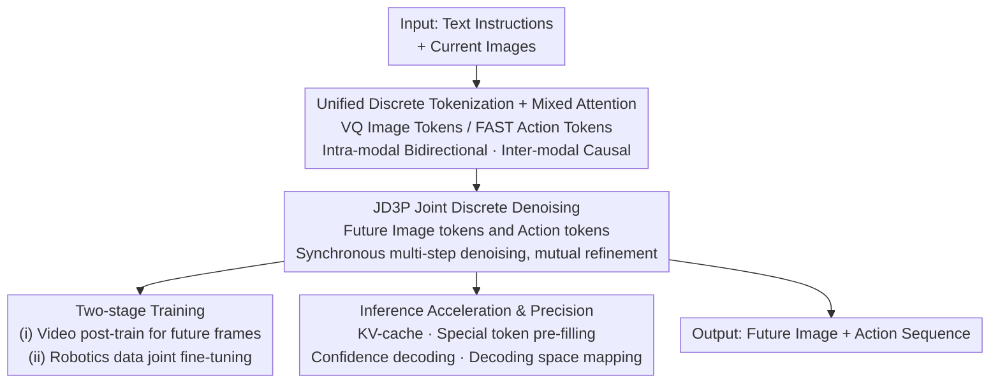

# Unified Diffusion VLA: Vision-Language-Action Model via Joint Discrete Denoising Diffusion Process

**Conference**: ICLR 2026  
**OpenReview**: [https://openreview.net/forum?id=UvQOcw2oCD](https://openreview.net/forum?id=UvQOcw2oCD)  
**Code**: Yes (Project page, provided as a link in the paper)  
**Area**: Robotics / Embodied AI / Vision-Language-Action Models / Discrete Diffusion  
**Keywords**: VLA, Unified Discrete Diffusion, Joint Denoising, Future Frame Prediction, Mixed Attention

## TL;DR
UD-VLA integrates "visual instruction understanding → future scene generation → action inference" into a **single joint discrete denoising trajectory** (JD3P). This allows action tokens to iteratively refine themselves by "attending to" increasingly clear future image tokens during each denoising step. It achieves SOTA performance on CALVIN, LIBERO, and SimplerEnv while reaching an inference speed 4x faster than autoregressive methods.

## Background & Motivation

**Background**: Vision-Language-Action (VLA) models aim to interpret natural language instructions and current visual observations to output corresponding actions as an embodied agent. Recently, a class of "unified VLAs" has incorporated **future image prediction** into the "understanding-execution" loop: by first imagining future scenes and then generating actions based on them, the model transforms abstract "how to move" problems into more solvable inverse kinematics problems, providing the policy with planning and look-ahead capabilities.

**Limitations of Prior Work**: To achieve such unification, existing routes are suboptimal. The first route uses **external experts** (e.g., CLIP/ViT encoders + diffusion decoders) for modality alignment, where the VLA only outputs intermediate tokens as conditions for independent image and action generation models. This modular splicing results in alignment errors, system complexity, and a **weak coupling** between image generation and action prediction. The second route tokenizes all inputs and outputs into a shared space (visual tokenizer + action tokenizer), eliminating extra encoders/decoders, but image generation and action prediction **remain separate processes**. Some even predict images only as auxiliary tasks during training and omit future image generation during inference, losing the explicit guidance value of "future imagery."

**Key Challenge**: True unification of "understanding-generation-execution" requires **intrinsic synergy**—actions should be formulated as "implicit mappings toward desired future observations." However, whether using autoregressive generation or separate diffusion processes for images and actions, action tokens typically absorb context in a single pass. The guidance from image information is a **one-off transaction** that cannot be iteratively utilized.

**Goal**: Enable visual generation and action prediction to be jointly optimized within a **synchronized denoising process**, ensuring that at every denoising step, all action tokens can causally attend to all future image tokens, with this computation repeated across the denoising trajectory.

**Key Insight**: The authors leverage "iterative refinement from coarse-to-fine"—actions start from an initialization and denoise alongside future images, evolving under sufficient visual guidance to converge into precise actions based on a confidence-based criterion. This effectively **translates latent visual representations into temporally structured actions**.

**Core Idea**: Utilize a **Joint Discrete Denoising Diffusion Process (JD3P)** to unify multiple modalities into a single denoising trajectory, allowing "understanding, generation, and execution" to reinforce each other at every step rather than calculating them in separate stages or models.

## Method

### Overall Architecture
UD-VLA uses a pretrained VLM as its backbone, facilitating "vision-language understanding → future image generation → action prediction" within a **single Transformer**. It performs three functions: (1) Quantizing language, images, and actions into discrete tokens to form a unified sequence and multimodal space; (2) Employing mixed attention for sufficient intra-modality interaction and inter-modality causality, decomposing end-to-end action prediction into two coupled sub-processes: "look-ahead future frame prediction + inverse kinematics action generation"; (3) Implementing JD3P to allow future image tokens and action tokens to be refined in parallel within the **same denoising step**, converging via confidence-based decoding.

The complete sequence is arranged as `[text tokens ; current image tokens ; future image tokens ; action tokens]`, where the first two segments are inputs and the latter two are outputs to be generated via denoising. Images are quantized into **fixed-length** sequences using a VQ tokenizer, and actions are quantized into **variable-length** sequences using a FAST tokenizer, with boundaries marked by special tokens like `<BOI>/<EOI>` and `<BOA>/<EOA>`. Training consists of two stages (post-training on large-scale video for "future image generation" followed by joint fine-tuning on robotics action data using JD3P). Inference utilizes KV-caching, confidence decoding, and decoding space mapping to ensure speed and precision.

### Key Designs

**1. Unified Discrete Token Space + Mixed Attention: Encapsulating Three Modalities Without Information Leakage**

To address the "weak coupling from external expert splicing," UD-VLA avoids external encoders/decoders by quantizing everything: language follows the Emu3 design, visual observations are discretized into $V_v$ tokens using a VQ tokenizer, and actions are discretized into $V_a$ tokens using FAST. All tokens are concatenated into a multimodal sequence, naturally sharing a representation space. However, free attention between all tokens is problematic. The authors designed **Mixed Attention**: input-side text follows causal attention, while current images follow bidirectional attention. The output side is split into a "Generation Block (future images)" and an "Execution Block (actions)," with **intra-block bidirectional attention** (ensuring global consistency for images and breaking strict temporal dependence for action dimensions like position/rotation to avoid shortcut learning) and **inter-block causal attention** (the generation block only sees inputs, and the execution block sees both inputs and the generation block, preventing backward information flow).

The significance of "intra-block bidirectional, inter-block causal" lies in **explicitly prohibiting the "action → vision" path**. It reforms difficult end-to-end action prediction into two coupled processes: (i) a look-ahead process forecasting the next visual state, and (ii) an inverse kinematics process inferring actions conditioned on that visual prediction. This eliminates leakage of coarse action information and subsequent error accumulation while ensuring that downstream control is supported by "predicted visual consequences" rather than spurious correlations. Replacing cross-modality attention with full bidirectional attention drops the average length by 0.3, proving the necessity of this causal constraint.

**2. Joint Discrete Denoising Diffusion Process (JD3P): Actions "Staring" at Increasingly Clear Future Images**

This is the core of the paper, addressing the separation of images and actions. JD3P concatenates fixed-length future image tokens $v_0$ and variable-length action tokens $a_0$ as $v_0,a_0=(v_{0,1},\dots,v_{0,L_v},a_{0,1},\dots,a_{0,L_a})$, adding a mask token $M$ (`<MASK>`) to the vocabulary. The forward process is a Markov chain $\{v_t,a_t\}_{t=0}^T$: at each step, a token is replaced by $M$ with probability $\beta_t$ or remains unchanged with $1-\beta_t$, based on a transition matrix $Q_t e_{t,r}=(1-\beta_t)e_{t,r}+\beta_t e_M$. The denoising process factorizes the joint conditional distribution as:

$$p_\theta(v_{t-1},a_{t-1}\mid v_t,a_t,c)=p_\theta(v_{t-1}\mid v_t,c)\,p_\theta(a_{t-1}\mid v_t,a_t,c),$$

Crucially, in the second term, action refinement depends on both $v_t$ and $a_t$—**action denoising explicitly consumes the future image from the current (not yet fully clear) step**. The reverse process starts from all `<MASK>` tokens, reconstructing masked positions per step by decreasing the mask rate until $v_0,a_0$ are recovered.

Why it works: In autoregressive methods, each action token integrates context in one pass. JD3P **repeats multiple rounds** of denoising where actions causally attend to future images, effectively **scaling the computation** of the "image information → action" mapping. Actions utilize visual information from intermediate denoising steps to refine predictions. Ablations in Table 7 verify this: AR scores 4.18, Independent Diffusion 4.35, and JD3P 4.64, with a 4.3x speedup. During training, the explicit diffusion chain is replaced by a **single-step mask-predict** objective: a mask rate $\rho_t\in(0,1]$ is sampled to apply masks, and cross-entropy is calculated only for masked positions:

$$L_{CE}(\theta)=-\omega\sum_j \log p_\theta^{(v)}(v_{0,j}\mid v_t,c)\,\mathbb{1}\{v_{t,j}{=}M\}-\sum_i \log p_\theta^{(a)}(a_{0,i}\mid v_t,a_t,c)\,\mathbb{1}\{a_{t,i}{=}M\},$$,

where $\omega$ downweights visual tokens to prevent them from dominating the loss, promoting stronger vision-action interaction.

**3. Two-Stage Training: Injecting Future Frame Imagination Before Joint Fine-tuning**

Backbone VLMs are typically trained with autoregressive causal attention and cannot generate future images. Direct JD3P training might be unstable due to a lack of world dynamics modeling. The authors adopt a two-stage approach: (i) Post-training on large-scale video data using the sequence `[text ; current image ; future image]` to teach the model to "understand and model future states"—injecting image generation/world model capabilities into the VLA; (ii) Jointly optimizing image and action generation on downstream robotics data. A critical engineering detail is that when **reforming autoregressive decoding into the JD3P diffusion process** in stage (ii), they use a shift-operation strategy to **predict the next token** rather than standard mask prediction. This retains capabilities learned during next-token pre-training while benefiting from bidirectional context and parallel decoding.

**4. Inference Trio: Achieving 4x Speed While Maintaining Precision**

Naive joint denoising repeatedly encodes prefixes, risks erroneous cross-modal tokens, and converges slowly. The authors implement three strategies. First, **Prefix KV-cache + Special Token Pre-filling**: Caching K/V for current visual and prompt tokens; since image tokens are fixed-length and action tokens are variable-length, `<BOI>/<EOI>/<BOA>` tokens are pre-filled to guide denoising, significantly reducing latency. Second, **Confidence-guided Decoding**: Starting from $t=T$ (full noise), iterating back to $t=0$ using a cosine mask schedule $\rho_t=\cos\!\big(\frac{\pi}{2}\frac{T+1-t}{T+1}\big)$. Confidence $q_{t-1,r}=\max_\ell p_\theta(\ell\mid\cdot)$ is calculated for masked positions, and only the TopK positions $(1-\rho_t)|M_t|$ with the highest confidence are updated using Gumbel-max sampling—allowing certain predictions to be fixed first and refined from coarse-to-fine. Third, **Decoding Space Mapping**: Image/action tokens originate from small codebooks occupying a subset of the vocabulary. During inference, classification is **restricted to respective modality zones** to prevent wrong-modality tokens. Once `<EOA>` is predicted, the action length is fixed, and subsequent tokens are set back to `<MASK>` to avoid polluting action predictions.

### Loss & Training
The core training objective is the single-step mask-predict cross-entropy $L_{CE}$ mentioned above, calculated only for masked positions with downweighted visual tokens ($\omega$). The two-stage training strategy (video post-train for future frames -> robotics JD3P fine-tuning) uses the shift-operation to bridge AR and diffusion paradigms.

## Key Experimental Results

### Main Results

CALVIN ABCD→D (Average completion length for 5 continuous sub-tasks, higher is better):

| Method | Avg. Len ↑ |
|------|------|
| UP-VLA | 4.42 |
| MDT | 4.52 |
| UniVLA* | 4.26 |
| **UD-VLA** | **4.64** |

LIBERO Suite Success Rates:

| Method | Spatial | Object | Goal | Long | Average |
|------|---------|--------|------|------|------|
| OpenVLA-OFT | 96.2% | 98.3% | 96.2% | 90.7% | 95.3% |
| UniVLA | 95.4% | 98.8% | 93.6% | 94.0% | 95.5% |
| F1 | 98.2% | 97.8% | 95.4% | 91.3% | 95.7% |
| **UD-VLA** | 96.2% | **98.8%** | 94.2% | **95.2%** | **96.1%** |

SimplerEnv-WidowX Average Success Rate: UD-VLA **76.0%**, significantly outperforming UniVLA (69.8%), F1 (59.4%), and SpatialVLA (42.7%). On the "Stack Block" task requiring precise manipulation, it achieved 66.7%, which is 37.5% higher than the 3D-aware SpatialVLA (29.2%).

### Ablation Study

| Configuration | Key Metric | Description |
|------|---------|------|
| Hybrid Attention (Full) | 4.64 | Intra-block Bidirectional + Inter-block Causal |
| Causal | 4.04 | Pure Causal, -0.60 |
| Bidirectional | 4.32 | Full Bidirectional, -0.3+ due to leakage |
| Target = Future Frame (Ours) | 4.64 (+0.43) | Provides temporal cues |
| Target = Current Frame Recon | 4.39 (+0.18) | Limited to static scenes |
| Target = Null (No vision gen) | 4.21 | No visual look-ahead |
| JD3P (Ours) | 4.64 / 219.3 tok·s⁻¹ (×4.3) | Joint denoising |
| Independent Diffusion (ID) | 4.35 / 144.4 (×2.9) | Separate image/action diffusion |
| Jacobi Parallel | 4.16 / 101.6 (×2.0) | Still limited by AR |
| AR Autoregressive | 4.18 / 50.2 (×1.0) | Slow with poor image modeling |

### Key Findings
- **Joint denoising is a win-win for performance and speed**: Compared to independent diffusion (4.35) and AR (4.18), JD3P improves average length to 4.64 and decoding speed to 4.3x. This proves actions can refine themselves using image info at intermediate steps, acting as a "computation scaling" mechanism.
- **"Future frame generation" is more effective than "current frame reconstruction"**: Future frames provided a +0.43 boost compared to only +0.18 for current frames, indicating that temporal look-ahead is the primary benefit over static perception.
- **"Inter-block causality" in mixed attention is vital**: Full bidirectional attention drops performance by 0.3+ due to action-to-vision leakage, while pure causal drops to 4.04.
- **Real-world generalization**: UD-VLA achieved >80% success on three task types (stacking bowls, blocks, flipping tower). It outperformed GR00T N1 and UniVLA in unseen scenes/objects by leveraging its ability to generate future images containing unseen targets to derive correct actions.

## Highlights & Insights
- **Turning "Visual Chain-of-Thought" into a reusable denoising trajectory**: Future images are not just one-off conditions but are refined alongside actions. This is a clever leap over the "separate image/action diffusion" paradigm.
- **Mixed Attention decomposes end-to-end problems into "Forecasting + Inverse Kinematics"**: By explicitly prohibiting action-to-vision paths, the model prevents leakage and improves interpretability. This idea of "encoding causal structure via attention masks" is transferable to other "imagine-then-decide" tasks.
- **Shift-operation allows diffusion to inherit AR pre-training capabilities**: Switching to parallel diffusion decoding without losing VLM knowledge is a practical "paradigm migration" trick.
- **Decoding Space Mapping + EOA Truncation** are small but critical engineering methods for stabilizing discrete multimodal generation, applicable to any scenario where multiple codebooks share a large vocabulary.

## Limitations & Future Work
- **Image fidelity issues**: The authors admit future frames have poor quality regarding fine-grained details (robotic arms, backgrounds), due to the lack of massive generative pre-training and the compressed token representation used for efficiency. While sufficient for task progress, pixel-level accuracy is not guaranteed.
- **Dependence on two-stage training**: A large-scale video post-training stage is necessary to inject future frame capabilities, requiring significant data and compute resources.
- **Careful metric interpretation**: Metrics like CALVIN's Avg. Len. and success rates across benchmarks are not always directly comparable due to varying task protocols.
- **Future Directions**: Introducing stronger generative pre-training or higher-resolution tokens may improve fidelity; extending JD3P to longer horizons, multi-view setups, or higher frequency control is a natural next step.

## Related Work & Insights
- **vs External Expert Routes (GR-1 / SEER / DreamVLA / F1)**: These use modular CLIP/ViT + diffusion decoders. UD-VLA uses discrete tokens + a single Transformer for end-to-end joint denoising, reducing alignment errors and increasing coupling.
- **vs Unified Tokens but Separate Decoding (CoT-VLA / WorldVLA / UniVLA)**: These share token space but generate images and actions separately (or skip images during inference). UD-VLA treats vision as explicit guidance during every denoising step.
- **vs Continuous Diffusion (PAD / UVA)**: These use continuous diffusion on DiTs. UD-VLA uses **discrete** diffusion on a large VLM backbone, providing a paradigm for "repurposing VLMs for embodied generation."
- **vs Discrete Action-only Diffusion (PD-VLA / CEED-VLA)**: These only apply discrete diffusion to actions. UD-VLA incorporates vision into the joint denoising process to exploit multimodal representation learning.

## Rating
- Novelty: ⭐⭐⭐⭐⭐ First VLA to unify "understanding-generation-execution" via joint discrete denoising on a large VLM; JD3P is a clear and self-consistent concept.
- Experimental Thoroughness: ⭐⭐⭐⭐ Covering three major benchmarks plus real-world tests and detailed ablations, though quantitative analysis of image fidelity limitations is slightly lacking.
- Writing Quality: ⭐⭐⭐⭐⭐ Theoretical derivations (transition matrices, factorization, loss) and engineering tricks are clearly explained. 
- Value: ⭐⭐⭐⭐⭐ Achieving SOTA while being 4x faster; the "joint denoising + VLM reuse" approach offers significant insights for future unified VLA research.

<!-- RELATED:START -->

## Related Papers

- [\[ICML 2026\] Discrete Diffusion VLA: Bringing Discrete Diffusion to Action Decoding in Vision-Language-Action Policies](../../ICML2026/robotics/discrete_diffusion_vla_bringing_discrete_diffusion_to_action_decoding_in_vision-.md)
- [\[ICLR 2026\] HybridVLA: Collaborative Diffusion and Autoregression in a Unified Vision-Language-Action Model](hybridvla_collaborative_diffusion_and_autoregression_in_a_unified_vision-languag.md)
- [\[ICLR 2026\] UniVLA: Unified Vision-Language-Action Model](unified_vision-language-action_model.md)
- [\[ICML 2026\] Dual-Stream Diffusion for World-Model Augmented Vision-Language-Action Model](../../ICML2026/robotics/dual-stream_diffusion_for_world-model_augmented_vision-language-action_model.md)
- [\[ICLR 2026\] AutoFly: Vision-Language-Action Model for UAV Autonomous Navigation in the Wild](autofly_vision-language-action_model_for_uav_autonomous_navigation_in_the_wild.md)

<!-- RELATED:END -->
