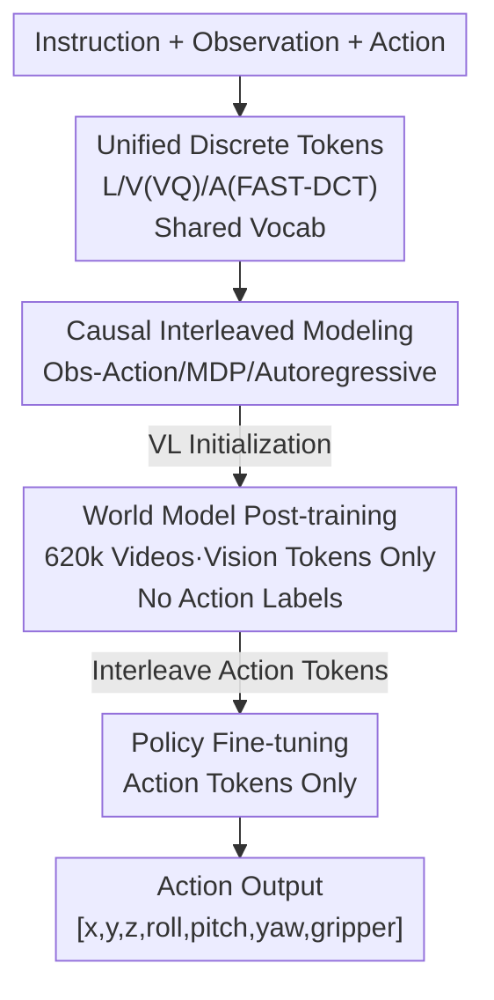

# UniVLA: Unified Vision-Language-Action Model

**Conference**: ICLR 2026  
**OpenReview**: [https://openreview.net/forum?id=PklMD8PwUy](https://openreview.net/forum?id=PklMD8PwUy)  
**Project Page**: [https://robertwyq.github.io/univla.github.io](https://robertwyq.github.io/univla.github.io)  
**Area**: Robotics / Embodied AI / Vision-Language-Action (VLA)  
**Keywords**: VLA, Unified Discrete Tokens, World Model, Autoregressive, Robot Manipulation

## TL;DR
UniVLA discretizes vision, language, and action into tokens within a shared vocabulary, modeling interleaved observation-action sequences with a single autoregressive Transformer. By introducing a "world model" objective for post-training on 620,000 action-free robot videos before fine-tuning, it sets new SOTA records across CALVIN, LIBERO, and SimplerEnv-Bridge (e.g., 95.5% average on LIBERO, surpassing π0-FAST's 85.5%).

## Background & Motivation
**Background**: Current mainstream VLA models (such as OpenVLA and π0) are largely built on pre-trained VLMs, following a "language-centric" pipeline—utilizing an independent vision encoder (ViT) to project images into semantic space and then decoding actions based on these representations. Vision is treated merely as "input understanding," with the model only outputting actions.

**Limitations of Prior Work**: This late-fusion paradigm has two major drawbacks. First, the coupling between visual features and actions is loose, preventing the model from learning deeply intertwined cross-modal representations or the temporal and causal dependencies within the perception-action loop. Second, modeling tasks as a "static image → action" mapping ignores the dynamic, causal nature of real-world interactions, making it impossible to leverage the temporal information inherent in large-scale video datasets.

**Key Challenge**: The vision, language, and action modalities are naturally heterogeneous—vision consists of high-dimensional continuous spatial signals, language consists of abstract discrete semantics, and actions are temporal sequences with causal dependencies. Integrating them into a unified representation space is inherently difficult, and the chain from perception to action is dynamically causal, which existing static paradigms fail to express.

**Goal**: Can vision, language, and action be jointly modeled in the **same representation space** to achieve tighter cross-modal fusion and enable the model to learn environment dynamics from large-scale videos, thereby enhancing policy learning?

**Key Insight**: The authors abandon the independent vision encoder in favor of an encoder-free approach. Since language is already tokenized, vision is discretized into tokens using VQ, and actions are discretized via frequency-domain DCT. All three share a single vocabulary. Consequently, all modalities are reduced to a "next-token prediction" problem, naturally supporting multi-modal multi-tasking and enabling the model to ingest large-scale video data like a language model.

**Core Idea**: Replace the "VLM encoding + action head" setup with unified discrete tokens and interleaved sequences. Introduce a **world model post-training** stage before fine-tuning to learn environment dynamics from unlabeled videos, which is then transferred to downstream policy learning.

## Method

### Overall Architecture
The core of UniVLA is an 8.5B parameter purely autoregressive Transformer (consistent with the Emu3 architecture) that treats all inputs as token sequences regardless of modality. On the input side, language, vision, and action are discretized by their respective tokenizers: language and vision follow the Emu3 design using a VQ encoder ($8\times$ spatial compression), and actions use FAST to transform continuous actions into the frequency domain via DCT before discretization. These tokens are **interleaved** chronologically into a causal multi-modal sequence, with modal boundaries defined by special tokens (boi/eoi for vision, boa/eoa for actions), followed by unified next-token prediction.

Training consists of two stages: The model is initialized with VL-aligned Emu3 weights (providing basic vision-language capabilities). The **post-training stage** uses a "world model" objective on 622,000 robot videos, supervising only the vision tokens without any action labels. The **fine-tuning stage** then interleaves action tokens into the sequence, supervising only the action tokens for downstream policy learning. During inference, the model generates action tokens without predicting future frames, stopping at the eoa token.

### Key Designs

**1. Unified Discrete Token Representation: Abandoning Indepedent Vision Encoders**

To address the loose vision-action coupling caused by independent ViT encoders, UniVLA adopts an encoder-free approach, mapping all three heterogeneous modalities to discrete tokens. Visual observations are discretized via a VQ tokenizer ($8\times$ spatial compression). Actions follow the FAST method: a time window $A_{1:H}=\{a_1,\dots,a_H\}$ (where each $a_t$ is a $d$-dimensional vector) is transformed via Discrete Cosine Transform (DCT) to the frequency domain and then quantized into a variable-length token sequence $[T_1,\dots,T_n]$. The 1024 action tokens directly replace the last 1024 IDs in the language vocabulary. Since language, vision, and action tokens originate from a shared vocabulary, the model requires only a standard cross-entropy next-token loss, selectively including tokens in the loss calculation as needed. Thus, vision and action are no longer two separate representations forced into alignment; they are mutually visible tokens in the same sequence, with cross-modal fusion occurring at every attention layer.

**2. Causal Interleaved Sequence Modeling: Perception-Action Loops as MDPs**

To capture temporal causality missing in static mappings, UniVLA formalizes embodied planning as a Markov Decision Process (MDP) and uses modal interleaving to naturally encode causality. For example, in a "pick up carrot" task, the instruction and current observation determine the action, the action changes the environment to produce a new observation, and the new observation guides the next action—forming an interleaved Markov chain. The policy learning sequence is formulated as:
$$S_a = \{L_t^1, L_v^1, L_a^1, L_v^2, L_a^2, \dots, L_v^t, L_a^t\}$$
where $L_t$, $L_v$, and $L_a$ denote language, vision, and action tokens respectively, with superscripts denoting time steps. Due to autoregressive modeling, each action token "sees" all previous observations and actions upon generation. Causal dependency is guaranteed by the structure itself rather than external recurrent modules. This interleaved format allows video generation, visual grounding, and action learning to be seamlessly integrated.

**3. World Model Post-training: Learning Dynamics from Videos**

This is the most critical finding. Addressing the scarcity of action labels and the difficulty of transferring across inconsistent robot action spaces, the authors insert a world model post-training stage before fine-tuning. In the MDP framework, the world model learns the transition function $P(s_{t+1}\mid s_t, a_t)$. Specifically, the language instruction is treated as a "generalized action." Given the current observation $L_v^1$ and instruction $L_t^1$, the model predicts future visual content, with the loss applied **only to vision tokens**:
$$S_v = \{L_t^1, L_v^1, L_v^2, \dots, L_v^t\}$$
This allows the model to learn environment dynamics from 620,000 robot videos without action labels. Ablations show (see below): pure action post-training actually degrades performance due to heterogeneous action spaces, whereas world model post-training increases the success rate from 17.4% to 89.2% on LIBERO-Long and the average sequence length from 1.46 to 4.61 on CALVIN, far exceeding text-to-image and pure video prediction.

### Loss & Training
Standard next-token cross-entropy is used throughout, with tasks switched by determining which tokens contribute to the loss. World model post-training calculates loss only on vision tokens (30K steps, batch 64, 622k videos). Policy fine-tuning calculates loss only on action tokens, using a 2-frame interleaved vision-action sequence, an action chunk size of 10, and a cosine annealing learning rate starting at $8\times10^{-5}$. Benchmark configurations vary: CALVIN uses dual views (third-person $200\times200$ + wrist $80\times80$) with batch 192 for 8k steps on A100s; LIBERO uses dual $200\times200$ views with batch 192 for 8k steps (single model for four suites); SimplerEnv uses a single $256\times256$ view with batch 128 for 20k steps and chunk size 5.

## Key Experimental Results

### Main Results
UniVLA achieves SOTA results across three major simulation benchmarks.

| Dataset | Metric | UniVLA | Prev. SOTA | Gain |
|--------|------|--------|-----------|------|
| CALVIN ABCD→D | Avg. Len | 4.63 | 4.49 (RoboVLMs) | +0.14 |
| CALVIN ABC→D | Avg. Len | 4.41 | 4.28 (Seer-Large) | +0.13 |
| LIBERO | Avg. Success | 95.5% | 85.5% (π0-FAST) | +10.0 |
| LIBERO-Long | Success Rate | 94.0% | 69.0% (CoT-VLA) | +25.0 |
| SimplerEnv-Bridge | Avg. Success | 69.8% | 42.7% (SpatialVLA) | +27.1 |

The +25% improvement on LIBERO-Long (long-horizon compositional tasks) validates the value of the world model for long-term planning. Significant improvements were also noted in the most difficult SimplerEnv tasks, such as "stack block," "put carrot," and "put spoon."

### Ablation Study
Comparison of post-training strategies (fine-tuning for action prediction only), with metrics for LIBERO / SimplerEnv-WidowX / LIBERO-Long / CALVIN:

| Post-training Strategy | Sequence | LIBERO | SimplerEnv | LIBERO-Long | CALVIN |
|------------|----------|--------|-----------|-------------|--------|
| No Post-training | — | 48.5 | 0.0 | 17.4 | 1.46 |
| Action Prediction Only | T,I,A | 43.9 (-4.6) | 0.0 | 10.6 (-6.8) | 0.52 (-0.94) |
| text-to-image | T,I | 69.8 (+21.3) | 6.3 | 55.8 | 3.79 |
| Video Prediction | I₁..Iₜ | 78.9 (+30.4) | 17.7 | 80.8 | 3.59 |
| **World Model** | T,I₁..Iₜ | **94.2 (+45.7)** | **64.6** | **89.2** | **4.61 (+3.15)** |

Data efficiency and history window ablation:

| Configuration | Key Metric | Description |
|------|---------|------|
| 10% Fine-tuning Data + Post-training | CALVIN 3.19 | Surpasses RoboVLMs full data (2.52); w/o post-training only 0.15 |
| 2k Steps Training w/ Post-training | CALVIN 4.21 | w/o post-training only 0.37; extremely fast convergence |
| History Window 1+0 | CALVIN 4.26 | No historical context |
| History Window 1+1 | CALVIN 4.61 | Optimal |
| History Window 1+2 | CALVIN 4.43–4.47 | Diminishing returns with longer context |

### Key Findings
- **World model post-training is the primary driver of performance**: Action-only post-training **degrades** performance due to heterogeneous action spaces (embodiment, control frequency, normalization), while all vision-based post-training strategies show gains. The world model shows the largest gain (+71.8 on LIBERO-Long).
- **Text instructions + temporal video are both essential**: Text-to-image (text, no temporal) and pure video prediction (temporal, no text) are inferior to the world model, indicating that their combination is necessary to model "instruction-driven state transitions."
- **Visual prediction loss during fine-tuning is effective even without post-training**: The autoregressive structure allows visual loss to naturally integrate world model learning into policy learning (CALVIN 4.42 vs. a baseline without visual prediction).
- **History follows Markovian properties**: Adding one frame of history significantly improves performance (4.26 → 4.61), while further additions show diminishing returns, suggesting recent observations contain the most information.

## Highlights & Insights
- **"Actions as tokens" integrates VLA into the language model paradigm**: Discretizing actions via FAST/DCT into 1024 shared vocabulary IDs reduces the model to pure next-token prediction, which is architecturally simple and naturally enables video processing and multi-modal output (spatial reasoning, video prediction).
- **World model post-training = "Self-supervised pre-training" for VLA**: It circumvents the need for expensive action labels by learning environment dynamics from massive robot videos, maximizing both data and training efficiency (outperforming full-data baselines with only 10% data).
- Treating **language instructions as "generalized actions"** in the world model is a clever formalization—it aligns instruction-conditioned future prediction with the MDP transition function, avoiding the need for a separate world model interface.

## Limitations & Future Work
- **Action discretization sacrifices low-level precision**: The authors acknowledge that tokenizing actions may result in a loss of fine-grained control precision compared to continuous action heads (like π0.5). Accurate pouring in real ALOHA tasks remains difficult for both UniVLA and π0. The paper suggests an "action expert" could be added during fine-tuning for high-precision scenarios, though this was not fully explored.
- **Model Size (8.5B)**: The autoregressive structure and long video token sequences lead to significant inference and training costs. Real-time robot control latency was not reported, leaving deployment feasibility in doubt.
- **Post-training data domain**: While 620k videos is a large dataset, it remains robot-specific. Whether the model can benefit from general internet videos (like LLMs) or generalize across domains (e.g., driving) requires further validation.

## Related Work & Insights
- **vs. OpenVLA / π0 (Action Prediction)**: These models use pre-trained VLMs to encode vision into semantic space before outputting tokens/flow-matching actions, lacking spatial reasoning and visual prediction. UniVLA's encoder-free, unified tokenization enables both action output and visual prediction/grounding.
- **vs. SuSIE / UniPi / GR Series (Vision-guidance)**: These use "policy-as-video," predicting future frames followed by inverse dynamics for action; however, generative and action models are separate. UniVLA builds both within a single autoregressive framework.
- **vs. LAPA / AdaWorld (Latent-action World Models)**: These learn latent actions from action-free videos. UniVLA's world model is simpler and offers better transferability by directly predicting vision tokens.

## Rating
- Novelty: ⭐⭐⭐⭐⭐ First native multi-modal VLA to unify vision/language/actions as shared vocabulary tokens; the encoder-free + world model post-training combination is elegant.
- Experimental Thoroughness: ⭐⭐⭐⭐⭐ SOTA across three major simulation benchmarks; comprehensive ablations on post-training, data efficiency, and history; extensions to real ALOHA and autonomous driving.
- Writing Quality: ⭐⭐⭐⭐ Clear motivation and methodology with good diagrams; some appendix details (action expert, driving experiments) could be better integrated.
- Value: ⭐⭐⭐⭐⭐ Provides a scalable, video-ingesting, action-label-free VLA roadmap with clear implications for General Embodied AI.

<!-- RELATED:START -->

## Related Papers

- [\[ICLR 2026\] HybridVLA: Collaborative Diffusion and Autoregression in a Unified Vision-Language-Action Model](hybridvla_collaborative_diffusion_and_autoregression_in_a_unified_vision-languag.md)
- [\[ICLR 2026\] WMPO: World Model-based Policy Optimization for Vision-Language-Action Models](wmpo_world_model-based_policy_optimization_for_vision-language-action_models.md)
- [\[ICLR 2026\] Unified Diffusion VLA: Vision-Language-Action Model via Joint Discrete Denoising Diffusion Process](unified_diffusion_vla_vision-language-action_model_via_joint_discrete_denosing_d.md)
- [\[ICLR 2026\] AutoFly: Vision-Language-Action Model for UAV Autonomous Navigation in the Wild](autofly_vision-language-action_model_for_uav_autonomous_navigation_in_the_wild.md)
- [\[ICLR 2026\] On Robustness of Vision-Language-Action Model against Multi-Modal Perturbations](on_robustness_of_vision-language-action_model_against_multi-modal_perturbations.md)

<!-- RELATED:END -->
