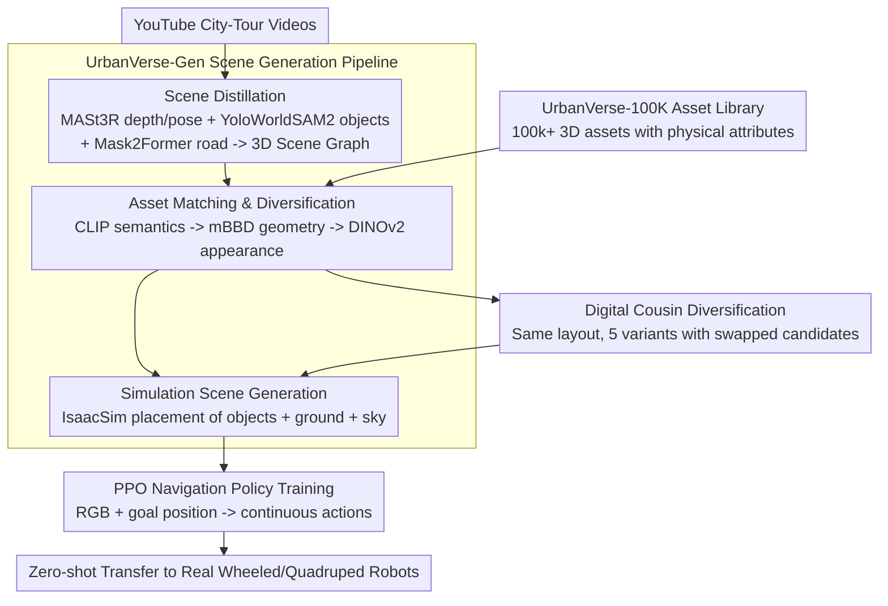

# UrbanVerse: Scaling Urban Simulation by Watching City-Tour Videos

**Conference**: ICLR 2026  
**arXiv**: [2510.15018](https://arxiv.org/abs/2510.15018)  
**Code**: [urbanverseproject.github.io](https://urbanverseproject.github.io/)  
**Area**: Robotics / Simulation  
**Keywords**: Urban Simulation, real-to-sim, Embodied AI, 3D Asset Library, Navigation Policy

## TL;DR
UrbanVerse is a data-driven real-to-sim system that transforms crowdsourced city-tour videos into physically-aware interactive simulation scenes. This system comprises a library of 100K+ annotated 3D assets and an automated scene construction pipeline. It generates 160 high-quality scenes in IsaacSim, where trained PPO navigation policies achieve an 89.7% success rate in zero-shot real-world transfer, completing 337m long-distance tasks with only two human interventions.

## Background & Motivation
Embodied AI agents in urban spaces (e.g., delivery robots, quadruped robots) are developing rapidly. Training these agents requires large-scale, diverse, and high-fidelity urban environments. However, existing simulation solutions face a fundamental contradiction:

- **Manual Scene Creation**: Tools like CARLA offer only 15 scenes, which are non-scalable and labor-intensive.
- **Procedural Generation**: Frameworks like MetaUrban/UrbanSim use hard-coded rules, producing scenes that deviate from real-world distributions (e.g., randomly parked scooters do not follow realistic parking patterns).
- **Passive Real Data**: City-tour videos offer rich diversity but lack action labels and interactivity.
- **3D Reconstruction**: Methods like 3DGS can reconstruct scenes from video but produce static textured meshes without semantic or physical attributes.

**Key Challenge**: The contradiction between scale and realism. Simply increasing quantity (procedural generation) does not yield generalization—if scenes do not faithfully reflect real-world distributions, quantity is ineffective.

**Core Idea**: Extract scene semantics and layouts from real city-tour videos and instantiate them into physically interactive simulation scenes using high-quality 3D assets—the "digital cousin" paradigm. This combines the diversity of real data with the interactivity of simulation.

## Method

### Overall Architecture
UrbanVerse is supported by two pillars: UrbanVerse-100K, a 3D urban asset library annotated with physical attributes, and UrbanVerse-Gen, an automated pipeline that converts YouTube city-tour videos into physically interactive simulation scenes in IsaacSim. The former provides the "building blocks," while the latter "builds scenes according to real videos." The pipeline distills object, ground, and sky nodes from a video, retrieves matching "digital cousin" instances from the asset library, and generates multiple variations with different appearances under the same layout. Finally, navigation policies are trained in these simulation scenes for zero-shot transfer to real wheeled and quadruped robots.

### Key Designs

**1. UrbanVerse-100K Asset Library: Solving Quality and Scale Bottlenecks for 3D Building Blocks**

For urban simulation to be faithful, one must first possess a large, clean, and physically-attributed collection of 3D objects. This work starts with 800,000 noisy assets from Objaverse and cleans them via a three-stage semi-automated pipeline. First, asset filtering: 10 annotators spent 3 weeks checking each asset in a Three.js viewer to remove 8 categories of quality issues (e.g., broken meshes, missing textures, paper-like geometry, abnormal scales), resulting in 158,000 usable assets. Second, urban ontology construction: Using OpenStreetMap labels as a backbone and integrating ADE20K and Cityscapes categories, a 3-layer ontology with 667 leaf categories was built to classify objects like "fire hydrants," "street lights," and "benches." Finally, attribute annotation: GPT-4o was used to assign 33 attribute labels (semantics, affordance, and physical properties like quality and friction) to each asset using a thumbnail and four rotation snapshots, costing only $1,334 via API. The final library contains 102,530 GLB objects, 288 PBR ground materials, and 306 HDRI sky maps.

**2. UrbanVerse-Gen Scene Building Pipeline: Distilling Videos into Interactive Scenes**

The key is placing building blocks according to real videos. A unified 3D urban scene graph $\mathcal{V} = \langle\mathcal{O}, \mathcal{G}, \mathcal{S}\rangle$ is defined, representing object, ground, and sky nodes. The pipeline converts video into this graph in three stages. The scene distillation stage extracts semantics and 3D layouts: MASt3R estimates metric depth and camera poses, YoloWorld+SAM2 perform open-vocabulary object parsing, and Mask2Former segments road and sidewalk surfaces. Cross-frame fusion yields persistent object nodes, each recording category, centroid, 3D bounding box, orientation, and appearance crops. The asset matching and diversification stage retrieves $k_{cousin}$ candidates for each node using CLIP semantic matching, mBBD geometric filtering, and DINOv2 appearance ranking. Finally, the simulation scene generation stage instantiates these in UrbanSim (IsaacSim) by fitting ground planes with PBR textures, applying HDRI skies, and placing objects with collision detection and physical property assignment.

**3. Digital Cousin Diversification: Batch-Creating "Cousin" Scenes under the Same Layout**

Replicating a video is insufficient, as policies may overfit to specific appearances. The "digital cousin" concept generates $k_{cousin}=5$ variants with identical layouts but different appearances. Multiple candidates are retained during matching; changing the candidates switches the "skin" of the scene—a bench remains a bench but with a different style. This provides intra-layout diversity that complements the inter-layout diversity of different videos, augmenting data without changing the semantic structure of the scene.

**4. PPO Navigation Policy Training: Learning Transferable Environment Understanding**

The goal is to transform the scene library into a functional navigation policy. An Actor-Critic architecture is used to run PPO in a continuous action space. Observations consist of a 135×240 RGB image and the relative goal position, encoded via a 3-layer CNN (channels [16,32,64]) and a 3-layer MLP (hidden layer 128). The reward function combines goal reaching (+2000), collision penalties (-200), and tracking rewards for position and velocity. Training cycles through 16 scenes at a time, replacing them every 100 episodes to force the policy to learn general environment understanding rather than memorizing a specific map.

### Loss & Training
Optimized using PPO with an adaptive learning rate of 1e-4, $\gamma=0.99$, GAE $\tau=0.95$, PPO clip $\epsilon=0.2$, KL threshold 0.01, and entropy coefficient 0.002. Training lasted 1500 epochs on a single L40S GPU using mixed precision.

## Key Experimental Results

### Main Results
**Scene Construction Fidelity** (KITTI-360, 45 sequences, average 198.7m):

| SfM | Scene Parser | Category(%) | Asset(%) | Dist(m) | Orient(°) | Vol(m³) | mAP25 |
|-----|--------------|-------------|----------|---------|-----------|---------|-------|
| MASt3R | YoWorldSAM2 | **93.1** | **75.1** | **1.4** | 19.8 | **0.8** | **28.2** |
| VGGT | YoWorldSAM2 | 91.5 | 70.6 | 2.1 | 20.1 | 1.3 | 9.4 |

**CraftBench Generalization Test** (10 artist-designed scenes):

| Method | SR(%) | CT | RC(%) |
|--------|-------|----|-------|
| MBRA | 35.6 | 25.6 | 52.9 |
| S2E | 33.1 | 27.7 | 55.7 |
| PPO-UrbanSim | 9.1 | 31.5 | 19.4 |
| **PPO-UrbanVerse** | **41.9** | 35.5 | **62.4** |

**Zero-shot Sim-to-Real** (16 real-world urban scenes):

| Method | Wheeled SR(%) | Quadruped SR(%) |
|--------|---------------|-----------------|
| NoMad | 33.3 | 37.5 |
| S2E | 47.9 | 58.6 |
| PPO-UrbanSim | 18.8 | 18.8 |
| **PPO-UrbanVerse** | **77.1** | **89.7** |

### Ablation Study

| Configuration | Key Metric | Description |
|---------------|------------|-------------|
| 1 layout → 32 layouts | SR: Low → 41.9% | Data scaling power law holds |
| 1 cousin → 5 cousins | SR: Low → Higher | Intra-layout diversity is also critical |
| UrbanVerse vs PG | Human Score 3.58 vs 2.9/5 | Over 70% of users prefer UrbanVerse |
| Pre-train + Fine-tune | SR: 0% → 80% | Real-to-sim-to-real closed loop is effective |

### Key Findings
- **Scaling power law exists**: A power-law relationship exists between the number of scenes/digital cousins and performance, with high $R^2$ in linear fitting.
- **Real distributions are critical**: Procedurally generated (PG) scenes of equivalent quantity fail to improve generalization (flat PG curve).
- **PPO-UrbanVerse out-performs foundation models**: A simple PPO policy trained on UrbanVerse scenes outperformed large-scale pre-trained visual navigation foundation models like NoMad and CityWalker.
- **Strong zero-shot transfer**: A quadruped Go2 achieved an 89.7% success rate in the real world, outperforming S2E by +31.1%.
- **Long-range tasks**: Successfully completed 337m long-distance navigation on public streets with only 2 human interventions.

## Highlights & Insights
- **Complete Pipeline**: Formulates a closed loop from video collection to asset library construction, scene generation, policy training, and real-world deployment.
- **100K Asset Library**: Addresses the quality and scale bottleneck of 3D assets, serving as a significant independent contribution.
- **Discovery of Scaling Law**: Validates the existence of data scaling laws in embodied AI, providing quantitative evidence that "more scenes = better policy."
- **Dual-Robot Verification**: The same policy works effectively on both wheeled and quadruped robots, indicating the learning of environmental understanding rather than specific kinematics.
- **Real-to-sim-to-real Loop**: Offers high practical value by allowing a video of a deployment environment to be used for simulation-based fine-tuning before deployment.

## Limitations & Future Work
- "Digital cousins" still exhibit gaps compared to real scenes—asset replacement cannot perfectly match original objects.
- Orientation error (19.8°) remains high, potentially impacting precise navigation.
- Only PPO was used; more advanced reinforcement learning algorithms were not explored.
- Limited to navigation; manipulation tasks were not covered.
- Scene dynamics are lacking—there is no movement of dynamic obstacles like pedestrians or vehicles.
- Stationary HDRI maps cannot simulate the passage of time.

## Related Work & Insights
- **Digital Cousins (Dai et al., 2024)**: UrbanVerse extends multi-variant generation from indoor to large-scale outdoor urban scenes.
- **MetaUrban / UrbanSim (Wu et al., 2025)**: Foundation for UrbanVerse's simulation platform; this work overcomes their procedural generation limitations.
- **ViNT / NoMad (Shah et al., 2023; Sridhar et al., 2024)**: Navigation foundation models trained on passive data; UrbanVerse introduces interactive learning.
- **Insight**: Crowdsourced video is an nearly infinite source of simulation material, worth promoting in other domains like indoor environments or factories.

## Rating
- Novelty: ⭐⭐⭐⭐⭐
- Experimental Thoroughness: ⭐⭐⭐⭐⭐
- Writing Quality: ⭐⭐⭐⭐⭐
- Value: ⭐⭐⭐⭐⭐

<!-- RELATED:START -->

## Related Papers

- [\[CVPR 2025\] CityWalker: Learning Embodied Urban Navigation from Web-Scale Videos](../../CVPR2025/robotics/citywalker_learning_embodied_urban_navigation_from_web-scale_videos.md)
- [\[NeurIPS 2025\] Spatial Understanding from Videos: Structured Prompts Meet Simulation Data](../../NeurIPS2025/robotics/spatial_understanding_from_videos_structured_prompts_meet_simulation_data.md)
- [\[ICLR 2026\] From Seeing to Experiencing: Scaling Navigation Foundation Models with Reinforcement Learning](from_seeing_to_experiencing_scaling_navigation_foundation_models_with_reinforcem.md)
- [\[ICLR 2026\] RoboCasa365: A Large-Scale Simulation Framework for Training and Benchmarking Generalist Robots](robocasa365_a_large-scale_simulation_framework_for_training_and_benchmarking_gen.md)
- [\[ICLR 2026\] D2E: Scaling Vision-Action Pretraining on Desktop Data for Transfer to Embodied AI](d2e_scaling_vision-action_pretraining_on_desktop_data_for_transfer_to_embodied_a.md)

<!-- RELATED:END -->
