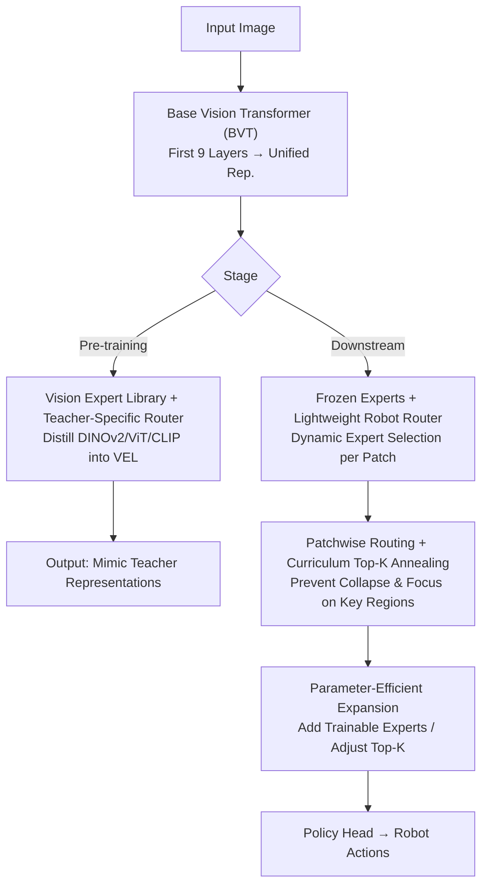

# VER: Vision Expert Transformer for Robot Learning via Foundation Distillation and Dynamic Routing

**Conference**: ICLR 2026  
**OpenReview**: [https://openreview.net/forum?id=aoorNQFpM6](https://openreview.net/forum?id=aoorNQFpM6)  
**Code**: https://yixiaowang7.github.io/ver_page/  
**Area**: Robotics / Embodied AI  
**Keywords**: Vision foundation model distillation, Mixture-of-Experts (MoE), dynamic routing, visuomotor policy, curriculum Top-K annealing

## TL;DR
VER distills multiple vision foundation models (DINOv2 / ViT / CLIP) into an MoE-style "Vision Expert Library." For downstream robot tasks, only a lightweight router (less than 0.4% parameters) is fine-tuned to dynamically select task-relevant experts per patch. Combined with curriculum Top-K annealing to prevent early routing collapse, VER achieves SOTA performance across 17 robot tasks and various policy heads.

## Background & Motivation
**Background**: Visuomotor policy learning maps image observations directly to control actions, typically relying on pre-trained vision foundation models (VFMs) like DINOv2, CLIP, and ViT to provide transferable visual representations. However, a single VFM often excels only in specific domains (e.g., DINOv2 for geometry/segmentation, CLIP for semantics), and no single model covers the diverse implicit visual capabilities required for robotics.

**Limitations of Prior Work**: Directly stacking multiple VFMs leads to an explosion in computational and engineering complexity. Prevailing approaches (e.g., RADIO, Theia) distill multiple VFMs into **a single unified representation**, leaving three issues: (1) Heterogeneous VFM features are inherently misaligned; forcing them into a unified representation dilutes or loses the specialized expertise of each model. (2) The unified representation uses fixed weights; downstream policy heads must "extract" task-relevant information themselves, leading to sub-optimal flexibility in selecting the most relevant VFM per task. (3) Injecting robotics-specific knowledge requires **full retraining**, and computational costs cannot be scaled based on task difficulty.

**Key Challenge**: Compressing multiple VFMs into a static, unified representation essentially uses "early binding + fixed weights" to serve diverse downstream tasks with varied needs—flexibility is lost at the moment of compression, and recovering it requires the policy head to struggle or necessitates full retraining.

**Goal**: (1) Preserve the expertise of each VFM during distillation rather than mixing them. (2) Enable dynamic selection of representations based on the task or local image content. (3) Incorporate robotics-specific knowledge at low cost with scalable computation.

**Key Insight**: Shift the distillation target from "a single unified representation" to an "expert library"—leveraging the Mixture-of-Experts (MoE) concept to let different experts capture distinct visual knowledge from various VFMs, with a learnable router sparsely activating the most relevant experts.

**Core Idea**: Replace "distillation into a fixed unified representation" with "distillation into an MoE expert library + downstream training of a lightweight router." This postpones the flexibility of representation selection from the training phase to the task execution phase.

## Method

### Overall Architecture
VER modifies a standard ViT into two sections: the first 9 layers remain a standard transformer, called the **Base Vision Transformer (BVT)**, responsible for encoding images into a unified representation. The final 3 layers replace Feed-Forward Networks (FFNs) with MoE modules, forming the **Vision Expert Library (VEL)**, where each layer contains $L=6$ MLP experts and activates $K=2$. The system operates in two stages:

- **Pre-training (Distillation Stage)**: Large-scale images (ImageNet-1K) are used to distill three teacher VFMs (DINOv2, ViT, CLIP) into the VEL. Crucially, each teacher is assigned a **Teacher-Specific Router (TS Router)**, which dynamically selects experts to mimic the corresponding teacher. Mutual information regularization encourages different teachers to activate disjoint subsets of experts, avoiding gradient interference and expert collapse.
- **Downstream Robotics Policy (Deployment Stage)**: The entire BVT + VEL is frozen. Only a new, **lightweight Robot Router (< 0.4% parameters)** is trained to dynamically select experts per task. The expert outputs are fed into policy heads (Diffusion / Flow-matching / ViLT, etc.) to generate actions. The optimal mode for the Robot Router is **Patchwise Expert Routing (PER)**, combined with **Curriculum Top-K Annealing (CTA)** to prevent early collapse. Robotics domain knowledge can be injected via parameter-efficient fine-tuning (adding trainable experts or adjusting Top-K).

### Key Designs

**1. Vision Expert Library + Teacher-Specific Router: Preserving Expertise without Mixing**

To address the dilution of VFM expertise, VER replaces the final $N=3$ FFN layers of the ViT with MoE modules. During distillation, each teacher $i$ has a private TS Router $R^n_i$, which scores and injects noise into input features for Top-K activation. The MoE output is $y = \sum_{l=1}^{L} R^n_i(x,l)\cdot E^n_l(x)$, where $R^n_i(x,l)=m_l\cdot p_l$, $p=\mathrm{Softmax}(z)$, $z=s_1+\epsilon$, noise $\epsilon\sim\mathcal{N}(0, \mathrm{SoftPlus}(s_2))$, and $m_l\in\{0,1\}$ is the Top-K indicator. The distillation loss $L_{\text{distill}}$ uses a weighted combination of cosine and smooth-L1 losses. This ensures knowledge from different VFMs is stored in distinct experts rather than being averaged out.

**2. Teacher-level Mutual Information Regularization: Enforcing Specialization and Balancing**

To prevent optimization conflicts and uneven expert utilization, VER introduces a **teacher-level mutual information loss**, maximizing the mutual information between teacher variables $I$ and routed experts $E^n$: $L_{mi}=-\sum_n I(I,E^n)$. The entropy decomposition $I(I,E^n)=H(E^n)-H(E^n\mid I)$ manages two objectives: maximizing marginal entropy $H(E^n)$ provides **global load balancing**, while minimizing conditional entropy $H(E^n\mid I)$ **forces teacher-specific specialization**. This reduces gradient interference in the shared MoE pool. The total pre-training objective is $L_{\text{pretrain}}=L_{\text{distill}}+\gamma L_{mi}$ with $\gamma=0.0005$.

**3. Patchwise Expert Routing + Curriculum Top-K Annealing: Local Selection and Solving Early Collapse**

During deployment, experts are frozen, and only the Robot Router is trained. The authors proposed **Patchwise Expert Routing (PER)**, which adapts to local content with $<0.4\%$ additional parameters. However, PER faces **early collapse**. Proposition 1 shows the gradient of the routing logit $\frac{\partial L}{\partial z_l}=p_l(m_l q_l-q)$, indicating that for any **inactive expert** ($m_l=0$), the gradient simplifies to $-p_l q$, becoming **independent** of the expert's potential contribution $q_l$. Because the shallow router converges faster than the policy head, random noise can permanently lock experts in an inactive state. VER introduces **Curriculum Top-K Annealing (CTA)**: starting with all experts active ($K_0=L$) and linearly annealing to $K_{\min}$ over $S$ steps. Initial full activation ensures every expert receives gradients for exploration.

**4. Parameter-Efficient Expansion: Low-cost Knowledge Injection and Scalable Computation**

Distilled experts encode general vision. To incorporate domain-specific information, VER allows adding **Train-from-Scratch (TFS) experts** alongside Distilled-Foundation-Model (DFM) experts. Only this section is trained to inject robotics knowledge. Moreover, adjusting the Top-K value per patch via fine-tuning the Robot Router allows for a controllable trade-off between accuracy and computational cost.

### Loss & Training
The pre-training objective is $L_{\text{pretrain}}=L_{\text{distill}}+\gamma L_{mi}$ ($\gamma=0.0005$, $\beta=0.9$, $\alpha_i=1/I$). Downstream training freezes the BVT+VEL and optimizes the Robot Router and policy head. Teacher routing uses Gumbel-Softmax with a straight-through estimator. VER-T/S/B models are based on DeiT-Tiny / DeiT-Small / ViT-Base with $L=6$ and $K=2$ in the final 3 layers.

## Key Experimental Results

### Main Results
On 17 robot tasks across Franka Kitchen, Meta-World, and Adroit, VER compared favorably against other encoders using the same policy head:

| Model | Avg Success Rate (%) |
|------|------|
| VC-1 | 42.6 |
| MVP | 48.7 |
| RADIO | 61.3 |
| VIP | 62.8 |
| R3M | 67.6 |
| Theia-B | 67.1 |
| **VER-B (Ours)** | **74.7** |

Table 2 shows VER outperformed Theia across ViLT, Flow-Matching, and Diffusion heads in both simulation and the real world (e.g., real-world water pouring 0.45 $\rightarrow$ 0.90). VER also surpassed the fine-tuned VLA model GR00T N1.5.

### Ablation Study
Routing strategy ablation (10 seeds, relocate/pen tasks):

| Configuration | relocate | pen | Description |
|------|---------|-----|------|
| Single DINOv2 Router | 38.4 | 78.0 | Relying on one VFM; poor for relocate |
| FTR (Frame-level) | 41.2 | 81.2 | Frame-level teacher routing |
| LTR (Layer-level) | 36.4 | 79.2 | Layer-level teacher routing |
| PER (Patch-level) | 47.6 | 78.0 | Patch-level; better than single VFM |
| **PER + CTA** | **56.4** | **80.8** | Annealing significantly boosts relocate |

| Configuration | relocate | pen | average |
|------|---------|-----|-----|
| 6 DFM + 0 TFS, K=2 | 64.0 | 80.0 | 72.0 |
| 0 DFM + 2 TFS, K=2 | 69.3 | 74.7 | 72.0 |
| **6 DFM + 1 TFS, K=2** | **74.7** | **82.7** | **78.7** |

### Key Findings
- **CTA is crucial for difficult tasks**: Relocate performance rose from 47.6 (PER) to 56.4 (PER+CTA), while easier tasks showed limited gains, confirming that early collapse primarily affects complex tasks requiring precise local selection.
- **VFM specialization**: Different VFMs suit different tasks; PER dynamic routing is required for cross-task robustness, proving unified representations lose flexibility.
- **Feature analysis**: CTA reduces high-norm outliers in background regions, focusing attention on task-critical areas. Mutual information analysis shows background patch information is suppressed while task-relevant information (e.g., target pose) is preserved.
- **DFM+TFS Complementarity**: Mixing distilled experts with task-specific trainable experts (6+1) outperforms either alone (78.7 vs 72.0).
- **Near-zero Overhead**: Inference time for Diffusion policies was identical for VER and Theia (0.105s on RTX 4090), while VER achieved better performance with fewer active parameters.

## Highlights & Insights
- **Redefining the Distillation Target**: Shifting from "unified representation" to an "expert library" postpones representation selection to the task phase—a perspective applicable to any multi-teacher distillation scenario.
- **Gradient-level Diagnosis of Early Collapse**: Proposition 1 explains why MoE routing is sensitive to random seeds. CTA's "open-then-anneal" strategy is a principled solution compared to empirical regularization.
- **Entropy Decomposition**: Using $H(E)$ for balancing and $H(E|I)$ for specialization handles collapse and interference simultaneously.
- **Router as Implicit Planner**: Interpreting the Robot Router as a "planner for task-relevant experts" justifies removing mutual information regularity during downstream tasks.

## Limitations & Future Work
- Distillation was conducted on ImageNet-1K with three teachers; whether more heterogeneous teachers (e.g., SAM, Depth models) maintain specialization remains to be fully verified.
- Real-world experiments were limited in scale; long-horizon task performance and large-scale generalization require further study.
- Curriculum hyperparameters (annealing steps $S$, $K_{\min}$) affect results; adaptive selection of these remains an open problem.
- Implementing MoE in only the last 3 layers is an empirical trade-off; the mechanism behind the "depth-usability" trade-off warrants exploration.

## Related Work & Insights
- **vs. Theia / RADIO**: These merge VFMs into fixed-weight representations. VER distills into an expert library with dynamic downstream routing, achieving higher performance with similar or lower computational costs.
- **vs. Traditional MoE**: Unlike standard MoE (e.g., Switch Transformer) which aims for load balancing in general NLP/CV, VER treats routing as a "task-specific expert selector" and addresses early collapse in low-data robotics regimes.
- **vs. Fixed-Encoder VLAs**: Most methods use static encoders. VER provides dynamic feature selection and low-cost domain knowledge injection, outperforming models like GR00T N1.5.

## Rating
- Novelty: ⭐⭐⭐⭐⭐ Reconceptualizing multi-teacher distillation as an expert library and providing gradient-level diagnosis for CTA is highly original.
- Experimental Thoroughness: ⭐⭐⭐⭐ Extensive tasks and ablations, though real-world scale could be increased.
- Writing Quality: ⭐⭐⭐⭐⭐ Clear motivation, rigorous derivations, and insightful visualization.
- Value: ⭐⭐⭐⭐⭐ Provides a practical, scalable, and SOTA path for "universal + extensible" robot vision representations.

<!-- RELATED:START -->

## Related Papers

- [\[ICLR 2026\] ExoPredicator: Learning Abstract Models of Dynamic Worlds for Robot Planning](exopredicator_learning_abstract_models_of_dynamic_worlds_for_robot_planning.md)
- [\[ICLR 2026\] BOLT: Decision‑Aligned Distillation and Budget-Aware Routing for Constrained Multimodal QA on Robots](bolt_decisionaligned_distillation_and_budget-aware_routing_for_constrained_multi.md)
- [\[ACL 2025\] DRAE: Dynamic Retrieval-Augmented Expert Networks for Lifelong Learning and Task Adaptation in Robotics](../../ACL2025/robotics/drae_dynamic_retrieval-augmented_expert_networks_for_lifelong_learning_and_task_.md)
- [\[ICLR 2026\] RRNCO: Towards Real-World Routing with Neural Combinatorial Optimization](rrnco_towards_real-world_routing_with_neural_combinatorial_optimization.md)
- [\[ICLR 2026\] Action-aware Dynamic Pruning for Efficient Vision-Language-Action Manipulation](action-aware_dynamic_pruning_for_efficient_vision-language-action_manipulation.md)

<!-- RELATED:END -->
