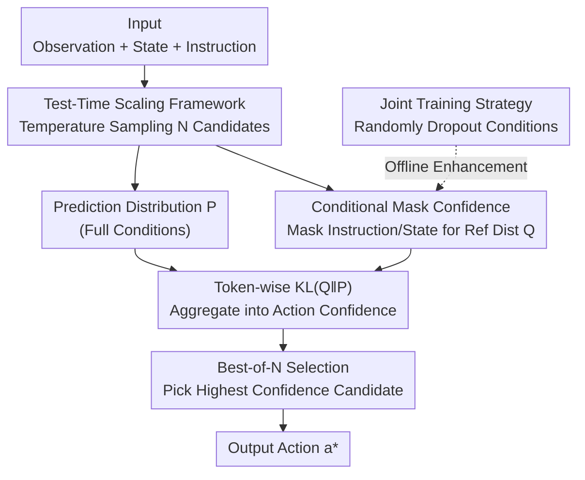

# Verifier-Free Test-Time Sampling for Vision-Language-Action Models

**Conference**: ICLR 2026  
**OpenReview**: [https://openreview.net/forum?id=UD4Rw8MOEK](https://openreview.net/forum?id=UD4Rw8MOEK)  
**Area**: Robotics / Embodied AI  
**Keywords**: VLA, Test-time scaling, Best-of-N, KL divergence confidence, conditional masking  

## TL;DR
This paper proposes MG-Select: a VLA test-time scaling framework that requires **no external verifier and no additional training modules**. It parallelly samples $N$ candidate actions and uses the KL divergence between the prediction distribution and a "reference distribution generated by the model itself after masking part of the input conditions" as a confidence measure for Best-of-N selection. It significantly improves the success rate of base VLAs in simulation and real-world pick-and-place tasks (a 168% relative improvement with 30 demonstration samples on RoboCasa).

## Background & Motivation

**Background**: Vision-Language-Action (VLA) models have shown impressive performance in robot control. Autoregressive VLAs (e.g., OpenVLA, $\pi_0$-FAST) directly reuse the next-token prediction objective of language models to tokenize continuous actions and generate them token-by-token. This approach achieves performance comparable to complex architectures without modifying the base architecture, making it a mainstream direction.

**Limitations of Prior Work**: VLAs still struggle with **high-precision tasks**—millimeter-level operations like grasping or placing often fail, and this precision determines the success of real-world robot tasks. One root cause is the single-inference paradigm: the model performs greedy decoding at each step (always taking the highest-probability action token), even if that action is not optimal.

**Key Challenge**: Inspired by the success of Test-Time Scaling (sampling + verifier) in LLM reasoning, prior works have equipped VLAs with an **external verifier** (a value function trained via reinforcement learning) for Best-of-N selection. However, this path has two major flaws: ① The verifier requires additional training before deployment, complicating the pipeline and increasing computational overhead; ② The reward modeling of these verifiers is often tied to specific datasets, failing to **generalize** to unseen task instructions or objects. The problem then becomes: can we select more precise actions using only the internal signals of the VLA itself, without training any external modules?

**Key Insight**: The authors first attempted the naive approach of "selecting candidates with the highest likelihood"—while effective in some cases, it generally fails because VLAs **memorize expert trajectories** after fine-tuning. The action token distribution becomes overly concentrated, and multiple samples almost converge to the same result, making likelihood indistinguishable. This suggests that instead of looking at "absolute probability," one should look at the "degree of deviation relative to an uncertain reference distribution"—the action that deviates furthest from an uncertain reference is often the most confident and precise one for the model.

**Core Idea**: Use the distribution generated by the **same VLA after randomly masking part of the input conditions** (instruction text / proprioceptive state) as the reference distribution $Q$. Use the KL divergence of the prediction distribution $P$ relative to $Q$ as the confidence score. The candidate with the largest KL is chosen as the most confident action—requiring no trained verifier or new modules.

## Method

### Overall Architecture
MG-Select replaces "single greedy decoding" with a "sample-score-select" loop, using only the internal signals of the VLA. Given the current observation $o_t$, state $q_t$, and instruction $I$: **(1)** The autoregressive VLA $\pi_\theta$ **parallelly samples** $N$ candidate action sequences with temperature $\tau > 0$; **(2)** For each candidate, it calculates the prediction distribution $P_i = \pi_\theta(\cdot \mid o_t, q_t, I, a_{<i})$ under normal conditions and a **reference distribution** $Q_i$ after masking certain conditions, computing the token-wise $\mathrm{KL}(Q_i \| P_i)$ to aggregate into an action-level confidence $C_{\tilde a}$; **(3)** The candidate with the highest confidence is selected as the final action $a^* = \arg\max_{\tilde a^{(n)}} C_{\tilde a^{(n)}}$ (Best-of-N). Additionally, to ensure the VLA generates meaningful distributions when inputs are masked, the authors use a **joint training strategy** to learn conditional mask distributions during the fine-tuning phase (resulting in the enhanced MG-Select*).

### Key Designs

**1. Test-Time Scaling Framework: Replacing Greedy Decoding with Parallel Sampling + Best-of-N**

To address the failure of greedy decoding in high-precision tasks, the framework splits inference into two stages: first, **parallel random sampling** to obtain $N$ candidates, and then using a criterion $M$ to select the best one. Sampling is controlled by temperature $\tau$ to manage distribution sharpness and diversity: $\tilde a^{(n)}_j \sim \pi_\theta(\cdot \mid o_t, q_t, I, \tilde a^{(n)}_{<j}; \tau)$, where $\pi_\theta(\cdot; \tau) = \mathrm{softmax}(\ell / \tau)$. As $\tau \to 0$, it degrades to greedy decoding. The final action is chosen via $a^* = \arg\max_{\tilde a^{(n)} \in \tilde A} M_{\tilde a^{(n)}}$. The framework is a general backbone; the key lies in defining the criterion $M$. Since likelihood fails due to distribution collapse, the authors introduce conditional mask confidence. Experiments show $N=4$ captures most gains, with marginal improvements beyond that.

**2. Conditional Mask Confidence: Measuring Confidence via KL Deviation from a "Half-Blind" Reference**

This is the core of the paper. The assumption is that a reference distribution that is **both uncertain and not too far from the target action distribution** provides a meaningful confidence signal. To create such a reference, the **same VLA masks part of the input conditions**—setting the instruction text, state, or both to null ($\varnothing$). This artificially creates a failure mode where the model "ignores" task-critical information. Three variants are used:

$$\text{KL}_{\text{text}} = \mathrm{KL}\big(\pi_\theta(\cdot \mid o_t, q_t, \varnothing, a_{<i}) \, \big\| \, \pi_\theta(\cdot \mid o_t, q_t, I, a_{<i})\big)$$

State-masking sets $q_t$ to null, and Text&State-masking sets both to null. Token-level confidence is $C_i = \mathrm{KL}(Q_i \| P_i)$, aggregated over the sequence as $C_a = \sum_{i \in \mathcal{I}} \mathrm{KL}(Q_i \| P_i)$ for ranking. The intuition is that if a candidate action remains distinct even against a "half-blind" reference (large KL), the full conditions provided critical information, and the model is highly confident. The best mask depends on the task: In SIMPLER-WidowX (mostly pick-and-place where the model performs okay without instructions), state-masking is best; in RoboCasa (diverse tasks requiring instructions), text-masking or text&state-masking is more effective. Note that $\mathcal{I}$ is not the full sequence: experiments found that taking only the **first 5 tokens of the FAST tokenizer** (aligned from low-frequency to high-frequency) yields the best results, whereas simple summation performs poorly.

**3. Joint Training Strategy: Learning "Masked" Distributions during Fine-tuning**

A pain point is that off-the-shelf VLAs are never trained under conditional masking, so masked inputs often produce **random actions**, leading to poor reference quality. The solution is to **randomly dropout conditions** during fine-tuning. Four masking variants $\mathcal{M} = \{(q_t, I), (q_t, \varnothing), (\varnothing, I), (\varnothing, \varnothing)\}$ (full / text-mask / state-mask / dual-mask) are used for the augmented training:

$$\mathcal{L}_{\text{Joint-IL}}(\theta; D) = -\mathbb{E}_{((o_t, q_t), a_{t:t+H}, I) \sim D} \Big[ \mathbb{E}_{(q^{(m)}_t, I^{(m)}) \in \mathcal{M}} \big[ \log \pi_\theta(a_t \mid o_t, q^{(m)}_t, I^{(m)}) \big] \Big]$$

This allows the model to maintain standard performance while becoming **aware** of the conditional mask distribution, making the reference more reliable. Interestingly, joint training alone outperforms vanilla imitation learning (PnP success rises from 17.0 to 28.5), likely due to a regularization effect. Adding MG-Select further boosts performance (MG-Select*). Additionally, the reference distribution uses a higher regularization temperature (e.g., $\tau=4.0$) to smooth the distribution and prevent it from becoming too "sharp" on certain tokens.

### Loss & Training
The training objective is $\mathcal{L}_{\text{Joint-IL}}$ described above—extending standard imitation learning by taking the expectation over masking variants. Inference requires no training: $N=4$, $\tau=0.5$ for sampling, $\tau=4.0$ for the reference distribution, and aggregating the first 5 tokens. To mitigate "repeated prefill" latency, the authors designed a **single-prefill deployment**: $N$ candidates share one prefill before independent decoding. This reduces latency by 45% for $N=4$, making total inference time comparable to single-action inference.

## Key Experimental Results

### Main Results

| Dataset | Setup / Metric | Base $\pi_0$-FAST | + MG-Select* | Gain (Rel.) |
|--------|------|------|----------|------|
| RoboCasa | 30 demos, PnP Success % | 5.3 | 14.2 | +168% |
| RoboCasa | 100 demos, PnP % | 17.0 | 31.0 | +82% |
| SIMPLER-WidowX | Mean of 4 tasks % | 46.9 | 50.3 | +7% |
| LIBERO | Mean of 4 suites % | 92.0 | 93.1 | +1.2% |
| Real-world ID (Franka) | 60 demos, Mean % | 37.5 | 47.9 | +28% |
| Real-world OOD (Franka)| Unseen objects, Mean % | 53.1 | 71.9 | +35% |

> Note: The largest gains are in the low-data regime of RoboCasa (30 demos), showing MG-Select compensates for data scarcity. LIBERO is near saturation (92%), but steady gains are still seen in the hardest tasks like LIBERO-Object (95.4→98.0) and LIBERO-Long (79.6→82.7). The method also works on OpenVLA (LIBERO mean 69.1→71.7), verifying architecture independence.

### Ablation Study (RoboCasa, 100 demos, PnP / All Success %)

| Config | PnP | All | Description |
|------|-----|-----|------|
| Greedy | 28.5 | 42.7 | Greedy decoding baseline |
| Likelihood ($N=4$) | 30.5 | 46.8 | Select by likelihood, already better than greedy |
| Uniform KL ($N=4$) | 30.0 | 46.5 | KL against uniform reference |
| **MG-Select** ($N=4$) | **31.0** | **48.1** | Conditional mask reference KL (Ours) |
| w/o Joint-IL (MG-Select only) | 22.6 | 43.7 | Performance drops without joint training |
| w/o MG-Select (Joint-IL only) | 28.5 | 42.7 | Performance drops without selection |

### Key Findings
- **Joint-IL and MG-Select are complementary**: Using both yields PnP=31.0, while using only one drops performance to 28.5 or 22.6, showing a clear synergistic effect.
- **Conditional mask reference outperforms uniform/likelihood**: MG-Select (31.0) > Likelihood (30.5) > Uniform KL (30.0), proving the "half-blind" reference provides a more effective uncertainty signal than an uninformative uniform distribution.
- **Aggregation strategy is critical and counter-intuitive**: Simple summation is worst (26.1), while taking only the first 5 tokens is best (31.0), likely due to the low-to-high frequency alignment in the FAST tokenizer.
- **Reference distribution must be "blunted"**: Using $\tau=1.0$ for the mask distribution is poor; a higher $\tau=4.0$ for smoothing is needed to outperform the uniform baseline.
- **Candidate size $N=4$ is sufficient**: Gains beyond $N=4$ show diminishing returns; $N=4$ is chosen as the practical default for efficiency.

## Highlights & Insights
- **Turning "masked input" into an uncertainty probe**: Using the same model with masked conditions to create a reference distribution is parameter-free and automatically aligns with the task distribution—a key "Aha!" moment.
- **Diagnosing why likelihood fails**: Autoregressive VLAs exhibit distribution collapse after fine-tuning, making absolute probabilities indistinguishable. Using "relative deviation" via KL solves this.
- **Single-prefill sharing**: Amortizing the main latency of Best-of-N (repeated prefills) makes test-time scaling viable for real-time robot control.
- **Transferable logic**: The idea of "generating a reference via condition dropout + KL selection" can be generalized to other autoregressive generation scenarios (e.g., conditional text generation where verifiers are unavailable).

## Limitations & Future Work
- **Mask variants require task-specific selection**: Whether text, state, or both masking works best depends on the task; a mechanism for automatic selection is missing.
- **Aggregation hyperparameters are coupled with the tokenizer**: The "first 5 tokens" heuristic is specific to the FAST tokenizer and might require re-tuning for other action representations.
- **Gains are limited by base model saturation**: On benchmarks where the base model is already near the ceiling (like LIBERO), the improvement is small.
- **Verified only on autoregressive VLAs**: The method relies on token distributions; its applicability to continuous VLAs (Diffusion/Flow Matching) remains unexplored.

## Related Work & Insights
- **vs. External Verifier TTS (Nakamoto et al. / Kwok et al.)**: Prior works train RL value functions as verifiers, which require extra training and generalize poorly. This work uses internal KL signals, is training-free/module-free, and improves OOD performance by 35%.
- **vs. Likelihood / Uniform-KL Self-certainty (Kang et al.)**: Self-consistency measures using uniform references in LLMs have limited effectiveness in VLAs due to distribution collapse. This work replaces uniform references with conditional mask references, providing task-relevant uncertainty.
- **vs. Greedy Base VLAs**: This method is a plug-and-play enhancement that improves success rates without modifying the architecture or standard fine-tuning procedure.

## Rating
- Novelty: ⭐⭐⭐⭐⭐ The "condition-masked self-reference + KL selection" approach is highly novel in VLA test-time scaling.
- Experimental Thoroughness: ⭐⭐⭐⭐⭐ Covers three simulations (RoboCasa/SIMPLER/LIBERO) and real-world ID/OOD, including extensive ablations.
- Writing Quality: ⭐⭐⭐⭐ Motivations are clear, though the selection of masking variants and aggregation hyperparameters remains somewhat empirical.
- Value: ⭐⭐⭐⭐⭐ Verifier-free, module-free, and architecture-agnostic; high practical value for low-data, high-precision tasks.

<!-- RELATED:START -->

## Related Papers

- [\[ICLR 2026\] VITA: Zero-Shot Value Functions via Test-Time Adaptation of Vision–Language Models](vita_zero-shot_value_functions_via_test-time_adaptation_of_visionlanguage_models.md)
- [\[ICLR 2026\] VLM4VLA: Revisiting Vision-Language-Models in Vision-Language-Action Models](vlm4vla_revisiting_vision-language-models_in_vision-language-action_models.md)
- [\[ICML 2026\] Test-Time Training for Visual Foresight Vision-Language-Action Models](../../ICML2026/robotics/test-time_training_for_visual_foresight_vision-language-action_models.md)
- [\[CVPR 2026\] Test-Time Perturbation Tuning with Delayed Feedback for Vision-Language-Action Models](../../CVPR2026/robotics/test-time_perturbation_tuning_with_delayed_feedback_for_vision-language-action_m.md)
- [\[ICML 2026\] TapSampling: Inference-Time Sampling with a Task-Progress-Understanding Verifier for Robotic Manipulation](../../ICML2026/robotics/tapsampling_inference-time_sampling_with_a_task-progress-understanding_verifier_.md)

<!-- RELATED:END -->
