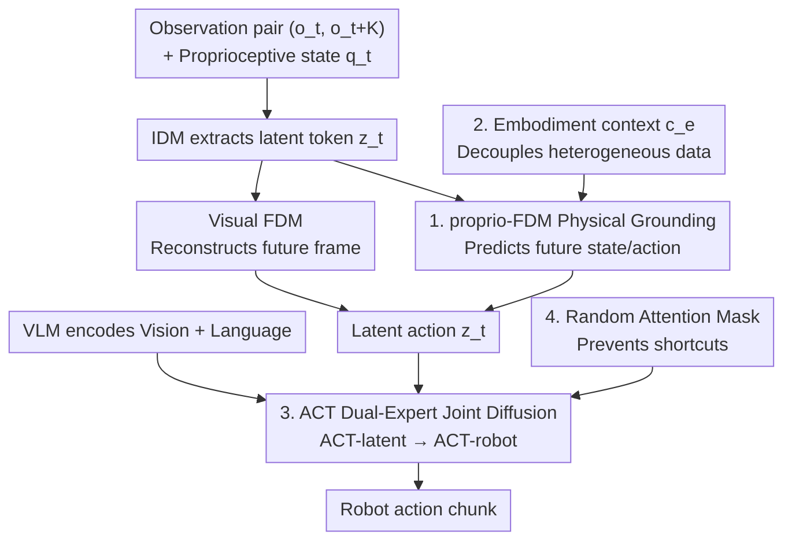

# villa-X: Enhancing Latent Action Modeling in Vision-Language-Action Models

**Conference**: ICLR 2026  
**OpenReview**: [https://openreview.net/forum?id=y5CaJb17Fn](https://openreview.net/forum?id=y5CaJb17Fn)  
**Code**: None (Source code included in supplementary materials)  
**Area**: Robotics / Embodied AI / Vision-Language-Action  
**Keywords**: Latent Action, VLA Pre-training, Proprioceptive Grounding, Joint Diffusion, Cross-Embodiment Generalization

## TL;DR
villa-X introduces two upgrades to "latent action" modeling: grounding latent actions to the robot's physical state via a proprioceptive forward dynamics model (proprio-FDM), and feeding latent actions to low-level control through joint diffusion of "latent experts + robot experts." The model achieves SOTA performance in SIMPLER simulations and on two real-world platforms (gripper + dexterous hand), demonstrating zero-shot transfer to unseen embodiments and open-vocabulary symbols.

## Background & Motivation

**Background**: Vision-Language-Action (VLA) models are the current mainstream paradigm for robotic manipulation policies, leveraging pre-trained VLMs to map vision and language to actions. A significant scaling route involves "latent actions"—compressing motion semantics between adjacent frames into compact latent tokens as pseudo-action labels. This allows for incorporating massive human video datasets without action labels into imitation learning via a Latent Action Model (LAM).

**Limitations of Prior Work**: Existing LAMs rely almost exclusively on visual signals to compress latent actions (e.g., IDM token extraction or visual FDM future frame reconstruction). However, visual changes and robot physical dynamics are not always aligned: end-effector rotations or gripper states may result in minimal pixel changes but are critical for control. Purely visual models tend to ignore these, resulting in "physically ungrounded" latent actions that underperform during real-world control. Furthermore, even with high-quality latent actions, effective integration into VLA pre-training remains unsolved—methods like LAPA only use latent action weights for initialization without conditional usage during inference.

**Key Challenge**: Latent actions must simultaneously capture visually perceptible motion and preserve subtle physical dynamics useful for control. Pure visual reconstruction targets optimize only for the former. Regarding integration, the challenge lies in how to couple "latent actions vs. robot actions": loose coupling (initialization only) fails to pass information, while tight coupling may lead the policy to take shortcuts by over-relying on latent actions.

**Goal**: Address two sub-problems: (1) How to learn more grounded latent actions; (2) How to integrate latent actions effectively into VLA pre-training.

**Key Insight**: The authors observe that "latent actions should serve as a bridge between vision and control." To stabilize this bridge, one end must be anchored to physical states (proprioception), and the other must be structured and passed to low-level actions using an explicit hierarchical policy rather than being implicitly mixed.

**Core Idea**: Add a proprio-FDM to the LAM for auxiliary supervision using robot proprioceptive states/actions to "ground" latent actions. On the policy side, use joint diffusion to model both latent actions and robot actions simultaneously, making robot action generation explicitly conditional on latent actions.

## Method

### Overall Architecture

villa-X is a Vision-Language-Latent-Action (ViLLA) framework consisting of two main components, trained in three stages (LAM pre-training → ACT pre-training → Embodiment-specific fine-tuning):

1.  **LAM (Latent Action Model)**: Extracts discrete latent tokens $z_t$ from a pair of observation frames $(o_t, o_{t+K})$ via an IDM. In addition to traditional visual FDM reconstruction of future frames, a proprio-FDM is added to predict the robot's state and actions for the next $K$ steps based on the current proprioceptive state $q_t$, latent $z_t$, and embodiment context $c_e$. The joint optimization of vision and proprioception forces latent tokens to align with both visual pixels and physical dynamics. The continuous vectors from the VQ codebook centroids are used as latent actions.

2.  **ACT (ACTor Module)**: On top of a pre-trained VLM backbone, a joint diffusion process models latent and robot action sequences. After the VLM encodes vision and language, the ACT-latent expert generates a mid-level latent action plan. The ACT-robot expert then generates low-level action chunks conditioned on these latent actions, proprioceptive states, embodiment context, and optional wrist camera inputs. The three experts share a block-causal attention mask and use random masking to prevent the robot branch from taking shortcuts.

### Key Designs

**1. proprio-FDM Physical Grounding: Adding Physical Supervision to Visual Latent Actions**

Traditional LAMs only utilize visual consistency constraints: $z_t = \text{IDM}(o_t, o_{t+K})$ and $\hat o_{t+K} = \text{FDM}(o_t, z_t)$. Consequently, rotation and gripper actions with weak pixel changes are often ignored. This work adds a proprioceptive forward dynamics model that predicts state and actions for $K$ future steps given $q_t$, $z_t$, and $c_e$:

$$(\hat q_{t+1}, \dots, \hat q_{t+K}, \hat a_{t+1}, \dots, \hat a_{t+K}) = \text{proprio-FDM}(q_t, z_t, c_e)$$

Vision reconstruction loss, proprioception prediction loss, and VQ commitment are optimized jointly (the proprioceptive term is omitted for human videos). This forces latent tokens to "align with physical dynamics" in addition to "aligning with pixels." Probing experiments demonstrate that regression from latent actions to robot actions results in significantly lower L1 errors when proprio-FDM is included.

**2. Embodiment Context $c_e$: Handling Heterogeneous Embodiments in a Single proprio-FDM**

Large-scale datasets mix different robot morphologies and frequencies. If the proprio-FDM is conditioned directly on $(q_t, z_t)$, the model might encode embodiment-specific features into the latent actions, polluting the universality of the latent space. This work introduces a context vector:

$$c_e = f(\text{dataset ID}, \text{control frequency})$$

The dataset ID is mapped to a learnable embedding, and control frequency uses sinusoidal features passed through an MLP. Both are concatenated with $q_t$. This design allows $c_e$ to account for embodiment-related dynamic differences, keeping the latent actions consistent across datasets—a prerequisite for cross-embodiment generalization.

**3. ACT Dual-Expert Joint Diffusion: Explicit and Structured Latent-to-Action Transfer**

Unlike methods like LAPA that use latent actions only for initialization, villa-X factorizes the policy into two conditional distributions:

$$\pi(a_{t:t+m-1}, z^K_{t:t+(n-1)K} \mid o_t, l, q_t, c_e) = \underbrace{\pi_{\text{robot}}}_{\text{ACT-robot}} \cdot \underbrace{\pi_{\text{latent}}}_{\text{ACT-latent}}$$

ACT-latent predicts mid-level latent action plans based on VLM features, and ACT-robot produces low-level action chunks conditioned on VLM features, predicted latent actions, and proprioception. The joint distribution is trained using conditional flow matching by packing both action types into $x_t$ and conditions into $O_t$, fitting the denoising vector field $u(x^\tau_t \mid x_t) = \epsilon - x_t$:

$$L_\tau(\theta) = \mathbb{E}\,\big\|v^\theta_\tau(x^\tau_t, O_t) - u(x^\tau_t \mid x_t)\big\|^2$$

**4. Random Attention Mask: Forcing Policy Dependence on Latent Actions**

Explicit conditioning might cause the robot branch to over-rely on latent actions, learning trivial shortcuts that harm robustness. Inspired by Moto and RDT, a random mask is applied to "robot-to-latent" attention during training: in 50% of cases, all robot-to-latent attention is masked; in the other 50%, half of the latent tokens are masked. This ensures robust reliance on latent tokens without them becoming a singular shortcut.

### Loss & Training
- **LAM Pre-training**: Joint optimization of visual reconstruction loss, proprioception prediction loss, and VQ commitment.
- **ACT Pre-training**: Joint conditional flow matching loss (Eq. 5) for latent and robot actions. Factorization is achieved via block-causal attention + random masking.
- **Embodiment-specific Fine-tuning**: Fine-tuning on target robot data, with optional wrist camera integration.

## Key Experimental Results

### Main Results (SIMPLER Simulation, Avg. Success Rate %)

| Platform | Metric | villa-X | Strongest Baseline | Description |
| :--- | :--- | :--- | :--- | :--- |
| Google Robot | Avg. | **77.7** | OpenVLA-OFT 63.0 / Magma 62.3 | Leads VLA / Visual trace / Latent action methods |
| WidowX Robot | Avg. | **62.5** | GR00T-N1.5 62.0 / LAPA 57.3 | Matches/exceeds strongest world-model methods |

Ours w/o latent drops to 36.5 (Google) and 49.0 (WidowX), proving the latent expert is the key driver of performance.

### Ablation Study (LAM and Integration, SIMPLER Avg. Success Rate)

| Config | Google Avg. | WidowX Avg. | Description |
| :--- | :--- | :--- | :--- |
| Ours (w/pp) | **58.5** | **40.8** | Full LAM (including proprio-FDM) |
| wo/pp | 57.4 | 32.3 | Removing proprio-FDM, WidowX drops 8.5 |
| wo/LAM | 35.0 | 33.1 | Without latent actions, Google performance collapses |
| LAPA-style | 43.8 | 1.0 | Integration via initialization only; nearly fails on WidowX |
| Go-1-style | 43.9 | 36.5 | Autoregressive latent planner; weaker than joint diffusion |

### Key Findings
- The gains from proprio-FDM are particularly evident on WidowX (32.3 vs 40.8), indicating that physical grounding is most beneficial for fine-grained manipulation where pixel changes are subtle.
- The failure of LAPA-style (1.0) on WidowX shows that loose coupling (initialization only) is insufficient for difficult platforms; joint diffusion's tight coupling is essential.
- Knowledge learned by the latent expert is "embodiment-agnostic"—zero-shot transfer to new mechanical arms and dexterous hands remains effective, validating the $c_e$ decoupling design.

## Highlights & Insights
- **Grounded Latent Actions via Proprioception**: Extending LAM supervision from "future frame reconstruction" to "state/action prediction" addresses the "physically ungrounded" issue of pure vision models using a simple auxiliary decoder.
- **Embodiment Context $c_e$ for Generalization**: Explicitly conditioning on dataset ID and frequency allows the latent space to remain universal, enabling zero-shot transfer to new embodiments.
- **Joint Diffusion + Random Masking**: This combination effectively manages the tension between needing tight coupling for information transfer and preventing the policy from learning shortcuts.

## Limitations & Future Work
- The authors acknowledge that while the latent expert performs future planning, its full capacity is "not yet fully exploited"; future work could involve a critic to filter latent trajectories.
- Physical grounding currently uses only robot proprioception; more general structural cues (end-effector keypoints, hand poses) are left for future research.
- Real-world evaluation used limited trials per task (mostly 10); success rate variance might be high.

## Related Work & Insights
- **vs. LAPA**: LAPA uses latent actions only for initialization; villa-X models them explicitly through joint diffusion. Ablations confirm that LAPA-style integration fails on challenging tasks.
- **vs. GR00T**: GR00T aligns future embeddings; villa-X uses latent actions as a bridge between high-level VL and low-level action with physical grounding.
- **vs. Moto-GPT / Go-1**: Moto-GPT lacks real-time visual context; Go-1 suffers from teacher-forcing inconsistencies. villa-X avoids these via joint diffusion and block-causal attention.

## Rating
- Novelty: ⭐⭐⭐⭐ proprio-FDM grounding and joint diffusion are well-targeted, though components have precedents.
- Experimental Thoroughness: ⭐⭐⭐⭐⭐ Comprehensive coverage across simulation, multiple real robots, zero-shot visualization, and probing.
- Writing Quality: ⭐⭐⭐⭐ Logical flow from motivation to validation.
- Value: ⭐⭐⭐⭐⭐ Provides a scalable, cross-embodiment paradigm for latent action VLAs.

<!-- RELATED:START -->

## Related Papers

- [\[ICLR 2026\] VLM4VLA: Revisiting Vision-Language-Models in Vision-Language-Action Models](vlm4vla_revisiting_vision-language-models_in_vision-language-action_models.md)
- [\[ICLR 2026\] Align-Then-stEer: Adapting the Vision-Language Action Models through Unified Latent Guidance](align-then-steer_adapting_the_vision-language_action_models_through_unified_late.md)
- [\[ICLR 2026\] Hybrid Training for Vision-Language-Action Models](hybrid_training_for_vision-language-action_models.md)
- [\[ICLR 2026\] Vision-Language-Action Instruction Tuning: From Understanding to Manipulation](vision-language-action_instruction_tuning_from_understanding_to_manipulation.md)
- [\[ICML 2026\] LangForce: Bayesian Decomposition of Vision-Language-Action Models via Latent Action Queries](../../ICML2026/robotics/langforce_bayesian_decomposition_of_vision_language_action_models_via_latent_act.md)

<!-- RELATED:END -->
## Related Papers

- [\[ICLR 2026\] VLM4VLA: Revisiting Vision-Language-Models in Vision-Language-Action Models](vlm4vla_revisiting_vision-language-models_in_vision-language-action_models.md)
- [\[ICLR 2026\] Hybrid Training for Vision-Language-Action Models](hybrid_training_for_vision-language-action_models.md)
- [\[ICML 2026\] LangForce: Bayesian Decomposition of Vision-Language-Action Models via Latent Action Queries](../../ICML2026/robotics/langforce_bayesian_decomposition_of_vision_language_action_models_via_latent_act.md)
- [\[ICML 2026\] Latent Reasoning VLA: Latent Thinking and Prediction for Vision-Language-Action Models](../../ICML2026/robotics/latent_reasoning_vla_latent_thinking_and_prediction_for_vision-language-action_m.md)
- [\[CVPR 2026\] Cross-Hand Latent Representation for Vision-Language-Action Models](../../CVPR2026/robotics/cross-hand_latent_representation_for_vision-language-action_models.md)

<!-- RELATED:END -->
