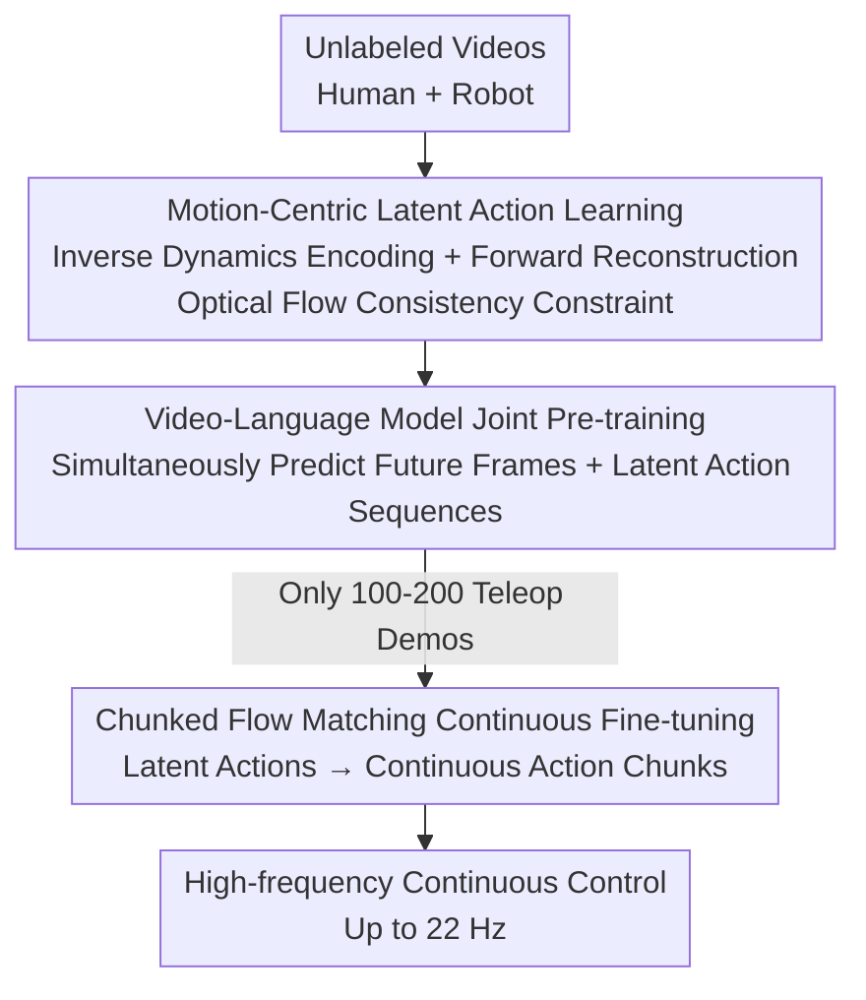

# ViPRA: Video Prediction for Robot Actions

**Conference**: ICLR 2026  
**OpenReview**: [https://openreview.net/forum?id=w3Ik8HUyTT](https://openreview.net/forum?id=w3Ik8HUyTT)  
**Paper**: [vipra-project.github.io](https://vipra-project.github.io)  
**Code**: https://vipra-project.github.io (Yes)  
**Area**: Robotics / Embodied AI / Video Prediction  
**Keywords**: Latent Actions, Video Prediction, Flow Matching, Cross-Embodiment, Robot Policy

## TL;DR
ViPRA transforms a video prediction model into a robot policy: it first learns motion-centric discrete latent actions from massive "unlabeled" human/robot videos via self-supervision, then uses a video-language model to jointly predict "future frames + latent action sequences" for pre-training. Finally, a chunked flow matching decoder maps latent actions to continuous actions of specific robots. With only 100–200 teleoperated demonstrations, it achieves smooth high-frequency control up to 22 Hz, outperforming the strongest baseline by 16% on SIMPLER and 13% on real-world tasks.

## Background & Motivation

**Background**: Current mainstream robot policies are Vision-Language-Action (VLA) models, which utilize imitation learning on labeled robot demonstrations—connecting vision-language models to an action head to predict control commands end-to-end.

**Limitations of Prior Work**: The Achilles' heel of VLA is "action labels." Collecting labeled robot trajectories is extremely expensive (OpenX scale requires tens of thousands of hours for pre-training + dozens to hundreds of hours for fine-tuning) and is restricted by embodiment morphology, making it hard to scale. Meanwhile, the web offers massive video data—YouTube clips of humans performing tasks, teleoperated robot logs—containing rich physical interactions, object dynamics, and long-horizon behaviors, but **the vast majority lack action labels**, making them unusable for VLA.

**Key Challenge**: Motion is "visible" in videos, but actions are not "readable." Existing latent action methods (LAPA, UniVLA, etc.) can learn latent actions from unlabeled videos, but they treat pre-training purely as "autoregressive policy learning in latent space," failing to predict future frames or explicitly model state transitions. Furthermore, they learn temporally coarse-grained, task-centric latent actions (often 1 step or less than 3–6 Hz), losing the high-frequency dynamics crucial for control.

**Goal**: To transform a powerful video prediction model into a control policy capable of running on real robots. This is broken down into three objectives: (1) Extracting fine-grained, motion-centric latent actions from unlabeled videos; (2) enabling video-language models to learn both "what will happen (frames)" and "how it changes (latent actions)"; (3) mapping latent actions to smooth, high-frequency continuous control with minimal demonstrations.

**Key Insight**: The authors observe that video generation models are naturally adept at "predicting future states," an ability that encompasses both fine-grained physical interactions and task semantics. Rather than solely performing policy learning in latent space like previous methods, it is better to have the model **simultaneously model "what changes" (what) and "how it changes" (how)**, treating video prediction as explicit state transition supervision.

**Core Idea**: Replace "pure latent space policy learning" with "video prediction + motion-centric latent action" joint pre-training, then decode latent actions into continuous actions using chunked flow matching—retaining the physical priors of video models while achieving the precision and frequency required for real-world control.

## Method

### Overall Architecture
ViPRA is a three-stage "pre-train then fine-tune" pipeline. The input consists of large-scale unlabeled videos (human + robot) plus a small amount of teleoperated demonstrations with actions. The output is a continuous control policy capable of running on real robots at up to 22 Hz. The three stages progress sequentially: first compressing video into the intermediate representation of "latent actions," then performing joint prediction pre-training with a video-language model on this representation, and finally grounding latent actions into continuous actions for specific embodiments.

### Key Designs

**1. Motion-Centric Latent Action Learning: Compressing unlabeled video into "movable" intermediate representations**

To learn control from videos without action labels, the first step is to have an intermediate variable that can substitute for "actions." ViPRA trains a VQ quantization bottleneck. Given an observation sequence $o_{t:t+L}$ of length $L+1$, it extracts a latent action sequence $z_{t:t+L-1}$, where each timestep is represented by $N_{latent}$ discrete tokens sampled from a **very small** shared codebook ($|C|=8$). This strong information bottleneck forces latent actions to encode only the "minimal sufficient information" required to explain local transitions. It is trained dually: the inverse dynamics encoder $I_\beta(z_{t:t+L-1}\mid o_{t:t+L})$ is **non-causal**, looking at the entire clip (past and future) to infer each $z_k$, allowing it to distinguish motion intents like "picking up" vs. "putting down" that require context. The forward decoder $F_\alpha(\hat o_{t+k+1}\mid o_{t:t+k}, z_{t:t+k})$ reconstructs the next frame using historical observations and latent actions, ensuring the latent actions truly "contain sufficient dynamical information."

Simply reconstructing frames does not guarantee kinematic correctness. Therefore, the training objective adds a perceptual loss $\mathcal{L}_{LPIPS}$ to capture high-level structures and an **optical flow consistency loss** $\mathcal{L}_{flow}$ to force the predicted frame's motion patterns to match the ground truth, in addition to pixel-level $L_1$ reconstruction $\mathcal{L}_{rec}$:

$$\mathcal{L}_{flow} = \frac{1}{L}\sum_{k=t+1}^{t+L}\lVert OF(\hat o_k,\hat o_{k-1}) - OF(o_k,o_{k-1})\rVert_1 + \frac{1}{L}\sum_{k=t}^{t+L-1}\lVert OF(\hat o_k,\hat o_{k+1}) - OF(o_k,o_{k+1})\rVert_1$$

Where $OF$ estimates forward/backward optical flow using RAFT. De total loss is $\mathcal{L}_{latent}=\mathcal{L}_{rec}+\lambda_{LPIPS}\mathcal{L}_{LPIPS}+\mathbb{I}(\text{step}>\alpha_{flow})\lambda_{flow}\mathcal{L}_{flow}$, where the optical flow term is enabled only after $\alpha_{flow}$ warm-up steps—applying flow constraints too early when reconstruction is poor leads to instability. It is this optical flow consistency that makes latent actions "motion-centric and physically plausible," distinguishing them from the vague latent representations of previous reconstruction-only methods.

**2. Video-Language Model Joint Prediction: Simultaneously learning "what will happen" and "how it changes"**

With latent actions established, the second stage aligns them with the semantic priors of video models. ViPRA uses the instruction-finetuned LWM-Chat-1M video-language model $G_\theta$ as a backbone, encoding each frame into visual tokens using its built-in VQ-VAE. Two modules are added to handle latent actions: a latent action embedding head $E_\phi$ to map discrete latent tokens into the model's token space, and a latent action decoder $H_\psi$ (an MLP) to predict the next latent token autoregressively. Thus, latent actions are generated in the same multimodal autoregressive space as language and video tokens.

The key lies in the **joint objective**: given the two most recent frames $(o_{t-1}, o_t)$ and a task description $c$, the model must predict both the future frame $o_{t+H}$ after $H$ steps and the intermediate latent action sequence $z_{t:t+H-1}$. The pre-training loss is the sum of their cross-entropies:

$$\mathcal{L}_{pretrain}=\underbrace{\sum_i CE(\hat x^i_{t+H}, x^i_{t+H})}_{\mathcal{L}_{img}}+\underbrace{\sum_{k=t}^{t+H-1}\sum_i CE(\hat z^i_k, z^i_k)}_{\mathcal{L}_{act}}$$

This is the fundamental divergence between ViPRA and previous latent action methods (LAPA/UniVLA): previous methods treat pre-training as pure policy learning, predicting only latent actions regardless of future states. ViPRA explicitly **models what changes (video prediction) and how (latent actions) simultaneously**. Multi-step temporal prediction forces the model to generate meaningful, discriminative scene changes, providing more stable conditions for downstream action inference.

**3. Chunked Flow Matching Continuous Fine-tuning: Grounding latent actions into smooth, high-frequency control**

While latent actions possess rich physical/semantic priors, they lack the precision required for low-level control. The third stage attaches two action-specific modules to $G_\theta$: an action encoder $E_\gamma$ to embed noisy continuous actions into the token space, and a flow decoder $H_\eta$ to predict the flow field over the entire action chunk. Training uses flow matching: sampling a target action sequence $a_{t:t+H-1}$ and noise $u_0\sim\mathcal{N}(0,I)$, interpolating as $u_s=s\cdot u_0+(1-s)\cdot a_{t:t+H-1}$ ($s\sim\text{Beta}(1.5,1)$). The model predicts the flow field $\hat g=H_\eta(G_\theta(c,x_{t-1},x_t,f_s))$, with loss $\mathcal{L}_{FM}=\lVert a_{t:t+H-1}-u_0-(1-s)\cdot\hat g\rVert_2^2$. During inference, 10 steps of forward Euler integration are performed from $s=0$ to $s=1$ to solve the entire continuous action chunk at once.

The two main points here are "flow matching" and "chunking." Flow matching injects smoothness and dynamical consistency into discrete latent tokens. Meanwhile, **action chunking** (producing multiple low-level actions per forward pass, e.g., length $H=14$, executing the first 7 before replanning) amortizes inference latency, allowing the policy to run at up to 22 Hz—the high frequency necessary for real-world dexterous manipulation. This step naturally supports cross-embodiment: the same set of latent actions, through a flow decoder trained for a specific robot, aligns with that embodiment's motor behavior. Consequently, only a few hundred demonstrations are needed to adapt to a new robot, avoiding the thousands of hours of labeling required by VLAs.

### Loss & Training
- **Latent Action Learning**: $\mathcal{L}_{latent}=\mathcal{L}_{rec}+\lambda_{LPIPS}\mathcal{L}_{LPIPS}+\mathbb{I}(\text{step}>\alpha_{flow})\lambda_{flow}\mathcal{L}_{flow}$, with the optical flow term enabled after warm-up.
- **Pre-training**: $\mathcal{L}_{pretrain}=\mathcal{L}_{img}+\mathcal{L}_{act}$ (dual cross-entropy for visual and latent action tokens, using teacher forcing).
- **Fine-tuning**: $\mathcal{L}_{finetune}=\mathcal{L}_{FM}$ (flow matching regression).
- **Data**: Pre-training uses 198k Something-Something v2 human videos + OpenX robot unlabeled videos (Fractal 87k, BridgeV2 25.4k, Kuka 85.6k); fine-tuning uses ~180 GELLO teleoperation demonstrations per real task, and only 100 multi-task trajectories on SIMPLER.

## Key Experimental Results

### Main Results (SIMPLER Four Bridge Tasks, Success Rate %)

| Setting | Method | Avg. Success Rate | Note |
|------|------|-----------|------|
| Discrete | OpenVLA | 38.6 | Using 970k labeled OpenX trajectories |
| Discrete | LAPA | 53.1 | 1-step coarse latent actions |
| Discrete | **ViPRA-AR** | **69.8** | +16.7 over LAPA |
| Continuous | π0 | 27.1 | Flow matching VLA, includes private data |
| Continuous | UniVLA | 42.7 | Task-centric latent actions |
| Continuous | Scratch-FM | 41.7 | No pre-training |
| Continuous | **ViPRA-FM** | **62.5** | +19.8 over UniVLA, +35.4 over π0 |

Real-world results across three manipulation tasks: ViPRA-FM achieved an average success rate of 54.1%, surpassing π0 (40.1%) and Scratch-FM (23.8%), despite using significantly fewer labeled demonstrations than VLA. It could retry after failed grasps, and successfully stabilized fabric in the Cover-Obj task.

### Ablation Study (SIMPLER Avg. Success Rate)

| Config | Pre-train | Fine-tune | Success Rate | Note |
|------|--------|------|--------|------|
| LAPA | 1-step latent | 1-step action | 53.1 | Baseline |
| ViPRA-AC | Future state + 1-step latent | 1-step action | 59.2 | Gain from adding future state prediction |
| ViPRA-SP2 | Only H-step latent | H-step action | 59.4 | Dropping future state drops performance from 69.8 to 59.4 |
| ViPRA-LA | Only future state | H-step action | 60.7 | State prediction alone is insufficient |
| ViPRA+SP3 | H-step latent | Add state during FT | 53.1 | Adding state during fine-tuning hurts performance |
| **ViPRA-AR** | Future state + H-step latent | H-step action | **69.8** | Full model |

Data composition ablation (LIBERO-10): Human-Robot co-training success rate 0.79 > Robot-only 0.72 > Human-only 0.69, indicating complementarity between human and robot videos.

### Key Findings
- **Future state prediction is the primary contributor**: Removing it (SP2) dropped AR from 69.8 to 59.4 and FM from 62.5 to 53.2. However, "only state, no H-step latent actions" (LA, 60.7) is also insufficient—both are necessary.
- **Future state prediction must be in pre-training, not fine-tuning**: Adding state prediction during fine-tuning (SP3) crashed FM to 31.3, proving this is a task for "shaping priors during the pre-training stage."
- **Fine-grained latent actions favor contact-sensitive tasks**: ViPRA-AR shows particularly significant gains in tasks like StackG2Y that require high precision.
- **Discrete actions are unsuitable for real robots**: Bin-based discrete actions exhibit unstable spikes under physical noise, triggering Franka safety stops; thus, real-world evaluations only utilized continuous policies.
- **Cross-embodiment transfer**: While the pre-training corpus contains only single-arm robots + humans, the model transfers to collaborative dual-arm tasks, confirming the "embodiment-agnostic" prior of latent actions.

## Highlights & Insights
- **The "what + how" dual objective is the masterstroke**: Previous latent action methods only learned "how to move." ViPRA insists on simultaneously predicting "future frames," which ablation proves is the biggest contributor—it truly bridges the physical priors of video generation models into control.
- **Minimal codebook ($|C|=8$) as a strong bottleneck**: Using a very small discrete codebook to force latent actions to retain only the "minimal sufficient information" for local transitions is a highly transferable representation learning trick.
- **Non-causal inverse dynamics encoding**: Viewing the entire clip to disambiguate "picking up vs. putting down" captures motion intent much better than causal encoding.
- **Optical flow consistency turns "reconstruction" into "motion"**: Using RAFT flow as extra supervision with a warm-up gate avoids early instability—this is applicable to any video task aiming for kinematically correct generation.
- **Chunked flow matching unlocks high frequency**: Action chunking amortizes latency to 22 Hz, bypassing the perennial issue of video models being too slow for high-frequency control.

## Limitations & Future Work
- **Dependency on a powerful video-language backbone** (LWM-Chat-1M); the ceilings and costs of the method are tied to the backbone. Whether smaller models can maintain high-frequency control is not fully verified.
- Real-world evaluation lowered the closed-loop control rate to 3.5 Hz for safety; 22 Hz is the capability upper bound rather than the deployment norm, and evidence for real-robot robustness at high frequencies is relatively limited.
- Discrete policies were directly excluded from real robots (triggering safety stops), suggesting the transition from latent actions to continuous control is a necessity rather than an option, which limits the utility of discrete branches.
- Pre-training corpora are still skewed toward manipulation (human hands + tabletop robots); generalization to mobile, long-horizon, or highly dynamic scenes remains unexplored.
- Whether the extremely small latent action codebook (8) becomes a bottleneck for more complex and diverse behaviors warrants further analysis.

## Related Work & Insights
- **vs. LAPA / UniVLA (Latent Action approach)**: They treat pre-training as pure latent space policy learning with 1-step coarse task-centric latent actions. ViPRA explicitly predicts future states + multi-step fine-grained motion-centric latent actions, leading by ~16.7 and 19.8 points on SIMPLER respectively.
- **vs. OpenVLA / π0 (VLA approach)**: VLAs rely on tens of thousands of hours of labeled trajectories for imitation learning. ViPRA uses unlabeled video pre-training + 100-200 demos for fine-tuning, saving on labels while improving real-world success rates from π0's 40.1% to 54.1%.
- **vs. UniPI / VPT (Learning from Video approach)**: UniPI uses video diffusion + inverse dynamics to recover actions, but long horizons diverge from instructions and inference is slow. VPT's IDM pseudo-labels are sensitive to environment drift. ViPRA's joint "latent action prediction + future state modeling" is more stable for cross-environment transfer and supports high-frequency control.

## Rating
- Novelty: ⭐⭐⭐⭐⭐ The joint pre-training of "video prediction + motion-centric latent actions" combined with chunked flow matching for grounding is a clear and novel path to turning video models into high-frequency robot policies.
- Experimental Thoroughness: ⭐⭐⭐⭐ Comprehensive simulation + real-world + dual-arm + multiple ablations, though the real-world closed-loop was only 3.5 Hz, lacking harder evidence for the 22 Hz upper bound.
- Writing Quality: ⭐⭐⭐⭐⭐ The three-stage structure is clear, formulas and figures are well-coordinated, and the motivation is convincingly derived.
- Value: ⭐⭐⭐⭐⭐ Achieving high-frequency continuous control with unlabeled videos + minimal demonstrations directly addresses the robot data bottleneck, holding high engineering and research value.

<!-- RELATED:START -->

## Related Papers

- [\[ICLR 2026\] Rodrigues Network for Learning Robot Actions](rodrigues_network_for_learning_robot_actions.md)
- [\[ICML 2026\] From Imagined Futures to Executable Actions: Mixture of Latent Actions for Robot Manipulation](../../ICML2026/robotics/from_imagined_futures_to_executable_actions_mixture_of_latent_actions_for_robot_.md)
- [\[CVPR 2026\] ORV: 4D Occupancy-centric Robot Video Generation](../../CVPR2026/robotics/orv_4d_occupancy-centric_robot_video_generation.md)
- [\[ICLR 2026\] MVR: Multi-view Video Reward Shaping for Reinforcement Learning](mvr_multi-view_video_reward_shaping_for_reinforcement_learning.md)
- [\[ICLR 2026\] Actions as Language: Fine-Tuning VLMs into VLAs Without Catastrophic Forgetting](actions_as_language_fine-tuning_vlms_into_vlas_without_catastrophic_forgetting.md)

<!-- RELATED:END -->
