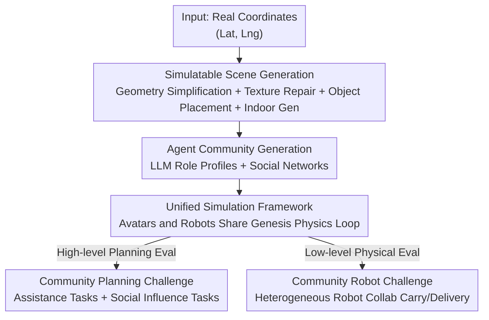

# Virtual Community: An Open World for Humans, Robots, and Society

**Conference**: ICLR 2026  
**OpenReview**: [https://openreview.net/forum?id=Qo0OZZoTLh](https://openreview.net/forum?id=Qo0OZZoTLh)  
**Paper**: [Project Page](https://virtual-community-ai.github.io/)  
**Code**: Open source (see project page)  
**Area**: Robotics / Embodied AI / Multi-agent Simulation  
**Keywords**: Open-world simulation, Embodied multi-agent, Human-robot coexistence, Physics engine, Scene generation

## TL;DR
This paper constructs Virtual Community—an embodied multi-agent simulation platform based on the Genesis physics engine. It automatically generates open-world scenes and agent societies using real geospatial data, allowing humanoid avatars and various robots to coexist and interact within the same physical world. The platform includes two benchmarks, the "Community Planning Challenge" and the "Community Robot Challenge," to evaluate high-level multi-agent planning and low-level physical coordination.

## Background & Motivation

**Background**: Embodied AI relies on virtual simulators for training and evaluation. Over the past decade, platforms such as Habitat, AI2-THOR, iGibson, ManiSkill, and CARLA have emerged. However, these platforms tend to focus on specific niches—either robotic manipulation, indoor household tasks, or simple interactions among a small number of agents.

**Limitations of Prior Work**: Existing platforms rarely support **large-scale, heterogeneous (human + various robots) communities** within a **scalable open world**. Specifically, two constraints exist: first, at the physical simulation level, most multi-agent platforms only handle small groups or provide restricted physical interactions that cannot support community-level realistic behavior. Second, at the world generation level, existing methods are split between procedural/manual designs (good interactivity but poor diversity/realism) and 3D reconstruction (high realism but low interactivity and demanding high vision input). Both are difficult to use for generating interactive, scalable city-scale open worlds at low cost.

**Key Challenge**: Three attributes required for studying "human-robot coexistence societies"—**physical realism, world scalability, and community heterogeneity**—tend to constrain each other in existing platforms. No single framework has addressed all three. Large-scale non-linear scenes (indoor + outdoor) with free exploration rather than fixed paths are the ideal stage for complex multi-agent behavior, yet they lack tool support.

**Goal**: Establish a unified simulation framework where humanoid avatars and multiple types of robots coexist in an **automatically generated, real-world-aligned, large-scale open world**, complete with observation/action interfaces and evaluation challenges.

**Key Insight**: The authors leverage the combination of a "general-purpose physics engine + real geospatial data + generative models." Genesis is used as the unified physical base, real geospatial data from Google 3D Tiles / OSM / Google Maps provides the skeleton for scale and realism, and generative models like diffusion and LLMs fill in the interactivity and community content.

**Core Idea**: Integrate the scale of real geospatial data with the controllable interactivity of generative models within a unified physics engine to automatically produce simulatable open worlds and realistic agent communities. This enables the study of embodied social intelligence at a large-scale, heterogeneous, and open-world level for the first time.

## Method

### Overall Architecture

The core of Virtual Community is an **automated "open-world generation + unified simulation" pipeline**. Given real latitude and longitude coordinates, the system cleans and enhances noisy 3D geospatial data into simulatable urban scenes (including indoor rooms). It then uses LLMs to "seed" a community of agents with profiles and social networks within this scene. Finally, humanoid avatars and robots are integrated into the Genesis physics engine for community simulation. The generation side ensures the "world is large and realistic enough," while the simulation side ensures "humans and robots can move, collide, and grasp in the physical world."

The pipeline consists of three main parts: **(A) Scene Generation** (geospatial data → simulatable scene), **(B) Agent Community Generation** (scene → roles + social networks), and **(C) Unified Simulation** (avatars + robots coexisting in Genesis). Two challenge benchmarks are built upon this platform.

### Key Designs

**1. Simulatable Scene Generation: Cleaning Noisy Geospatial Data into Embodied Open Worlds**

Geospatial data like Google 3D Tiles is abundant but topologically unreliable, contains transient objects, and suffers from aerial reconstruction artifacts (distorted surfaces, poor ground-level detail). This paper uses a four-step pipeline to "repair" it. **Geometric Reconstruction and Simplification** splits the scene into terrain, buildings, and decorative roofs. Terrain is procedurally generated via bilinear interpolation of sparse elevation points, while buildings use OpenStreetMap (OSM) data to derive simplified meshes with correct topology, aligned with Google 3D Tiles geometry and terrain height. **Texture Enhancement** uses Stable Diffusion 3 inpainting to fix missing or distorted textures on the new geometry, refined with Street View images for ground-level realism. **Interactive Object Placement** combines generation and retrieval: simple objects (e.g., tents) use OSM labels to drive Stable Diffusion image generation and One-2-3-45 for 3D meshes, while complex objects (e.g., trees) are retrieved from an asset library. **Location/Traffic Annotation and Indoor Generation** use Google Maps Places and OSM for semantics (navigation, traffic, decision-making). Indoor scenes are retrieved from GRUTopia or generated via Architect for uncovered types. This process has produced 35 annotated city scenes globally.

**2. Scene-Grounded Community Generation: Growing Agents within the Scene**

To study social intelligence, agents must be "residents." The paper uses GPT-4o for character and social network generation, emphasizing **grounding**. LLM input is structured into scene information (names/types/functions of locations) and agent appearance (consistent with visual attributes). Output includes profiles (occupation, personality, hobbies) and social networks organized as "groups" (sets of agents, descriptions, and activity locations). To prevent hallucinations of non-existent locations, a **grounding validator** verifies location references and provides feedback for LLM correction in a "generate-validate-correct" loop. High-fidelity humanoid meshes are generated using Avatar SDK and Mixamo skins.

**3. Unified Human-Robot Simulation: Sharing the Physical Loop**

The platform uses the Genesis physics engine. While robot simulation is inherited from Genesis, the challenge lies in **integrating humanoid avatars** into the same simulation loop. Avatars are modeled using SMPL-X skeletons and skins, parameterized by pose vectors $J \in \mathbb{R}^{162}$ and global translation/rotation $T, R \in \mathbb{R}^3$. Over 2000 Mixamo motion clips drive behaviors (walking, objects, vehicles). For interaction (grasping/mounting), objects are kinematically attached/detached to hands based on motion kinematics, with collision detection terminating actions upon contact. Daily **schedules** are generated using foundation models, explicitly accounting for commute times across large 3D environments to reflect navigation costs. The platform supports five robot categories (UAV, quadruped, humanoid, wheeled, mobile manipulator), each with independent controllers exposing specific action spaces.

**4. Two Benchmarks: Quantifying Research Questions**

The **Community Planning Challenge** evaluates high-level multi-agent planning across Three Assistance Tasks (Carry, Delivery, Search) and one Social Influence Task (two main agents competing to persuade and network with community members). Observations include RGB-D, camera matrices, segmentation, and pose. Metrics include Success Rate (SR), average time $T_s$, and Human Following Rate (HR). The **Community Robot Challenge** focuses on low-level physical collaboration, where heterogeneous robots (e.g., mobile manipulator + wheeled carrier) must collaborate on delivery while following humans in dynamic environments.

## Key Experimental Results

### Main Results: Community Planning Challenge

Evaluation on 24 scenes using baselines (Random / Heuristic / MCTS Planner / LLM Planner) under 1-assistant and 2-assistant settings:

| Setting | Method | Carry SR↑ | Delivery SR↑ | Search SR↑ | Avg SR↑ |
|------|------|-----------|--------------|------------|---------|
| 1-assistant | Random | 0.0 | 0.0 | 0.0 | 0.0 |
| 1-assistant | Heuristic | 34.7 | 46.5 | 45.1 | 42.1 |
| 1-assistant | MCTS Planner | 42.3 | 39.6 | 45.1 | 42.4 |
| 1-assistant | LLM Planner | 29.9 | 41.7 | **70.1** | 47.2 |
| 2-assistant | Heuristic | 52.8 | 59.7 | 51.4 | 54.6 |
| 2-assistant | MCTS Planner | 42.4 | 43.8 | 48.6 | 44.9 |
| 2-assistant | LLM Planner | 30.2 | 43.8 | **77.8** | 50.6 |

No single method dominates: LLM Planner leads significantly in Search (70.1 / 77.8) which lacks object interaction but fails in Carry/Delivery as it struggles to track progress through action history. Baselines generally **underestimate the cost of navigation and search** in open worlds.

### Ablation Study and Social Influence

Distance Modeling (DM) ablation highlights the criticality of spatial information:

| Setting | Method | Avg SR↑ |
|------|------|---------|
| 1-assistant | MCTS Planner (Full) | 42.4 |
| 1-assistant | MCTS Planner w/o DM | 29.0 |
| 1-assistant | LLM Planner (Full) | 47.2 |
| 1-assistant | LLM Planner w/o DM | 44.4 |

Removing DM leads to performance drops, especially for MCTS (42.4 → 29.0). In Social Influence, the o1 backbone outperforms GPT-4o with an average win rate of 0.63.

### Community Robot Challenge

Mobile manipulator + wheeled carrier collaboration on 21 scenes:

| Method | Carry SR↑ | Deliver SR↑ | Avg SR↑ |
|------|-----------|-------------|---------|
| Heuristic | 17.6 | 22.2 | 19.9 |
| RL | 9.5 | 19.0 | 14.3 |
| Heuristic w Oracle Grasp | 23.5 | 50.0 | **36.8** |
| RL w Oracle Grasp | 19.0 | 42.9 | 31.0 |

### Key Findings
- **Grasping is the bottleneck**: Success rates plummet without oracle grasp (Heuristic 36.8 → 19.9), indicating that dynamic open-world manipulation is the primary challenge.
- **Classical planners outperform RL**: Heuristics based on IK + RRT-Connect are superior as they find paths in configuration space whereas RL struggles with sparse rewards; VLA baselines score near zero.
- **Carry is harder than Delivery**: Carrying requires simultaneous manipulation and human-following in dynamic environments.

## Highlights & Insights
- The **integration of real data, generative models, and physics engines** is clever: OSM/3D Tiles provide city-scale skeletons, diffusion/LLMs provide community depth, and Genesis ensures unified physical constraints.
- The **grounding validator is a reusable trick**: It solves the common LLM hallucination problem by forcing community generation to align with the 3D scene's structural knowledge via a simple feedback loop.
- **Commute time inclusion** forces agents to consider spatial costs during planning, which proved to be a major failure point for standard baselines and represents an inherent difficulty of open worlds.
- **Unified human-robot physics** breaks the traditional silo between "avatar-only" and "robot-only" platforms, providing necessary infrastructure for studying coexistence.

## Limitations & Future Work
- Outdoor modeling accuracy still lacks the precision needed to fully reflect real-world physical and visual properties, limiting sim-to-real fidelity.
- Avatar motion relies on kinematic attachment rather than full physical driving; the "physical realism" of humans is weaker than that of robots.
- Social network diversity is limited by LLM world knowledge and biases, with no quantitative evaluation of generated community quality.
- Low baseline success rates (especially without oracle grasp) suggest that while tasks are challenging, they may currently be near-unsolvable for standard methods.

## Related Work & Insights
- **vs. Generative Agents (Park et al., 2023)**: Virtual Community brings LLM-driven societies into a 3D physical world where agents must actually navigate and collide.
- **vs. GRUTopia / Architect**: These focus on indoor layout or skill task generation; this work integrates a generative pipeline for city-scale, human-robot mixed societies.
- **vs. Habitat / CARLA**: This platform fills the gap for embodied multi-agent simulation in large-scale, heterogeneous, indoor+outdoor environments.

## Rating
- Novelty: ⭐⭐⭐⭐⭐ First work to successfully merge real geospatial data, generative models, and unified physics for large-scale HR coexistence.
- Experimental Thoroughness: ⭐⭐⭐⭐ Extensive benchmarks and ablations, though low baseline SRs mainly serve to demonstrate task difficulty.
- Writing Quality: ⭐⭐⭐⭐ Clear structure and comprehensive documentation of the pipeline steps.
- Value: ⭐⭐⭐⭐⭐ Provides crucial research infrastructure for the fields of embodied social intelligence and human-robot coexistence.

<!-- RELATED:START -->

## Related Papers

- [\[ICLR 2026\] World-In-World: World Models in a Closed-Loop World](world-in-world_world_models_in_a_closed-loop_world.md)
- [\[CVPR 2025\] Solving Instance Detection from an Open-World Perspective](../../CVPR2025/robotics/solving_instance_detection_from_an_open-world_perspective.md)
- [\[ICLR 2026\] Manipulation as in Simulation: Enabling Accurate Geometry Perception in Robots](manipulation_as_in_simulation_enabling_accurate_geometry_perception_in_robots.md)
- [\[CVPR 2026\] IGen: Scalable Data Generation for Robot Learning from Open-World Images](../../CVPR2026/robotics/igen_scalable_data_generation_for_robot_learning_from_open-world_images.md)
- [\[ICLR 2026\] Ctrl-World: A Controllable Generative World Model for Robot Manipulation](ctrl-world_a_controllable_generative_world_model_for_robot_manipulation.md)

<!-- RELATED:END -->
