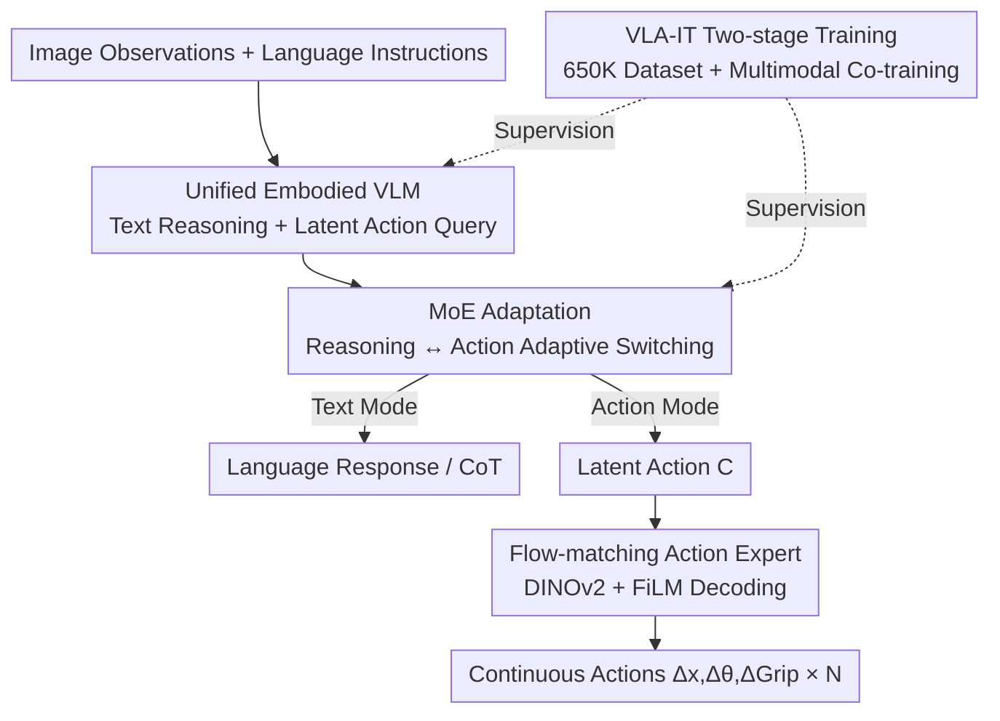

# Vision-Language-Action Instruction Tuning: From Understanding to Manipulation

**Conference**: ICLR 2026  
**OpenReview**: [https://openreview.net/forum?id=tsxwloasw5](https://openreview.net/forum?id=tsxwloasw5)  
**Code**: Available (see project homepage)  
**Area**: Robotics / Embodied AI / VLA  
**Keywords**: Vision-Language-Action Models, Instruction Tuning, Mixture of Experts, Latent Action, Flow Matching

## TL;DR
InstructVLA proposes the "Vision-Language-Action Instruction Tuning (VLA-IT)" paradigm, which utilizes a single VLM to simultaneously perform multimodal reasoning and latent action planning. These are then handed over to a flow-matching action expert for decoding. Through Mixture of Experts (MoE) adaptation, the model preserves the VLM's multimodal capabilities during action training, allowing reasoning to directly enhance manipulation—achieving a 33% improvement over SpatialVLA on SimplerEnv and a 96% improvement over a fine-tuned OpenVLA on the new SimplerEnv-Instruct benchmark.

## Background & Motivation

**Background**: Current VLA models are mostly initialized from pre-trained vision-language models (VLMs) and then fine-tuned on embodied data to acquire generalizable manipulation skills. There are two main approaches: the first, like RT-2 and Magma, involves co-training vision-language data with manipulation data autoregressively; the second, like ECoT and Emma-X, embeds chain-of-thought (CoT) reasoning into manipulation datasets to transfer VLM capabilities.

**Limitations of Prior Work**: The first approach often neglects complex embodied reasoning, and the authors' ablation shows a domain gap between general VLM corpora and embodied scenarios. The second approach relies on action-pre-trained architectures and structured reasoning formats (sub-tasks, grounding, etc.), which limits expressiveness and causes **catastrophic forgetting**; even with additional fine-tuning, these models fail to demonstrate general multimodal capabilities. A common problem for both is that acquiring manipulation skills often comes at the cost of sacrificing the VLM's multimodal reasoning.

**Key Challenge**: Task interference exists between action training and multimodal reasoning—optimizing vision, language, and action simultaneously leads to unstable training and slow convergence, while biasing towards action erodes the VLM's inherent semantic understanding. Furthermore, there is a data scarcity (lack of manipulation data with rich multimodal supervision) and a methodological gap (lack of an effective mechanism to transform reasoning into actions).

**Goal**: To acquire manipulation skills without eroding VLM multimodal reasoning, while allowing this reasoning to conversely enhance manipulation; and to fill the gaps in both data and evaluation for this research direction.

**Key Insight**: Treat "language-conditioned action generation" as an **integral part of instruction following** rather than an independent downstream task—since VLMs excel at instruction following, action generation should grow along the same chain of thought.

**Core Idea**: Use a unified embodied VLM to simultaneously output textual reasoning and latent actions. Rely on MoE adaptation for adaptive switching between "reasoning mode" and "action mode," and then use a lightweight flow-matching expert to decode latent actions into low-level control. This decouples low-level control learning from the VLM backbone, preserving its multimodal capabilities.

## Method

### Overall Architecture

InstructVLA addresses the question: "How to enable a model to both reason and manipulate, such that the two do not harm each other but instead provide mutual benefits?" It is a unified architecture driven by a single VLM: the input consists of image observations + language instructions. The model first uses a VLM (based on the compact Eagle2-2B backbone) for autoregressive text reasoning to maintain language understanding. It then uses $N$ learnable action queries $Q \in \mathbb{R}^{N\times D}$ to attend to the VLM's hidden states, extracting task-related latent actions $C \in \mathbb{R}^{N\times D}$. Finally, a flow-matching action expert, conditioned on DINOv2 visual features, latent actions, noisy action embeddings, and optional proprioception, decodes the latent actions into continuous actions $(\Delta x, \Delta\theta, \Delta\mathrm{Grip})$. The generation process consists of three steps: ① VLM asynchronous autoregressive reasoning; ② Latent action generation; ③ Action decoding. MoE adaptation is the key switch allowing the VLM to adaptively alternate between "reasoning" and "latent action prediction" modes. The training follows a two-stage recipe: action pre-training to obtain the "Expert," followed by VLA-IT instruction tuning to arrive at the "Generalist."

### Key Designs

**1. Unified Embodied VLM and Latent Action Queries: Growing Actions on the Instruction Following CoT**

To resolve the core conflict of "action training eroding multimodal reasoning," the authors do not create a separate representation for actions. Instead, the same VLM produces text output (preserving language understanding and multimodal reasoning) while extracting latent actions $C$ by attending to VLM hidden states using $N$ learnable action queries $Q$. This effectively places a "learnable interface" on top of the VLM: low-level control learning is transferred to the latent action and action expert side. The VLM backbone does not need to rewrite its weights to fit robotic actions, thereby decoupling low-level control learning from the VLM and preserving its multimodal capabilities. The VLM side is supervised by the cross-entropy loss of the language output $\mathcal{L}_{LM}$. In this way, action generation becomes a link in the instruction following chain rather than an opposing task competing for capacity.

**2. MoE Adaptation: Seamless Switching via LoRA Experts + Scalar Gating**

The most difficult aspect of a unified model is smoothly switching between "talking when it should talk" and "acting when it should act." The authors use an MoE design for this: several LoRA modules are treated as experts inside the LLM backbone (one action LoRA, one language LoRA), retaining pre-trained capabilities while ensuring efficient inference. A scalar head then predicts gating coefficients $\lambda_i$ for each expert by classifying hidden states, adaptively mixing their outputs. The hidden state of $K$ experts is synthesized as:

$$h = W_0 x + \sum_{i=0}^{K} B_i A_i x \cdot \alpha_i \cdot \lambda_i$$

where $W_0$ is the original weight, $x$ is the input, $A_i \in \mathbb{R}^{r\times d}$ and $B_i \in \mathbb{R}^{d\times r}$ are LoRA parameters, and $\alpha_i$ is the LoRA scaling factor. Gating coefficients are dynamically reweighted based on the input context and reasoning mode, enabling the model to automatically switch between text reasoning and language-guided latent actions. Ablation shows that removing MoE preserves multimodal performance but significantly drags down manipulation capability, proving that this switch is what allows both capabilities to coexist.

**3. Flow-matching Action Expert: DINOv2 + FiLM Grounding High-level Intent into Finegrained Manipulation**

The VLM backbone provides general semantic understanding, but fine-grained manipulation requires more granular perception. The authors design the action expert as an independent lightweight module (12-layer transformer, hidden dimension 768). It takes image features from a DINOv2 visual encoder, latent actions, noisy action embeddings, and optional proprioception as input, fused via block-wise causal attention (non-causal within a single input, causal between input types), and supervised by a flow-matching objective $\mathcal{L}_{FM}$. The DINOv2 encoder is further modulated by FiLM at the feature level, allowing visual features to be "steered" by latent actions toward spatial and context-relevant regions. Ablation is very telling: removing the DINOv2 encoder results in a 50.0% drop overall; adding FiLM increases performance by another 15.3%—demonstrating that placing rich perception in a compact action expert rather than back into the VLM is key to efficiently transforming reasoning intent into action.

**4. VLA-IT Two-stage Training + 650K Instruction Dataset: Feeding Reasoning into Manipulation**

Direct co-training of vision, language, and action is unstable and slow to converge, so the authors split it into two stages. **Stage 1: Action Pre-training**: The model is trained on heterogeneous manipulation data to simultaneously predict actions and "language motion" (textual descriptions of low-level actions, supervised by cross-entropy). The total loss is $\mathcal{L} = \mathcal{L}_{LM} + \mathcal{L}_{FM}$. Only the latent action embeddings and the action LoRA on the LLM backbone (approx. 650M parameters) are trained, resulting in the "Expert." **Stage 2: VLA-IT Instruction Tuning**: A language LoRA and scalar head are added, forming the MoE adaptation together with the action LoRA from Stage 1. This is the only trainable part of Stage 2 (approx. 220M parameters), co-trained alternately on multimodal data, manipulation data, and a curated 650K VLA-IT corpus to obtain the "Generalist." This 650K dataset was annotated using GPT-4o with three keyframes and categorized into four types: scene description, QA (embodied scene understanding), instruction paraphrasing, and context creation (instruction understanding and latent action planning). The authors built this specifically instead of using GPT-4o directly as an interpreter because even SOTA VLMs make mistakes in embodied tasks; ground-truth instructions are crucial for annotation accuracy. Training uses a 1:7 multimodal-to-action ratio (twice the 1:3 ratio of ECoT/ChatVLA) to maintain multimodal capability at a lower cost.

### Loss & Training
- Language Side: Cross-entropy $\mathcal{L}_{LM}$ supervises text output and "language motion" descriptions.
- Action Side: Flow-matching objective $\mathcal{L}_{FM}$, weighted on noisier timesteps via a $\beta$ distribution as per Black et al. to improve precision.
- Stage 1 total loss is the direct sum $\mathcal{L} = \mathcal{L}_{LM} + \mathcal{L}_{FM}$; Stage 2 only trains MoE adaptation (language LoRA + scalar head + action LoRA).
- Inference Acceleration: Text responses are greedily decoded until the first action query token appears; remaining action queries are decoded in parallel in one VLM forward pass. Language responses and latent actions are cached—leveraging their temporal stability—to reduce VLM forward passes.

## Key Experimental Results

### Main Results

Manipulation benchmarks (SimplerEnv and SimplerEnv-Instruct, Success Rate %, average of three random seeds):

| Model | SimplerEnv Avg. | SimplerEnv-Instruct Avg. |
|------|-----------------|--------------------------|
| OpenVLA-7B | 27.2 | 14.2 |
| SpatialVLA-3B | 45.9 | 16.5 |
| π0-3B (S.) | 41.7 | 12.0 |
| OpenVLA (FT&GPT) | — | 35.6 |
| **InstructVLA-Expert (Ours)** | **61.2** | 20.7 |
| **InstructVLA-Generalist (Ours)** | 54.9 | **46.9** |

- Expert outperforms SpatialVLA on SimplerEnv by **33.3%** relatively; Generalist outperforms the strongest baseline (OpenVLA + GPT-4o) on SimplerEnv-Instruct by **31.7%** relatively, and is approx. 96% higher than fine-tuned OpenVLA.

Multimodal understanding (selected benchmarks, #Params refers to LLM backbone size):

| Model | #Params | MMMU | MMStar | TextVQA | AI2D |
|------|---------|------|--------|---------|------|
| Eagle2 (Base) | 1.5B | 43.1 | 56.4 | 79.1 | 79.3 |
| OpenVLA (FT) | 7B | 26.0 | 28.2 | 2.5 | 35.8 |
| ECoT | 7B | 16.2 | 19.1 | 0.0 | 0.0 |
| Magma | 8B | 38.8 | 41.3 | 66.5 | 66.1 |
| **InstructVLA-Generalist** | 1.5B | **44.2** | 56.2 | 77.7 | 79.1 |

- InstructVLA's multimodal scores are nearly identical to its base, Eagle2, whereas OpenVLA(FT) and ECoT suffered massive collapse in multimodal capability after action training, validating the claim of "preserving VLM capability."

### Ablation Study

| Config | WidowX | Google | Avg. | Notes |
|------|--------|--------|------|------|
| **InstructVLA** | 29.1 | 64.8 | **52.9** | Full action expert |
| w/o Lang. | 15.3 | 65.0 | 48.4 | Remove "language motion" supervision, Loss: -9.3% |
| w/o FiLM | 25.0 | 56.3 | 45.9 | DINO only without modulation, Loss: -15.3% |
| w/o DINO | 4.2 | 32.4 | 23.0 | No vision input for action expert, Loss: -50.0% |

| Training/Inference Strategy | Key Metric | Notes |
|----------------|----------|------|
| FFT (OpenVLA-OFT full fine-tune) | Lower | Suboptimal in both manipulation and understanding without MoE/multi-stage |
| AR (Magma autoregressive co-train) | Limited | Co-training possible but performance is limited |
| InstructVLA-MoE | Preserves Multimodal | Control without MoE design |
| Generalist w/o Think | Exceeds OpenVLA/Magma | Stronger even without explicit reasoning |
| Generalist w/ Think | +36.1% | Significant gain after enabling explicit text reasoning |

### Key Findings
- **DINOv2 perception is critical for the action expert**: Removing it halves performance, indicating that VLM general vision is insufficient for fine-grained manipulation. Fine-grained perception must be added to the action expert, and FiLM modulation further aligns visual features with latent actions.
- **Explicit "thinking" directly benefits manipulation**: Enabling thinking improves performance by 36.1% over direct execution, and even outperforms using GPT-4o as an external system-2 interpreter—proving that end-to-end coupling of reasoning and action is superior to external LLMs.
- **Situated reasoning tasks benefit most from data scale and multimodal diversity**: Situated reasoning gains the most as the VLA-IT annotation scale grows; adding QA and scene description annotations improves generalization by 10.8%. In contrast, fine-tuned OpenVLA shows almost no gain in situated reasoning due to catastrophic forgetting.
- **Freezing the action expert is sufficient**: In stage two, fine-tuning only the VLM while freezing the action expert achieves results comparable to joint fine-tuning, significantly reducing trainable parameters.

## Highlights & Insights
- **Actions as a link in instruction following**: Manipulation is no longer viewed as an independent downstream task; instead, latent actions grow along the VLM's chain of thought. This perspective allows reasoning and action to naturally share a path and benefit each other.
- **MoE as a "Mode Switch" rather than "Capacity Expansion"**: Using LoRA experts + scalar gating to switch between reasoning and action is a highly reusable trick. Any unified architecture requiring "one model, two behavioral modes" can benefit from gating based on hidden state classification.
- **Decoupling low-level control is key to preserving multimodality**: Constraining action learning to the latent action + lightweight expert side without altering the VLM backbone is the fundamental reason it retains base-level multimodal scores. This provides insights for any scenario adding new modalities/skills to foundation models while fearing forgetting.
- **Self-built 650K instruction data + SimplerEnv-Instruct benchmark**: Fills public gaps in "manipulation data with rich multimodal supervision" and "evaluating instruction generalization," while remaining affordable at approximately one-third the scale of SimplerEnv (80 tasks, 1.1K trials).

## Limitations & Future Work
- Evaluation is primarily real-to-sim via SimplerEnv. While real-world robot experiments were conducted, their scale was limited (WidowX-250 zero-shot + Franka few-shot); the robustness of large-scale real-world deployment requires further validation.
- The 650K VLA-IT annotations rely on automated GPT-4o generation. The authors acknowledge that even SOTA VLMs make mistakes in embodied tasks, and the impact of annotation noise on final capabilities has not been fully characterized.
- The method is built on compact VLMs like Eagle2-2B; whether larger VLM backbones further amplify "reasoning boosting action" or the marginal effects of scaling MoE experts remains unexplored.
- Sensitivity analysis for key hyperparameters like the number of latent action queries $N$ and the 1:7 multimodal-to-action ratio could be more systematic.

## Related Work & Insights
- **vs RT-2 / Magma (Autoregressive Co-training)**: These models co-train vision-language and manipulation data autoregressively. They partially preserve multimodality but neglect complex embodied reasoning, limiting manipulation performance. Ours uses MoE adaptation + two-stage training to explicitly distinguish the two modes, achieving a 12.5% relative improvement over Magma on SimplerEnv.
- **vs ECoT / Emma-X (CoT embedded in manipulation data)**: These models embed structured CoT into manipulation datasets, relying on action-pre-trained architectures and fixed reasoning formats. They still suffer from catastrophic forgetting and lack multimodal QA capabilities. Ours treats action as part of instruction following and decouples low-level control, preserving multimodality while making reasoning generalizable.
- **vs π0 / GR00T (Flow-matching VLA)**: These use continuous flow matching for action generation and have strong manipulation performance but usually do not integrate autoregressive text reasoning. Ours unifies autoregressive language and flow-matching action generation in one model, proving they can be co-trained efficiently.
- **vs OpenVLA + GPT-4o (External system-2)**: Using external LLMs to paraphrase instructions is limited by GPT-4o's interpretation errors in embodied scenarios. Ours' end-to-end internal reasoning is more accurate and outperforms this external solution when "thinking" is enabled.

## Rating
- Novelty: ⭐⭐⭐⭐⭐ Integrating action generation into instruction following and using MoE to switch between reasoning/action while decoupling low-level control is a clear and self-consistent approach.
- Experimental Thoroughness: ⭐⭐⭐⭐⭐ Covers multimodality, SimplerEnv, self-built benchmarks, and real robots. Ablations clearly disentangle the contributions of each design component.
- Writing Quality: ⭐⭐⭐⭐ Complete logical chain and rich visualizations; some component details (MoE gating, caching strategies) are scattered in the appendix.
- Value: ⭐⭐⭐⭐⭐ Provides a reproducible data+benchmark+method paradigm for "reasoning-enhanced manipulation without forgetting," high reference value for the Embodied AI community.

<!-- RELATED:START -->

## Related Papers

- [\[ICLR 2026\] PixelVLA: Advancing Pixel-level Understanding in Vision-Language-Action Model](pixelvla_advancing_pixel-level_understanding_in_vision-language-action_model.md)
- [\[CVPR 2026\] Test-Time Perturbation Tuning with Delayed Feedback for Vision-Language-Action Models](../../CVPR2026/robotics/test-time_perturbation_tuning_with_delayed_feedback_for_vision-language-action_m.md)
- [\[ICLR 2026\] Action-aware Dynamic Pruning for Efficient Vision-Language-Action Manipulation](action-aware_dynamic_pruning_for_efficient_vision-language-action_manipulation.md)
- [\[ICLR 2026\] VITA: Vision-to-Action Flow Matching Policy](vita_vision-to-action_flow_matching_policy.md)
- [\[ICLR 2026\] villa-X: Enhancing Latent Action Modeling in Vision-Language-Action Models](villa-x_enhancing_latent_action_modeling_in_vision-language-action_models.md)

<!-- RELATED:END -->
