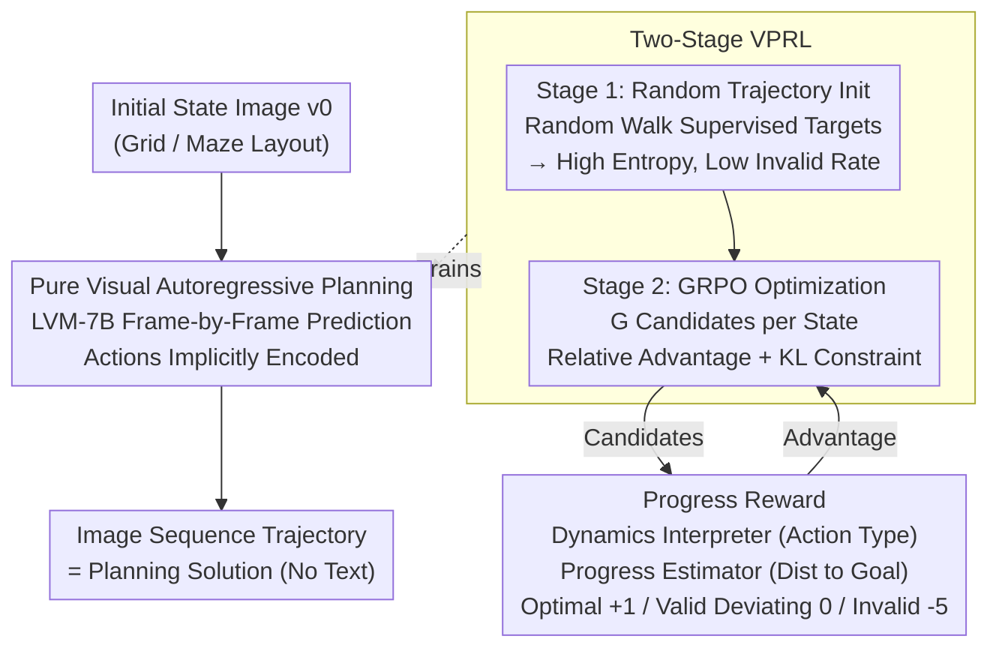

# Visual Planning: Let's Think Only with Images

**Conference**: ICLR 2026 Oral  
**arXiv**: [2505.11409](https://arxiv.org/abs/2505.11409)  
**Code**: [GitHub](https://github.com/yix8/VisualPlanning)  
**Area**: Robotics  
**Keywords**: Visual Planning, Pure Visual Reasoning, Large Vision Model, GRPO, Reinforcement Learning, Navigation

## TL;DR

This paper proposes Visual Planning—the first pure visual reasoning paradigm: the planning process is entirely expressed by image sequences (without text mediation), using a Large Vision Model to autoregressively generate step-by-step state images. It introduces the VPRL two-stage RL framework (random trajectory initialization for exploration + GRPO with progress reward optimization), achieving an average EM that exceeds text-based reasoning methods by 27% on FrozenLake, Maze, and MiniBehavior navigation tasks. This demonstrates that for "vision-first" tasks, visual reasoning is significantly superior to text reasoning.

## Background & Motivation

**Background**: LLMs/MLLMs have made significant progress in reasoning, yet all reasoning processes currently occur in the text space—even if inputs contain images, visual information is first described as text before reasoning. Cognitive science's Dual Coding Theory suggests humans possess separate verbal and non-verbal channels, where visual imagination is more efficient for spatial tasks.

**Limitations of Prior Work**:
   - (1) In spatial/geometric tasks, translating visual information into text descriptions leads to the loss of critical spatial features, creating a modality gap.
   - (2) Methods like Visual Sketchpad use tools to generate auxiliary visuals, but reasoning decisions are still completed in the text space.
   - (3) MVoT generates visualizations to assist text reasoning, but it remains essentially a text-driven tool-use paradigm.
   - (4) A true pure visual reasoning paradigm does not yet exist—all existing methods ultimately depend on text for decision-making.

**Key Insight**: Completely remove text mediation $\rightarrow$ planning = image sequence $\rightarrow$ each image represents an environment state $\rightarrow$ actions are implicitly encoded in state transitions $\rightarrow$ use LVMs trained on pure visual data to avoid linguistic interference.

**Design Motivation for RL**: RL has demonstrated generalization capabilities significantly superior to SFT in text reasoning (e.g., DeepSeek-R1), but it has never been applied to image generative reasoning/planning scenarios.

**Experimental Thoroughness (SFT Limitations)**: Supervised learning (VPFT) only imitates trajectories in the training distribution and lacks exploration of diverse actions, making it prone to overfitting and unable to learn from errors.

**Key Challenge (Evaluation)**: Visual output is high-dimensional and sparse, unlike text tokens which can be judged directly. Designing a specialized dynamics interpreter and progress estimator is required to evaluate whether generated images represent meaningful planning progress.

## Method

### Overall Architecture

This paper seeks to answer one question: In spatial planning tasks (maze navigation, grid navigation), does performing the reasoning process entirely in the image space without any text mediation outperform "describing the image as text before reasoning"? The approach redefines "planning" as image sequence generation: given an initial state image $v_0$, a Large Vision Model (LVM-7B, trained on zero text data) autoregressively draws subsequent state images step-by-step. The entire trajectory $\hat{\mathcal{T}} = (\hat{v}_1, \ldots, \hat{v}_n)$ serves as the planning solution—actions (where to move) are implicitly hidden in the transitions between adjacent frames, without outputting a single word.

Ensuring the model can "draw the next frame" is insufficient; it must draw a **valid** next frame leading to the goal. This is achieved via VPRL (Visual Planning via RL), a two-stage reinforcement learning framework: Stage 1 uses random trajectories to initialize the policy into a model that moves and maintains sufficient exploration; Stage 2 utilize GRPO combined with a **progress reward** to optimize it into a planner that selects valid actions leading to the goal. The progress reward translates the quality of each drawn frame into an optimizable scalar signal, serving as the bridge between "drawing" and "planning."

### Key Designs

**1. Pure Visual Autoregressive Planning: Hiding Actions in Transitions**

The states of spatial planning tasks are spatial layouts. Describing coordinates with text is lengthy and error-prone—statistical analysis shows approx. 25.7% of coordinate/layout descriptions mismatch the real environment. This modality gap is why text reasoning fails in such tasks. Visual Planning allows the model to directly predict the "next frame" in the image space, with each step conditionally depending on all historical states $\hat{v}_i \sim \pi_\theta(v_i \mid v_0, \hat{v}_1, \ldots, \hat{v}_{i-1})$. Backbone selection focuses on LVM-7B, pre-trained only on images/videos, to cut off linguistic capability as a confounder.

**2. Two-Stage VPRL: Feeding Exploration Before RL**

Initially, using a supervised model (VPFT trained on optimal trajectories) as the starting RL policy causes exploration collapse—entropy drops to zero, and sampled candidate actions for the same state become identical, leading to zero relative advantage for GRPO. Stage 1 addresses this by learning from **random walks** rather than optimal trajectories. One valid next state is randomly sampled as the target to minimize:

$$\mathcal{L}_{\text{VPFT}}(\theta) = -\mathbb{E}_{(v_{\leq i}, \tilde{v}_{i+1})} \left[\log \pi_\theta(\tilde{v}_{i+1} \mid v_{\leq i})\right]$$

The resulting model behaves like a high-entropy random planner with a low invalid action rate, providing sufficient space for Stage 2. Stage 2 then samples $G$ candidates per state and uses GRPO with a KL constraint:

$$\mathcal{J}_{\text{VPRL}}(\theta) = \mathbb{E}\left[ \frac{1}{G}\sum_{k=1}^{G} \min\left(\rho^{(k)} A^{(k)},\; \text{clip}(\rho^{(k)}, 1-\epsilon, 1+\epsilon) A^{(k)}\right) - \beta D_{\text{KL}}(\pi_\theta \| \pi_{\text{ref}}) \right]$$

**3. Progress Reward: Semantic Scoring of Generated States**

Visual outputs are high-dimensional, preventing bit-wise matching. Stage 2 requires environmental semantic signals. This involves two components: a dynamics interpreter $\mathcal{D}$ to parse action types between frames and a progress estimator $P$ using BFS to pre-calculate steps to the goal. Rewards are categorized into three tiers:

$$r(v_i, \hat{v}_{i+1}^{(k)}) = \alpha_{\text{opt}} \cdot \mathbb{I}[\mathcal{D}(\cdot) \in \mathcal{A}_{\text{opt}}] + \alpha_{\text{nopt}} \cdot \mathbb{I}[\mathcal{D}(\cdot) \in \mathcal{A}_{\text{nopt}}] + \alpha_{\text{inv}} \cdot \mathbb{I}[\mathcal{D}(\cdot) \in \mathcal{E}_{\text{inv}}]$$

Coefficients are: optimal action $\alpha_{\text{opt}}=1$, valid but non-progressive action $\alpha_{\text{nopt}}=0$, and invalid actions (e.g., hitting walls) $\alpha_{\text{inv}}=-5$.

## Key Experimental Results

### Table 1: Main Results — Performance Across Three Navigation Tasks

| Method | Input $\rightarrow$ Output | FrozenLake EM | FrozenLake PR | Maze EM | Maze PR | MiniBehavior EM | MiniBehavior PR | Avg EM | Avg PR |
|------|-----------|-------------|-------------|---------|---------|----------------|----------------|--------|--------|
| Gemini 2.0 Flash Direct | Img+Txt $\rightarrow$ Txt | 21.2 | 47.6 | 8.3 | 31.4 | 0.7 | 29.8 | 10.1 | 36.3 |
| Gemini 2.0 Flash CoT | Img+Txt $\rightarrow$ Txt | 27.6 | 52.5 | 6.9 | 29.8 | 4.0 | 31.2 | 12.8 | 37.8 |
| Gemini 2.5 Pro (think) | Img+Txt $\rightarrow$ Txt | 72.0 | 85.0 | 21.5 | 35.5 | 37.6 | 59.9 | 43.7 | 60.1 |
| Qwen2.5-VL Direct | Img+Txt $\rightarrow$ Txt | 1.2 | 15.0 | 0.6 | 14.5 | 0.3 | 9.8 | 0.7 | 13.1 |
| Qwen2.5-VL CoT | Img+Txt $\rightarrow$ Txt | 8.2 | 29.1 | 2.3 | 15.2 | 0.5 | 14.7 | 3.7 | 19.7 |
| Qwen2.5-VL SFT | Img+Txt $\rightarrow$ Txt | 68.6 | 84.4 | 60.9 | 70.3 | 31.3 | 56.1 | 53.6 | 69.9 |
| LVM VPFT (Ours) | Img $\rightarrow$ Img | 75.4 | 79.5 | 59.0 | 64.0 | 33.8 | 52.2 | 56.1 | 65.2 |
| **LVM VPRL (Ours)** | **Img $\rightarrow$ Img** | **91.6** | **93.2** | **74.5** | **77.6** | **75.8** | **83.8** | **80.6** | **84.9** |

### Table 2: Ablation Study — Textual Planning Variants on FrozenLake

| Method | EM (%) | PR (%) |
|------|--------|--------|
| Qwen2.5-VL SFT Direct | 68.6 | 84.4 |
| Qwen2.5-VL SFT w/ Coordinates | 74.4 | 82.7 |
| Qwen2.5-VL SFT w/ ASCII | 73.1 | 83.4 |
| Qwen2.5-VL GRPO w/ VPRL reward | 54.4 | 69.9 |
| Qwen2.5-VL GRPO w/ PR metric reward | 60.1 | 74.3 |

Finding: Text planning fails to exceed SFT baselines even with RL $\rightarrow$ bottlenecks reside in the modality gap rather than training methods.

## Key Findings

1. **Visual Planning Dominates Text Reasoning**: VPRL achieves an average EM of 80.6% vs. 53.6% for the best text SFT (+27%). The performance gap is largest on MiniBehavior, suggesting visual reasoning advantages scale with task complexity.
2. **Text RL Fails with Multimodal Inputs**: Unlike pure text domains, RL for multimodal planning is inferior to SFT (54.4% vs 68.6%) due to the modality gap in grounding visual info to text.
3. **Random Initialization is Crucial**: VPFT's entropy approaches zero, collapsing exploration. Stage 1 random initialization enables Stage 2 RL optimization.
4. **VPRL Reduces Invalid Actions**: Invalid action rates in failed trajectories dropped significantly compared to VPFT, showing VPRL effectively constrains the model to valid action spaces.
5. **VPRL is More Robust to Complexity Scaling**: As environments scale from 3×3 to 6×6, Gemini 2.5 Pro EM drops from 98% to 38.8%, while VPRL only drops from 97.6% to 82.4%.

## Highlights & Insights

- **"First Pure Visual Reasoning"**: Unlike previous works that make decisions in text space, Visual Planning implements full image-space reasoning.
- **First RL Application for Generative Image Planning**: Transfers the RL-for-reasoning paradigm from text to image generation.
- **Verification of Dual Coding Theory**: Validates Paivio's hypothesis that vision and language are independent reasoning channels at a computational level.
- **Elegant Two-Phase Design**: Stage 1 random initialization creates a "teachable" model for Stage 2 RL.

## Limitations & Future Work

1. **Limited Task Scope**: Testing is limited to grid-based navigation; continuous spaces or 3D environments remain unexplored.
2. **Rule-Based Dynamics**: The reward system currently relies on rule-based parsing, limiting generalization to unknown environments.
3. **Image Complexity**: Environments use simple grid rendering; scalability to high-resolution real-world images is unknown.
4. **Training Cost**: The computational overhead of two-stage RL and sampling efficiency requires further analysis.
5. **模态 Complementarity**: Positioned as an alternative rather than a supplement; fusing both modalities might yield better results.

## Related Work & Insights

### vs Visual Sketchpad (Hu et al., 2024)
Visual Sketchpad uses tools to generate sketches to help MLLMs, but **decisions remain in the text space**. Visual Planning reasons entirely in the image space.

### vs MVoT (Li et al., 2025)
MVoT generates visualizations for text steps, but remains a "text reasoning + visual tool" paradigm. Visual Planning eliminates the text decision step entirely.

### vs Action-conditional Generative Models (Hafner et al., 2019)
World models learn dynamics for model-based RL but **do not perform planning** themselves; they require external planners. VPRL is a self-contained holistic planner.

## Rating

- **Novelty**: ⭐⭐⭐⭐⭐ Pure visual reasoning paradigm + VPRL framework are pioneering.
- **Experimental Thoroughness**: ⭐⭐⭐⭐ Solid navigation tasks and ablations, though task types are narrow.
- **Writing Quality**: ⭐⭐⭐⭐⭐ Clear motivations and intuitive paradigm comparisons.
- **Value**: ⭐⭐⭐⭐⭐ Opens a new direction for the multimodal reasoning community.

<!-- RELATED:START -->

## Related Papers

- [\[ICLR 2026\] Sparse Imagination for Efficient Visual World Model Planning](sparse_imagination_for_efficient_visual_world_model_planning.md)
- [\[CVPR 2026\] ForeAct: Steering Your VLA with Efficient Visual Foresight Planning](../../CVPR2026/robotics/foreact_steering_your_vla_with_efficient_visual_foresight_planning.md)
- [\[NeurIPS 2025\] ThinkAct: Vision-Language-Action Reasoning via Reinforced Visual Latent Planning](../../NeurIPS2025/robotics/thinkact_vision-language-action_reasoning_via_reinforced_visual_latent_planning.md)
- [\[ICLR 2026\] Planning with an Embodied Learnable Memory](planning_with_an_embodied_learnable_memory.md)
- [\[CVPR 2026\] IGen: Scalable Data Generation for Robot Learning from Open-World Images](../../CVPR2026/robotics/igen_scalable_data_generation_for_robot_learning_from_open-world_images.md)

<!-- RELATED:END -->
