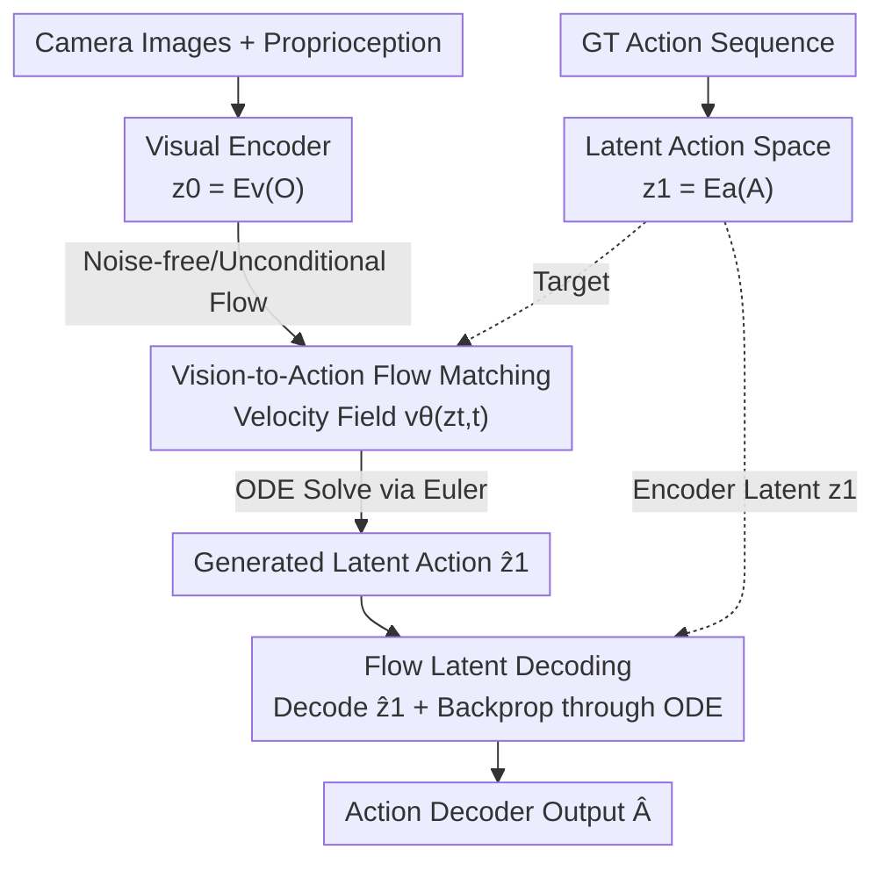

# VITA: Vision-to-Action Flow Matching Policy

**Conference**: ICLR 2026  
**OpenReview**: [https://openreview.net/forum?id=BTe5VLBjPg](https://openreview.net/forum?id=BTe5VLBjPg)  
**Code**: Project Page VITA (Paper annotated, repository link not provided)  
**Area**: Robotics / Embodied AI  
**Keywords**: Flow Matching, Visuomotor Policy, Imitation Learning, Latent Action, Inference Efficiency

## TL;DR
VITA replaces the source distribution of the Flow Matching policy from Gaussian noise with the visual representation itself, allowing the flow to "stream directly from vision to action." This eliminates the need for per-step visual conditioning during denoising. On 14 tasks such as ALOHA and Robomimic, it achieves $1.5\times–2\times$ faster inference and $18.6\%–28.7\%$ reduction in VRAM, while reaching or exceeding SOTA success rates.

## Background & Motivation

**Background**: Diffusion Policy and Flow Matching Policy have become mainstream generative approaches for visuomotor control. They start from a standard noise distribution (usually Gaussian) and iteratively "sculpt" the noise into an action sequence through denoising.

**Limitations of Prior Work**: Because the source distribution is task-agnostic pure noise, the model must repeatedly inject visual observations at **every denoising step**; otherwise, the generated actions become decoupled from the current scene. This injection relies on conditioning modules: cross-attention introduces quadratic time/space complexity, while AdaLN or FiLM avoid quadratic complexity but require extra modulation networks to generate feature-wise parameters at every layer and step. Consequently, inference is slow, memory consumption is high, and network structures are complex.

**Key Challenge**: Real-time robot control is extremely sensitive to latency (Pi-0.5 runs at 50 Hz, Helix up to 200 Hz). The "noise source + repeated conditioning" paradigm places computational overhead exactly on the critical inference path. The root of the problem is that **the source distribution contains no visual information, so vision must be supplemented repeatedly through conditioning**.

**Goal**: Eliminate the high overhead of conditioning without sacrificing (or even while improving) action precision.

**Key Insight**: Flow matching theoretically places **no constraints** on the source distribution—it does not have to be Gaussian. If the visual latent representation is directly used as the starting point of the flow, the source itself becomes "visually grounded," and repeated visual injection is no longer necessary during the flow process.

**Core Idea**: Replace the traditional paradigm of "Gaussian noise $\rightarrow$ Action + Per-step conditioning" with a noise-free, unconditional "Visual Latent $\rightarrow$ Action Latent" flow matching.

## Method

### Overall Architecture

VITA learns a policy $\pi(A|O)$ that maps observation $O$ (raw images $I$, optional proprioception $S$) to a future action sequence $A \in \mathbb{R}^{T_{pred} \times D_{action}}$ using action chunking. Its unique feature is the **starting point** of the flow: unlike traditional methods where $z_0 \sim \mathcal{N}(0, I)$, VITA treats the visual latent representation $z_0 = E_v(O)$ from the visual encoder as the source. This allows the velocity field $v_\theta(z_t, t)$ to be unconditional—hence "noise-free and unconditional."

However, Flow Matching requires the source and target to have **identical dimensions**. Visual latents often have 512 dimensions or more, while action dimensions are low (e.g., 2 in PushT, 21 in ThreadNeedle). Thus, VITA must "lift" actions into a latent space of the same dimension as the vision. The architecture consists of three components: the **Visual Encoder** $E_v$ providing the source latent $z_0$; the **Action Autoencoder** (encoder $E_a$ compresses ground truth actions into target latent $z_1 = E_a(A)$, and decoder $D_a$ restores latents to actions) providing the target and final output; and the **Flow Matching Network** $v_\theta$ learning the velocity field from $z_0$ to $z_1$.

At inference: Current observation is encoded into $z_0 \rightarrow$ Euler solver integrates the ODE from $t=0$ to $t=1$ to get the generated latent action $\hat{z}_1 \rightarrow$ Decoder outputs the final action $\hat{A} = D_a(\hat{z}_1)$. At training, a critical loop is added—**Flow Latent Decoding (FLD)**: the decoder is forced to reconstruct $\hat{z}_1$ **actually generated by the ODE**, and the reconstruction error is backpropagated through the ODE steps back to $v_\theta$ and $E_v$ to prevent latent action space collapse.

### Key Designs

**1. Noise-free and Unconditional Vision-to-Action Flow: Vision as the Source**

Traditional Flow Matching starts from Gaussian noise with no visual information, requiring a **conditional** velocity field $v_\theta(z_t, t \mid O)$. Every denoising step relies on cross-attention, AdaLN, or FiLM to inject observation $O$—the source of overhead. VITA exploits the theoretical property that flow matching lacks constraints on the source distribution by using the visual latent $z_0 = E_v(O_{curr})$ as the starting point. Since the source is "visually grounded," the velocity field becomes unconditional $v_\theta(z_t, t)$, requiring **zero visual injections** during the flow.

This yields structural benefits: with vector-type visual features (e.g., ResNet global average pooling), the flow network simplifies from "processing $T_{pred} \times D_{action}$ noise blocks fused with vision" to a pure **vector-to-vector mapping**. This allows the use of lightweight MLPs—VITA is the first Flow Matching policy known to handle complex tasks like ALOHA dual-arm manipulation using only MLPs. For grid features (e.g., $9 \times 512$), a transformer is used but still without cross-attention. The paper provides intuitive evidence: due to end-to-end optimization, the visual and action latent manifolds are "co-evolved" and highly aligned. **Rough action trajectories can be obtained by decoding the visual latent directly without ODE integration**, indicating that VITA learns an action-centric visual representation.

**2. Latent Action Space: Lifting Actions via Action Autoencoder**

Flow Matching requires the source and target to be of the same dimension, but actions are lower-dimensional than vision. Simple solutions like downsampling vision discard information, while zero-padding actions creates sparse, unstructured targets that hinder training. Pre-training and freezing an action AE (like Latent Diffusion) also fails because sparse robot data leads to unreliable latent spaces that cannot be corrected if frozen.

VITA's solution is an **action autoencoder jointly trained with flow matching**: the encoder $E_a$ upsamples ground truth action chunks into target latents $z_1 = E_a(A)$ of the same dimension as vision; the decoder $D_a$ restores them. The AE loss uses L1 reconstruction $L_{AE} = \|A - D_a(E_a(A))\|_1$. This results in $z_1$ being a **structured, low-reconstruction-bias, and locally well-conditioned** target latent space.

**3. Flow Latent Decoding: Backpropagating through ODE to Root Out Collapse**

Jointly training the action AE and Flow Matching can still fail. The paper identifies the root cause as **latent action space collapse caused by train-inference inconsistency**. During training, the decoder sees $z_1$ from the encoder, but at inference, it must decode $\hat{z}_1$ from the ODE solver. Since $\hat{z}_1$ is an approximation of $z_1$, the decoder may fail to map it to meaningful actions.

FLD addresses this by **having the decoder decode from the generated $\hat{z}_1$ during training**. The loss is $L_{FLD} = \|D_a(\hat{z}_1) - A\|$, where $\hat{z}_1$ is obtained via the Euler solver during training. Gradients flow through the decoder and the ODE steps back into $v_\theta$ and $E_v$. This anchors the "latent generation process" to ground truth actions, measuring error in the action space and bridging the gap between encoder latents and ODE latents. The paper also proposes a simpler proxy, **Flow Latent Consistency (FLC)**: $L_{FLC} = \|\hat{z}_1 - z_1\|$, which aligns them directly in latent space. Theoretically, FLD and FLC provide **locally equivalent** signals; in practice, FLC prevents collapse but converges slower than FLD. Ablations show that the model fails completely when $\lambda_{FLD}=0$.

### Loss & Training

The total objective is a weighted sum of three terms:

$$L_{VITA} = \lambda_{FM} L_{FM} + \lambda_{FLD} L_{FLD} + \lambda_{AE} L_{AE}$$

Where $L_{FM} = \mathbb{E}_{t, z_0, z_1}[\|v_\theta(z_t, t) - (z_1 - z_0)\|^2]$ is the standard Flow Matching loss (linear interpolation path $z_t = (1-t)z_0 + t z_1$ supervising the velocity field $z_1 - z_0$), $L_{AE}$ is the action reconstruction L1 loss, and $L_{FLD}$ is the ODE backprop reconstruction loss. VITA uses OT-CFM based on Optimal Transport, an Euler solver with 6 time steps, ResNet-18 for the visual encoder, and an action chunk length of 16. VITA/FM converges much faster than DP/ACT, requiring only 25K–50K training steps.

## Key Experimental Results

Evaluated on **9 simulation + 5 real-world** tasks across ALOHA, AV-ALOHA, Robomimic, PushT, and RLBench, covering single/dual-arm and up to 21-DoF actions. Latency/VRAM measured on an RTX 4090.

### Main Results

Efficiency Comparison (per action chunk, batch size 1):

| Visual Feature | Method | Architecture | Conditioning | Params | Latency (ms) | VRAM (MiB) |
|---------------|--------|--------------|--------------|--------|--------------|------------|
| Vector | **VITA** | MLP | None | 31.09M | **0.2215** | **333.86** |
| Vector | FM | Transformer | AdaLN | 31.16M | 0.3307 | 410.38 |
| Vector | FM | U-Net | FiLM | 84.05M | 0.3650 | 818.79 |
| Vector | DDPM | U-Net | FiLM | 81.82M | 2.5985 | 801.47 |
| Grid | **VITA** | Transformer | None | 31.80M | **0.2502** | **377.55** |
| Grid | FM | Transformer | Cross-Attn | 29.06M | 0.5102 | 529.16 |

Under vector settings, VITA is $1.5\times$ faster and saves $18.6\%$ VRAM relative to the best FM baseline; under grid settings, it is $2\times$ faster and saves $28.7\%$ VRAM.

Simulation Success Rate (Mean $\pm$ SD of 3 seeds, selected):

| Task | VITA | FM | DP | ACT |
|------|------|----|----|-----|
| ThreadNeedle | **91.33** | 90 | 59.33 | 44.67 |
| HookPackage | **86** | 82 | 37.33 | 32 |
| PushT | **88** | 83.33 | 74.67 | 28 |
| Square | **95.33** | 87.33 | 84 | 72 |
| CloseBox | **95.33** | 85.33 | 85.33 | 72 |
| Can | 100 | 100 | 95.33 | 88.67 |

VITA matches or exceeds the strongest transformer-based FM (AdaLN) in most tasks, significantly outperforming DP/ACT, especially in high-precision multi-stage tasks.

### Ablation Study

| Configuration | Observation | Explanation |
|---------------|-------------|-------------|
| w/o FLD or FLC ($\lambda_{FLD}=0$) | Success rate $\approx 0$ | Latent space collapse; ODE output $\hat{z}_1$ is unmaskable |
| FLC only | Prevents collapse, slower convergence | Aligning in latent space is weaker than anchoring to GT actions |
| FLD only | Policy successfully learned | GT actions directly anchor the ODE generation process |
| FLD + FLC | Best performance | Dual training signals from both raw and latent spaces |

### Key Findings

- **FLD is critical**: Removing it zeroes the success rate. The train-inference gap is fatal in sparse action data; backpropagating GT reconstruction through the ODE is the solution.
- **Efficiency gains are universal**: Vector features benefit from MLP-ification, while grid features benefit from removing cross-attention. The dividend comes from "de-conditioning."
- **Visual latents encode coarse action semantics**: Decoding $z_0$ directly yields a rough trajectory, confirming visual-action manifold alignment. This explains why lightweight MLPs suffice for VITA.

## Highlights & Insights
- **Leveraging Flow Matching properties for policy learning**: Using visual representations as the source is a theoretically sound but previously unexplored "hack" to eliminate conditioning overhead.
- **FLD: Gradient through the ODE solver**: Bringing the inference-time $\hat{z}_1$ into the training loop and backpropagating is a general strategy for bridging train-inference gaps in latent generation.
- **Theoretical Equivalence (FLD $\leftrightarrow$ FLC)**: Provides implementation flexibility; FLC can be used as a low-compute approximation of FLD.

## Limitations & Future Work
- The Action AE and Flow Matching **must be jointly trained end-to-end**, preventing the reuse of frozen pre-trained latents. Each task requires training a new latent space.
- Experiments focus on imitation learning (50–200 demos per task). Scaling to large-scale, multi-task, or cross-robot policies remains to be verified.
- The alignment "Visual Latent = Coarse Action" relies on strong vision-action correlation. Its stability under heavy visual distractors or long-horizon planning requires further study.

## Related Work & Insights
- **vs. Conventional DP/FM**: They start from Gaussian noise and use per-step conditioning; VITA starts from visual latents and uses unconditional fields, trading "noise source" for "visually grounded source" to gain $1.5\times–2\times$ acceleration.
- **vs. ACT (CVAE)**: ACT uses conditional VAE for direct regression; VITA is generative flow matching in latent space, achieving higher success rates in complex tasks.
- **vs. Latent Diffusion**: Image domains have sufficient data for frozen latents; action domains are sparse, necessitating VITA's joint training and FLD—a key modification for small-data modalities.

## Rating
- Novelty: ⭐⭐⭐⭐⭐ Uses "source-agnostic" FM for policy learning to eliminate conditioning; a clear and elegant paradigm shifts.
- Experimental Thoroughness: ⭐⭐⭐⭐ 14 tasks (Sim/Real, Single/Dual), thorough ablation of FLD; lacks large-scale general-purpose validation.
- Writing Quality: ⭐⭐⭐⭐⭐ Clear derivation of motivation; provides both theoretical and intuitive evidence.
- Value: ⭐⭐⭐⭐⭐ High direct value for robot deployment due to reduced latency and memory.

<!-- RELATED:START -->

## Related Papers

- [\[ICLR 2026\] Translating Flow to Policy via Hindsight Online Imitation](translating_flow_to_policy_via_hindsight_online_imitation.md)
- [\[CVPR 2026\] GeniNav: Generative Model Driven Image-Goal Navigation via Imagination-Guided Consistency Flow Matching](../../CVPR2026/robotics/geninav_generative_model_driven_image-goal_navigation_via_imagination-guided_con.md)
- [\[ICLR 2026\] WMPO: World Model-based Policy Optimization for Vision-Language-Action Models](wmpo_world_model-based_policy_optimization_for_vision-language-action_models.md)
- [\[ICLR 2026\] VITA: Zero-Shot Value Functions via Test-Time Adaptation of Vision–Language Models](vita_zero-shot_value_functions_via_test-time_adaptation_of_visionlanguage_models.md)
- [\[ICLR 2026\] HAMLET: Switch Your Vision-Language-Action Model into a History-Aware Policy](hamlet_switch_your_vision-language-action_model_into_a_history-aware_policy.md)

<!-- RELATED:END -->
