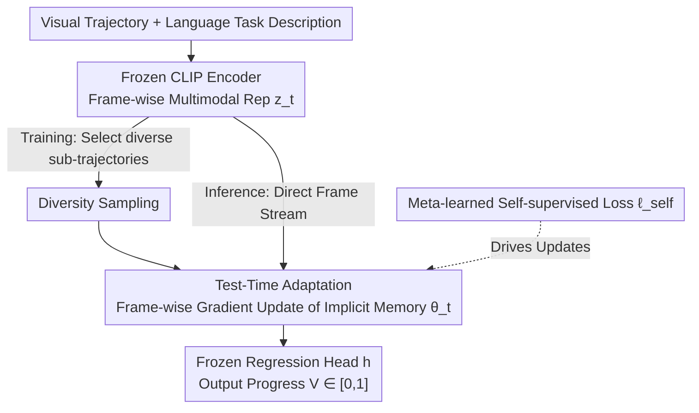

# VITA: Zero-Shot Value Functions via Test-Time Adaptation of Vision–Language Models

**Conference**: ICLR 2026  
**OpenReview**: [https://openreview.net/forum?id=V35oo1SVGH](https://openreview.net/forum?id=V35oo1SVGH)  
**Paper**: [Project Website](https://chziakas.github.io/vita/)  
**Code**: See project homepage  
**Area**: Robotics / Reinforcement Learning / Multimodal VLM  
**Keywords**: Zero-Shot Value Functions, Test-Time Adaptation, Meta-Learning, Reward Shaping, Robotic Manipulation

## TL;DR
VITA uses a frozen contrastive VLM (CLIP) as a backbone for goal-conditioned value functions and performs frame-wise gradient updates on a lightweight adaptive module at inference time. The update rule itself is a self-supervised loss derived via meta-learning, which implicitly encodes trajectory history into parameters. This allows a value function trained only in a single environment to generalize zero-shot to entirely new tasks, environments, and robot embodiments, outperforming the state-of-the-art autoregressive VLM-based method GVL.

## Background & Motivation
**Background**: Unsupervised learning of a "universal goal-conditioned value function" from large-scale video is a major research direction in robot learning. Given a visual observation $o_t$ and a natural language task description $g$, the model predicts the current completion progress $V(o_t;g)\in[0,1]$. In expert trajectories, progress is typically supervised using normalized timesteps $t/T$. Once obtained, such value functions can be used for zero-shot reward shaping in reinforcement learning / imitation learning.

**Limitations of Prior Work**: Existing approaches using VLMs as value functions have significant drawbacks. Contrastive VLMs (e.g., CLIP) only compute the similarity between individual frames and task descriptions, **lacking temporal modeling**. They cannot distinguish between states that are visually similar but in different stages of a task (e.g., folding vs. unfolding clothes). Autoregressive VLMs (e.g., GVL using Gemini) introduce temporal context by feeding the entire trajectory into the prompt, but because pre-training data is chronologically ordered, they have an **inherent bias towards predicting monotonically increasing progress**. GVL mitigates this by shuffling frame order during inference, but this discards temporal sequencing entirely.

**Key Challenge**: Both types of VLMs rely on **frozen pre-trained representations** for zero-shot prediction, which limits both generalization and temporal reasoning. Previous attempts to solve this required large-scale pre-training, domain fine-tuning, or expert demonstrations—violating the "zero-shot" premise.

**Goal**: Enhance both the **generalization ability** and **temporal reasoning** of value functions without large-scale pre-training or task-specific demonstrations.

**Key Insight**: The authors adopt the concept of Test-Time Training (TTT), treating inference as a self-supervised learning task where an adaptive module is updated frame-by-frame via gradient steps. The key observation is that TTT **encodes history into parameters** (rather than hidden states or KV caches). These parameters serve as implicit memory that naturally preserves temporal order. Combined with gradient-based meta-learning (e.g., Finn et al.), the self-supervised task itself can be "learned" to specifically serve downstream value estimation.

**Core Idea**: Use a meta-learned self-supervised loss to update a lightweight adaptive module frame-by-frame during inference. This allows VLM representations to online-adapt to the semantic and temporal context of each test trajectory, condensing "temporal history" into parameters as implicit memory.

## Method

### Overall Architecture
The VITA value function estimator consists of three parts: a **frozen contrastive VLM encoder** (CLIP) that encodes the visual trajectory and task description into frame-wise joint multimodal representations $z_t=[\phi_v(o_t);\phi_g(g)]\in\mathbb{R}^{2d}$; a **test-time adaptation module** $f_{\text{adapt}}$ that is updated frame-by-frame along the trajectory during inference; and a **regression head** $h$ (a two-layer MLP) that outputs the final progress. The core mechanism is that CLIP and the regression head remain frozen, while only the parameters of $f_{\text{adapt}}$ change during inference—it performs a gradient update each time it reads a frame, writing "viewed history" into the parameters.

On the training side, the value function estimator is trained via gradient meta-learning: first, diversity sampling is used to select the most semantically dispersed sub-trajectories; then, the adaptive module performs frame-wise adaptation on these sub-trajectories while backpropagating through these updates to optimize the goal of "minimizing the supervised prediction loss after adaptation." During inference, no task-specific demonstrations are needed; the test trajectory is fed in for frame-wise adaptation to obtain zero-shot progress estimates.

### Key Designs

**1. Test-Time Adaptation: Encoding Trajectory History into Parameters as Implicit Memory**

This design directly addresses the "lack of temporal modeling" in contrastive VLMs and the "loss of temporal order" in autoregressive VLMs. During inference, for each frame $t$, the adaptive module $f_{\text{adapt}}$ performs one gradient update on a self-supervised loss $\ell_{\text{self}}$:

$$\theta_t = \theta_{t-1} - \eta\nabla_\theta\,\ell_{\text{self}}(z_t;\theta_{t-1})$$

Notably, the update is **incremental and non-resetting**—$\theta_t$ continues from $\theta_{t-1}$, so by frame $t$, the parameters have accumulated information from the previous $t-1$ frames. This differs from standard sequence models that store history in hidden states (RNNs) or KV caches (Transformers). VITA stores history in **parameters**, which become implicit memory carrying accumulated temporal context while preserving temporal order. Ablations prove this "incremental frame-wise" approach is superior to trajectory-level one-time updates, memoryless resets, or explicit sliding window memory. The final value is given by $V(z_t;g)=h\big(f_{\text{adapt}}(P_Q z_t;\theta_t)\big)$, where $P_Q$ is a meta-learned linear projection and $h$ is frozen during inference.

**2. Meta-Learned Self-Supervised Loss: Ensuring Updates Improve Value Estimation**

Merely "updating during inference" is insufficient—updates must move in the correct direction. VITA **meta-learns** the self-supervised loss itself to serve value estimation. This loss is a reconstruction objective parameterized by two learnable linear projections $P_K$ (generating a perturbed view) and $P_V$ (generating the reconstruction target):

$$\ell_{\text{self}}(z_t;\theta_{t-1},P_K,P_V) = \big\|\,f_{\text{adapt}}(P_K z_t;\theta_{t-1}) - P_V z_t\,\big\|^2$$

Training follows the gradient meta-learning paradigm: first, update $f_{\text{adapt}}$ online using $\ell_{\text{self}}$, then **backpropagate through this update** to optimize the initialization $\theta_0$, the three projections $P_K, P_V, P_Q$, and the regression head $h$ using the supervised prediction loss $\ell_{\text{pred}}$ (MSE between predicted progress and ground truth $y_t=t/T$). The total loss weights $\ell_{\text{pred}}$ and $\ell_{\text{self}}$ with a scalar $\lambda$ (experimentally $\lambda_{\text{self}}=0.5$). In other words, the self-supervised task is not fixed a priori but is trained such that "performing this test-time update makes the value estimation more accurate"—which distinguishes VITA from standard TTT.

**3. Diversity Sampling: Suppressing Shortcut Learning and Forcing Semantic Cues**

Adjacent frames in expert videos are highly redundant. Value functions can easily learn "shortcuts" by fitting frequently appearing late-stage visual patterns rather than truly understanding semantic progress. When constructing training mini-batches, VITA selects the **visually most dispersed** sub-trajectories from each trajectory to increase intra-batch variance—an importance sampling biased toward semantic diversity. Formally, given a sliding window of size $w_{tr}$ and stride $s$, candidates $W$ are generated. VITA aims to select a subset $W'$ of size $k$ to maximize pairwise differences $\sum\|w_i-w_j\|_2^2$. Since this combinatorial optimization is NP-hard, a scoring heuristic is used: calculate the total difference of each window from all others $s(w)=\sum_{v\in W}\|w-v\|_2^2$, then select the top $k$ windows. This reduces complexity to polynomial time with negligible training overhead. Ablations show this is significantly better than whole-trajectory or random sampling for distinguishing experts from non-experts.

### Loss & Training
Training Objective = Supervised Prediction Loss $\ell_{\text{pred}}$ (MSE, progress regression) + Self-supervised Loss $\ell_{\text{self}}$, with weight $\lambda_{\text{self}}=0.5$; optimized via gradient meta-learning for $\theta_0, P_K, P_V, P_Q, h$. Backbone is frozen OpenCLIP ViT-B/32. Diversity sampling hyperparameters: window $w_{tr}=8$, number of sub-trajectories $k=8$, stride $s=1$. At test time, only one gradient step is taken ($t_{ep}=1$) with learning rate $\eta=0.1$; adaptation cost is minimal and does not affect real-time performance.

## Key Experimental Results

### Main Results
Trained on BridgeData V2 using only 2,986 pick-and-place expert trajectories from the ToyKitchen environment and a single embodiment (WidowX 250). Zero-shot evaluation was performed under distribution shifts. Metric: VOC (Value Order Correlation) = Spearman rank correlation between predicted progress and frame time index.

| Shift Type | Dataset | GVL-0S | GVL-1S | CLIP-GRU | VITA |
|------------|---------|--------|--------|----------|------|
| In-dist.   | tk_pnp  | 0.269 | 0.252 | 0.773 | **0.782** |
| Env Shift  | lm_pnp  | 0.305 | 0.272 | 0.676 | **0.725** |
| Env Shift  | td_fold | 0.326 | 0.318 | 0.674 | **0.709** |
| Env Shift (Long) | ms_sweep | 0.158 | 0.150 | 0.434 | **0.490** |
| Embodiment | dt_tk_pnp | 0.258 | 0.211 | **0.856** | 0.820 |
| Embodiment | dt_tk_stack | 0.254 | 0.277 | 0.667 | **0.708** |
| Dual Shift | dt_ft_stack | 0.212 | 0.249 | 0.674 | **0.698** |

VITA and CLIP-GRU both significantly outperform GVL (autoregressive VLM), indicating that preserving temporal order is crucial for progress estimation; VITA outperforms CLIP-GRU in 6 out of 10 evaluation sets. GVL performs decently on folding tasks but fails on stacking and pick-and-place, exposing the "folding bias" of autoregressive VLMs; VITA remains stable across all task types and shifts.

Reward shaping transfer to simulated Meta-World MT10 (using IQL for offline RL), metric IQM (Interquartile Mean of 10 seeds):

| Method | MT10 IQM | 95% CI |
|--------|----------|--------|
| CLIP-FT | 0.785 | [0.759, 0.809] |
| CLIP-GRU | 0.777 | [0.734, 0.814] |
| META-WL (Sim fuzzy-logic dense reward) | 0.779 | [0.750, 0.804] |
| **VITA** | **0.815** | [0.785, 0.838] |

VITA, trained on real robot data and transferred zero-shot to simulation for reward shaping, actually outperformed the simulator's built-in fuzzy-logic dense reward META-WL (0.815 vs 0.779).

### Ablation Study

| Configuration | Key Finding | Description |
|---------------|-------------|-------------|
| Diversity Sampling (Full) | Best expert/non-expert discrimination | BinVOC VITA=1.00 (Perfect), tied with GVL-0S/1S |
| w/ Whole-trajectory Sampling | Degradation | Overfits to global temporal shortcuts |
| w/ Random Sampling | Sub-optimal | Provides diversity but lacks semantic diversity |
| VITA (Frame-wise Incremental Memory) | Optimal | Implicit memory accumulates temporal context |
| TTT-TR (Trajectory-level single update) | Drop | Batched average over trajectory, loses frame order |
| TTT-RS (Frame-wise reset, memoryless) | Drop | Carries no history |
| TTT-EX (Reset + Local Window) | Drop | Explicit window memory is worse than implicit accumulation |

### Key Findings
- **Implicit Memory > Explicit Memory/Hidden States**: VITA outperforms CLIP-GRU in expert/non-expert discrimination (BinVOC) and offline RL, suggesting that storing temporal history in parameters during sequential updates is less prone to overfitting than storing it in RNN hidden states.
- **Incremental Non-resetting is Key**: In memory ablation, only VITA's "incremental non-resetting" logic consistently won; resetting or batch updating destroys temporal order information.
- **Greater Gains on Long-horizon Tasks**: On the long-horizon sweeping task (ms_sweep), most methods drop significantly except for VITA, which maintains the highest VOC, proving TTT handles long horizons better than RNN hidden states.
- **Embodiment Migration Surprise**: On dt_tk_pnp (new embodiment, same environment/task), both VITA and CLIP-GRU outperformed their in-distribution scores, indicating learned temporal context can transfer across robot embodiments.

## Highlights & Insights
- **Inference as "Online Learning"**: The most clever aspect of VITA is treating the value function not as a static feed-forward network, but as a model that learns on the fly during each test trajectory—parameters are memory, and each frame triggers an update. This "inference as adaptation" mindset can be transferred to any prediction task requiring temporal context while maintaining zero-shot capabilities.
- **Meta-Learning the Self-Supervised Task**: Instead of pre-defining a self-supervised proxy task, backpropagating through test-time updates "learns" a self-supervised loss that is useful for the downstream task, avoiding the common "objective misalignment" pitfall in TTT.
- **Frozen Backbone + Lightweight Adaptation**: CLIP and the regression head are frozen throughout; only a lightweight module is updated, resulting in negligible overhead and independence from the specific VLM encoder used. In theory, this can "retro-fit" temporal reasoning onto any pre-trained multimodal representation.
- **Real-to-Sim Reward Transfer**: The evidence that a value function learned on real robot data can outperform native simulation rewards for RL is highly persuasive regarding the transferability of value functions as rewards.

## Limitations & Future Work
- The authors acknowledge that test-time adaptation might still fail in scenarios with extremely high execution variability or very long durations.
- Updating the value function estimator every frame **might be unsafe** during deployment, limiting applicability for real-time closed-loop control; authors list real-time control and complex RL environments as future work.
- Diversity sampling's role in suppressing shortcut learning is empirical; it lacks a **theoretical analysis** of why/how such sampling affects shortcut learning.
- Personal observation: Evaluation is localized within robotic manipulation; VOC/BinVOC measure "progress ordering" rather than absolute accuracy. The VOC values across different task difficulties are not directly comparable, and the generalization conclusions rely on the underlying CLIP representations being sufficiently universal.

## Related Work & Insights
- **vs GVL (Autoregressive VLM SOTA)**: GVL fits the whole trajectory into a Gemini prompt and relies on shuffling to mitigate monotonic bias—at the cost of temporal order and high inference costs. VITA **preserves** temporal order and captures context via TTT, avoiding shortcuts with minimal cost.
- **vs CLIP-GRU (Explicit Temporal Memory)**: Both model time, but CLIP-GRU stores history in hidden states, which are more susceptible to temporal shortcuts; VITA uses parameter-level implicit memory, which is more stable in RL and expert discrimination.
- **vs RoboCLIP / Large-scale Pre-trained Value Functions**: These usually require demonstrations or massive data scale for generalization; VITA requires no task-specific demonstrations or massive pre-training, adapting online for a much "lighter" zero-shot approach.
- **vs Standard TTT (Sun et al.)**: Standard TTT uses whole-trajectory sampling and more general self-supervised tasks; VITA introduces diversity sampling to suppress shortcuts and meta-learns the task specifically for value estimation.

## Rating
- Novelty: ⭐⭐⭐⭐⭐ Using the "parameters as memory" concept from TTT for zero-shot value functions and meta-learning the self-supervised loss is both novel and self-consistent.
- Experimental Thoroughness: ⭐⭐⭐⭐ Covers shifts in task/env/embodiment + expert discrimination + offline RL transfer with solid ablations, though limited to manipulation and lacks real-world closed-loop validation.
- Writing Quality: ⭐⭐⭐⭐⭐ Motivation is clearly derived, TTT background is well-explained, and the logic between formulas and ablations is sound.
- Value: ⭐⭐⭐⭐ Provides a lightweight, zero-shot, transferable reward-shaping route that is directly useful for robotics RL.

<!-- RELATED:START -->

## Related Papers

- [\[ICLR 2026\] Verifier-Free Test-Time Sampling for Vision-Language-Action Models](verifier-free_test-time_sampling_for_vision-language-action_models.md)
- [\[CVPR 2026\] Test-Time Perturbation Tuning with Delayed Feedback for Vision-Language-Action Models](../../CVPR2026/robotics/test-time_perturbation_tuning_with_delayed_feedback_for_vision-language-action_m.md)
- [\[ICML 2026\] Test-Time Training for Visual Foresight Vision-Language-Action Models](../../ICML2026/robotics/test-time_training_for_visual_foresight_vision-language-action_models.md)
- [\[ICLR 2026\] Test-Time Mixture of World Models for Embodied Agents in Dynamic Environments](test-time_mixture_of_world_models_for_embodied_agents_in_dynamic_environments.md)
- [\[ICLR 2026\] Sim2Real VLA: Zero-Shot Generalization of Synthesized Skills to Realistic Manipulation](sim2real_vla_zero-shot_generalization_of_synthesized_skills_to_realistic_manipul.md)

<!-- RELATED:END -->
