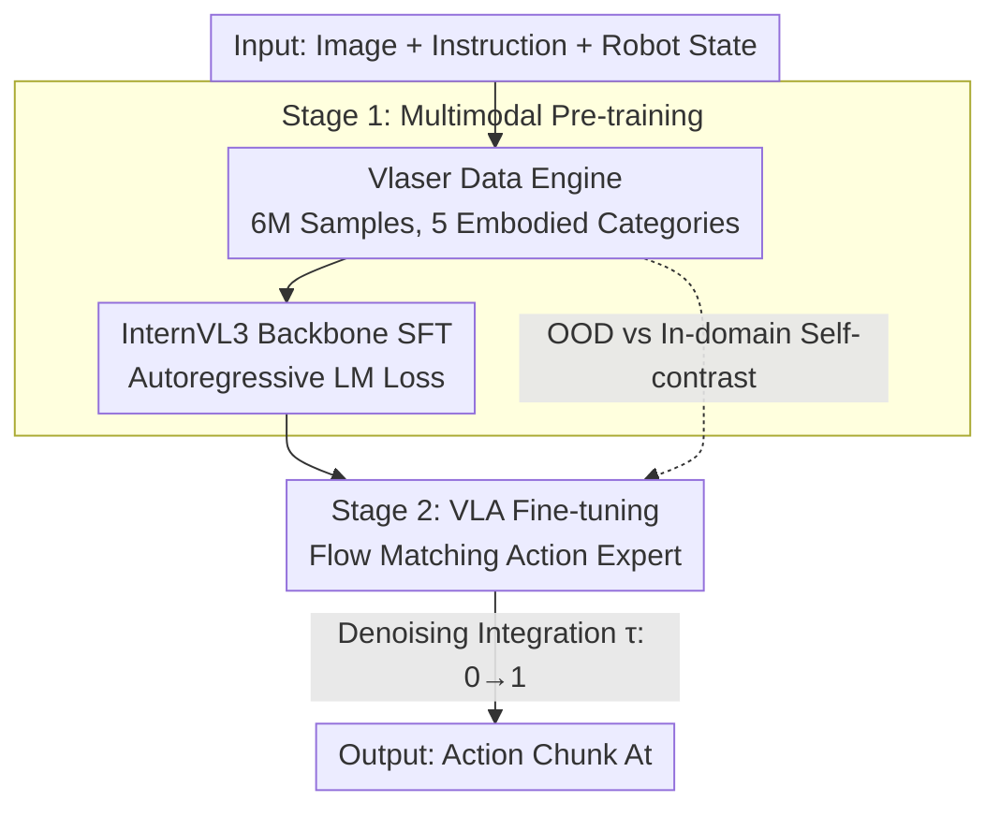

# Vlaser: Vision-Language-Action Model with Synergistic Embodied Reasoning

**Conference**: ICLR 2026  
**OpenReview**: [https://openreview.net/forum?id=8xTDnj39Ti](https://openreview.net/forum?id=8xTDnj39Ti)  
**Code**: https://github.com/OpenGVLab/Vlaser/ (Available)  
**Area**: Embodied AI / Robotics / Multimodal VLM  
**Keywords**: Embodied Reasoning, Vision-Language-Action Model, Data Engine, Flow Matching, Domain Shift

## TL;DR
This paper constructs Vlaser (based on InternVL3, 2B/8B versions), a vision-language-action model using the self-developed Vlaser-6M dataset to integrate "high-level embodied reasoning" and "low-level robot control" into a single backbone. It systematically addresses a long-ignored question: **which type of pre-training data is most useful for downstream VLA policy learning?** The conclusion is that "higher scores on online reasoning benchmarks do not equal improved downstream manipulation performance; what truly works is in-domain data within the same observation domain as the robot hardware."

## Background & Motivation
**Background**: The embodied intelligence community follows two parallel research lines. One uses Vision-Language Models (VLM) to enhance embodied **reasoning** (grounding, planning, spatial reasoning); the other extends VLMs into Vision-Language-Action (VLA) models for end-to-end robot control via action heads. While both lines are active, the link between them remains disconnected.

**Limitations of Prior Work**: A gap exists between upstream VLM reasoning and downstream VLA policy learning that has rarely been studied directly. It is often assumed that "the stronger the VLM reasoning, the better its initialization for VLA fine-tuning," but this hypothesis has never been systematically validated. Furthermore, the impact of different multimodal data streams (QA / grounding / spatial / planning) on downstream control is "poorly understood."

**Key Challenge**: There is a significant **domain shift** between internet-scale pre-training data and robot-specific policy learning data. Reasoning capabilities measured on public benchmarks are typically in the domain of web images, whereas robots operate in specific observation domains (e.g., WidowX, Google Robot). Performance gains in the former do not necessarily translate to success rates in the latter's closed-loop execution.

**Goal**: ① Build an embodied VLM base with strong reasoning capabilities; ② Systematically decompose the "VLM $\rightarrow$ VLA" transfer on this base to identify which data categories are truly beneficial.

**Key Insight**: Rather than blindly accumulating "difficult-looking" OOD (Out-of-Distribution) reasoning data, it is more effective to annotate **in-domain** data directly from robot interaction datasets (e.g., Open X-Embodiment, simulation platforms). This allows the VLM to learn reasoning within the same observation domain as its downstream tasks. The authors hypothesize that "observation domain alignment" determines downstream performance more than "reasoning benchmark scores."

**Core Idea**: A unified data engine (Vlaser-6M) is used to connect embodied reasoning and action control within the same VLM. Through rigorous self-controlled ablations, the authors prove that **in-domain data eliminating observation domain shift** is the key to accelerating VLA convergence and improving success rates, rather than high scores on OOD reasoning benchmarks.

## Method

### Overall Architecture
Vlaser consists of two components and two training stages. Components: A standard VLM backbone (InternVL3, featuring InternViT and Qwen2.5-1.5B/7B for the 2B/8B versions) handles perception and reasoning, while an **action expert** manages low-level control. Training: Stage one involves **multimodal pre-training** via Supervised Fine-Tuning (SFT) on the Vlaser-6M dataset to instill embodied reasoning (grounding/planning/spatial). Stage two involves **VLA fine-tuning**, where the VLM backbone is frozen or reused, and only the action expert is trained to generate future action sequences from single-frame observations using flow matching.

The key to the pipeline lies not in architectural novelty (the action expert largely follows the design of $\pi_0$), but in the data. The Vlaser data engine systematically curates, re-organizes, and labels public datasets into five categories. The inclusion of "in-domain simulation data" serves as the experimental lever to validate the hypothesis regarding domain shift.

### Key Designs

**1. Vlaser Data Engine: Systematically "Feeding" Reasoning via Five Data Categories**

Current embodied VLM datasets are fragmented, making it difficult to cover grounding, QA, spatial awareness, and planning simultaneously. This paper curates a unified dataset, Vlaser-6M, with 6 million samples across five modalities: ① **Embodied Grounding (1.8M)**—Bounding boxes and center points normalized to $[0, 1000]$ for resolution independence, sourced from RoboPoint, ShareRobot, etc., with 300k additional synthetic samples from SA-1B masks for open-vocabulary generalization; ② **General + Spatial Reasoning (1.2M RoboVQA + 0.5M Spatial)**—Aggregation of RoboVQA and Robo2VLM, including 100k manually labeled spatial samples from 3D scenes like ScanNet; ③ **Planning (0.4M)**—Language and multimodal planning trajectories from Habitat (LLaRP-based) and EgoPlan-IT; ④ **In-domain Simulation Data (2.0M)**—The core of the ablation study, consisting of QA/grounding/spatial/planning pairs generated from the same observation domains as downstream hardware (SimplerEnv and RoboTwin). This organization allows Vlaser to excel in reasoning benchmarks while providing the necessary groups to validate domain shift effects.

**2. Flow Matching Action Expert: Connecting Low-level Control via Shared Attention**

To enable an MLLM to perform physical actions, Vlaser attaches an action expert module following the $\pi_0$ approach. It acts like a two-expert MoE: existing parameters handle image-text inputs, while independent weights handle robot-specific tokens (actions, states), **sharing self-attention** within the language model. Robot states are encoded as state tokens, and noisy actions as action tokens. The VLA flow utilizes non-causal attention. For action generation, flow matching is used: an action chunk $A_t = [a_t, \dots, a_{t+H-1}]$ is noised to $A^\tau_t = \tau A_t + (1-\tau)\epsilon$. The network $v_\theta$ matches the denoising vector field $u(A^\tau_t | A_t) = \epsilon - A_t$. The objective is:

$$\mathcal{L}_{vla} = \mathbb{E}_{p(A_t|o_t)} \left\| v_\theta(A^\tau_t, o_t) - u(A^\tau_t | A_t) \right\|^2$$

During inference, integration starts from random noise $A^0_t \sim \mathcal{N}(0, I)$ following $A^{\tau+\delta}_t = A^\tau_t + \delta v_\theta(A^\tau_t, o_t)$. A horizon $H=4$ and step size $\delta=0.1$ (10 steps) are used for efficiency.

**3. Two-stage Training + OOD/In-domain Contrast: Turning "Data Utility" into Testable Ablations**

To test the assumption that "stronger reasoning $\rightarrow$ better VLA," Vlaser splits training: Stage one uses an autoregressive loss:

$$\mathcal{L}_{lm} = -\log p\big(t_N \mid F_v(x;\theta_v), F_t(y), t_{0:N-1}; \Theta\big)$$

where $F_v$ is ViT+MLP and $\Theta$ are LLM parameters. Stage two trains only the action expert. The data is partitioned into variants: **Vlaser-OOD** uses only "out-of-domain" reasoning data (benchmarks), while **Vlaser-QA / -Spatial / -Grounding** add specific in-domain simulation data. This clean isolation proves whether OOD benchmark improvements or in-domain observation alignment drives VLA success.

### Loss & Training
Stage one (VLM pre-training) uses the language modeling loss $\mathcal{L}_{lm}$. Stage two (VLA fine-tuning) uses the flow matching loss $\mathcal{L}_{vla}$, optimizing only the action expert. Inference hyperparameters: $H=4$, integration step $\delta=0.1$ (10 steps).

## Key Experimental Results

### Main Results

**Embodied Reasoning Benchmarks (12 total, Normalized Avg):**

| Model | Scale | Avg | Key Highlights |
|-------|-------|-----|----------------|
| GPT-4o | Closed | 34.2 | Closed-source LLM |
| Gemini-2.5-Pro | Closed | 44.4 | Strongest Closed-source |
| InternVL3-2B (base) | 2B | 15.2 | Vlaser-2B baseline |
| RoboBrain2.0-3B | 3B | 35.3 | Concurrent SOTA |
| **Vlaser-2B** | 2B | **45.3** | Surpasses Gemini-2.5-Pro |
| InternVL3-8B (base) | 8B | 22.3 | Vlaser-8B baseline |
| RoboBrain2.0-7B | 7B | 37.0 | Concurrent SOTA |
| **Vlaser-8B** | 8B | **51.3** | ~+10% over concurrent SOTA |

Vlaser-6M nearly triples/doubles the baseline reasoning capability. Vlaser-2B outperforms the 8B version on short-answer point-grounding tasks, while the 8B version excels in complex multi-step planning and closed-loop simulations (CoT-heavy tasks).

**WidowX Closed-loop Manipulation (SimplerEnv, Avg Success Rate):**

| Model | Scale | Avg |
|-------|-------|-----|
| $\pi_0$ | 3B | 54.9% |
| SpatialVLA | 4B | 42.7% |
| InternVL3-2B | 2B | 41.8% |
| Vlaser-OOD | 2B | 43.2% |
| Vlaser-QA | 2B | 62.6% |
| Vlaser-Grounding | 2B | 62.0% |
| **Vlaser-All** | 2B | **65.1%** |

On Google Robot tasks, Vlaser-All 2B achieved 76.2% on Visual Matching and 59.0% on Variant Aggregation. On RoboTwin bimanual tasks, it averaged 67.5% (vs. 55.8% for InternVL3-2B and 36.8% for RDT-1B).

### Ablation Study

| Configuration | WidowX Avg | Description |
|---------------|------------|-------------|
| InternVL3-2B (base) | 41.8% | Original base |
| Vlaser-OOD | 43.2% | OOD reasoning data only, minimal gain |
| Vlaser-QA | 62.6% | + In-domain QA |
| Vlaser-Spatial | 60.8% | + In-domain Spatial |
| Vlaser-Grounding | 62.0% | + In-domain Grounding |
| Vlaser-All | 65.1% | Combined, Best |

Sensitivity analysis on WidowX: Reducing predict/execute length from $4/4$ to $4/2$ significantly dropped performance (e.g., Vlaser-QA dropped from 62.6% to 51.1%). Increasing sampling steps from 10 to 20 yielded marginal gains (62.6% to 63.3%), validating the choice of 10-step integration.

### Key Findings
- **Core Counter-intuitive Conclusion**: High scores on OOD reasoning benchmarks do not translate to downstream control success. Vlaser-OOD (high reasoning score) reached only 43.2% on WidowX, nearly identical to the base's 41.8%. Any single category of in-domain data pushed success rates above 60%. **Observation domain alignment** is the true driver of performance.
- **In-domain Data is Additive**: QA, grounding, and spatial categories each provided gains, and combining them (Vlaser-All) resulted in the highest performance, indicating a positive synergistic effect.
- **Scale Depends on Task**: Smaller models are sufficient or even better for short-answer point grounding; larger models are more stable for multi-step planning and closed-loop control.

## Highlights & Insights
- **Falsifiable Experimental Design**: The OOD vs. In-domain contrast cleanly separates "observation domain alignment" from "abstract reasoning capability." This provides a vital "negative conclusion" to the community: do not focus solely on benchmarking scores.
- **Small Models Surpassing Closed-source Giants**: Vlaser-2B (45.3) outperforming Gemini-2.5-Pro (44.4) in embodied reasoning shows that targeted data engineering is more cost-effective than model scaling in vertical domains.
- **Transferable Insights**: For any "upstream pre-training $\rightarrow$ downstream fine-tuning" task, one must ask if the upstream metrics align with the downstream observation domain. This perspective is directly applicable to navigation, autonomous driving, and other embodied sub-fields.

## Limitations & Future Work
- The fundamental conflict between foundational models and real robot hardware remains; in-domain simulation data "bypasses" rather than "eliminates" the gap. How to make public benchmarks truly reflect physical performance remains an open question.
- Closed-loop evaluation was primarily conducted in SimplerEnv/RoboTwin simulations. While correlation is cited as strong, lack of extensive real-world physical robot data means the "sim-to-real" final mile requires more validation.
- The action expert follows the $\pi_0$ design, meaning the methodology's contribution is centered on data and insights rather than architecture.
- In-domain data relies on simulation platforms; the coverage of robot ontologies (WidowX/Google Robot/Aloha) is still limited.

## Related Work & Insights
- **vs. $\pi_0$ / OpenVLA / SpatialVLA**: These focus on "how to build a stronger VLA controller." Vlaser reuses the $\pi_0$ flow matching expert but shifts the focus to "what data is most useful," concluding in-domain > OOD.
- **vs. RoboBrain2.0 / Embodied-R1**: These emphasize high scores on reasoning benchmarks. Vlaser outpaces them by ~10% and demonstrates that these benchmark scores correlate poorly with closed-loop control, questioning current evaluation paradigms.
- **vs. web data co-training (e.g., $\pi_0$, Driess et al.)**: While prior work proved web data helps generalization, Vlaser clarifies that "in-domain observation data" is the critical component.

## Rating
- Novelty: ⭐⭐⭐⭐ (Architecturally based on existing VLA paradigms, but the systematic "in-domain > OOD" insight and the 6M data engine are significant contributions.)
- Experimental Thoroughness: ⭐⭐⭐⭐⭐ (12 reasoning benchmarks + 3 simulation platforms + rigorous self-contrasts.)
- Writing Quality: ⭐⭐⭐⭐ (Clear motivation and conclusions; core findings are well-articulated.)
- Value: ⭐⭐⭐⭐⭐ (Open-source model, 6M dataset, and evaluation code provided; provides actionable insights for data construction.)

<!-- RELATED:START -->

## Related Papers

- [\[ICLR 2026\] OneTwoVLA: A Unified Vision-Language-Action Model with Adaptive Reasoning](onetwovla_a_unified_vision-language-action_model_with_adaptive_reasoning.md)
- [\[ICLR 2026\] On Robustness of Vision-Language-Action Model against Multi-Modal Perturbations](on_robustness_of_vision-language-action_model_against_multi-modal_perturbations.md)
- [\[ICLR 2026\] UniVLA: Unified Vision-Language-Action Model](unified_vision-language-action_model.md)
- [\[ICLR 2026\] Self-Refining Vision Language Model for Robotic Failure Detection and Reasoning](self-refining_vision_language_model_for_robotic_failure_detection_and_reasoning.md)
- [\[ICLR 2026\] Embodied-R1: Reinforced Embodied Reasoning for General Robotic Manipulation](embodied-r1_reinforced_embodied_reasoning_for_general_robotic_manipulation.md)

<!-- RELATED:END -->
