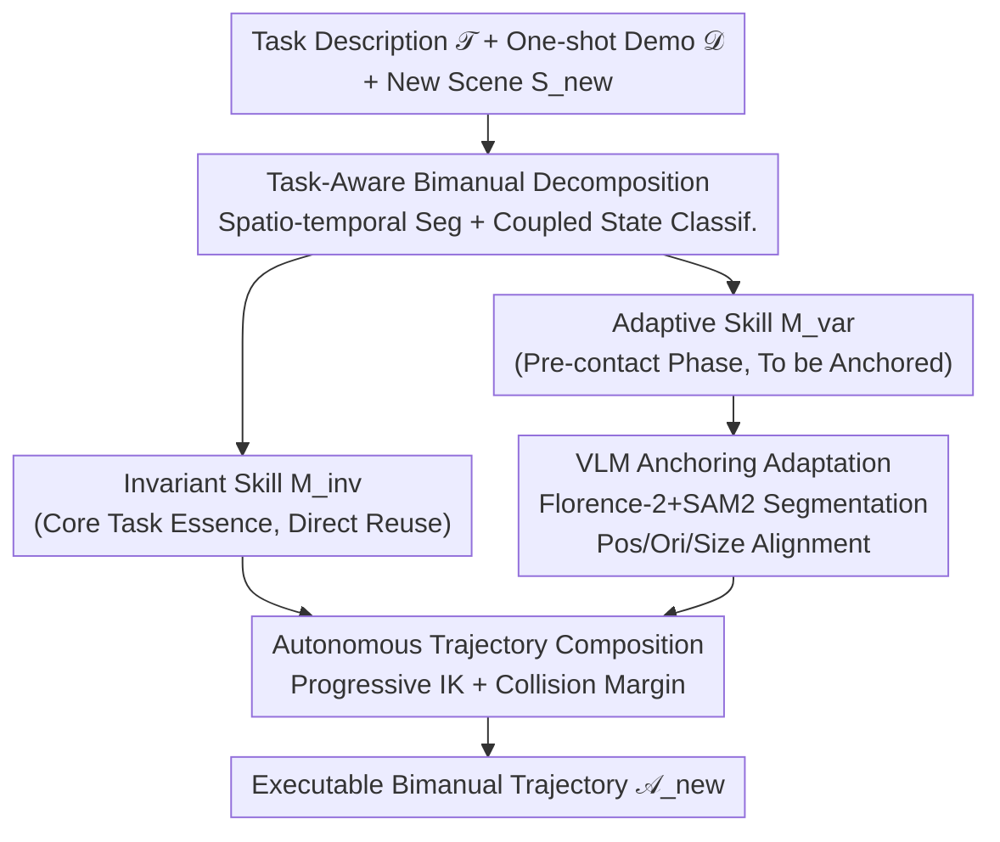

# VLBiMan: Vision-Language Anchored One-Shot Demonstration Enables Generalizable Bimanual Robotic Manipulation

**Conference**: ICLR 2026  
**arXiv**: [2509.21723](https://arxiv.org/abs/2509.21723)  
**Code**: [Project Page](https://hnuzhy.github.io/projects/VLBiMan)  
**Area**: Robotic Manipulation/Bimanual Manipulation  
**Keywords**: Bimanual Manipulation, One-Shot Demonstration, VLM Anchoring, Skill Decomposition, Cross-Embodiment Transfer

## TL;DR

The VLBiMan framework is proposed to decompose a single demonstration into invariant and adaptive atomic skills through task-aware bimanual decomposition. It utilizes VLM vision-language anchoring to adapt to object positions and instance variations in new scenes, combined with kinematic-aware trajectory composition for bimanual coordination. On 10 complex bimanual tasks, it achieves an 85.3% success rate with only 1 demonstration, significantly outperforming imitation learning baselines that require hundreds of demonstrations.

## Background & Motivation

**Background**: Bimanual robotic manipulation is a core challenge in embodied intelligence. Current mainstream Vision-Language-Action (VLA) models (e.g., ALOHA, $\pi_0$, RDT-1B) train "end-to-end" policies through large-scale teleoperation demonstrations, showing impressive performance on long-horizon tasks.

**Limitations of Prior Work**:
- VLA models require hundreds or thousands of teleoperation demonstrations. Bimanual teleoperation is more difficult than single-arm (14D action space), making data collection extremely costly.
- Adapting to new objects or tasks typically requires recollecting demonstrations and retraining, which is not scalable to open-world scenarios.
- Zero-shot methods (e.g., ReKep) rely on LLMs for task decomposition and prompt engineering, which are often fragile and unreliable.
- One-shot imitation learning has been explored for single arms, but bimanual coordination (synchronous/asynchronous) involves significantly higher complexity.

**Key Challenge**: Achieving the broadest generalization with minimal demonstrations requires identifying "what remains invariant" versus "what needs to adapt" in a manipulation task. The coordination constraints of bimanual tasks make this separation more difficult.

**Goal**: How to extract reusable bimanual manipulation skills from a single human demonstration and generalize them to new scenes (new positions, new object instances, new robot platforms)?

**Key Insight**: **"What matters more than How"**—Instead of imitating precise execution poses, the system captures and reproduces relative spatial relationships between objects. For example, in a pouring task, the critical factor is the relative position of the cup and bottle rather than the specific movement of the arms.

**Core Idea**: Decompose the demonstration into "invariant sub-skills" (directly reusable) and "adaptive sub-skills" (re-synthesized after VLM anchoring), enabling 1-shot demonstration $\rightarrow$ N-shot generalization.

## Method

### Overall Architecture

Given a task description $\mathcal{T}$ and a single demonstration $\mathcal{D} = \{(\mathcal{O}_t, \mathcal{A}_t)\}_{t=1}^T$, VLBiMan learns a mapping $\mathcal{F}_{\text{VLBiMan}}: (\mathcal{T}, \mathcal{D}, \mathcal{S}_{\text{new}}) \mapsto \{\widetilde{\mathcal{A}}_t^{\text{new}}\}_{t=1}^{T'}$ to migrate the demonstration to a new scene $\mathcal{S}_{\text{new}}$ and regenerate bimanual trajectories. The workflow consists of three stages: **Task-Aware Bimanual Decomposition**, which splits the demonstration into "invariant" and "adaptive" atomic skills; **VLM Anchoring Adaptation**, which uses Vision-Language Models to segment and locate objects in the new scene for geometric alignment of adaptive skills; and **Autonomous Trajectory Composition**, which uses kinematic solvers to merge skills into an executable bimanual trajectory.

### Key Designs

**1. Task-Aware Bimanual Decomposition: Separating "Task Essence" from "Scene Dependency"**

A single demonstration is difficult to generalize because it mixes scene-independent essential actions (e.g., "how to pour stably") with layout-dependent actions (e.g., "reaching for the bottle"). VLBiMan first performs spatio-temporal segmentation: detecting key poses based on motion dynamics (velocity discontinuities, acceleration spikes) and gripper state changes to segment the demo into time intervals $\tau_i = [t_i, t_{i+1}]$, with each segment corresponding to a motion primitive $\mathcal{M}_i$. Classification is then performed using object-robot coupling states—defining a binding indicator $\text{bind}(o, r, t)$. If a segment satisfies $\forall t \in \tau_i, \text{bind}(o_k, r, t) = 1$ and $\text{geometry}(o_k) \approx \text{geometry}(o_k^{\text{demo}})$ (object is securely held and geometry matches demo), it is labeled as an **Invariant Skill** $\mathcal{M}_i^{\text{inv}}$. Otherwise, it is an **Adaptive Skill** $\mathcal{M}_j^{\text{var}}$ for the pre-contact phase.

**2. VLM Anchoring Adaptation: Utilizing VLMs for Segmentation rather than Planning**

Instead of relying on heavy 6D pose estimation, VLBiMan uses VLMs to extract object category prompts from $\mathcal{T}$, which are fed into Florence-2 + SAM2 to obtain high-quality 2D semantic masks $\mathbf{M}_k^{\text{2D}}$. Three layers of geometric alignment are then performed: Position via 3D displacement $\Delta\mathbf{x} = \mathbf{p}^{\text{new}} - \mathbf{p}^{\text{demo}}$ of centroids; Orientation via the second-order image moments of the 2D mask to extract the principal axis $\Delta\theta = \angle(\mathbf{v}^{\text{new}}, \mathbf{v}^{\text{demo}})$; and Size via point cloud z-extent to estimate height differences $\Delta h_k$. This approach uses VLMs for "anchoring" (segmentation + localization) rather than "planning" (task decomposition), leveraging their robust perception while avoiding fragile LLM reasoning.

**3. Autonomous Trajectory Composition: Ensuring Kinematic Feasibility and Safety**

When merging skills, target poses for adaptive segments change, which may lead to unreachable IK solutions or collisions. VLBiMan employs progressive IK optimization: using spline interpolation to move the target pose from start to end, solving inverse kinematics frame-by-frame $\mathbf{q}^{(n+1)} = \text{IK}(\mathbf{T}_g^{(n)})$, where $\mathbf{T}_g^{(n)} = \text{SplineInterp}(\mathbf{T}_{\text{start}}, \mathbf{T}_{\text{goal}}, n)$. Additionally, safety margins are added during the approach phase $\tilde{\mathbf{x}}^{\text{goal}} = \mathbf{x}^{\text{goal}} + \delta_{\text{base}}\mathbf{u}_\| + \delta_z\mathbf{u}_z$ to prevent premature collisions.

## Key Experimental Results

### Main Results: Success Rate of 6 Basic Bimanual Tasks (25 trials/task)

| Method | plugpen | inserting | unscrew | pouring | pressing | reorient | Avg (Same Obj) | Avg (New Inst) |
|------|:---:|:---:|:---:|:---:|:---:|:---:|:---:|:---:|
| Mechanisms | 11/25 | 9/25 | 5/25 | 5/25 | 7/25 | 3/25 | 26.7% | 12.7% |
| MAGIC | 16/25 | 15/25 | 10/25 | 10/25 | 9/25 | 7/25 | 44.7% | 27.3% |
| ReKep | 14/25 | 11/25 | 10/25 | 12/25 | 10/25 | 8/25 | 43.3% | 29.3% |
| ReKep+ | 19/25 | 18/25 | 13/25 | 17/25 | 17/25 | 11/25 | 63.3% | 42.7% |
| **Ours** | **25/25** | **23/25** | **20/25** | **21/25** | **20/25** | **19/25** | **85.3%** | **78.0%** |

### Ablation Study (Avg SR under New Instance + Interference)

| VLM Type | Initial Grasp | IK Opt | Collision Avoid | Avg SR |
|------|:---:|:---:|:---:|:---:|
| SAM+DINOv2 | ours | ✓ | ✓ | 35.8% |
| ours | AnyGrasp | ✓ | ✓ | 31.7% |
| ours | ours | ✗ | ✓ | 29.2% |
| ours | ours | ✓ | ✗ | 34.2% |
| **Ours** | **Ours** | **✓** | **✓** | **59.2%** |

### Key Findings

- VLBiMan achieves 85.3% success rate with 1 demonstration, far exceeding imitation learning methods requiring 50-100+ demos.
- Perfect 25/25 success on the "plugpen" task demonstrates that invariant/adaptive separation + VLM anchoring is highly effective for fine-grained coordination.
- Generalization to new instances (78.0%) is only 7.3% lower than the same object (85.3%), proving strong category-level adaptation.
- Even with oracle initial grasps (ReKep+), VLBiMan maintains a lead, indicating its advantage lies in both perception and skill reuse strategy.
- Successful cross-embodiment transfer to humanoid bimanual robots shows the skill representation is sufficiently abstract.

## Highlights & Insights

- **Efficiency Revolution**: 100x reduction in data requirements compared to standard models, which is crucial for bimanual setups where teleoperation costs are 2-3x higher.
- **VLM as "Anchor" not "Planner"**: Assigning segmentation and localization to VLMs (where they excel) while avoiding LLM-based task decomposition (where they fail) ensures stability.
- **Invariant/Adaptive Separation Principle**: This principle is not limited to bimanual tasks and can be generalized to any manipulation framework as a universal skill reuse method.
- **Philosophical Shift**: Capturing the "What" (relative relationships) rather than the "How" (exact trajectories) compresses the task to a low-dimensional essence solvable by a single demo.

## Limitations & Future Work

- Currently handles only rigid objects; deformable objects (cloth, rope) require different representations.
- Lacks runtime anomaly detection and recovery, making it sensitive to slips or occlusions.
- Fixed-base bimanual platforms limit reachable space; future work could extend to mobile bases and force/tactile feedback.
- Skill decomposition and anchor point selection still occasionally require human-in-the-loop oversight.

## Related Work & Insights

- **vs ALOHA/$\pi_0$ (End-to-End VLA)**: These require massive demos and retraining; VLBiMan requires 1-shot with no retraining. VLA may be more robust in extreme diversity but is data-inefficient.
- **vs ReKep (Zero-shot)**: VLBiMan is more reliable by extracting task structure from a demonstration rather than relying solely on LLM prompts.
- **vs Mechanisms/MAGIC (One-shot Single-arm)**: These show poor performance on bimanual tasks (26.7%/44.7%), highlighting that bimanual coordination is a unique challenge requiring specialized decomposition.

## Rating

⭐⭐⭐⭐⭐ (5/5)

**Overall Evaluation**: Achieving 85.3% success with 1 demonstration marks a breakthrough in the balance between efficiency and generalization for bimanual manipulation. The design principle of invariant/adaptive separation is methodologically significant, and the extensive real-robot validation proves its practical value.

<!-- RELATED:START -->

## Related Papers

- [\[ICLR 2026\] TwinVLA: Data-Efficient Bimanual Manipulation with Twin Single-Arm Vision-Language-Action Models](twinvla_data-efficient_bimanual_manipulation_with_twin_single-arm_vision-languag.md)
- [\[AAAI 2026\] ManiLong-Shot: Interaction-Aware One-Shot Imitation Learning for Long-Horizon Manipulation](../../AAAI2026/robotics/manilong-shot_interaction-aware_one-shot_imitation_learning_for_long-horizon_man.md)
- [\[ICLR 2026\] One Demo Is All It Takes: Planning Domain Derivation with LLMs from A Single Demonstration](one_demo_is_all_it_takes_planning_domain_derivation_with_llms_from_a_single_demo.md)
- [\[ICLR 2026\] MemoryVLA: Perceptual-Cognitive Memory in Vision-Language-Action Models for Robotic Manipulation](memoryvla_perceptual-cognitive_memory_in_vision-language-action_models_for_robot.md)
- [\[ICLR 2026\] VITA: Zero-Shot Value Functions via Test-Time Adaptation of Vision–Language Models](vita_zero-shot_value_functions_via_test-time_adaptation_of_visionlanguage_models.md)

<!-- RELATED:END -->
