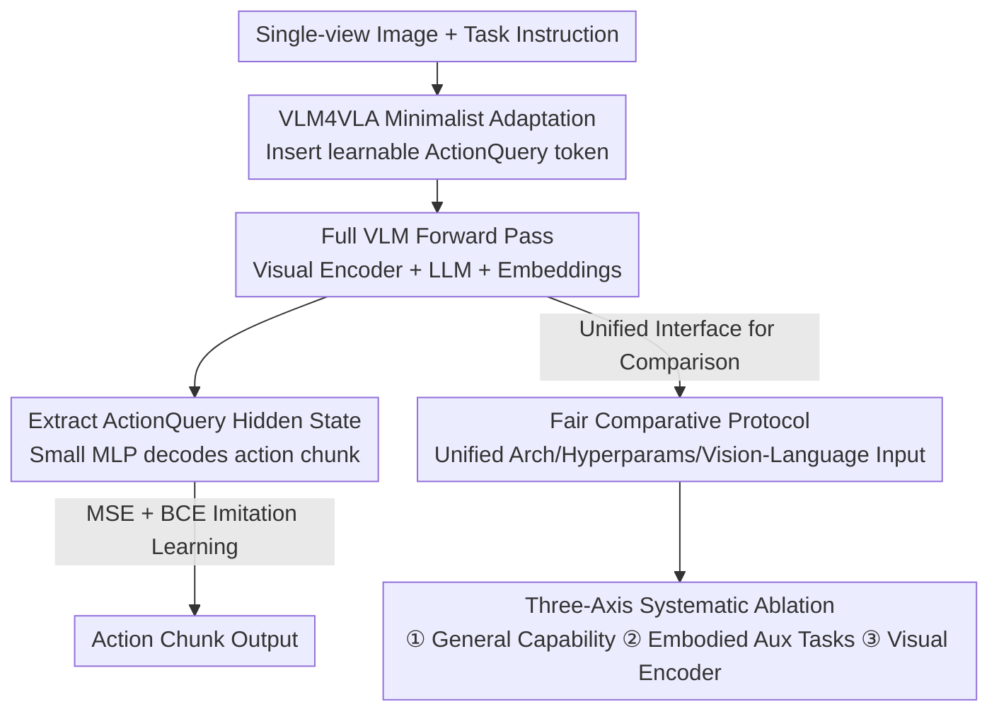

# VLM4VLA: Revisiting Vision-Language-Models in Vision-Language-Action Models

**Conference**: ICLR 2026  
**OpenReview**: [https://openreview.net/forum?id=tc2UsBeODW](https://openreview.net/forum?id=tc2UsBeODW)  
**Project Page**: [https://cladernyjorn.github.io/VLM4VLA.github.io](https://cladernyjorn.github.io/VLM4VLA.github.io)  
**Area**: Robotics / Embodied AI / Multimodal VLM  
**Keywords**: VLA, VLM Backbone, Embodied Control, Visual Encoder, Empirical Study

## TL;DR
This paper establishes a minimalist adaptation pipeline (VLM4VLA) that adds $<1\%$ parameters to fairly convert 17 general VLMs into VLA policies. It systematically investigates whether "VLM strength determines VLA performance," concluding that while VLM pre-training is necessary, neither general capabilities nor specialized embodied capabilities reliably predict downstream control performance; the true bottleneck lies in the visual encoder.

## Background & Motivation
**Background**: VLA (Vision-Language-Action) models utilize pre-trained large VLMs as policy backbones, leveraging their vision-language knowledge to enhance the generalization of robotic policies. This has become a mainstream route in embodied AI. Representative works like RT-2 and OpenVLA discretize actions into language tokens, while subsequent works shift toward using policy heads to decode continuous actions, evolving into a hierarchical structure of "VLM + Action Expert."

**Limitations of Prior Work**: Most VLA research focuses on developing complex policy networks (advanced architectures, additional training paradigms, or sophisticated action decoding). However, few have systematically answered the fundamental question: **How exactly do the choice and specific capabilities of the underlying VLM affect VLA policy performance?** The only related study, RoboVLMs, compared several early VLM backbones, but inconsistent implementations prevented a fair comparison.

**Key Challenge**: The community implicitly assumes that "stronger VLMs lead to better VLAs" and continually fine-tunes VLMs with embodied tasks or increases visual capabilities. This hypothesis has never been cleanly validated because different VLA works use varying policy heads, training paradigms, and input modalities, contaminating the VLM backbone's contribution with extraneous variables. It is difficult to distinguish whether improvements stem from a better VLM or fancy policy design.

**Goal**: Establish a fair testing interface that isolates "VLM backbone" as the single variable, then answer how general capability, specialized embodied capability, and visual encoders translate into downstream control performance across three dimensions.

**Key Insight**: The authors argue that the intrinsic capabilities of a VLM can only be purely measured by making the policy head "minimalist and unified" and removing shortcuts like proprioception that allow models to bypass the VLM. Thus, they take the opposite approach: instead of complicating the policy network, they develop the "least intrusive adaptation method."

**Core Idea**: Utilize a minimalist adaptation pipeline (VLM4VLA) with $<1\%$ new parameters, MLP decoding, and MSE supervision as a unified interface. By benchmarking 17 VLMs across three benchmarks, they empirically map the relationship from "VLM Capability $\to$ VLA Performance."

## Method

### Overall Architecture
The "Method" consists of two parts: a **minimalist adaptation network** (converting any VLM to VLA) and a **three-axis comparative research protocol** (using this network for fair ablation). The network design is extremely restrained: a learnable `<ActionQuery>` token is inserted at the end of the VLM's input sequence. The VLM performs a standard forward pass, the final hidden state of this token is extracted, and a small MLP decodes it into an action chunk. Only $<1\%$ of parameters are added. The entire VLM (visual encoder + LLM + word embeddings) and the MLP are fully fine-tuned using maximum likelihood imitation learning (MSE + BCE), deliberately avoiding diffusion or flow-matching losses.

With this unified interface, the study conducts comparisons along three axes: ① Testing general capabilities by switching VLM backbones; ② Converting a VLM (Qwen2.5-VL) into a VLA after fine-tuning it with various embodied auxiliary tasks; ③ Comparing frozen vs. fine-tuned visual encoders. A from-scratch random initialization serves as a lower bound.

### Key Designs

**1. VLM4VLA Minimalist Adaptation Pipeline: Converting any VLM to VLA with <1% New Parameters without confounding variables**

To fairly compare VLM backbones, the "policy head" must contribute as little capability as possible. The authors add only one learnable `<ActionQuery>` token and a small MLP head. The input sequence follows the native instruction format of each VLM: `[...<text>...<text><ActionQuery>]`. After the forward pass, the action is decoded:

$$\text{action} = \text{MLP}\big(\text{VLM}([\langle img\rangle\ldots\langle text\rangle\ldots\langle ActionQuery\rangle])\big)$$

Crucially, **diffusion and flow-matching losses are avoided**. Preliminary experiments indicated these losses introduce significant randomness during inference, require more rollouts for accurate evaluation, and exhibit high performance volatility between checkpoints, hindering fair comparison. Instead, maximum likelihood imitation learning is used: MSE for the relative position of the end-effector $a_{pos}$ and BCE for the discrete gripper state $a_{end}$:

$$L = \frac{1}{|B|}\sum_B \big(\lVert a_{pos}-\hat a_{pos}\rVert_2^2 + \text{BCE}(a_{end},\hat a_{end})\big)$$

Despite its simplicity, VLM4VLA performs on par with complex designs like pi0's flow-matching action expert on benchmarks like Calvin, proving it is a clean yet powerful testing base.

**2. Fair Protocol Isolating Intrinsic VLM Capabilities: Unified Architecture, Hyperparameters, and Vision-Language Input**

A minimalist network is insufficient; the experiments must be reproducible. The authors use **identical** model configurations and training/testing settings for all 17 VLMs: images are standardized to $224\times224$, only the current single-view frame is used, and **proprioception state is excluded** (to prevent the model from learning actions directly from state). Learning rate sweeps were performed to select a unified set of hyperparameters ensuring convergence. Consequently, differences in downstream performance can be attributed solely to the VLM backbone. This protocol is the prerequisite for the credibility of the study's conclusions.

**3. Three-Axis Comparative Study: General Capability / Embodied Auxiliary Tasks / Visual Encoder, plus From-Scratch Baseline**

The authors decompose "how VLM capability translates to control" into three independently manipulatable axes. **General Capability Axis**: 7 open-source VLMs (Paligemma series, QwenVL series, InternVL3.5, Kosmos-2, 1B–10B) are converted to test the correlation between general VQA and control. **Embodied Auxiliary Task Axis**: Using Qwen2.5-VL as the fixed backbone, it is fine-tuned with 7 types of embodied SFT tasks (Robopoint, Vica-332k spatial understanding, Robo2vlm action VQA, etc.) before conversion to VLA. **Visual Encoder Axis**: Comparisons of freezing vs. fine-tuning the visual encoder for three VLMs. Finally, a random from-scratch initialization serves as the lower bound to determine if generalization stems from architecture or VLM pre-training.

### Loss & Training
The training objective is the imitation learning loss described in Design 1: $L = \text{MSE}(a_{pos}) + \text{BCE}(a_{end})$. All parameters (visual encoder, embeddings, LLM, MLP head) are fine-tuned. The authors explicitly state that freezing any part leads to significant performance degradation. Models were trained for 30k steps on Calvin ABC-D, and 50k steps on SimplerEnv-Bridge and Libero-Long. During testing, executing full action chunks, half chunks, and single steps was attempted, with the best results reported.

## Key Experimental Results

### Main Results
On Calvin ABC-D (average tasks completed, max 5), the QwenVL and InternVL series led significantly. Qwen2.5VL-7B reached 4.057, approaching SOTA expert VLAs. The performance of pi0 (based on Paligemma-1) was nearly identical to the base Paligemma-1, suggesting its action expert was bottlenecked by the backbone.

| Model (VLM Backbone) | Params | Calvin ABC-D↑ | Simpler-Bridge↑ | Libero-10↑ |
|------|------|------|------|------|
| OpenVLA* (Llama-2, Discrete) | 7.7B | 2.548 | 4.2 | 53.7 |
| pi0* (Paligemma-1, Flow Matching) | 3.1B | 3.509 | 60.4 | 46.0 |
| Qwen2.5VL-7B (Ours) | 8.3B | **4.057** | 46.9 | 45.0 |
| InternVL3.5-4B (Ours) | 4.7B | 3.977 | 57.3 | 62.8 |
| Paligemma-2 (Ours) | 3.0B | 3.406 | 57.3 | 46.2 |
| **KosMos-2** (Ours, Smallest) | 1.7B | 3.096 | **60.4** | 55.0 |

> Counter-intuitive finding: **The smallest model, KosMos-2, achieved the highest success rate on Simpler-Bridge (60.4)** and outperformed most large models on Libero-10. Linear regression shows that general VQA ability only correlates with VLA performance on Calvin; on Simpler/Libero, the correlation is nearly zero—general capability is a poor predictor of control.

### Ablation Study
**Freezing the visual encoder** (Design 3) had the most drastic impact, providing the strongest signal in the paper:

| Configuration | Calvin ABC-D↑ | Simpler-Bridge↑ |
|------|------|------|
| Qwen2.5VL-3B (Full FT) | 3.856 | 48.00 |
| + Frozen Visual Encoder | 2.855 (**-1.001**) | 23.95 (**-24.05**) |
| Qwen2.5VL-7B (Full FT) | 4.057 | 46.75 |
| + Frozen Visual Encoder | 2.823 (**-1.234**) | 25.50 (-21.25) |
| Paligemma-1 (Full FT) | 3.506 | 55.25 |
| + Frozen Visual Encoder | 0.495 (**-3.011**) | 13.25 (**-42.00**) |

> Note: A frozen Qwen2.5VL-7B (with 7.6B trainable params) is significantly inferior to the fully fine-tuned version and even loses to the fully fine-tuned Qwen2.5VL-3B (3.8B). This indicates that fine-tuning the visual module is more critical than simply scaling LLM parameters.

**From-scratch lower bounds** (Design 3) confirm pre-training is indispensable: training Qwen2.5VL-3B from zero results in Calvin 1.381 (-2.475) and Simpler 15.75 (-32.25).

**Embodied auxiliary tasks** (Design 3) were largely unsuccessful: VLMs fine-tuned on 7 types of SFT tasks **generally performed worse than the original baseline**. Most showed slight degradation and significantly increased variance.

### Key Findings
- **Visual Encoder is the Prime Bottleneck**: Freezing it causes a performance cliff (Paligemma-1 dropped 42 points on Simpler). Its impact outweighs increasing trainable parameters in the LLM. The authors hypothesize that pre-trained visual encoders are not aligned with the visual domains of embodied scenes.
- **General Capability is a Poor Predictor**: Kosmos-2 (the smallest) outperformed Qwen-2.5VL/Paligemma in multiple scenarios. Strong VQA $\neq$ Strong Control. Standard VLM capability is "necessary but not sufficient" for effective control.
- **Embodied SFT Does Not Transfer**: Deliberately improving VLM skills like pointing, spatial understanding, or depth estimation does not guarantee better downstream control and often increases variance. This challenges the consensus that "feeding embodied tasks to VLMs creates better VLA backbones."

## Highlights & Insights
- **The Philosophy of "Addition by Subtraction"**: Instead of developing complex policy heads, the authors squeezed the head to $<1\%$ parameters and removed proprioception to obtain a clean testing interface. This approach of "minimalism for fairness" is a notable methodology.
- **Interconnected Counter-intuitive Conclusions**: General capability doesn't predict $\to$ Embodied SFT doesn't transfer $\to$ The true bottleneck is the visual encoder. All three axes point to a single judgment: a persistent domain gap exists between current VLM pre-training objectives and the requirements of embodied action planning.
- **Transferable Trick**: Using a learnable query token to extract backbone knowledge + a small MLP decoder is a lightweight paradigm for quickly adapting any pre-trained large model to new tasks without contaminating the backbone capability comparison.

## Limitations & Future Work
- **Lack of Real-robot Experiments**: For reproducibility and efficiency, the study was conducted entirely in simulation (Calvin/SimplerEnv/Libero). Whether these conclusions transfer to physical robots remains unverified.
- **Minimalist Strategy Head as a Double-edged Sword**: While beneficial for fair comparison, these conclusions were reached under "deliberately weakened policy" settings. It remains unknown if the relationship between VLM capability and control changes with multi-view inputs or stronger policy heads.
- **Unexplained Mechanisms**: The authors state that the mechanism driving this gap remains an open question. They identified the visual encoder as the bottleneck but did not provide a definitive solution for modifying VLM pre-training.

## Related Work & Insights
- **vs. RoboVLMs**: While both aim to compare VLM backbones, RoboVLMs suffered from implementation inconsistencies. Ours uses a unified minimalist interface and unified hyperparameters to provide credible, fair results.
- **vs. pi0 / OpenVLA**: These works focus on flow-matching or discrete decoding. This study proves a minimalist MLP head can match pi0, suggesting policy-side complexity is often bottlenecked by the VLM backbone.
- **vs. Robobrain2 / Robo2vlm**: These assume embodied tasks lead to better VLA backbones. Ours empirically finds that this transmission chain does not hold for end-to-end control.

## Rating
- Novelty: ⭐⭐⭐⭐ Not a new method but a new perspective, providing the first clean, systematic measurement of the "VLM $\to$ VLA" relationship.
- Experimental Thoroughness: ⭐⭐⭐⭐⭐ 17 VLMs $\times$ 3 benchmarks $\times$ three-axis ablation + from-scratch bounds.
- Writing Quality: ⭐⭐⭐⭐ Clear motivation, counter-intuitive conclusions, and logically structured.
- Value: ⭐⭐⭐⭐⭐ Precisely identifies the visual encoder bottleneck and challenges community consensus, providing directional guidance for the VLA community.

<!-- RELATED:START -->

## Related Papers

- [\[ICLR 2026\] Verifier-Free Test-Time Sampling for Vision-Language-Action Models](verifier-free_test-time_sampling_for_vision-language-action_models.md)
- [\[ICLR 2026\] WMPO: World Model-based Policy Optimization for Vision-Language-Action Models](wmpo_world_model-based_policy_optimization_for_vision-language-action_models.md)
- [\[ICLR 2026\] Hybrid Training for Vision-Language-Action Models](hybrid_training_for_vision-language-action_models.md)
- [\[ICLR 2026\] MemoryVLA: Perceptual-Cognitive Memory in Vision-Language-Action Models for Robotic Manipulation](memoryvla_perceptual-cognitive_memory_in_vision-language-action_models_for_robot.md)
- [\[ICLR 2026\] TwinVLA: Data-Efficient Bimanual Manipulation with Twin Single-Arm Vision-Language-Action Models](twinvla_data-efficient_bimanual_manipulation_with_twin_single-arm_vision-languag.md)

<!-- RELATED:END -->
