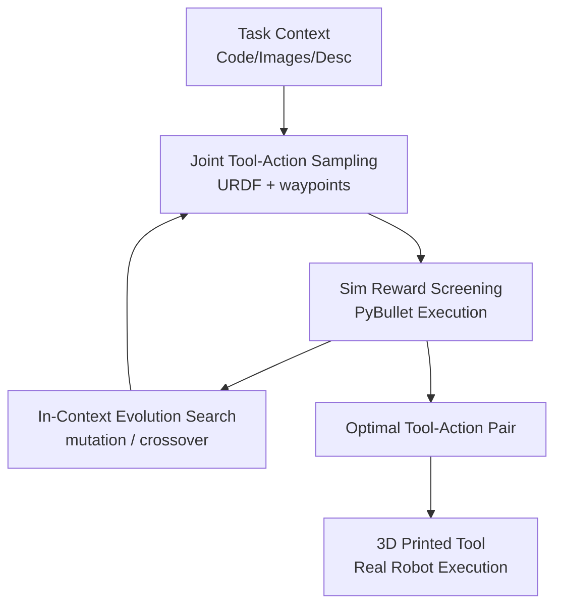

# VLMgineer: Vision-Language Models as Robotic Toolsmiths

**Conference**: ICLR 2026  
**OpenReview**: [https://openreview.net/forum?id=nESyz4PvJL](https://openreview.net/forum?id=nESyz4PvJL)  
**Paper**: [Project Website](https://vlmgineer.github.io/)  
**Code**: To be released  
**Area**: Robotics / VLM Tool Design  
**Keywords**: Robotic Tool Design, VLM, Evolutionary Search, Tool-Action Co-design, sim-to-real  

## TL;DR
VLMgineer integrates the vision-language understanding, code generation, and commonsense priors of VLMs into an evolutionary search loop to automatically co-design URDF tools and discrete action trajectories for robotic tasks. It demonstrates superior task completion capabilities over human prompts, naive sampling, and off-the-shelf tools across 12 tool-use tasks, evolutionary ablations, and real-world Franka robot validations.

## Background & Motivation
**Background**: Research on robotic tool use typically assumes the tool already exists, focusing on learning grasping, trajectories, dynamics models, or affordances. Another category, morphology-control co-optimization, designs grippers, end-effectors, or soft robot forms, but often requires humans to pre-define parameterized design spaces, task templates, or optimizable geometric variables.

**Limitations of Prior Work**: Both approaches strictly limit "what a tool looks like." Tool-use methods that only select existing tools cannot handle tasks where no suitable tool is available. Morphology optimization methods that rely on human-written parameterized templates are difficult to transfer to new everyday scenarios. Specifically, for tasks like reaching distant cupcakes, scattered balls on a table, or objects on high shelves, the difficulty lies not in high-precision control, but in whether a tool exists that can simplify the physical interaction.

**Key Challenge**: Tool geometry and action strategies are coupled. A curved pusher allows a puck to be moved with a simple single-axis nudge; a bucket with side baffles prevents balls from scattering. conversely, if the tool is a simple straight rod, the control strategy must be finer, more precise, and more fragile. Existing works often decouple tool design from action optimization or only optimize a few parameters within human-given templates, making it difficult to find solutions in open shape spaces that "save control effort through geometry."

**Goal**: The authors aim to verify a radical question: whether existing VLMs possess sufficient physical commonsense, visual understanding, code generation, and creativity to automatically invent robot-usable tools and provide corresponding action sequences starting from environment code, images, and task descriptions.

**Key Insight**: Instead of using a VLM as a one-off designer, it is placed within a loop similar to a genetic algorithm. The initial population is generated by the VLM. Candidate tool-action pairs are evaluated in PyBullet according to task rewards; high-performing designs then serve as context for the VLM to perform mutation and crossover. This preserves the VLM's open-ended generative capacity while pinning its imagination to task performance via physical simulation rewards.

**Core Idea**: Generate URDF tools and end-effector waypoints using VLMs, then iteratively screen, mutate, and crossover through simulation-reward-driven evolutionary search. This shifts the difficulty of robotic tasks from complex control to smarter tool geometry.

## Method
### Overall Architecture
The input to VLMgineer is not a human-designed template but unedited environment source code, screenshots, text descriptions, and task instructions. The system prompts the VLM to generate paired tool designs and action plans: tools are represented by URDF modules, and actions are discrete end-effector waypoint sequences. After each candidate is executed in PyBullet, it is evaluated using a task-specific normalized reward, and the top-k high-scoring candidates are used as context for the next generation.

The process can be viewed as a closed loop where "VLM proposes open designs, simulation provides physical feedback, and the VLM evolves based on elite samples." The key is not just asking the VLM to draw a tool, but requiring it to specify both geometry and action in a single candidate, subjecting the geometry-action combination to the selective pressure of task rewards.

Algorithmically, VLMgineer samples $K$ candidate designs $D_1,\dots,D_K$ in each evolutionary cycle. Using the task reward function $F$ to obtain $s_i=F(D_i)$, the system retains candidates that score highest and exceed a threshold, concatenating these elite candidates into the evolution prompt. Finally, the tool-action pair with the highest $F(D)$ across all rounds is returned.

### Key Designs
**1. Joint Tool-Action Sampling: Letting the VLM decide both "what tool to make" and "how to move it"**

Many morphology optimization works fix the tool or morphology first and then adapt the controller. VLMgineer emphasizes that tools and actions should be generated in pairs during the same VLM inference. Specifically, each design agent generates $n_{tool}$ tools and $n_{action}$ sets of actions for each tool; thus, one query yields $n_{agent}\times n_{tool}\times n_{action}$ tool-action candidates. Actions are not complex closed-loop policies but end-effector waypoints: $N\times 6$ (position and Euler angles) without a gripper, or $N\times 7$ with a gripper including binary open/close commands.

The value of this design lies in searching for "tool shape" and "action feasibility" within the same semantic space. For instance, a bucket with guards naturally corresponds to actions like "plunge from the bottom, lift, maintain lateral constraints." An intentional use of discrete waypoints proves that clever tools can reduce control complexity rather than relying on complex policies to brute-force the problem.

**2. URDF Tool Representation: Constraining open shape spaces with structured code**

Tools must be open enough for the VLM to invent unconventional geometries, but they must also be directly simulatable, attachable to a Franka end-effector, and printable/manufacturable. The paper chooses URDF for representation, further limiting tools to rigid modules composed of 3D rectangular components. For the VLM, URDF is a code block suitable for generation and modification; for simulation, it can be integrated into the robot model and attached to links like `panda_virtual` or `panda_leftfinger`.

This choice sacrifices some geometric expressiveness for a robust engineering loop. The VLM output is an executable, evaluable, structured design. Constraints such as direct component connection, light weight, and attachment to specific end-links make generated tools more likely to pass IK and collision checks.

**3. Simulation Reward Filtering: Verifying VLM creativity through physical performance**

VLM open-generation often produces designs that seem clever but are physically ineffective. VLMgineer does not let the model judge its own outputs; instead, it executes each pair in a PyBullet environment. Each ROBOTOOLBENCH task has a normalized reward $R:S\rightarrow r\in[0,1]$ measuring the distance from the goal state $S$: e.g., BringCube measures the cube's distance to the target; GatherSpheres measures how many balls are collected and lifted.

This reward is used for black-box selection rather than training an RL policy. The system identifies which candidates are effective under physical dynamics and saves the top-k samples that exceed the `rewardsave` threshold. Since evaluation is per tool-action pair, elite candidates contain information on both "why the geometry is good" and "how the action uses it."

**4. In-Context Evolution Search: Amplifying physical creativity via mutation and crossover**

A key finding is that a single VLM sampling round is insufficient, and greedy refinement of a single sample tends to get stuck. VLMgineer borrows from genetic algorithms, using elite tools from the previous round as context and asking the VLM to perform two operations: mutation (changing dimensions, position, orientation, or adding/deleting components) and crossover (combining components from two tools).

This step does not use hard-coded geometric mutation operators but lets the VLM propose free-form mutations based on elite samples and task semantics. For example, in GatherSpheres, evolution might turn an open scoop into a structure with lateral guards and a top bar to prevent escape. The reward determines the direction, and the VLM proposes semantically reasonable modifications.

### Loss & Training
VLMgineer does not train a new model or use backpropagation for tool parameters. Its "optimization objective" is the normalized reward in the environment. For a candidate $D$, the score is $F(D)$, and the system selects $D^*=\arg\max_D F(D)$. Each round involves sampling, simulation evaluation, and selection of a winner set (top-k and above `rewardsave` threshold), which is then fed into the next round's prompt to guide mutation and crossover.

Gemini-2.5-pro-preview-03-25 is used. Hyperparameters vary: most tasks use 20 parallel agents, 10 tools per agent, 10 actions per tool, and 3 evolution rounds. PyBullet is used for evaluation, taking about 30 minutes per task run.

## Key Experimental Results
### Main Results
ROBOTOOLBENCH was constructed with 12 tasks: BringCube, CleanTable, DislodgeCube, ElevatePlate, GatherSpheres, HighObject, LiftBox, MoveBall, OneBook, ScoreGoal, SnatchCookie, and TurkeyLegs. Comparisons were made against the default Franka gripper, human prompts (expert/user), RLBench tools, and VLMgineer.

| Baselines | Evaluation | Findings | Meaning |
|-----------|------------|----------|---------|
| Franka Gripper | 12 tasks | Most tasks fail or have low rewards | These tasks require custom tools beyond the original gripper. |
| Human Prompts | 3 types | VLMgineer outperforms humans in all tasks, avg. normalized Gain: 64.7% | One-off human specs are less stable than simulation-driven evolution. |
| RLBench Tools | 4 adapted tasks | VLMgineer Gain: 24.3% | Human-made tools are usable but not optimal for specific rewards/scenarios. |
| VLMgineer | 12 tasks | Stable average and top rewards | Co-evolving geometry and actions reduces control difficulty. |

Qualitatively, VLMgineer's tools prioritize simplifying interaction over mimicking human tools. BringCube uses cages for lateral constraint; ScoreGoal uses curved tools to reduce path complexity; GatherSpheres uses scoped buckets to trap balls.

### Ablation Study
| Config | Task / Metric | Result | Description |
|------|-------------|------|------|
| VLMgineer Evolution | Avg Reward (multi-task) | 0.938 | 4 rounds, 8000 samples; significantly better than naive sampling. |
| VLM Sampling Baseline | Avg Reward | 0.428 | Massive sampling without evolution; 119.2% lower relative gain. |
| w/o image feedback | Avg Reward | 0.55 | Scalar reward feedback only. |
| w. image feedback | Avg Reward | 0.52 | Adding the final frame decreased reward by 5.4%; visual nuance introduced noise. |
| Evolutionary | Avg Reward | 0.55 | Population-based mutation/crossover. |
| Iterative Refinement | Avg Reward | 0.28 | Single-sample iterative refinement gets stuck in local optima. |

| Model | Average Reward | Top Reward | Description |
|------|----------------|------------|------|
| Gemini-2.5-pro | 0.6054 | 0.8222 | Strongest model in cross-model comparisons. |
| GPT-o3 | 0.3775 | 0.5436 | Significantly lags behind Gemini-2.5-pro. |
| Gemini-2.5-flash | 0.3393 | 0.4481 | Moderate performance. |
| Gemini-2.0-flash | 0.0686 | 0.0796 | Insufficient capability for this task. |

### Key Findings
- Evolutionary search is the core source of gain. Under the same budget, structured evolution significantly outperforms brute-force sampling.
- Image feedback is not naturally beneficial. VLM's judgment of fine physical progress or contact quality currently introduces noise.
- Real-world robot validation across MoveBall, ElevatePlate, and GatherSpheres tasks showed normalized rewards of 0.959, 0.761, and 0.713, demonstrating sim-to-real transferability for static, reproducible scenarios.
- VLM capability is critical. Gemini-2.5-pro outperformed others, suggesting the task requires a mix of visual understanding, code generation, and spatial reasoning.

## Highlights & Insights
- VLMgineer translates VLM "creativity" from the linguistic level to physical robotic geometry. It requires executable URDFs rather than just descriptions.
- Tool-action co-design is highly practical. Task failures are often due to ill-suited end-effector forms rather than poor controllers. Optimized geometry can simplify actions.
- Evolutionary prompting is a reusable technique. Letting the model perform semantic mutations in-context based on elite samples is an effective design strategy.
- ROBOTOOLBENCH forces methods to handle the coupling of shape, contact, action, and reward, rather than treating manipulation as a pure control problem.

## Limitations & Future Work
- Discrete waypoints are suited for quasi-static tasks (push, pull, lift) but struggle with high-speed dynamics, force control, or real-time feedback.
- URDF rigid modules have limited expressiveness. They cannot represent articulated tools, flexible materials, or complex curved surfaces.
- The system assumes access to environment code, descriptions, and reward functions. It has not yet solved the end-to-end pipeline from real-world perception to automated reward definition.
- Sim-to-real was validated on relatively clean tasks. Dynamic, cluttered, or long-horizon real-world scenarios remain a challenge.
- The cost of optimizing a new tool for every task is high; future work could balance selecting, tuning, and inventing tools.

## Related Work & Insights
- **vs. Learning for Tool Use**: Conventional methods learn affordances or trajectories for existing tools. VLMgineer invents the tools from scratch.
- **vs. Morphology-Control Co-design**: Traditional co-design uses human-defined parameter spaces. VLMgineer uses VLMs to generate structured URDFs, expanding the design space to free compositional geometry.
- **vs. LLM/VLM for Robotic Design**: While other works focus on morphology or locomotion, VLMgineer targets manipulation tools and actions in everyday contexts.
- **vs. Eureka / Language-to-Reward**: While Eureka evolves reward functions, VLMgineer evolves physical tools and trajectories. The insight remains: use models for proposal and simulation for evaluation.

## Rating
- Novelty: ⭐⭐⭐⭐⭐ Establishes a closed loop for automatic tool invention using VLM and evolutionary search.
- Experimental Thoroughness: ⭐⭐⭐⭐☆ Extensive simulation tasks and ablations, though real-world coverage is limited.
- Writing Quality: ⭐⭐⭐⭐☆ Clear logic, though some main figures are less direct than tables.
- Value: ⭐⭐⭐⭐⭐ Demonstrates that "intelligent robotics" involves physical geometry invention as much as control policies.

<!-- RELATED:START -->

## Related Papers

- [\[ICLR 2026\] VLM4VLA: Revisiting Vision-Language-Models in Vision-Language-Action Models](vlm4vla_revisiting_vision-language-models_in_vision-language-action_models.md)
- [\[ICLR 2026\] MemoryVLA: Perceptual-Cognitive Memory in Vision-Language-Action Models for Robotic Manipulation](memoryvla_perceptual-cognitive_memory_in_vision-language-action_models_for_robot.md)
- [\[ICLR 2026\] Hybrid Training for Vision-Language-Action Models](hybrid_training_for_vision-language-action_models.md)
- [\[ICLR 2026\] Self-Refining Vision Language Model for Robotic Failure Detection and Reasoning](self-refining_vision_language_model_for_robotic_failure_detection_and_reasoning.md)
- [\[ICLR 2026\] Policy Contrastive Decoding for Robotic Foundation Models](policy_contrastive_decoding_for_robotic_foundation_models.md)

<!-- RELATED:END -->
