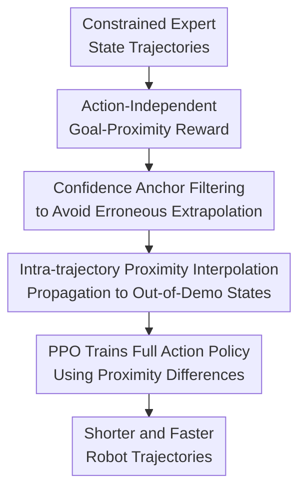

# When a Robot is More Capable than a Human: Learning from Constrained Demonstrators

**Conference**: ICLR 2026  
**OpenReview**: [https://openreview.net/forum?id=BvirMuKWV1](https://openreview.net/forum?id=BvirMuKWV1)  
**Paper**: [Project Page](https://sites.google.com/view/constrainedexpert)  
**Code**: supplementary material  
**Area**: Robot Imitation Learning / Learning from Constrained Demonstrations  
**Keywords**: Constrained Demonstrations, Imitation Learning, Inverse Reinforcement Learning, Goal-Proximity Reward, Robot Manipulation  

## TL;DR

This paper defines the Learning from Constrained Demonstrations (LfCD) problem and proposes LfCD-GRIP to learn state-only goal-proximity rewards from constrained human demonstrations. By using confidence anchors and trajectory interpolation to propagate rewards to states outside the demonstrations, it enables the robot to leverage its larger action space to generate shorter and faster trajectories than the demonstrator.

## Background & Motivation

**Background**: Robot learning from demonstrations (LfD) typically assumes that "expert demonstrations" are the targets for imitation. Behavior Cloning (BC) fits state-to-action mappings directly, GAIL-style methods match state-action distributions, and observation-based methods match state transition distributions. These are natural when expert data contains near-optimal behavioral patterns.

**Limitations of Prior Work**: Experts are often limited by interfaces rather than capability. For example, a 6-DoF arm controlled via a mode-switching joystick forces a human to move a single axis at a time. While the human reaches the goal, the trajectories are slow and segmented. If a robot copies these motions, it inherits the interface limitations of the human.

**Key Challenge**: The paper emphasizes that "the expert goal is correct, but the available action space is smaller than the robot's." Formally, the expert uses a constrained action set $A_e(s) \subseteq A$. The optimal robot policy may never appear in demonstrations, making it unrecoverable through standard cloning or distribution matching.

**Goal**: The authors address three sub-problems: 1) Reward learning must not be tied to expert actions. 2) The system must identify which reward estimates for unvisited states are reliable. 3) A generalizable progress signal must be provided for states outside demonstrations that lead to shortcuts.

**Key Insight**: For goal-reaching tasks, progress can be described by "state proximity to the goal." Even slow demonstrations provide a sequence of states approaching the goal. Extending this signal to new states allows the robot to find shortcuts the demonstrator could not perform.

**Core Idea**: Learn an action-independent goal-proximity reward from constrained demonstrations, then use high-confidence states as anchors for temporal interpolation along the robot's own trajectories to propagate rewards beyond demonstration paths.

## Method

### Overall Architecture

LfCD-GRIP takes constrained expert state trajectories $D_e$ and outputs a robot policy $\pi_\theta$ trained via Reinforcement Learning. It pre-trains a goal-proximity function $f_\phi(s)$ using the temporal order of demonstrations. During online training, the robot samples trajectories, uses Monte Carlo Dropout to identify reliable predictions, finds high-confidence endpoints, and interpolates progress for intermediate states. The policy is trained using the proximity gain $f_\phi(s_{t+1}) - f_\phi(s_t)$ as a reward.

The Mechanism decouples goal intent from expert actions. LfCD-GRIP extracts state-level progress, allowing the robot to find faster actions in its full action space.

### Key Designs

**1. Action-Independent Goal-Proximity Reward: Decoupling Interface Constraints**

The reward is defined over states. For an expert trajectory $\tau = \{s_0, s_1, \ldots, s_T\}$, states are labeled with exponentially decaying proximity $\delta^{T-t}$. $f_\phi(s)$ fits these labels:

$$
L^e_\phi = \mathbb{E}_{s_t \sim D_e}\left(f_\phi(s_t) - \delta^{T-t}\right)^2.
$$

The policy reward $\hat{R}_{prox}(s_t, s_{t+1}) = f_\phi(s_{t+1}) - f_\phi(s_t)$ allows the robot to choose any action that increases proximity, bypassing the expert's interface constraints.

**2. Confidence Anchor Filtering: Restricted Extrapolation**

To avoid wild generalization, proximity IRL typically regularizes online states toward zero. In LfCD, this would suppress efficient shortcuts. Monte Carlo Dropout estimates uncertainty: $confidence_\phi(s_t) = -Var(f_\phi(s_t))$. A dynamic threshold based on expert state variance determines reliable anchors, allowing the reward range to expand as learning progresses.

**3. Intra-trajectory Proximity Interpolation: Propagating Task Progress**

In a robot rollout, if sub-trajectory endpoints are high-confidence markers with log-scale distances $\rho_{start}$ and $\rho_{end}$, intermediate states receive interpolated proximity labels:

$$
\hat{f}_t = \delta^{\rho_{start} + \frac{t}{T_{sub}}(\rho_{end} - \rho_{start})}.
$$

This propagates task progress based on temporal adjacency in the robot's own path, recognizing that states between reliable markers are likely meaningful transitions.

**4. Progressive Interpolation Training: From Conservative to Generalizing**

An annealing mask $p_{itr}$ prevents instability from early unreliable rewards. Initially, it pushes states toward zero; as training continues, it adopts more interpolated labels:

$$
L^{conf}_\phi = \mathbb{E}_{s_t \sim D_{conf}}\left[(1-m_{itr})(f_\phi(s_t)-\hat{f}_t)^2 + m_{itr}(f_\phi(s_t))^2\right].
$$

### Main Results

| Task / Scenario | Metric | LfCD-GRIP | Key Comparison | Conclusion |
|--------|------|------|----------|------|
| MiniGrid-LfCD | Avg Trajectory Length | Finds diagonal shortcut | Others follow long expert path | Propagates reward to shortcuts |
| Maze2D-Constrained | Avg Trajectory Length | 100 transitions | Proximity 113 transitions | 10%+ improvement over best baseline |
| WidowX-Pick Real Robot | Completion Time | 12 seconds | BC 100 seconds | ~10x speedup via multi-axis motion |

### Ablation Study

| Configuration | Key Metric | Description |
|------|---------|------|
| Proximity | Maze2D-Constrained length ~112 | Reliable on expert paths but fails to guide shortcuts |
| LfCD-GRIP w/o Masking | FetchPick-Constrained fails | Divergence due to early unreliable interpolated rewards |
| LfCD-GRIP w/ Masking | FetchPick-Constrained success | Balanced generalization and stability |

## Highlights & Insights

- The distinction between "interface-limited experts" and "suboptimal experts" is a key contribution. Constrained experts are goal-competent but require intent extraction rather than behavior mirroring.
- State-only rewards are robust against interface-contaminated actions while preserving sequence-level task progress.
- MCD-based dynamic anchor identification allows the reward's region of influence to expand naturally without manual tuning.
- Trajectory interpolation allows the agent to recognize that "out-of-demonstration" does not mean "bad" if the states are part of a progress-making sequence.

## Limitations & Future Work

- Currently restricted to goal-reaching tasks where progress can be mapped to a proximity structure. 
- Multi-task generalization across diverse semantic goals remains an open question.
- Linear interpolation within rollouts may not be robust to non-monotonic paths involving backtracking.
- Scaling to high-dimensional visual inputs and multi-stage tasks is a future direction.

## Related Work & Insights

- **vs BC / GAIL**: These inherit constrained trajectories because they prioritize behavior distribution matching. LfCD-GRIP optimizes for goal progress.
- **vs GAIfO**: GAIfO matches expert state transitions, whereas LfCD-GRIP rewards any transition that increases goal proximity.
- **vs SSRR / T-REX**: These focus on varying demonstration quality in identical action spaces. LfCD handles mismatched action spaces.

## Rating

- Novelty: ⭐⭐⭐⭐⭐ 
- Experimental Thoroughness: ⭐⭐⭐⭐☆ 
- Writing Quality: ⭐⭐⭐⭐☆ 
- Value: ⭐⭐⭐⭐⭐ 

<!-- RELATED:START -->

<!-- RELATED:END --> 

---

**Core Problem**: How can a robot learn to outperform a human demonstrator when the human's actions are limited by the control interface?  
**Mechanism**: LfCD-GRIP extracts a state-only goal proximity reward from constrained demonstrations and uses uncertainty-aware interpolation to guide the robot through efficient actions not present in the training data.  
**Conference**: ICLR 2026.  
**Keywords**: Constrained Demonstrations, Inverse RL, Goal Proximity.
