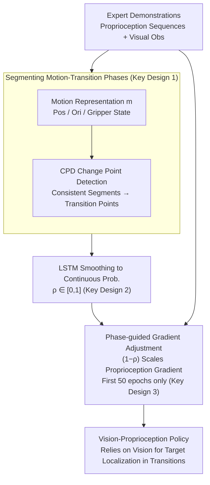

# When would Vision-Proprioception Policies Fail in Robotic Manipulation?

**Conference**: ICLR 2026  
**arXiv**: [2602.12032](https://arxiv.org/abs/2602.12032)  
**Code**: [Project Page](https://gewu-lab.github.io/GAP/)  
**Area**: Robotics  
**Keywords**: Vision-proprioception policies, modality temporality, gradient adjustment, motion-transition phases, robotic manipulation

## TL;DR
This paper reveals why vision-proprioception manipulation policies fail during motion-transition phases—proprioception signals dominate optimization and suppress vision learning. It proposes the Gradient Adjustment with Phase-guidance (GAP) algorithm, which adaptively reduces proprioception gradients to restore vision modality learning, significantly enhancing policy generalization in both simulated and real-world environments.

## Background & Motivation

Proprioception information is essential for precise servo control, providing real-time joint states of the robot. In learning-based manipulation policies, utilizing both proprioception and vision is generally expected to enhance performance in complex tasks. However, existing research reports **contradictory findings**:
- HPT demonstrates that vision + proprioception significantly outperforms vision-only.
- Octo finds that incorporating proprioception leads to performance degradation.

**Key Challenge**: Proprioceptive information should theoretically be a beneficial supplement, yet in practice, the generalization of vision-proprioception policies is often inferior to vision-only policies. **What is the root cause of this contradiction, and when does it occur?**

**Key Insight**: Through temporally controlled experiments, the authors discovered that the issue resides in the **motion-transition phases**. In manipulation tasks, robot motion can be categorized into "motion-consistent phases" (e.g., continuous forward movement) and "motion-transition phases" (e.g., locating a new target and changing direction).

- **Motion-consistent phases**: Proprioception signals are effective, and the policy performs normally.
- **Motion-transition phases**: The vision modality should play a critical role (target localization), but vision learning is suppressed in vision-proprioception policies.

**Mechanism**: From an optimization perspective, proprioception signals are concise and low-dimensional, providing faster loss descent during training. This causes the optimization to be dominated by proprioception signals. While vision signals contain crucial information like target localization, their learning is suppressed because pixel-level changes are more subtle compared to proprioception signals (modality competition/modality laziness).

## Method

### Overall Architecture
GAP (Gradient Adjustment with Phase-guidance) does not modify the policy network structure. The pipeline consists of a single objective: first, identifying which moments belong to "motion-transition phases" offline from expert demonstration proprioception signals, and then dynamically weakening the proprioception branch's gradient during behavior cloning training based on these moments. Specifically, it first encodes the motion of each trajectory into a computable representation, uses change point detection to segment boundaries between motion-consistent and motion-transition phases, and employs an LSTM to smooth hard split points into a continuous transition probability $\rho$ for each timestep. During training, the proprioception encoder's gradient is scaled by $(1-\rho)$. Consequently, when the robot needs to locate a new target or change motion direction ($\rho$ is large), proprioception updates are minimized, forcing optimization pressure onto the vision branch, thus allowing the previously suppressed vision modality to receive learning signals.

### Key Designs

**1. Segmenting motion-transition phases: Converting "whether the robot is currently changing direction" into computable boundaries**

To adjust gradients by phase, one must first identify which moments belong to motion transitions. GAP does not rely on semantics or manual annotation; it performs this directly using existing proprioception signals. It defines the motion representation between timesteps $i$ and $j$ as $m_{i:j} = \{p_{i:j}, \theta_{i:j}, g_{i:j}\}$, where the three components represent changes in gripper position, orientation, and openness, respectively, characterizing the robotic arm's state. Change Point Detection (CPD) combined with dynamic programming is then used based on a motion consistency distance:

$$d(m_{t_1:t_2}, m_{i:i+1}) = -\cos(p_{t_1:t_2}, p_{i:i+1}) - \alpha\cos(\theta_{t_1:t_2}, \theta_{i:i+1}) - \beta(\text{sgn}(g_{t_1:t_2}) == \text{sgn}(g_{i:i+1}))$$

This segments the trajectory into parts with consistent internal motion directions ($\alpha=1$, $\beta=2\times10^{-3}$ to balance components). After CPD minimizes the total cost, the breakpoints between segments are where motion transitions occur. Compared to semantic phases or manual labels, this geometric detection automatically covers the entire trajectory and is more comprehensive.

**2. LSTM smoothing into continuous transition probability: Converting discrete split points into differentiable phase signals**

CPD provides hard boundaries, but real motion transitions are gradual. Using discrete labels to multiply gradients would cause abrupt jumps at breakpoints and propagate CPD segmentation errors into training. GAP thus trains an LSTM to model the temporal difference of proprioception $\Delta s_i = s_{i+1} - s_i$, outputting a continuous probability $\rho_i \in [0,1]$ for each timestep belonging to a transition phase. Training is supervised by CPD segments, with reduced penalties near transition points to encourage smooth transitions. Ablation studies show this continuous $\rho$ significantly outperforms discrete CPD labels by absorbing CPD priors while smoothing errors.

**3. Phase-guided gradient adjustment: Disabling proprioception learning during transitions based on $\rho$ to force visual focus**

This is the core of GAP. In each training epoch, the update for the proprioception feature extractor (parameters before the transformer) is modulated as:

$$\omega_s^{j+1} = \omega_s^j - \lambda \cdot (1-\rho) \cdot \eta \nabla_{\omega_s^j} \mathcal{L}_{BC}(\omega_s^j)$$

where $\lambda=0.3$ controls adjustment intensity and $\rho$ is the predicted transition probability. When $\rho$ approaches 1 (transition phase), $(1-\rho)$ approaches 0, and proprioception is barely updated. The model is forced to learn target localization from vision. This refines the "global concatenation" competition into a phase-dependent balance. However, constant adjustment would suppress proprioception during consistent phases where precise servoing is needed; thus, GAP is only applied during the first 50 epochs (out of 100). Once the vision branch establishes localization capability, both modalities are allowed to collaborate normally.

### Loss & Training
The overall framework follows the behavior cloning paradigm using MSE as the base loss. The vision branch uses ResNet-18 to extract 512-dimensional representations followed by a 4-layer temporal transformer. The proprioception branch uses a 3-layer MLP. Features are concatenated and fed into a 3-layer MLP policy head to output an action sequence of length $L=9$. Training uses the Adam optimizer with a learning rate of 3e-4 and batch size 128 for 100 epochs on a single RTX 3090. Meta-World uses 100 expert demonstrations, and RoboSuite uses 500 synthetic trajectories.

## Key Experimental Results

### Main Results (Simulation + Real World)

| Method | Meta-World (Avg of 4) | RoboSuite (Avg of 4) | Note |
|------|------------|------------|------|
| Vision-only | 80.5% | 64.6% | Vision-only baseline |
| Concatenation | 71.8% | 53.8% | Vision-proprioception, performance **drops** |
| MS-Bot | 83.5% | 69.4% | Uses semantic phase info |
| Aux Loss | 83.5% | 56.3% | Auxiliary vision prediction loss |
| Mask | 84.5% | 62.0% | Randomly masks proprioception |
| **GAP (Ours)** | **88.4%** | **73.0%** | **Best performance** |

Real-world experiments (20 rollouts):

| Method | Single-arm (3 tasks) | Bimanual (3 tasks) |
|------|----------|----------|
| Vision-only | 41/60 | 35/60 |
| Concatenation | 28/60 | 24/60 |
| **GAP (Ours)** | **50/60** | **49/60** |

### OOD Generalization

| Method | assembly | bin-picking | stack | threading | cube | handover |
|------|----------|-------------|-------|-----------|------|----------|
| Vision-only | 78% | 59% | 63% | 32% | 12/20 | 12/20 |
| Concatenation | 62% | 32% | 49% | 28% | 7/20 | 9/20 |
| **GAP** | **88%** | **67%** | **72%** | **49%** | **15/20** | **15/20** |

### VLA Model Compatibility (Octo Fine-tuning)

| Method | disassemble | push-wall | put hammer | threading |
|------|-------------|-----------|------------|-----------|
| Octo-V (Vision-only) | 95% | 77% | 92% | 69% |
| Octo-VP (Vision+Proprio) | 82% | 65% | 88% | 57% |
| Octo-VP + **GAP** | **100%** | **85%** | **97%** | **78%** |

### Ablation Study

| Configuration | Key Metric | Note |
|------|---------|------|
| Human labels vs. CPD | GAP (CPD) is better | Auto-detection is more comprehensive |
| HDBSCAN Clustering | Performance drop | Destroys temporal trajectory structure |
| CoTPC | Inferior to GAP | Simple cosine distance is insufficient |
| Fixed $\rho$ vs. LSTM | LSTM significantly better | Continuous prob better than discrete labels |
| $\lambda=0.1$ to $0.5$ | 0.2-0.4 are stable | Robust to $\lambda$ |
| Epochs for GAP | 50 epochs optimal | Balance between vision and proprioception |

### Key Findings
- Standard vision-proprioception concatenation policies are **consistently worse** than vision-only (approx. 15% drop), verifying the prevalence of OOD generalization issues.
- Intervention experiments pinpoint the issue: the vision modality is suppressed during **motion-transition phases**, preventing the policy from locating targets.
- GAP restores vision branch learning via gradient adjustment; linear-probing experiments confirm improved visual feature quality (e.g., assembly task from 61% to 74%).
- GAP is compatible with various fusion methods (Concatenation, Summation, FiLM) and architectures (MLP, Diffusion, VLA/Octo).
- Effectiveness in real-world single-arm and bimanual tasks demonstrates practical deployment value.

## Highlights & Insights
- **Precise Diagnosis**: Identifies "motion-transition phases" as the specific failure mode through temporal intervention experiments rather than making a general claim about multi-modality.
- **Deep Optimization Perspective**: Explains the mechanism of vision suppression via gradient competition/modality laziness, linking to theoretical multi-modal learning analysis.
- **Simple and Effective**: Modifies only the proprioception gradient magnitude—no architecture changes, no extra modules, no auxiliary losses.
- **High Compatibility**: Robust across CNN/Transformer/Diffusion/VLA architectures, single/bimanual arms, and simulation/real environments.
- **Thorough Ablation**: Exhaustively tests motion detection methods, LSTM vs. alternatives, hyperparameters $\alpha/\beta/\lambda$, and training stages.
- **Counter-intuitive Discovery**: Proprioception, intended to help, actually inhibits vision learning during optimization—revealing a neglected pitfall in multi-modal learning.

## Limitations & Future Work
- Experiments were conducted on a single embodiment; cross-embodiment evaluation is missing.
- CPD's motion consistency distance relies on hand-designed metrics (cosine similarity + sign), which may not suit all manipulation tasks.
- LSTM training depends on labels from CPD; systematic biases in CPD segmentation could affect the LSTM.
- GAP is applied only in early training (first 50/100 epochs); this threshold might require tuning for different task scales.
- Complex attention-based fusion combined with GAP was not explored.
- Gradient adjustment uses a constant $\lambda$; adaptive $\lambda$ per timestep could be considered.
- Focused only on vision and proprioception, neglecting other modalities like tactile feedback.

## Related Work & Insights
- **Modality Competition/Laziness** (Huang et al. 2022, Fan et al. 2023): A common multi-modality issue where one modality dominates; GAP is a specific solution for robotics.
- **HPT (Wang et al. 2024)**: Showed positive effects of proprioception.
- **Octo**: Reported negative effects of proprioception; this paper explains and resolves this contradiction.
- **Modality Temporality (Feng et al.)**: Introduced importance variation over time; GAP specializes this as "motion-transition phases."
- **Diffusion Policy (Chi et al. 2023)**: GAP is compatible and improves performance with diffusion heads.
- **Insight**: The gradient adjustment approach can be generalized to any multi-modal scenario where one modality excessively dominates optimization.

## Rating
- Novelty: ⭐⭐⭐⭐ (Novel diagnostic perspective, simple yet effective method)
- Experimental Thoroughness: ⭐⭐⭐⭐⭐ (14+ tasks, multiple architectures, sim+real, comprehensive ablation, OOD, VLA compatibility)
- Writing Quality: ⭐⭐⭐⭐ (Problem-driven, clear logic, rich visualizations)
- Value: ⭐⭐⭐⭐⭐ (Solves a practical and widespread problem in robotic manipulation)

<!-- RELATED:START -->

## Related Papers

- [\[ICLR 2026\] ManipEvalAgent: Promptable and Efficient Evaluation Framework for Robotic Manipulation Policies](manipevalagent_promptable_and_efficient_evaluation_framework_for_robotic_manipul.md)
- [\[ICLR 2026\] Robotic Manipulation by Imitating Generated Videos Without Physical Demonstrations](robotic_manipulation_by_imitating_generated_videos_without_physical_demonstratio.md)
- [\[ICLR 2026\] MemoryVLA: Perceptual-Cognitive Memory in Vision-Language-Action Models for Robotic Manipulation](memoryvla_perceptual-cognitive_memory_in_vision-language-action_models_for_robot.md)
- [\[ICLR 2026\] Genie Envisioner: A Unified World Foundation Platform for Robotic Manipulation](genie_envisioner_a_unified_world_foundation_platform_for_robotic_manipulation.md)
- [\[ICLR 2026\] Robust Finetuning of Vision-Language-Action Robot Policies via Parameter Merging](robust_fine-tuning_of_vision-language-action_robot_policies_via_parameter_mergin.md)

<!-- RELATED:END -->
