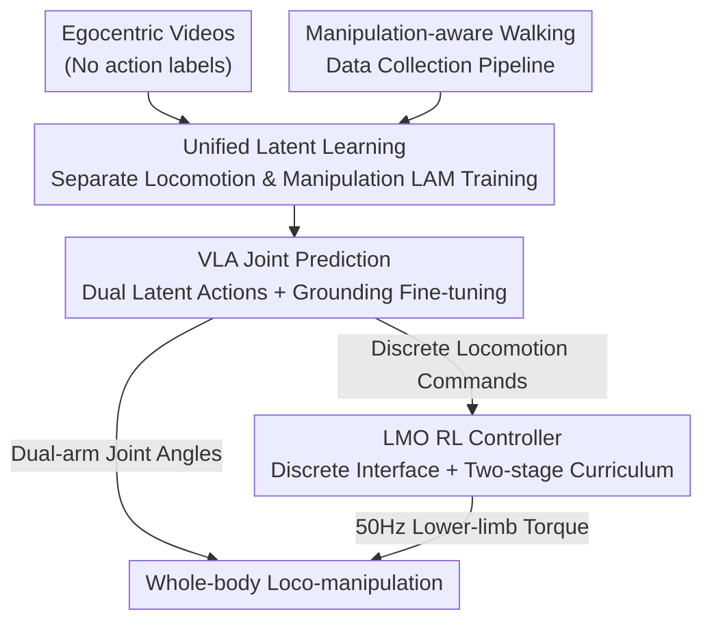

# WholeBodyVLA: Towards Unified Latent VLA for Whole-Body Loco-Manipulation Control

**Conference**: ICLR 2026  
**Paper**: [OpenReview / Project Page](https://opendrivelab.com/WholeBodyVLA)  
**Code**: Project Page https://opendrivelab.com/WholeBodyVLA (Repository not explicitly open-sourced)  
**Area**: Robotics / Embodied AI / VLA  
**Keywords**: Humanoid Robot, loco-manipulation, Latent Action Model, VLA, Whole-body control

## TL;DR
WholeBodyVLA enables bipedal humanoid robots to perform end-to-end "move-and-manipulate" tasks in large spaces for the first time. By utilizing two separately trained Latent Action Models (LAMs) to learn locomotion and manipulation priors from massive "action-unlabeled" egocentric human videos, combined with a discrete-command RL low-level controller tailored for loco-manipulation, it achieves a 21.3% higher average success rate than previous baselines on AgiBot X2.

## Background & Motivation
**Background**: For humanoid robots to perform truly useful tasks, they must possess both "precise locomotion" and "dexterous manipulation." Current approaches fall into two categories: modular (using high-level planners to chain "navigation" and "grasping" as discrete skills) and end-to-end (learning direct whole-body control).

**Limitations of Prior Work**: Modular solutions suffer from brittle skill boundaries; robots often stop in "out-of-reach" or "unstable" poses after walking, making subsequent manipulation impossible. Furthermore, poor closed-loop feedback leads to error accumulation. End-to-end solutions theoretically allow for joint optimization but require massive "whole-body loco-manipulation" trajectories for imitation learning, which are nearly non-existent and prohibitively expensive to collect via MoCap or teleoperation.

**Key Challenge**: The authors identify two root causes. First is **data scarcity**: while large datasets exist for tabletop manipulation and wheeled/quadrupedal navigation, data integrating "humanoid walking" and "manipulation" is extremely rare. Consequently, models fail to learn "manipulation-aware locomotion" (where movement itself creates optimal conditions for manipulation: approaching, aligning, and stabilizing). Second is the **misalignment between decision and execution**: existing RL controllers use "continuous velocity tracking" targets suitable for cruising but overly complex for the "precise start/stop/turn" maneuvers required by loco-manipulation, leading to training difficulties and unreliable execution of high-level VLA commands.

**Goal**: To learn rich loco-manipulation priors without relying on large-scale teleoperation data, while ensuring low-level execution is precise and stable enough to faithfully implement high-level decisions.

**Key Insight**: Humans can learn new walking and manipulation skills simply by "watching others." Tabletop manipulation has already demonstrated the utility of human demonstration videos. These videos encapsulate movement directions, end-effector trajectories, object affordances, and physical interaction cues—precisely what is needed for loco-manipulation—at a very low collection cost.

**Core Idea**: Compress "action-unlabeled egocentric videos" into discrete latent actions to serve as supervision signals for VLA during pre-training. Since locomotion and manipulation have fundamentally different visual change patterns, **two separate LAMs** are used. A discrete-command RL controller is then employed as the foundational executor for loco-manipulation.

## Method

### Overall Architecture
WholeBodyVLA is a hierarchical system consisting of a "high-level VLA + low-level RL controller." During runtime, it receives egocentric images and language instructions (e.g., "Pick up the box, turn and walk to the cart, and place it on top"). The VLM encodes these into unified latent action tokens. A lightweight action decoder (approx. 10 Hz) grounds these latent actions into two sets of specific commands: (i) dual-arm joint angles, and (ii) a discrete locomotion command (forward/sidestep/turn/crouch height). The locomotion command is then processed by the LMO RL controller at 50 Hz to produce lower-limb torques, ensuring stable execution.

Training follows three steps: First, **separately pre-train** a manipulation LAM (using AgiBot World real-robot data) and a locomotion LAM (using self-collected "manipulation-aware walking" videos) on large-scale egocentric videos to compress inter-frame inverse dynamics into discrete codebooks. Second, have the VLA **jointly predict both types of latent actions** on a mix of "human videos + real-robot data" (using LAM codes as pseudo-labels). Finally, attach the action decoder and fine-tune on teleoperation trajectories to ground latent actions into executable robot commands. Information for the LMO RL controller is trained separately in simulation and fixed during deployment.

### Key Designs

**1. Unified Latent Learning: Using Two Separate LAMs to Turn "Action-less Videos" into VLA Supervision**

The pain point is that teleoperation data is expensive and whole-body data is nearly non-existent, yet unlabeled videos contain all the cues needed for loco-manipulation. Following the logic of Genie / UniVLA, the authors use a VQ-VAE architecture with encoders built on DINOv2 features. Given adjacent frames $(o_t, o_{t+k})$, the encoder $E_i$ outputs a continuous latent vector $z_t = E_i(o_t, o_{t+k})$, which is then quantized to the nearest code $c_t^i = \arg\min_{c\in C_i}\lVert z_t - c\rVert_2$ in the codebook. The decoder $D_i$ takes the previous frame and the quantized latent action to reconstruct the subsequent frame $\hat o_{t+k}=D_i(o_t, c_t)$, optimized with standard VQ-VAE loss. This encodes "inter-frame changes" into a discrete "latent action vocabulary" without requiring action labels.

The key insight is the **necessity of decoupling LAMs for locomotion and manipulation** ($i\in\{\text{mani},\text{loco}\}$). First, in manipulation videos, the camera is mostly static and changes come from the arms, biasing the model toward arm regions. In walking videos, the camera moves continuously, and changes come from relative environmental motion, forcing the model to observe the entire scene. Mixing these creates conflicting attention targets. More importantly, in loco-manipulation, the arms are often in view; during walking, the "change in arm position relative to the environment" is due to camera (body) movement, but a single LAM might misinterpret this as arm movement, causing ambiguous encoding. After decoupling, the VLA jointly predicts both types of latent actions via cross-entropy $\pi_\theta(c_t^{\text{mani}}, c_t^{\text{loco}}\mid o_t, \ell)$, forcing the model to learn how locomotion and manipulation coordinate within a unified action space. Finally, a lightweight decoder $f$ grounds the latent actions into robot commands $a_t = f(\hat c_t^{\text{mani}}, \hat c_t^{\text{loco}}, s_t)$.

**2. Manipulation-aware Walking Data Pipeline: Aligning Low-cost Videos with Loco-manipulation**

Locomotion LAMs require large-scale videos of "walking with manipulative intent," which are not readily available. The authors designed a minimalist egocentric collection pipeline with three essential features: (1) **Low cost and high efficiency**—only one operator wearing a head-mounted monocular camera is needed, bypassing MoCap and teleoperation. (2) **Coverage of humanoid primitives**—the operator performs a full range of motions: forward, turning, and crouching. (3) **Goal-orientation**—walking must be "toward a potential manipulation target" rather than aimless wandering, ensuring the collected locomotion data aligns directly with loco-manipulation learning.

**3. LMO RL Policy: Replacing Velocity Tracking with a Discrete Command Interface to Fix Decision-Execution Mismatch**

The authors found that many failures (stumbling, yaw deviation) stemmed from insufficient precision/stability in the low-level RL controller rather than the VLA itself. The culprit is the commonly used "continuous velocity tracking" target, which is "over-capable" for the precise positioning needed in loco-manipulation, leading to instability.

LMO replaces velocity tracking with a **discrete command interface**. Observations use only proprioception $O_t=[u_t,\omega_t,g_t,q_t,\dot q_t,a_{t-1}]$. Every step, the planner provides commands $u_t=[s_x,s_y,s_\psi,h^\star]\in\{-1,0,1\}^3\times\mathbb{R}$, where three tri-valued flags represent forward/sidestep/turn, and $h^\star$ specifies standing height. This interface explicitly encodes "start/stop" semantics and reduces trajectory variance. To avoid abrupt acceleration, directional intent passes through a smooth gating function: $v_k^{\text{ref}}(t)=v_k^{\text{goal}}\tanh\big(\alpha(s_k-\bar s_k(t))\big)$, where $\bar s_k(t)\leftarrow(1-\lambda)\bar s_k(t-1)+\lambda s_k$, ensuring predictable switching and suppressing oscillations.

Training uses a **two-stage curriculum**: Stage I focuses on basic gait stability. Stage II refines precision for loco-manipulation. Cruising speed is fixed to suppress unintended yaw, and directional deviation $J_{\text{dir}}=|\text{wrap}(\psi_{\text{end}}-\psi_{\text{start}})|$ supervises precise starts/stops/turns. Real arm motion segments from AgiBot-World are injected as perturbations to force the legs to compensate for actual inertial coupling.

### Loss & Training
- **LAM Pre-training**: Standard VQ-VAE reconstruction loss.
- **VLA Pre-training**: Cross-entropy, jointly maximizing $\pi_\theta(c_t^{\text{mani}}, c_t^{\text{loco}}\mid o_t, \ell)$ using LAM codes as pseudo-labels.
- **VLA Fine-tuning**: Fine-tuning on AgiBot-X2 teleoperation trajectories (50 per task) with the action decoder for grounding.
- **LMO RL**: Two-stage curriculum including $J_{\text{dir}}$, $J_{\text{stand}}$, and structured arm perturbations; trained in simulation and fixed during deployment.

## Key Experimental Results

The hardware comprises an AgiBot X2 prototype (7-DoF dual arms, 6-DoF legs, 1-DoF waist). Three major tasks: Bagging (pick bag → sidestep → crouch and place in box), Boxing (crouch and pick box → turn → place on cart), and Cart-pushing (grasp 50 kg cart handle → push forward stably).

### Main Results
Each task was split into two sub-goals, with 25 trials each (Successes/25). Table shows average success rates:

| Method | Bagging (Pick/Move-Crouch) | Boxing (Crouch-Pick/Rise-Turn) | Cart-pushing (Grasp/Push) | Average |
|------|------|------|------|------|
| Modular Design | 22 / 12 | 9 / 9 | 22 / 22 | 64.0% |
| GR00T w/ LMO | 20 / 10 | 6 / 4 | 12 / 11 | 42.0% |
| OpenVLA-OFT w/ LMO | 19 / 6 | 12 / 12 | 22 / 14 | 56.7% |
| **WholeBodyVLA (Ours)** | **23 / 13** | **19 / 17** | **23 / 22** | **78.0%** |

Ours outperforms the strongest baseline (Modular 64.0%) by approximately 14 percentage points. (Note: discrepancies with the abstract's +21.3% likely stem from different baseline comparison pairings).

### Ablation Study

| Configuration | Avg. Success Rate | Description |
|------|---------|------|
| Full model | 78.0% | Complete model |
| w/ vel.-based RL | 54.0% | Replacing LMO with velocity tracking RL (-24%) |
| w/o LAM | 39.3% | Skipping latent pre-training (-38.7%) |
| w/ manip. LAM | 63.3% | Latent learning only on manipulation data |
| w/ shared LAM | 66.0% | Locomotion and manipulation sharing one LAM |

### Key Findings
- **Latent pre-training is the biggest contributor**: Removing LAM results in a 38.7% drop, making it the single largest performance source. Locomotion-side pre-training is especially critical.
- **Decoupling LAMs is beneficial but secondary**: A shared LAM (66.0%) is only slightly worse than separate LAMs, suggesting that the presence of locomotion pre-training is more important than the decoupling itself.
- **LMO fixes "execution at the finish line"**: The 24% drop with velocity-based RL is 91.7% concentrated in the second sub-goals involving heavy movement.
- **Data Efficiency**: Pre-training with >50% human videos allows 25 teleoperation trajectories to match the performance of a variant using 200 trajectories with <25% video pre-training.

## Highlights & Insights
- **Explicit modeling of "Moving for Manipulation"**: The core premise of manipulation-aware locomotion is well-addressed—movement is not an independent phase but a prerequisite to create optimal conditions for grasping.
- **Convincing rationale for Decoupled LAMs**: By analyzing visual ambiguities (camera static vs. moving), the authors provide a transferable insight for any "mobile + manipulation" embodied scenario.
- **Discrete Command Interface as "Smart Design"**: Replacing velocity tracking with tri-valued flags + smooth gating simplifies the RL task while making high-level planning more reliable.
- **Minimalist Collection Pipeline**: Using monocular egocentric video for locomotion priors brings the data cost near zero, enabling scalability.

## Limitations & Future Work
- The authors acknowledge challenges in long-horizon, high-dexterity tasks. Future work involves incorporating lightweight mapping and memory for longer planning.
- The evaluation was conducted on a single platform (AgiBot X2) with a relatively small sample size (25 trials per sub-goal).
- The LMO controller is fixed during deployment; there is untapped potential for end-to-end joint optimization between high and low levels.

## Related Work & Insights
- **vs. Modular Planners (Being-0 / R2S2 / HEAD)**: These treat movement and manipulation as discrete skills with brittle boundaries; Ours uses end-to-end joint optimization.
- **vs. Humanoid VLA (Humanoid-VLA / GR00T)**: Previous works typically focused on either locomotion or manipulation; Ours integrates both into a unified latent action space.
- **vs. Latent Action Learning (Genie / LAPA / UniVLA)**: While these proved unlabeled videos can supervise VLA, they were oriented toward static-camera tabletop manipulation; Ours extends this to locomotion and addresses camera-induced ambiguity.

## Rating
- Novelty: ⭐⭐⭐⭐⭐ First end-to-end whole-body loco-manipulation for humanoids in large spaces with original insights across LAMs and RL.
- Experimental Thoroughness: ⭐⭐⭐⭐ Extensive real-robot tasks and ablations, though sample sizes are slightly small.
- Writing Quality: ⭐⭐⭐⭐ Logical motivation and clear explanations of component designs.
- Value: ⭐⭐⭐⭐⭐ Provides a low-cost, scalable path for humanoid whole-body control under data scarcity.

<!-- RELATED:START -->

## Related Papers

- [\[ICLR 2026\] HWC-Loco: A Hierarchical Whole-Body Control Approach to Robust Humanoid Locomotion](hwc-loco_a_hierarchical_whole-body_control_approach_to_robust_humanoid_locomotio.md)
- [\[ICLR 2026\] Hierarchical Value-Decomposed Offline Reinforcement Learning for Whole-Body Control](hierarchical_value-decomposed_offline_reinforcement_learning_for_whole-body_cont.md)
- [\[ICLR 2026\] Unified Diffusion VLA: Vision-Language-Action Model via Joint Discrete Denoising Diffusion Process](unified_diffusion_vla_vision-language-action_model_via_joint_discrete_denosing_d.md)
- [\[ICLR 2026\] From Language to Locomotion: Retargeting-free Humanoid Control via Motion Latent Guidance](from_language_to_locomotion_retargeting-free_humanoid_control_via_motion_latent_.md)
- [\[ICLR 2026\] Interleave-VLA: Enhancing Robot Manipulation with Image-Text Interleaved Instructions](interleave-vla_enhancing_robot_manipulation_with_image-text_interleaved_instruct.md)

<!-- RELATED:END -->
