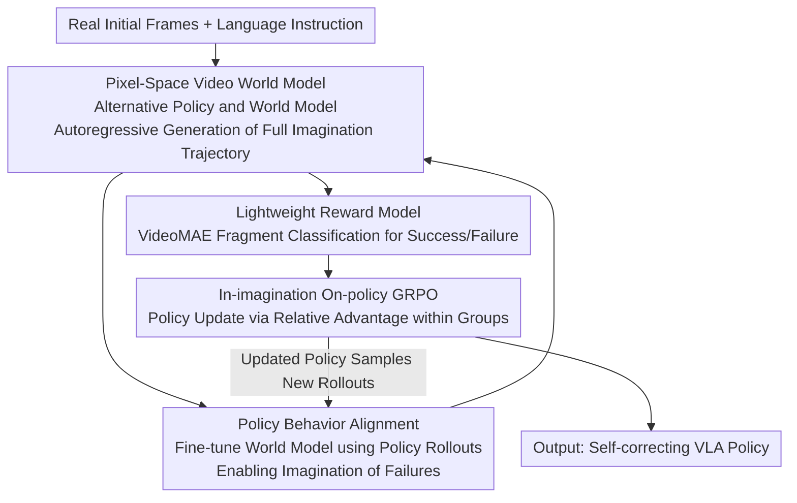

# WMPO: World Model-based Policy Optimization for Vision-Language-Action Models

**Conference**: ICLR 2026  
**OpenReview**: [https://openreview.net/forum?id=qE2FyvRvuF](https://openreview.net/forum?id=qE2FyvRvuF)  
**Project Page**: [https://wm-po.github.io/](https://wm-po.github.io/)  
**Code**: https://github.com/WM-PO/WMPO (Available)  
**Area**: Robotics / Embodied AI / VLA / Reinforcement Learning / World Models  
**Keywords**: VLA, World Models, On-policy RL, GRPO, Sample Efficiency

## TL;DR
WMPO migrates the entire reinforcement learning process of VLA policies into a **pixel-space action-conditioned video world model** for "dreaming." By using the world model to imagine complete trajectories, judging success with a lightweight reward model, and running on-policy GRPO, it significantly improves sample efficiency without physical interaction and enables the emergence of self-correction behaviors.

## Background & Motivation

**Background**: Vision-Language-Action (VLA) models are the current mainstream paradigm for general robotic manipulation, mostly fine-tuned via **Imitation Learning (IL)** on large-scale human demonstrations (e.g., OpenVLA, π0).

**Limitations of Prior Work**: Policies trained via pure IL are "brittle"—once they enter out-of-distribution (OOD) states not seen in demonstrations, they produce sub-optimal actions, causing compounding errors that lead to ultimate task failure without recovery. Essentially, IL only learns to "imitate success" and fails to **learn error correction from failure**. While Reinforcement Learning (RL) could address this through active interaction, running RL directly on real hardware requires millions of interactions, which is costly, unsafe, and slow.

**Key Challenge**: Enabling VLA self-improvement requires on-policy RL, while on-policy RL demands massive real-world rollouts—two factors that naturally conflict in physical environments. Existing efficiency routes rely on either **human intervention** (expensive, hard to scale) or **simulators** (building accurate simulators for every real scene is an engineering explosion).

**Key Challenge (Deeper level)**: Video generation world models are an intuitive solution for model-based RL, but classical world models often operate in **abstract latent spaces** (like RSSM). This is **fundamentally mismatched** with the visual representations VLA gains from pre-training on web-scale real images—VLA's rich pre-trained visual understanding cannot be directly applied to mismatched latent dynamics.

**Goal**: Construct an "imagination training ground" that fully replaces real-machine interaction, allowing VLA to run true on-policy RL while preserving pre-trained knowledge.

**Key Insight**: Instead of building a world model in latent space, build an action-conditioned video generation world model **in pixel space**. Its generated images belong to the same distribution as VLA pre-training data, naturally bridging pre-trained policy knowledge.

**Core Idea**: Build a self-contained environment using a **pixel-space video world model + policy behavior alignment + lightweight reward model**, allowing VLA to run on-policy GRPO entirely "in imagination," reducing real-machine interaction to just a few calibration rollouts.

## Method

### Overall Architecture

WMPO formalizes the problem as an MDP $M=(S,A,P,R)$: State $S$ is the image sequence + language instruction; actions $A$ are action chunks of length $K$ (discrete bins). The **transition function $P$ is implemented by a parameterized world model $p_\phi$**, which generates future frames based on past observations and actions. Reward $R$ is a binary success/failure signal provided by a learned model $R_\psi$. The objective is to maximize cumulative return of imagined trajectories: $\max_\theta \mathbb{E}_{\tau\sim\pi_\theta,p_\phi}[R_\psi(\tau)]$.

The training workflow is a three-stage loop where each iteration is completed within the world model without real-world interaction:

1.  **Imagination Trajectory Generation**: Starting from initial frames $I_{0:c}$ sampled from the real environment, the policy $\pi_{\theta_{old}}$ and world model $p_\phi$ work alternately. The policy observes the last $m$ frames + instruction to predict an action chunk, and the world model generates the next $K$ frames accordingly, repeating autoregressively until a full trajectory $\tau$ is formed.
2.  **Trajectory Sampling**: A group of $G$ imagined trajectories $\{\tau_1,\dots,\tau_G\}$ is sampled from the same initial state. Each is evaluated by the reward model $R_\psi$ to obtain binary labels.
3.  **Policy Update**: On-policy GRPO is used with the relative advantages of these trajectories to update policy parameters $\theta$.

### Key Designs

**1. Pixel-Space Action-Conditioned Video World Model: Aligning Imagination with VLA Pre-trained Representations**

This is the foundation that distinguishes WMPO from classical model-based RL. The pain point is that states produced by latent-space world models (RSSM, etc.) mismatch VLA’s web-scale image pre-trained representations. WMPO models in **pixel space** using OpenSora video diffusion as the backbone, but replaces the 3D VAE with SDXL's 2D VAE to better preserve fine-grained motion details and temporal fidelity. Diffusion occurs in the VAE latent space and is decoded back to pixels for the VLA, directly leveraging pre-trained knowledge.

To support long-range trajectories, two stabilizing techniques are introduced: **noisy-frame conditioning** (injecting slight noise corresponding to early diffusion steps into condition frames to improve robustness) and **frame-level action control** (extending AdaLN blocks to inject action signals via MLP-generated scale $\gamma_1^i$, shift $\beta_1^i$, and residual scale $\alpha_1^i$ at each frame), ensuring precise action-frame alignment.

**2. Policy Behavior Alignment: Enabling the World Model to Faithfully Reproduce Failures**

The world model is first pre-trained on millions of trajectories from Open X-Embodiment (OXE). However, OXE and expert demonstrations consist almost entirely of **successful** executions. A world model that only sees success cannot imagine failure. WMPO solves this by fine-tuning the world model using **real rollouts collected by the policy itself**, aligning it to the downstream (state, action) distribution and capturing failure modes. This is a critical prerequisite for on-policy RL.

**3. Lightweight Reward Model: Binary Success Signals via Segment Classification**

Short-range predictions are prone to reward hacking. WMPO uses a **lightweight reward model** for outcome-based binary scoring on the full trajectory. The trajectory is sliced into segments $c_i=I_{i-L:i}$. The reward model (VideoMAE encoder + linear head) is trained using binary cross-entropy. During inference, if any segment's success probability exceeds a threshold $\tau_{thr}$, the trajectory is judged as a success.

**4. In-imagination On-policy GRPO: Realizing GRPO's Rollout Advantages via the World Model**

Real-world RL is bottlenecked by physical interaction costs, often forcing a retreat to off-policy methods. By delegating transitions to the world model, rollouts become cheap and scalable, allowing for true on-policy **GRPO**. To prevent gradient vanishing, **dynamic sampling** (from DAPO) is used: if a group is all successes or all failures, it is discarded. Advantages are normalized within the group $\hat A_i = (R_i - \text{mean}(\{R_i\})) / \text{std}(\{R_i\})$, and the objective uses a clipped ratio:

$$\mathcal{J}(\theta)=\mathbb{E}\Big[\tfrac{1}{G}\sum_{i=1}^{G}\tfrac{1}{T}\sum_{t=0}^{T}\min\big(r_{i,t}(\theta)\hat A_i,\ \mathrm{clip}(r_{i,t}(\theta),1-\epsilon_{low},1+\epsilon_{high})\hat A_i\big)\Big],$$

Removing the KL term (DAPO style) saves VRAM and encourages exploration.

### Loss & Training
- **World Model**: OpenSora backbone + SDXL 2D VAE; pre-trained on OXE then fine-tuned via behavior alignment; noisy-frame conditioning at diffusion step 50 noise level.
- **Reward Model**: VideoMAE encoder + linear head unit, BCE loss, class-balanced.
- **Policy**: OpenVLA-OFT base (IL fine-tuned); chunk length $K=8$, $c=4$ conditional frames; GRPO without KL + dynamic sampling.

## Key Experimental Results

### Main Results
Comparison on four fine-grained manipulation tasks in Mimicgen with equal real rollout budgets $P$ (Success Rate %):

| Budget $P$ | Method | Coffee | StackThree | ThreePieceAssembly | Square | Mean |
|---|---|---|---|---|---|---|
| – | Base policy | 43.8 | 46.9 | 19.5 | 24.2 | 33.6 |
| 128 | GRPO | 38.3 | 52.3 | 17.2 | 25.0 | 33.2 |
| 128 | DPO | 43.8 | 53.9 | 23.4 | 28.1 | 37.3 |
| 128 | **WMPO** | **61.7** | **56.3** | **37.5** | **32.8** | **47.1** |
| 1280 | GRPO | 47.7 | 54.7 | 20.3 | 25.8 | 37.1 |
| 1280 | DPO | 52.3 | 57.0 | 26.7 | 33.6 | 42.4 |
| 1280 | **WMPO** | **75.0** | **64.1** | **46.1** | **45.3** | **57.6** |

With $P=128$, WMPO outperforms the strongest baseline by **+9.8**. At $P=1280$, the gap widens to **+15.2**, indicating superior ability to utilize additional rollouts.

### Generalization & Robustness
Success rate (%) under three perturbation scenarios:

| Method | Pos. Dis. | Bg. Dis. | Tex. Dis. | Mean |
|---|---|---|---|---|
| Base policy | 14.1 | 46.1 | 10.9 | 23.7 |
| GRPO | 15.6 | 47.7 | 10.9 | 24.7 |
| DPO | 16.4 | 34.4 | 7.8 | 19.5 |
| **WMPO** | **22.3** | **50.0** | **16.4** | **29.6** |

### Key Findings
- **Emergence of Self-Correction**: In the Square task, while the base policy fails upon collision due to compounding errors, WMPO learns to **lift the block, re-align, and re-insert**—a behavior not present in IL data.
- **Efficiency and Smoothness**: WMPO trajectories are shorter and smoother as it penalizes "stuck" behaviors.
- **Lifelong Learning**: WMPO shows stable improvements across iterative cycles (collecting 128 real rollouts → WMPO optimization → repeat), whereas DPO saturates or becomes unstable.
- **Real-world Validation**: On Cobot Mobile ALOHA for a 5mm gap insertion task, WMPO achieved a **70%** success rate compared to 53% for the base policy and 60% for DPO.

## Highlights & Insights
- **Pixel-space is for alignment, not just visual quality**: The authors pivot from the usual "latent vs pixel" debate to focus on "bridging pre-trained knowledge," making pixel-space modeling a fundamental principle for VLA.
- **Turning GRPO's weakness into a strength**: GRPO's requirement for repeated rollouts from the same state—impossible in real-time robotics—is perfectly suited for a world model.
- **Policy Behavior Alignment as the "secret sauce"**: Recognizing that imagining failures is necessary for learning error correction is a key insight that enables on-policy RL to function properly.

## Limitations & Future Work
- **State-Observation Equivalence**: The model simplifies robot state to image observations, leaving POMDP settings for future work.
- **Dependency on Real-world Samples**: Total avoidance of real interaction is not yet achieved, as a small number of real rollouts (e.g., 128) are still needed for world model alignment.
- **Binary Reward Sparsity**: Sparse success/failure signals may be insufficient for credit assignment in long-horizon, multi-stage tasks.

## Related Work & Insights
- **vs Latent World Models (Dreamer)**: Latent spaces are efficient but mismatch VLA pre-training; WMPO's pixel-space keeps representations consistent.
- **vs Real-machine/Sim RL**: WMPO avoids both the high cost of real interaction and the engineering nightmare of building per-scene simulators.
- **vs Offline RL (DPO)**: WMPO is truly on-policy, providing better stability and generalization than DPO, which is prone to relying on spurious visual cues.

## Rating
- Novelty: ⭐⭐⭐⭐⭐ 
- Experimental Thoroughness: ⭐⭐⭐⭐ 
- Writing Quality: ⭐⭐⭐⭐⭐ 
- Value: ⭐⭐⭐⭐⭐ 

<!-- RELATED:START -->

## Related Papers

- [\[CVPR 2026\] SRPO: Self-Referential Policy Optimization for Vision-Language-Action Models](../../CVPR2026/robotics/srpo_self-referential_policy_optimization_for_vision-language-action_models.md)
- [\[ICLR 2026\] UniVLA: Unified Vision-Language-Action Model](unified_vision-language-action_model.md)
- [\[ICLR 2026\] WorldGym: World Model as an Environment for Policy Evaluation](worldgym_world_model_as_an_environment_for_policy_evaluation.md)
- [\[ICLR 2026\] VLM4VLA: Revisiting Vision-Language-Models in Vision-Language-Action Models](vlm4vla_revisiting_vision-language-models_in_vision-language-action_models.md)
- [\[ICML 2026\] Dual-Stream Diffusion for World-Model Augmented Vision-Language-Action Model](../../ICML2026/robotics/dual-stream_diffusion_for_world-model_augmented_vision-language-action_model.md)

<!-- RELATED:END -->
