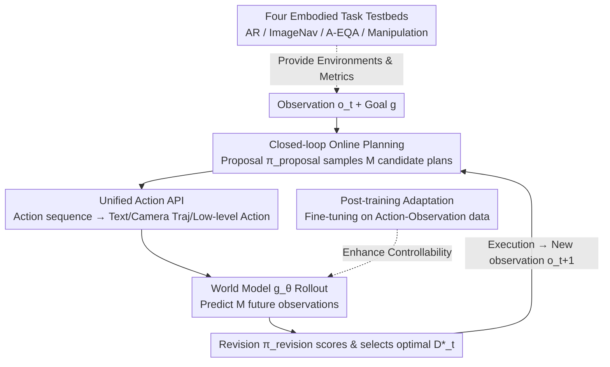

# World-In-World: World Models in a Closed-Loop World

**Conference**: ICLR 2026  
**Paper**: [Project Page](https://world-in-world.github.io/)  
**Code**: https://world-in-world.github.io/ (Yes, open platform)  
**Area**: Robotics / Embodied AI  
**Keywords**: World models, closed-loop evaluation, online planning, embodied AI, post-training

## TL;DR
This paper proposes World-In-World—the first open platform to evaluate generative world models in a **closed-loop embodied environment**. It utilizes a unified "Propose-Semulate-Revise" online planning strategy and a unified Action API to integrate various heterogeneous world models. Using **task success rate rather than visual quality** as the primary metric, the study reveals three counter-intuitive findings: high visual quality does not equate to task success (controllability is more critical), post-training with action-observation data is more effective than switching to stronger pre-trained video generators, and increasing inference-time compute significantly boosts closed-loop performance.

## Background & Motivation
**Background**: Video generation and 3D/4D scene generation have progressed rapidly. Generative World Models (WMs) can now synthesize visually realistic worlds. Given an agent's initial observation and a candidate action, these models can predict the resulting video, acting as an "action-conditioned environment simulator" that provides "predictive perception" to assist decision-making for embodied agents.

**Limitations of Prior Work**: The community lacks a unified benchmark for evaluating world models from the perspective of **embodied interaction**. Existing evaluation suites—such as VBench for video generation quality, WorldModelBench for visual plausibility, and WorldScore for "image + camera trajectory" inputs—primarily follow **open-loop** protocols. They evaluate single frames or video segments in isolation but fail to address the core question: **Can world models actually help an agent successfully complete embodied tasks?**

**Key Challenge**: A positive correlation between visual quality and embodied utility is often assumed but has never been verified in a closed-loop. A model with stunning visuals but inaccurate responses to low-level control might be useless in a "perception-planning-control-replanning" loop. Open-loop evaluation systematically amplifies visual quality while masking controllability—the dimension truly vital for decision-making.

**Goal**: (1) Build a closed-loop evaluation platform for the fair integration of heterogeneous world models; (2) Re-examine the relationship between "visual quality vs. task success" using task success rate as the primary metric; (3) Characterize the data and inference scaling laws of world models in embodied scenarios.

**Key Insight**: Treat the world model as a "simulator" within predictive control, embedding it into a real agent-environment interaction loop. Before acting, the agent uses the world model to "mentally" rehearse the consequences of several candidate actions and then selects the best one, mimicking the operation of human mental models.

**Core Idea**: Use a "Propose-Simulate-Revise" policy-guided beam search as the unified closed-loop planning skeleton. This is paired with a unified Action API that maps heterogeneous actions to the control inputs required by various models. This allows all world models to be ranked by **closed-loop task success rate** under the same protocol—world models should "live and die by their closed-loop success, not by flawless generated visuals."

## Method

### Overall Architecture
World-In-World is essentially an **evaluation platform + a set of general planning interfaces** rather than a new world model. Its core is a closed loop executed at each timestep: At timestep $t$, the agent receives the current egocentric observation $o_t$ and task goal $g$, then uses a **proposal policy** $\pi_{\text{proposal}}$ to sample $M$ candidate action plans. The Unified Action API $\mathcal{C}$ translates each plan into the control input (text/camera trajectory/low-level action) required by the target world model. The world model $g_\theta$ performs counterfactual rollouts for each candidate, predicting future observations $\hat{O}_t^{(m)}$. Finally, a **revision strategy** $\pi_{\text{revision}}$ scores the rollouts, selects the optimal decision $D_t^\star$, and executes it in the real environment to obtain the next observation $o_{t+1}$. This cycle is formalized as **policy-guided beam search**, where the beam width is the number of candidates $M$.

Beyond this loop, the platform provides a third component: a recipe for **post-training** pre-trained video generators into more competent embodied world models, along with four standardized closed-loop task environments as testbeds. The overall pipeline consists of four components:

### Key Designs

**1. Closed-loop Online Planning: Propose-Simulate-Revise Policy-Guided Beam Search**

Addressing the pain point where open-loop evaluation ignores decision success, this paper embeds the world model into a real prediction-control loop. The strategy is formalized as a beam search with beam width $M$, involving three stages per step: In the **proposal** stage, the proposal policy samples $M$ candidate action sequences $\hat{A}_t^{(m)} \sim \pi_{\text{proposal}}(\mathcal{A}\mid o_t, g)$, each with a planning horizon $L$. In the **simulation** stage, the world model performs counterfactual rollouts $\hat{O}_t^{(m)} \sim g_\theta(\mathcal{O}\mid o_t, I_t^{(m)})$ to predict observations for the next $L$ steps. In the **revision** stage, the revision policy combines all (candidate plan, rollout result) pairs to yield the optimal decision:

$$D_t^\star = \pi_{\text{revision}}\big(\{(\hat{A}_t^{(m)}, \hat{O}_t^{(m)})\}_{m=1}^M, o_t, g\big)$$

A common instance defines $\pi_{\text{revision}}$ as a "score-and-select" operator $S$, where $m^\star = \arg\max_m S(\hat{A}_t^{(m)}, \hat{O}_t^{(m)}\mid o_t, g)$, and $S$ is a task-specific scoring function. Crucially, $D_t^\star$ is not necessarily an action sequence—it can be a high-level answer, an identification result, or a newly synthesized action, making this framework more general than classic Model Predictive Control (MPC).

**2. Unified Action API: Translating Heterogeneous Actions into Model Inputs**

Different world models require vastly different input formats—some take text prompts, others camera trajectories or low-level action vectors. The Unified Action API $\mathcal{C}$ maps the agent's abstract action sequence $A$ to control inputs $I = \mathcal{C}(A)$, supporting three types: (1) **Text Prompts**—converting atomic actions into phrases via templates and concatenating them into $I_{\text{text}}$; (2) **Camera Trajectories/Viewpoints**—translating actions into camera paths (e.g., a move action shifts the camera 0.2m); (3) **Low-level Actions**—mapping sequences to the model's action vocabulary $A_{\text{world}}$. This translation ensures semantic consistency, enabling "one-click integration" of heterogeneous models.

**3. Four Embodied Task Testbeds: Complementary Capabilities**

The platform includes four complementary tasks to expose world model weaknesses: **Active Recognition (AR)**—identifying targets under occlusion using minimal moves (Habitat-Sim); **Image Goal Navigation (ImageNav)**—reaching a location corresponding to a target image (HM3D); **Active Embodied Q&A (A-EQA)**—answering open questions after exploration (OpenEQA+HM3D); and **Robot Manipulation**—controlling a 7-DoF arm for grasping/placing (RLBench). These tasks stress-test perception, navigation, reasoning, and contact-rich physics.

**4. Post-training Adaptation: Fine-tuning for Embodied Competence**

Pre-trained video generators often lack fine-grained response to low-level control. The authors propose a post-training recipe using action-observation data from the same action space as the target environment. Fine-tuning is conducted on Habitat-Sim and CoppeliaSim tasks. Crucially, all Habitat-Sim data for post-training comes from **disjoint scenes** from the evaluation set, ensuring that evaluated scenes remain unseen and testing generalization rather than memorization. This step transforms "visually pleasing but uncontrollable" models into reliable embodied world models.

## Key Experimental Results

### Main Results
Covering image-based (PathDreamer, SE3DS) and video-based (SVD, LTX-Video, Hunyuan, Wan2.1/2.2, Cosmos-Predict2, NWM, Runway Gen4) models. "†" denotes the post-trained version.

| Task | Configuration | Primary Metric | Baseline (No WM) | With WM |
|------|------|--------|-------------|-----------|
| AR | Runway Gen4 (Closed) | Acc↑ / Avg Steps↓ | VLM 50.27% / 6.24 | **64.79% / 4.06** |
| ImageNav | Wan2.1† | SR↑ / SPL↑ | VLM 35.42% / 25.88 | **45.14% / 32.10** |
| A-EQA | Wan2.2† (A14B) | Ans Score↑ / SPL↑ | VLM 45.7 / 29.6 | **48.4 / 31.9** |
| Manip. | SVD† | SR↑ | 3D-DP 24.0% | **44.7%** |

World models consistently improve the baseline across four tasks, though the gain in manipulation is smaller due to the difficulty of simulating contact-rich physics and robot kinematics.

### Ablation Study

| Variable | Key Metric | Description |
|----------|---------|------|
| Post-training Data 400→80K | AR SR 60.25%→63.34% | Data scaling: More data is better; larger models (14B) are harder to saturate. |
| Inference Count 3→11 | AR SR 53.36%→60.98% | Inference scaling: Simulating more futures leads to better decisions. |
| Post-training vs. Off-the-shelf | ImageNav 38.19%→45.14% | Post-training adaptation significantly boosts embodied utility. |
| Controllability vs. Quality | Correlation with Success | Controllability (measured via 1-LPIPS) correlates much more strongly with success than visual quality. |

## Highlights & Insights
- **Paradigm Shift**: Moving from "visual-centric open-loop" to "success-centric closed-loop" highlights a systematic evaluation misalignment in the field.
- **Generic Decision Skeleton**: Policy-guided beam search allows the framework to span heterogeneous tasks like recognition, Q&A, and manipulation.
- **Unified Action API**: This engineering solution enables any generative simulator to be plugged into the evaluation protocol with minimal friction.
- **Embodied Scaling Laws**: The paper provides clear evidence for scaling laws in action-conditioned post-training and the benefits of larger model capacities.

## Limitations & Future Work
- **Manipulation Challenges**: Current visual world models struggle to accurately model fine-grained physical dynamics and robot kinematics.
- **Panorama Trade-offs**: While providing global context, converting panoramas back to perspective views introduces resolution loss.
- **Task-Specific Scoring**: The revision strategy relies on a task-specific scoring function $S$, and a more universal approach to this remains an open question.

## Related Work & Insights
- **vs. VBench / WorldModelBench**: These focus on open-loop generation quality. Ours demonstrates that high visual scores do not guarantee task success.
- **vs. WorldScore**: While WorldScore evaluates camera-trajectory-conditioned models, it still operates in an open-loop manner without measuring actual task enhancement.
- **vs. Classic MPC**: While MPC optimizes action sequences, Ours allows $D_t^\star$ to be an answer or a high-level result, providing a broader decision space.

## Rating
- Novelty: ⭐⭐⭐⭐⭐ 
- Experimental Thoroughness: ⭐⭐⭐⭐⭐ 
- Writing Quality: ⭐⭐⭐⭐ 
- Value: ⭐⭐⭐⭐⭐ 

<!-- RELATED:START -->

## Related Papers

- [\[ICLR 2026\] Empowering Multi-Robot Cooperation via Sequential World Models](empowering_multi-robot_cooperation_via_sequential_world_models.md)
- [\[ICLR 2026\] WorldGym: World Model as an Environment for Policy Evaluation](worldgym_world_model_as_an_environment_for_policy_evaluation.md)
- [\[ICLR 2026\] WMPO: World Model-based Policy Optimization for Vision-Language-Action Models](wmpo_world_model-based_policy_optimization_for_vision-language-action_models.md)
- [\[CVPR 2026\] Dexterous World Models](../../CVPR2026/robotics/dexterous_world_models.md)
- [\[ICLR 2026\] Ctrl-World: A Controllable Generative World Model for Robot Manipulation](ctrl-world_a_controllable_generative_world_model_for_robot_manipulation.md)

<!-- RELATED:END -->
