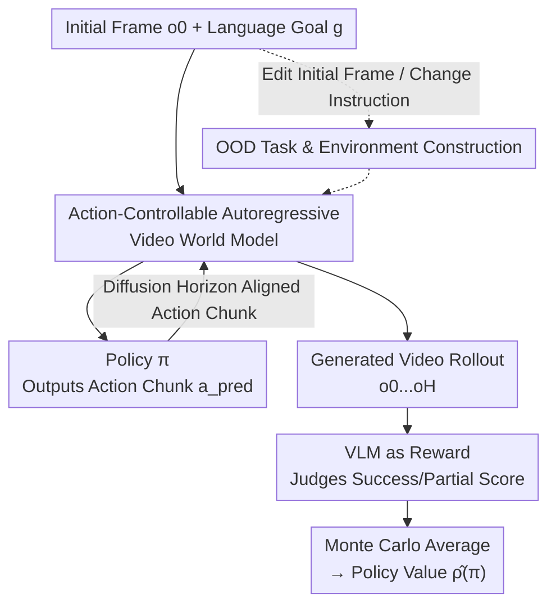

# WorldGym: World Model as an Environment for Policy Evaluation

**Conference**: ICLR 2026  
**Paper**: [Project Page](https://world-model-eval.github.io)  
**Code**: https://world-model-eval.github.io (Available)  
**Area**: Robotics / World Models / Policy Evaluation  
**Keywords**: World Models, Offline Policy Evaluation, VLA Policies, Action-conditioned Video Generation, Monte Carlo Rollout

## TL;DR
This paper trains WorldGym, an action-conditioned autoregressive video world model, as a "virtual environment." Robot policies perform rollouts within this model, and a VLM is used for scoring to estimate policy success rates before real-world deployment. Experiments demonstrate that the success rates in the world model are highly correlated with real-world success rates (Pearson $r=0.78$) and maintain consistent relative rankings across different policy versions, scales, and training steps.

## Background & Motivation
**Background**: Evaluating robot control policies has long been a major challenge. Traditional approaches involve either real-world testing or manually constructed physical simulators (e.g., MuJoCo, Drake).

**Limitations of Prior Work**: Real-world testing is slow, expensive, and risks damaging hardware; a complete evaluation cycle often takes days. Hand-crafted simulators require significant human effort to model complex dynamics, particularly for soft-body manipulation or high-freedom interactions that are difficult to hard-code, leading to a persistent sim-to-real gap.

**Key Challenge**: Evaluation requires an environment that is both "realistic" and "general." However, manual simulators are inherently limited in the tradeoff between realism and generality—the cost of modeling explodes as one tries to cover more tasks and objects. Meanwhile, model-based reinforcement learning (RL) has explored "learning dynamics from experience for rollouts," but is mostly restricted to single-task settings where learning the dynamics is often harder than learning the policy itself, making it less competitive than model-free methods.

**Goal**: To use a **single** world model as an interactive environment to evaluate the performance of **any policy on any task**, requiring only a single initial frame as input.

**Key Insight**: While tasks and policies are infinite, the physical world we inhabit is unique and follows the same set of physical laws. Thus, learning a single world model can aggregate diverse data from different tasks, environments, and robot morphologies, which is more advantageous than single-task settings. Furthermore, world models can be trained directly on image observations, perfectly matching the perceptual modalities of real robots.

**Core Idea**: Train an action-conditioned autoregressive video generation model as a "universal simulator." Policies perform Monte Carlo rollouts within it, and a VLM acts as a reward function to judge task success, thereby estimating policy value.

## Method

### Overall Architecture
WorldGym reframes "Offline Policy Evaluation (OPE)" as performing Monte Carlo rollouts within a learned world model $\hat{T}(\cdot\mid o,a)$. Given an initial observation $o_0$ and a language goal $g$, the policy $\pi$ and the world model form a closed loop: the policy observes the current frame $\rightarrow$ outputs an action chunk $a_{\text{pred}}$ $\rightarrow$ the world model renders each action into new frames $\rightarrow$ the latest frame is fed back to the policy, repeating for hundreds of steps. The final generated video rollout is handed to a VLM (GPT-4o) to determine task success and assign a reward. Averaging over multiple stochastic rollouts yields the policy value estimate $\hat{\rho}(\pi)$:

$$\hat{\rho}(\pi)=\mathbb{E}\big[\hat{R}([o_0,\dots,o_H],g)\,\big|\,a\sim\pi(o,g),\,o'\sim\hat{T}(o,a),\,o=o'\big]$$

Since the entire environment only requires a single initial frame for initialization, the authors can directly edit this frame (using image generation models to add objects or change colors) or modify language instructions to "generate" OOD tasks and environments for stress-testing policy generalization.

### Key Designs

**1. Action-Controllable Autoregressive Video World Model: Making Every Frame Obedient to Actions**

The world model must accurately predict the next frame based on actions and continue rollouts autoregressively. The authors train a Latent Diffusion Transformer on frame-action paired sequences and use **Diffusion Forcing** for autoregressive step-by-step generation. Action injection is critical: robot action vectors for each frame are linearly projected to the model dimension and **element-wise added to the diffusion timestep embeddings**, then used to condition the entire model via AdaLN-Zero (analogous to class conditioning in DiT). To ensure the model does not ignore action signals in favor of video priors, the authors propose **action dropout for entire video segments** combined with classifier-free guidance to amplify the difference between "action-conditioned vs. unconditional" predictions. Temporal dependencies are handled by **causal temporal attention blocks** interspersed between spatial attention blocks, ensuring frame $t$ only attends to the past.

**2. Alignment of Diffusion Horizon with Action Chunk Size: Efficiently Adapting to Various Policies**

Different robot policies output varying numbers of actions (e.g., 1 step vs. an entire chunk). If a world model is fixed to denoise $k$ frames in parallel, it becomes inefficient: it wastes computation if the action chunk is smaller than $k$ and fails to utilize parallelism if larger. Thanks to Diffusion Forcing and causal temporal attention masks, WorldGym can **flexibly control the number of frames denoised in parallel** during inference. The authors propose setting the diffusion horizon length directly to the policy's current action chunk size $|a_{\text{pred}}|$. This allows the same world model checkpoint to efficiently serve policies with different chunk sizes, fully utilizing hardware parallelism. This contrasts with models like Cosmos, which require parallel denoising of fixed latent frames (e.g., 16) due to bidirectional attention and fixed context lengths.

**3. VLM as Reward Function: Using GPT-4o for Video-based Success Judgment and Partial Credit**

Under sparse reward settings, task success is essentially a vision-language judgment problem. The authors use GPT-4o as a reward model, feeding it the sequence of rollout frames and the language instruction. Crucially, when comparing two policies that both fail to complete the task end-to-end, a binary 0/1 reward cannot distinguish between them. The authors specify **partial credit criteria** for the VLM—such as "who is closer to completion"—automating a scoring process that previously required manual heuristics.

**4. Single-Frame Initialization $\rightarrow$ Rapid OOD Task/Environment Construction: Turning Generalization Tests into Image/Instruction Editing**

Since the evaluation environment only requires an initial frame, the authors can create Out-Of-Distribution (OOD) scenarios at minimal cost. There are two paths: first, **editing the initial image** using models like Nano Banana to add unseen objects, distractors, or change object attributes, then rolling out from the edited frame; second, **changing language instructions** while keeping the initial frame to construct OOD language tasks. This design allows systematic probing of VLA policy blind spots: for instance, finding that OpenVLA struggles to distinguish carrots from oranges by shape alone (only succeeding consistently when the carrot is colored red) and can be fooled by 2D images of objects displayed on screens.

### Loss & Training
The world model is essentially a Latent DiT trained with the frame-by-frame denoising objective of Diffusion Forcing. Actions are injected via diffusion timestep embeddings + AdaLN-Zero, with action dropout used to support classifier-free guidance. Training data comes from multi-task, multi-morphology robot data such as Open-X Embodiment. The reward model (GPT-4o) is not trained. Evaluated policies (RT-1-X, Octo, OpenVLA) and policies trained from scratch (UniPi, DexVLA) are trained on Bridge V2, while the world model remains fixed.

## Key Experimental Results

### Main Results: World Model Success Rate vs. Real-World Success Rate
On the OpenVLA Bridge evaluation suite (17 challenging tasks not in the Bridge V2 training set, 10 trials per task), three open-source VLA policies were rolled out in WorldGym using real-world initial frames. Their success rates were compared:

| Policy | Real-World Success | World Model Success | Difference |
|------|--------------|--------------|------|
| RT-1-X | 18.5% | 15.5% | ~3% |
| Octo | 20.0% | 23.8% | ~3.8% |
| OpenVLA | 70.6% | 67.4% | ~3.2% |

- Per-task correlation Pearson **$r = 0.78$ ($p < 0.001$)**; the average success rate difference is only **3.3%**.
- The relative ranking (OpenVLA > Octo > RT-1-X) is **perfectly consistent** between the world model and the real world.

### Ranking Retention / OOD Degradation Analysis

| Evaluation Setting | Key Results | Description |
|---------|---------|------|
| Different Versions/Scales | Octo-Base 1.5 > Octo-Small 1.5; OpenVLA 7B (67.4%) ≫ OpenVLA v0.1 7B (27.6%) | Larger and newer models score higher, consistent with real-world findings. |
| Different Training Steps | Success rates for UniPi and DexVLA rise monotonically with training steps. | Aligns with validation MSE decrease; useful for checkpoint selection. |
| OOD Distractors | RT-1-X 15.6% $\rightarrow$ 7.6% (-51%); Octo 23.8% $\rightarrow$ 4.1% (-83%); OpenVLA 67.4% $\rightarrow$ 39.4% (-41.5%) | OpenVLA is the most robust. |
| OOD Language Instructions | "Move the pot to the counter" failed almost entirely, except for 1 success by OpenVLA. | Bridge data lacks trajectories moving objects out of the sink. |

### Key Findings
- **High correlation with real-world success** is the core selling point ($r=0.78$, mean diff 3.3%), suggesting WorldGym can replace multi-day real-world testing with less than 1 hour of GPU time for sanity checks.
- **Relative ranking is more reliable than absolute values**: Rankings were preserved across versions, scales, and training steps, which is highly beneficial for hyperparameter tuning.
- **OOD probing exposes VLA blind spots**: Modern VLAs still struggle with shape-based discrimination and 2D illusions. OpenVLA, with its stronger language backbone and richer pre-training, is the most stable under OOD conditions.

## Highlights & Insights
- **The "One World" observation** is the fundamental premise—it flips the disadvantage of model-based RL (difficulty of learning dynamics vs. policy) into an advantage where multi-task data shares the same physical laws.
- **Diffusion horizon alignment** is a practical engineering insight: a single checkpoint adapts to all action chunk sizes, avoiding the waste of fixed-length contexts found in models like Cosmos.
- **Zero-cost OOD environment construction** via image/instruction editing represents the "generative dividend" of using world models for evaluation, reducing the cost of generalization testing.
- **VLM partial credit** automates previous manual scoring heuristics and provides granularity even when comparing failed policies.

## Limitations & Future Work
- **Realism of object interactions** remains a weakness: Generating high-fidelity interactions (especially contact and deformation) is difficult. The world model is better at rendering robot proprioception than fine-grained object dynamics.
- **Reliance on GPT-4o**: Evaluation quality is capped by VLM judgment accuracy, and closed-source models introduce cost and reproducibility concerns.
- **Absolute success rate bias**: Per-task success rates may deviate from real-world values; caution is needed for scenarios requiring exact absolute metrics.
- Future Directions: Enhancing physical fidelity for contact/soft-body interactions, introducing stronger open-source reward models, and systematizing OOD construction into adversarial evaluation benchmarks.

## Related Work & Insights
- **vs. Manual Simulators (MuJoCo/Drake)**: Traditional sims rely on manual physical modeling and suffer from sim-to-real gaps. WorldGym learns dynamics from real video, saving human effort but sacrificing some interaction fidelity.
- **vs. Single-task Model-based RL (Dreamer, etc.)**: These struggle because learning dynamics for one task is harder than the policy. WorldGym leverages multi-task/morphology data to reverse this.
- **vs. Cosmos-like World Models**: Cosmos uses bidirectional attention and fixed contexts (16 frames). WorldGym uses Diffusion Forcing + causal attention for variable horizons, saving computation.
- **vs. Traditional OPE**: Most OPE assumes full observability or access to ground-truth states in simulation. WorldGym targets real-world systems (image observations, high-frequency control, no ground-truth state).

## Rating
- Novelty: ⭐⭐⭐⭐⭐ Using video world models as general policy evaluation environments and systematically validating real-world correlation is both novel and practical.
- Experimental Thoroughness: ⭐⭐⭐⭐ Covers correlation, ranking, scale/version/step variations, and OOD validation, though absolute bias and interaction fidelity are known issues.
- Writing Quality: ⭐⭐⭐⭐⭐ Clear argumentation ("One World"), smooth transition between method and experiments, and excellent qualitative visualizations.
- Value: ⭐⭐⭐⭐⭐ A safe, reproducible, low-cost sanity check tool before real-world deployment with high utility for iterative robot policy development.

<!-- RELATED:START -->

## Related Papers

- [\[ICLR 2026\] WMPO: World Model-based Policy Optimization for Vision-Language-Action Models](wmpo_world_model-based_policy_optimization_for_vision-language-action_models.md)
- [\[ICLR 2026\] World-In-World: World Models in a Closed-Loop World](world-in-world_world_models_in_a_closed-loop_world.md)
- [\[ICLR 2026\] Ctrl-World: A Controllable Generative World Model for Robot Manipulation](ctrl-world_a_controllable_generative_world_model_for_robot_manipulation.md)
- [\[ICLR 2026\] Sparse Imagination for Efficient Visual World Model Planning](sparse_imagination_for_efficient_visual_world_model_planning.md)
- [\[CVPR 2026\] Chain of World: World Model Thinking in Latent Motion (CoWVLA)](../../CVPR2026/robotics/chain_of_world_world_model_thinking_in_latent_motion.md)

<!-- RELATED:END -->
