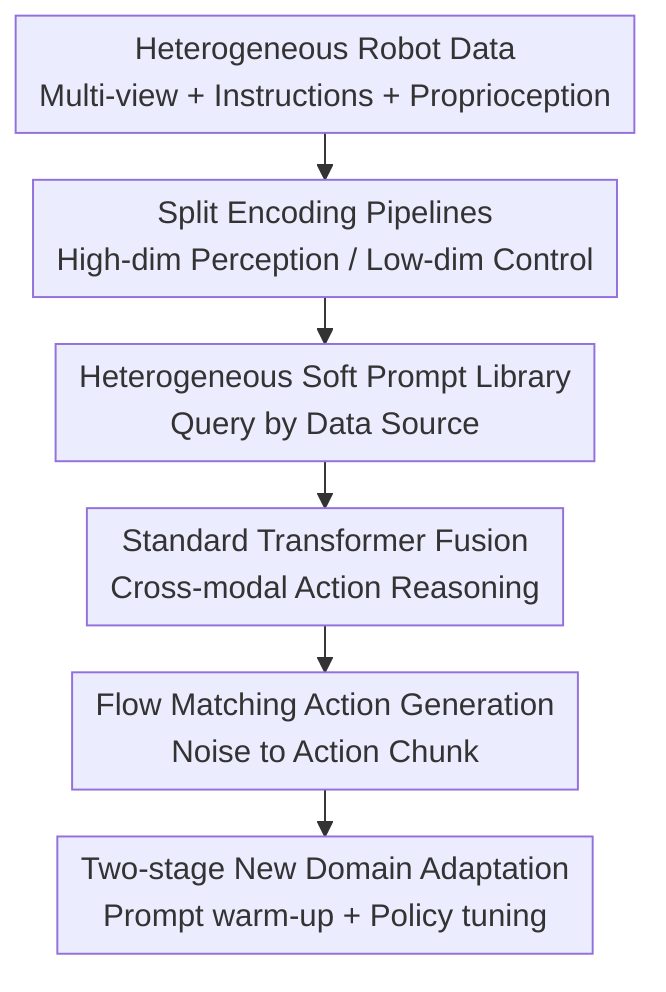

# X-VLA: Soft-Prompted Transformer as Scalable Cross-Embodiment Vision-Language-Action Model

**Conference**: ICLR2026  
**OpenReview**: [https://openreview.net/forum?id=kt51kZH4aG](https://openreview.net/forum?id=kt51kZH4aG)  
**Paper**: [Project Page](https://thu-air-dream.github.io/X-VLA/)  
**Code**: TBD  
**Area**: Robotics / Cross-Embodiment Vision-Language-Action  
**Keywords**: Cross-embodiment robotics, VLA, soft prompt, flow matching, robot pre-training  

## TL;DR
X-VLA encodes hardware and collection variances from each robot data source into a set of learnable soft prompts. Combined with a concise Transformer + flow matching action generation framework, it achieves robust cross-embodiment adaptation after pre-training on large-scale heterogeneous robot data.

## Background & Motivation
**Background**: General-purpose robotic policies are transitioning from single-task imitation learning toward Vision-Language-Action (VLA) models. These models receive multi-view images, natural language instructions, and proprioceptive states to output a sequence of future actions. Recent works like the RT series, OpenVLA, $\pi_0$, and GR00T attempt to combine the open-vocabulary understanding of VLMs with robotic action generation to enable a single model to cover multiple robots, tasks, and environments.

**Limitations of Prior Work**: The primary difficulty lies beyond merely aligning action dimensions. Large-scale robotic data originates from different hardware platforms, camera placements, control frequencies, task distributions, and collection protocols. For the same instruction "put the object in the container," the corresponding visual perspective, proprioception meaning, and action scale differ across Franka, UR5, AgileX dual-arm, or WidowX platforms. Many existing VLAs assign different action heads to different embodiments to handle action space differences but fail to inform the model during early perception and reasoning stages about which robot, camera, or control interface a set of tokens belongs to.

**Key Challenge**: Cross-embodiment pre-training requires a shared backbone to accumulate general manipulation knowledge, yet heterogeneous data pulls the backbone toward conflicting distributions. Complete sharing leads to semantic misalignment and training instability, while assigning too many robot-specific parameters limits scalability and weakens cross-robot knowledge transfer.

**Goal**: The authors aim to identify a low-cost heterogeneous modeling approach that explicitly absorbs hardware, camera, and data source variances without disrupting the pre-trained VLM representations. The goal is to ensure stable pre-training on 290,000 trajectories across 7 data sources while enabling rapid adaptation to new robots with minimal parameters.

**Key Insight**: The paper reframes "different robot data sources" as "different tasks" in multi-task learning. In NLP, soft prompts use a small number of learnable tokens to guide large models toward specific tasks. Transferred to robotics, each data source can have its own prompt tokens to automatically learn latent representations of hardware configurations through end-to-end training, eliminating the need for manual robot descriptions.

**Core Idea**: Inject embodiment information at the early multimodal fusion stage using data-source-level soft prompts. This allows the shared Transformer backbone to learn cleaner cross-embodiment general policies while delegating robot-specific differences to lightweight prompts and action projections.

## Method

### Overall Architecture
X-VLA is a VLA policy model based on flow matching. It takes primary view images, optional auxiliary views, language instructions, proprioceptive states, noisy action chunks, and continuous time $t$ as inputs. These are converted into tokens through individual encoding pipelines and concatenated with soft prompts queried by data source. Finally, a stack of standard self-attention Transformer encoders performs cross-modal reasoning to predict the action velocity field.

Training is divided into two stages: the first stage involves joint pre-training of the backbone and soft prompts across 7 hardware/camera configurations (e.g., AGIBOT, Droid, RoboMind). In the second stage, when facing a new robot or task, the backbone is frozen to warm up new prompts, followed by joint fine-tuning of the entire policy or using PEFT like LoRA to tune minimal parameters.

### Key Designs
**1. Heterogeneous Soft Prompt Library: Injecting Robot Variance into Shared Reasoning Space Early**

The difficulty of cross-embodiment data is that differences appear not only in action output but also in the interpretation of perception and proprioception. X-VLA maintains a set of learnable prompt tokens $p_i$ for each data source $D_i$. During training, the corresponding prompt is queried based on the dataset ID and fed into the Transformer alongside image, language, proprioception, and action tokens. The authors formalize this as $p_i \approx \Phi(h_i)$, where $h_i$ is the hardware configuration, and $\Phi$ is an implicitly learned prompt space mapping rather than a manually defined text template.

This design intervenes in the reasoning process earlier than "one action head per robot" and is more automated than language prompts. Action heads can only handle dimensions at the final output and cannot inform the model about the distinct meanings of primary and wrist views. Handwritten language descriptions depend on template quality and are costly to maintain across many robots. Soft prompts use minimal parameters to let the backbone actively sense the hardware/collection domain of the current sample within the attention mechanism, reducing representation conflicts from mixed data.

**2. Split Encoding Pipeline: Separating VLM Semantic Understanding from Fine-grained Robotic Observation**

X-VLA does not simply feed all images and language into the VLM. Primary view images and language instructions enter a pre-trained VLM encoder (e.g., Florence-2-Large) to handle high-level vision-language grounding. Auxiliary views like wrist cameras are encoded by a shared vision backbone because these views change rapidly and contain high noise, serving as local manipulation cues rather than general semantic features.

Low-dimensional components are also handled separately: proprioceptive state $R_t$, noisy action chunks $A_t$ in flow matching, and time embedding $t$ are concatenated and projected into the high-dimensional token space via lightweight linear layers. The key is not structural complexity but ensuring different modalities are organized at appropriate scales before being fused by the standard Transformer. Consequently, the model retains VLM capabilities without proprioception and action tokens being overwhelmed by high-dimensional vision-language features.

**3. Flow Matching Action Generation: Predicting Future Action Trajectories via Continuous Denoising**

X-VLA does not directly regress single-step actions but learns a velocity field from random noise to expert action chunks. Given an expert action sequence $A$ and noise $A_0 \sim \mathcal{N}(0, I)$, the model constructs an interpolation $A_t=(1-t)A_0+tA$ during training and predicts the velocity $A-A_0$ from $A_t$ toward the target. In inference, the complete action chunk is obtained by starting from noise and updating via an ODE.

This choice aligns well with robotic control: an action chunk containing a short-term future trajectory expresses intent better than single-step control. Flow matching handles continuous end-effector poses more naturally than discrete action tokenization. The paper unifies actions as end-effector poses: 3D position, Rotate6D absolute rotation, and binary gripper status. MSE is used for position/rotation, while BCE is used for the gripper, reducing label inconsistencies across different robotic control interfaces.

**4. Two-stage Adaptation and Training Recipe: Warming up New Prompts before Specialization**

During new robot adaptation, X-VLA avoids immediate full fine-tuning. It first introduces a new set of soft prompts $p_{new}$, freezes the pre-trained backbone, and optimizes only the prompts to find a suitable entry point for the new hardware configuration in the existing cross-embodiment representation space. Subsequently, it jointly optimizes prompts and policy parameters, or uses PEFT like LoRA to specialize with few parameters.

The authors also include several critical engineering stabilization measures: smaller learning rates for soft prompts and vision-language modules to avoid disrupting pre-trained representations; using 30 anchor points downsampled from a 4-second trajectory as targets instead of frame-by-frame values to reduce human demonstration noise through abstract intent supervision; and balanced sampling across domains and trajectories to prevent large datasets from dominating. These recipes explain why the soft prompt mechanism scales stably across 290,000 heterogeneous trajectories.

### A Full Example
Suppose a pre-training batch includes three types of samples: AGIBOT head/wrist three-view dual-arm data, Droid Franka left/wrist view data, and RoboMind UR5 top-view data. A traditional shared VLA would feed all these into the same backbone and differentiate only at the action head; the model would have to guess the hardware source from images and proprioception values, risking the confusion of "camera placement changes" with "task semantic changes."

In X-VLA, AGIBOT samples query AGIBOT prompts, Droid-Left samples query Droid-Left prompts, and UR5 samples query UR5 prompts. Primary view and language form high-level task tokens, wrist views form local manipulation tokens, and proprioception plus noisy actions form control tokens. These tokens are concatenated with corresponding prompts and enter the Transformer. The attention mechanism can immediately perceive "this is three-view dual-arm" or "this is single-arm top-view" as a soft condition, allowing the same "pick and place" instruction to be interpreted as distinct executable action trajectories within different hardware contexts.

When adapting to an unseen WidowX, the model initializes a set of WidowX prompts and trains only the prompts and action heads with a few demonstrations. This process effectively positions the new hardware near existing single-arm robot prompts; joint fine-tuning or LoRA follows. Prompt visualizations show that trained prompts cluster by hardware configuration—two Franka views in Droid even interweave—indicating the model learns continuous representations with embodiment similarity rather than just categorical data source IDs.

### Loss & Training
The pre-training objective is a flow matching version of behavioral cloning. Given observation $o$, expert action chunk $A$, noise $A_0$, and time $t \sim U(0,1)$, the model learns the velocity field $v_\theta(A_t,o,t)$ with the optimization objective:

$$
L^{FM}_{BC}(\theta)=\mathbb{E}_{t,(o,A)}\left[\left\|v_\theta(A_t,o,t)-(A-A_0)\right\|^2\right],\quad A_t=(1-t)A_0+tA.
$$

X-VLA-0.9B uses Florence-2-Large as the VLM encoder. The action generation backbone is a standard Transformer with 24 layers and a hidden size of 1024, using a soft prompt length of 32. Pre-training data includes approximately 290K episodes across 7 data sources and 5 types of robot arms from AGIBOT, Droid, and RoboMind. It is trained for 200K iterations with a global batch size of 1024 and AdamW learning rate of $1\times10^{-4}$. For new domain adaptation, a 1000-iteration prompt/action head warm-up is followed by joint training; in the PEFT setting, only ~9M parameters are tuned (approx. 1% of the 0.9B model).

## Key Experimental Results

### Main Results
The main experiments cover 6 simulation environments and 3 real robot platforms. The core conclusion is that X-VLA-0.9B, with only 0.9B parameters, outperforms larger 3B-9B VLAs on most benchmarks and maintains strong results across cross-robot, cross-task, cross-environment, and dexterous manipulation scenarios.

| Benchmark | Metric | X-VLA-0.9B | Prev. SOTA | Gain |
|--------|------|------|----------|------|
| Simpler Visual Matching (Google) | Avg success | 80.4 | 78.0 | +2.4 |
| Simpler Visual Aggregation (Google) | Avg success | 75.7 | 72.7 | +3.0 |
| Simpler WidowX | Success | 95.8 | 71.9 | +23.9 |
| LIBERO Average | Avg success | 98.1 | 97.1 | +1.0 |
| RoboTwin-2.0 Easy | Avg success | 70.0 | 46.4 | +23.6 |
| RoboTwin-2.0 Hard | Avg success | 39.0 | 16.4 | +22.6 |
| VLABench | Avg score | 51.1 | 39.7 | +11.4 |
| NAVSIM | PDMS | 87.3 | 81.7 | +5.6 |

Real robot results are equally compelling. On WidowX, X-VLA outperforms baselines across 5 pick-and-place tasks in the BridgeData-v2 style. For AgileX dual-arm cloth folding, after adaptation with 1200 Soft-FOLD trajectories, it achieves near 100% success rate (~33 folds/hour). On AIRBOT, a robot unseen during pre-training, PEFT enables rapid adaptation with minimal cloth-pick demonstrations.

| Real/Low-cost Adaptation Setting | Tunable Params | X-VLA Results | Comparison | Note |
|------|---------|---------|------|------|
| LIBERO PEFT | 9M | ~93% Avg Success | $\pi_0$ full/large ~94% | Near 3B model performance with 1% params |
| Simpler-WidowX PEFT | 9M | 54.2 | $\pi_0$ 55.7 | Close results with 300x fewer tunable params |
| AIRBOT cloth-pick | Few PEFT params | Adaptable on unseen robot | No PT specialized version | Validates new embodiment transfer |
| AgileX cloth folding | Full policy adapt | ~100% success, 33 folds/hour | ACT, $\pi_0$ finetune | Shows gains in dexterous dual-arm tasks |

### Ablation Study
Component ablations reveal a clear causal chain: naive heterogeneous pre-training degrades adaptation, while action alignment, encoding pipelines, and soft prompts are key to unlocking pre-training benefits.

| Configuration | PT Val Error | Adaptation Success | Note |
|------|---------|------|------|
| Baseline w/o PT | - | 4.1 | Hard to use with only base model |
| + Custom LR w/o PT | - | 39.6 | LR recipe improves single-domain stability |
| + Heterogeneous PT | 0.110 | 25.0 | Naive mixed pre-training hurts adaptation |
| + Action alignment / intention abstraction / balanced sampling | 0.077 | 50.0 | Data processing improves supervision consistency |
| + Transformer encoder instead of DiT | 0.071 | 47.9 | Simpler structure but limited individual gain |
| + Encoding pipeline | 0.053 | 64.6 | Split encoding significantly improves adaptation |
| + Soft prompt | 0.041 | 73.8 | Directly validates contribution of hetero-prompts |
| + Scaling up | 0.032 | 89.6 | Larger model further reduces error and improves adaptation |
| + Two-step adaptation | 0.032 | 95.8 | Strongest results after prompt warm-up |

BACKBONE comparison: X-VLA's standard Transformer encoder (Val Error 0.041) outperforms DiT (0.077), MM-DiT (0.140), and $\pi_0$-style decoders (0.056), indicating the key is cleaning input encoding and heterogeneous conditions rather than stacking complex action decoders.

| Design Query | Comparison | Key Result | Conclusion |
|------|------|------|------|
| Prompt learned hardware diff | T-SNE 7 source prompts | Clustered by hardware; Franka views interweave | Not just dataset IDs |
| Unseen robot prompt source | random / AgiBot / UR5 / two-step adapted | UR5 better early; two-step is best | Embodiment similarity affects transfer |
| Prediction window length | 1s / 2s / 4s / 8s | Simpler-WidowX Success 0 / 8.3 / 29.16 / 27.08 | 4s window best for intent abstraction |
| PEFT tunable params | prompt only / +linear / +LoRA / unfreeze last layer | 0 / 8.3 / 54.2 / 68.9 | Prompt is vital; high perf needs some capacity |

### Key Findings
- Soft prompts are the core source of gain: Adding soft prompts to the encoding pipeline reduced PT validation error from 0.053 to 0.041 and increased adaptation success from 64.6 to 73.8.
- PT validation error correlates strongly with downstream success; the authors use action prediction $\ell_1$ error as a scaling proxy, showing no signs of saturation as model size and data diversity increase.
- Naive heterogeneous pre-training causes negative transfer, suggesting cross-embodiment VLA requires explicit modeling of heterogeneous sources rather than just "dumping data."
- PEFT results indicate the backbone learns embodiment-agnostic representations, but prompt-only is insufficient; new robot adaptation requires LoRA or unfreezing layers for capacity.
- Real cloth folding results demonstrate that X-VLA benefits from large-scale pre-training in long-horizon, non-rigid, and dual-arm dexterous tasks beyond benchmark numbers.

## Highlights & Insights
- The placement of soft prompts is strategic. It doesn't patch actions at the output or rely on manual descriptions at the input but provides a continuous, learnable hardware context during the token fusion stage, influencing vision, proprioception, and actions simultaneously.
- The breakdown of "heterogeneity" is thorough. While many VLA papers reduce cross-embodiment to action space mismatch, X-VLA identifies that camera variation, task distribution, control frequency, and protocols also confuse a shared backbone.
- Architectural restraint is a merit. The model avoids complex MoE or numerous domain-specific adapters in favor of a standard Transformer encoder, making scaling behavior more interpretable and sustainable for future foundation models.
- The 4-second, 30-anchor point action abstraction is valuable. For noisy human demonstrations, frame-by-frame actions might overfit jitters; downsampling focuses pre-training on "where to go next."
- Prompt visualization provides rare interpretability. The interweaving of Franka views and separation of single/dual arms suggests the prompt space could move toward embodiment retrieval or few-shot initialization.

## Limitations & Future Work
- 0.9B and 290K episodes are not the ultimate scale. Scaling hasn't saturated, but constraints in compute and high-quality data meant rules for larger backbones or multi-million trajectory scales were not validated.
- New robots still require demonstrations and adaptation. X-VLA aims for rapid adaptation rather than true zero-shot deployment; even with prompt warm-up, some trajectories must be collected for new hardware.
- Supervision relies primarily on low-dimensional action labels. The authors acknowledge the limited information in action labels and suggest combining 3D reasoning, physical states, sub-goals, or self-supervised video to learn richer task structures.
- Soft prompts depend on dataset IDs or domain labels. In open deployment where data boundaries are blurred or robot configurations shift, automatic prompt selection or composition remains an open question.
- While benchmark coverage is broad, hardware difficulty and demonstration counts vary; "one model beats all" claims should be interpreted with awareness of these protocol differences.

## Related Work & Insights
- **vs $\pi_0$**: $\pi_0$ is a flow-based VLA showing general robotic control; X-VLA focuses more on cross-embodiment heterogeneous pre-training, using soft prompts to reduce adaptation costs. X-VLA achieves near $\pi_0$ results with ~9M tunable parameters in PEFT.
- **vs OpenVLA / OpenVLA-OFT**: OpenVLA emphasizes open-source VLA and efficient fine-tuning; X-VLA emphasizes hardware/camera/task distribution variances in mixed-robot pre-training, proving shared backbones/heads alone cannot stably absorb heterogeneous data.
- **vs HPT-style heterogeneous pretraining**: HPT-style projections align observations but risk altering VLM feature distributions; X-VLA uses soft prompts as auxiliary tokens to guide attention with minimal interference to existing representations.
- **vs language prompt**: Language prompts describe hardware textually but rely on manual templates; soft prompts turn descriptions into learnable vectors, capturing nuances (cameras, frequencies) that text might miss.
- **Insights for future research**: Combining prompt spaces with explicit robot parameters (DoF, extrinsics, frequency) could lead to retrievable, composable, and interpolatable embodiment representations, paving the way for plug-and-play robot foundation models.

## Rating
- Novelty: ⭐⭐⭐⭐☆ Systematic introduction of soft prompts to cross-embodiment VLA; simple mechanism but accurate problem targeting.
- Experimental Thoroughness: ⭐⭐⭐⭐⭐ Covers 6 sim benchmarks, 3 real robots, scaling, ablations, prompt analysis, and PEFT; strong support for conclusions.
- Writing Quality: ⭐⭐⭐⭐☆ Clear main line and complete engineering details; minor claims like "one model to beat them all" require nuanced interpretation.
- Value: ⭐⭐⭐⭐⭐ Highly practical for mixed-robot data training, offering a scalable and reproducible baseline for heterogeneous modeling in cross-embodiment VLA.

<!-- RELATED:START -->

## Related Papers

- [\[ICLR 2026\] Spatially Guided Training for Vision-Language-Action Model](spatially_guided_training_for_vision-language-action_model.md)
- [\[ICLR 2026\] Spatial Forcing: Implicit Spatial Representation Alignment for Vision-language-action Model](spatial_forcing_implicit_spatial_representation_alignment_for_vision-language-ac.md)
- [\[ICLR 2026\] Unified Diffusion VLA: Vision-Language-Action Model via Joint Discrete Denoising Diffusion Process](unified_diffusion_vla_vision-language-action_model_via_joint_discrete_denosing_d.md)
- [\[ICLR 2026\] UniVLA: Unified Vision-Language-Action Model](unified_vision-language-action_model.md)
- [\[ICML 2026\] Dual-Stream Diffusion for World-Model Augmented Vision-Language-Action Model](../../ICML2026/robotics/dual-stream_diffusion_for_world-model_augmented_vision-language-action_model.md)

<!-- RELATED:END -->
