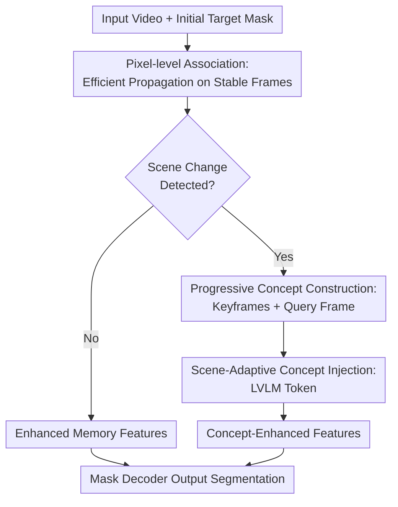

# Advancing Complex Video Object Segmentation via Progressive Concept Construction

**Conference**: ICLR2026  
**OpenReview**: [https://openreview.net/forum?id=hDM3YphhVx](https://openreview.net/forum?id=hDM3YphhVx)  
**Code**: To be confirmed  
**Area**: Video Object Segmentation / Semantic Segmentation  
**Keywords**: Video Object Segmentation, Concept Guidance, LVLM, Scene Switching, SeCVOS

## TL;DR
This paper introduces Segment Concept (SeC), which injects object-level "concept representations" extracted by Large Vision-Language Models (LVLMs) into a SAM 2.1-style Video Object Segmentation (VOS) pipeline on demand. This approach significantly reduces appearance-based interference and object reappearance failures in complex multi-shot scenarios while establishing the SeCVOS benchmark specifically for evaluating semantic-level VOS capabilities.

## Background & Motivation
**Background**: Semi-supervised Video Object Segmentation (VOS) typically starts with a target mask in the first frame and aims to continuously track and segment the same target in subsequent frames. Recent mainstream approaches center on memory-based matching: storing object features from historical frames in a memory bank, retrieving the target in query frames via pixel-level or instance-level similarity matching, and outputting segmentation results through a mask decoder. SAM 2 and its long-video variants have pushed this paradigm to high engineering standards, performing stably on standard benchmarks like DAVIS, YouTube-VOS, and SA-V.

**Limitations of Prior Work**: Real-world videos do not always feature objects moving smoothly within continuous shots. Movie clips, long-video editing, surveillance, and storytelling content frequently involve scene cuts, occlusions, object departures followed by reappearances, drastic perspective changes, and background characters wearing similar clothing. In these cases, traditional memory matching primarily observes local textures, colors, and shape similarities, making it prone to mistaking "look-alike" distractors for the target or losing the target entirely after significant appearance changes.

**Key Challenge**: Human recognition of the same object in a video does not rely solely on pixel appearance continuity; instead, humans progressively build an object-level concept: who this person is, what role they play, what object they are holding, and what semantic function they serve in the scene. Existing VOS models lack these high-level semantic concepts accumulated across frames. Consequently, in multi-shot contexts, even strong low-level matching can only mitigate local drift and cannot truly resolve "identical object identity" determination.

**Goal**: The authors aim to introduce an object-level concept representation without abandoning the efficient pixel-level association capabilities of SAM 2. This allows the model to propagate masks quickly on normal continuous frames while invoking stronger semantic reasoning to re-lock the target during scene changes, object reappearances, or sudden appearance shifts.

**Key Insight**: It is observed that LVLMs already possess strong image/video semantic understanding capabilities. If several keyframes and the current query frame are provided to an LVLM, it can implicitly summarize "what this target actually is" from multi-frame visual evidence without needing to generate text descriptions. Thus, the authors use the LVLM as a concept extractor, representing the target concept via the hidden state of a special token and injecting it into the segmentation model.

**Core Idea**: Complement low-level appearance matching in VOS with "progressive object concept construction." This means invoking LVLM-formed concept guidance only when scene changes truly occur, while continuing to use efficient pixel-level association during stable segments.

## Method

### Overall Architecture
SeC is built upon SAM 2.1-large, reusing its image encoder and mask decoder while adding two complementary paths: an enhanced pixel-level association memory for processing temporally continuous frames with minor appearance changes, and an LVLM concept guidance module for extracting object-level semantic representations from keyframes during scene switches. During online inference, the model first uses lightweight scene change detection to decide whether to activate concept guidance. If no change is detected, it follows regular memory matching; if a significant change is detected, it sends keyframes, the query frame, and a special `<SEG>` token into the LVLM. The hidden state of the `<SEG>` token is taken as the target concept vector and fused into the query frame features via cross-attention.

The overall process can be described as "relying on memory for fast tracking normally, and relying on concepts to re-identify targets at critical moments." The keyframe library updates progressively as the video advances, including the first frame and recent representative high-confidence frames. Consequently, the concept vector is not a fixed one-time text label but an object-level representation gradually formed as the model observes more target states.

### Key Designs
**1. Pixel-level Association: Retaining the Most Reliable Continuous Frame Propagation for VOS**

The authors did not transform VOS entirely into an LVLM reasoning task, as most adjacent frames still possess strong temporal continuity. In these segments, pixel-level matching is inexpensive and reliable. SeC adopts SAM 2's memory attention as a baseline and further extends long-term memory: temporal positional encoding supports a wider window of up to 22 frames, while drawing from SAM2Long’s object-aware filtering to only include frames with non-zero occlusion scores (visible targets) in the memory bank. This allows the model to cover longer ranges without polluting the memory bank with non-target or heavily occluded frames.

**2. Progressive Concept Construction: Using Keyframes for LVLM to Summarize Identity Instead of Generating Text**

SeC maintains a sparse keyframe library, initialized with the first frame and updated only when a new frame significantly differs from existing keyframes and the segmentation result is sufficiently confident. This condition is crucial: significant difference ensures keyframes cover new perspectives and scenes, while confidence prevents feeding drifted masks into the LVLM. To control input length, the library retains the first frame and a FIFO window of recent representative keyframes.

During concept construction, the model inputs these temporally ordered keyframes and the query frame into InternVL 2.5, appending a special `<SEG>` token at the end of the sequence. Unlike approaches like LISA that generate segmentation-related text, SeC directly extracts the hidden embedding of the `<SEG>` token as the target concept vector. This vector is understood as an "identity representation compressed from multi-frame observations," encoding roles and semantic categories beyond mere appearance attributes like "red clothes" or "round shape."

**3. Scene-Adaptive Concept Injection: Invoking LVLM Only at Semantic Breaks**

While LVLM concepts are useful, per-frame invocation is impractical. SeC designs scene-adaptive activation: it compares the current and previous frames using the Bhattacharyya distance of HSV color histograms. When the distance exceeds a threshold of 0.35, it identifies a scene change and activates LVLM concept guidance. When not triggered, the model sends memory-enhanced image features to the mask decoder; when triggered, the concept vector from the LVLM fuses with spatial features of the current frame via lightweight cross-attention and is added point-wise to memory-enhanced features before the decoder outputs the mask.

**4. SeCVOS Benchmark: Turning "Complex Semantic Scenarios" into a Measurable Task**

The authors argue that existing VOS benchmarks struggle to expose weaknesses in concept-level reasoning. Thus, they constructed the Semantic Complex Scenarios Video Object Segmentation (SeCVOS) benchmark. It consists of 160 manually annotated multi-shot videos with an average duration of 29.36 seconds, 4.26 scenes, and an object disappearance rate of 30.2%. Compared to DAVIS or SA-V, SeCVOS features higher scene counts and disappearance/reappearance frequencies, reflecting real-world cross-shot target identification.

### Loss & Training
SeC adopts a two-stage training strategy. The first stage trains the pixel-level association memory using the 2k videos from the SA-V training set with the most detected scene changes. This stage updates only the memory attention module while freezing other components over 40 epochs with a learning rate of $5 \times 10^{-6}$.

The second stage fine-tunes the LVLM concept guidance module. Approximately 190k target instances from SA-V are used. For each training sample, 1 to 7 reference frames are randomly selected alongside a query frame and 0 to 2 distractor frames with incorrect annotations. Target prompts consist of green outlines around target edges to inform the LVLM of the target without obscuring visual details. InternVL 2.5-4B is fine-tuned via LoRA with a learning rate of $4 \times 10^{-5}$, while SAM 2 parameters remain frozen. The loss function is consistent with SAM 2.

## Key Experimental Results

### Main Results
SeCVOS is the most critical evaluation in this paper as it specifically examines target identity maintenance under multi-scene changes.

| Method | No Scene Change J&F | Single Scene Change J&F | Multi-Scene Change J&F | Overall J&F |
|------|----------------|----------------|----------------|-------------|
| XMem | 71.9 | 47.0 | 41.9 | 48.4 |
| Cutie-base | 72.5 | 53.0 | 48.3 | 52.7 |
| SAM 2.1 | 79.4 | 58.5 | 52.4 | 58.2 |
| SAMURAI | 81.8 | 60.6 | 59.3 | 62.2 |
| SAM2.1Long | 81.3 | 61.8 | 58.5 | 62.3 |
| SeC | 84.2 | 69.6 | 67.5 | 70.0 |

On standard VOS benchmarks, SeC also demonstrates robustness, achieving competitive results on SA-V, LVOS v2, and MOSE v2.

### Ablation Study
Ablation of modules shows that SeC's gains are multi-faceted. The pixel-level association module contributes significantly to SA-V, while the concept guidance module provides the largest boost on SeCVOS.

| Configuration | SA-V J&F | SeCVOS J&F |
|------|----------|------------|
| SAM 2.1 baseline | 78.6 | 58.2 |
| + Pixel-level Association | 82.4 | 62.2 |
| + Pixel-level Association + Concept Guidance | 82.7 | 70.0 |

### Key Findings
- The value of concept guidance is primarily evident in scenarios requiring semantic identity judgment: gains on SeCVOS were from 62.2 to 70.0, compared to 82.4 to 82.7 on SA-V.
- Sparse triggering is sufficient. With a trigger rate of approx. 7.4%, SeC achieves 70.0 J&F at 14.8 FPS on SeCVOS.
- Offline concept construction outperforms online construction (71.8 vs 70.0), validating the hypothesis that concepts become more complete with more observed keyframes.

## Highlights & Insights
- SeC cleverly utilizes the LVLM as an implicit concept extractor rather than a textual reasoner, bypassing the long chain of generating and parsing text.
- Scene-adaptive triggering is pragmatic, reserving expensive reasoning for high-risk moments like cuts and reappearances.
- SeCVOS quantifies the "semantic gap" in VOS, showing that SAM 2.1 drops significantly in multi-scene changes while SeC's advantage grows with scene complexity.

## Limitations & Future Work
- Concepts still depend on observed keyframes; extreme perspective differences can still cause failure.
- Scene change detection relies on a heuristic (HSV histograms). Future work could explore learnable or uncertainty-driven triggers.
- The training and deployment requirements (Fine-tuning InternVL 2.5, A800 GPUs) are higher than pure SAM 2 variants.

## Related Work & Insights
- **vs SAM 2 / SAM 2.1**: SeC adds LVLM concept vectors during scene switches to stabilize multi-shot tracking.
- **vs SAM2Long**: While SAM2Long emphasizes longer visual memory, SeC introduces higher-level semantic constraints when appearance matching fails.
- **vs LISA / etc.**: Unlike reasoning segmentation models that use language interfaces, SeC integrates LVLM hidden states directly into the VOS propagation path for better online performance.

## Rating
- Novelty: ⭐⭐⭐⭐☆
- Experimental Thoroughness: ⭐⭐⭐⭐⭐
- Writing Quality: ⭐⭐⭐⭐☆
- Value: ⭐⭐⭐⭐⭐

<!-- RELATED:START -->

## Related Papers

- [\[CVPR 2026\] Efficient Video Object Segmentation and Tracking with Recurrent Dynamic Submodel](../../CVPR2026/segmentation/efficient_video_object_segmentation_and_tracking_with_recurrent_dynamic_submodel.md)
- [\[CVPR 2026\] RMAE-ProGRess: Advancing Semantic Segmentation in Unstructured Environments](../../CVPR2026/segmentation/rmae-progress_advancing_semantic_segmentation_in_unstructured_environments.md)
- [\[CVPR 2026\] SemLayer: Semantic-aware Generative Segmentation and Layer Construction for Abstract Icons](../../CVPR2026/segmentation/semlayer_semantic-aware_generative_segmentation_and_layer_construction_for_abstr.md)
- [\[CVPR 2026\] Cross-Domain Few-Shot Segmentation via Multi-view Progressive Adaptation](../../CVPR2026/segmentation/cross-domain_few-shot_segmentation_via_multi-view_progressive_adaptation.md)
- [\[ECCV 2024\] ActionVOS: Actions as Prompts for Video Object Segmentation](../../ECCV2024/segmentation/actionvos_actions_as_prompts_for_video_object_segmentation.md)

<!-- RELATED:END -->
