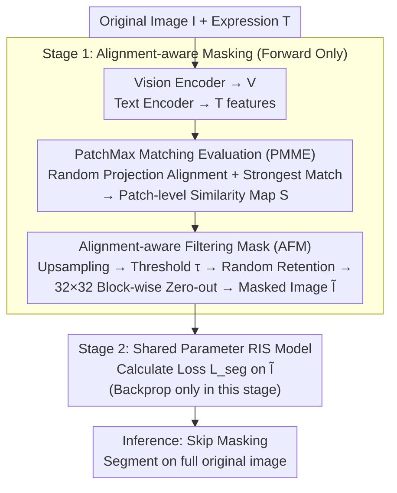

# AMLRIS: Alignment-aware Masked Learning for Referring Image Segmentation

**Conference**: ICLR 2026  
**arXiv**: [2602.22740](https://arxiv.org/abs/2602.22740)  
**Code**: [GitHub](https://github.com/pipashu1/AMLRIS)  
**Area**: Image Segmentation  
**Keywords**: referring image segmentation, vision-language alignment, masked learning, cross-modal similarity  

## TL;DR
The authors propose an Alignment-aware Masked Learning (AML) strategy that quantifies vision-language patch-level alignment and filters low-alignment pixels. This allows the RIS model to focus on reliable regions during training, achieving SOTA results across all 8 RefCOCO splits without any architectural modifications.

## Background & Motivation

**Background**: Referring image segmentation (RIS) aims to precisely segment target objects in an image based on a natural language expression (e.g., "the giraffe closest to the person"). Its core performance depends on fine-grained pixel/patch-level alignment between vision and language. Mainstream methods (LAVT, CARIS, DETRIS) follow a trajectory of encoding visual and textual features separately, then aligning them using increasingly complex fusion modules.

**Limitations of Prior Work**: Such methods implicitly assume "all regions in the image are equally important," applying segmentation loss to **all pixels**. However, RIS samples typically have only one target annotated, making the supervision signal sparse. Under dense loss, gradients backpropagated from regions unrelated to the expression dominate training, causing the model to overfit to irrelevant areas. Furthermore, standard data augmentation (e.g., flipping, color jittering) often destroys the semantic consistency of referring expressions—flipping invalidates "on the left," while color jittering distorts "woman in red."

**Mechanism**: Rather than using more complex fusion to model all relationships, this work takes the opposite approach: removing regions that "do not match the expression." Before optimization, the alignment level of each patch relative to the expression is quantified. Weakly aligned pixels are then masked from the supervision signal, forcing the model to backpropagate gradients only within reliable regions that it can "understand and align."

## Method

### Overall Architecture

AMLRIS does not modify the structure of the RIS model; instead, it wraps it in a two-stage forward pass where parameters are shared across both stages. **Stage 1 (Forward only, no backpropagation)**: The original image $I$ and expression $T$ are fed into vision/text encoders. The PatchMax Matching Evaluation (PMME) calculates patch-level vision-language similarity maps. The Alignment-aware Filtering Mask (AFM) then translates low-similarity regions into an image mask, zero-out processing the original image to obtain the masked image $\tilde{I}$. **Stage 2**: Both $\tilde{I}$ and $T$ are fed back into the same RIS model. Training proceeds with standard segmentation loss, and parameters are updated only during this stage. At inference, the masking stage is skipped entirely, and the model operates on the full original image, resulting in zero deployment overhead.

### Key Designs

**1. PatchMax Matching Evaluation (PMME): Quantifying patch-expression alignment via random projection**

RIS lacks patch-level alignment labels, making it difficult to identify pixels responding to the expression. Moreover, vision and language backbones are often not jointly pre-trained, resulting in mismatched output dimensions that prevent direct similarity calculation. PMME first applies $\ell_2$ normalization to visual features $V$ and textual features $T$, then uses two random Gaussian matrices $W_i, W_t$ to project them into a $D_a$-dimensional shared space to calculate similarity. Using **random projections instead of learnable layers** is crucial: based on the Johnson-Lindenstrauss lemma, random projections maintain cross-modal inner products and angular structures with high probability. This ensures alignment metrics are mathematically grounded without extra training or learnable biases. After projection, SoftMax normalization is applied column-wise. Instead of averaging, the similarity for each patch is taken as the maximum similarity with the **strongest matching** token ("PatchMax")—a pixel is considered strongly aligned if it corresponds highly to even one word in the expression.

**2. Alignment-aware Filtering Mask (AFM): Translating weak alignment to image-level masks**

AFM bilinearly upsamples the patch-level similarity map to the pixel level to enhance spatial consistency. Pixels with scores below threshold $\tau$ are added to a weak-alignment candidate set. To prevent over-filtering useful regions, a dropout ratio $\rho$ is used to randomly retain some weak-alignment pixels. Finally, masking is performed in $B^h \times B^w$ blocks (implemented as $32 \times 32$): a conservative strategy is used where a block is masked if any pixel within it is weakly aligned:

$$M_{\text{block}}^{(p,q)}=\max_{(m,n)\in\mathcal{B}^{(p,q)}}\mathbb{I}\big[(m,n)\in\mathcal{P}_{\text{selected}}\big],\quad \tilde{I}=I\odot(1-M_{\text{block}})$$

Masking by blocks rather than pixels prevents pepper-and-salt masks from interfering with convolutional receptive fields, though coarse-grained blocks may accidentally cover small targets.

### Loss & Training

The loss remains the standard segmentation loss $\mathcal{L}_{seg}$ used by the baseline RIS model. **No additional regularization or alignment loss terms are introduced.** The role of AML is solely to determine "which pixels contribute to the loss" rather than modifying the loss itself. The two-stage forward pass adds approximately $4.9\%$ VRAM and $17.2\%$ training time compared to the CARIS baseline, while maintaining zero overhead at inference.

## Key Experimental Results

### Main Results (mIoU)

| Method | RefCOCO val | testA | testB | RefCOCO+ val | testA | testB | RefCOCOg val | test | Avg |
|------|-------------|-------|-------|--------------|-------|-------|--------------|------|-----|
| LAVT | 74.46 | 76.89 | 70.94 | 65.81 | 70.97 | 59.23 | 63.34 | 63.62 | 68.0 |
| CGFormer | 76.93 | 78.70 | 73.32 | 68.56 | 73.76 | 61.72 | 67.57 | 67.83 | 71.1 |
| CARIS* | 76.77 | 79.03 | 74.56 | 69.33 | 74.51 | 62.69 | 68.87 | 68.51 | 71.8 |
| MagNet | 77.43 | 79.43 | 74.11 | 70.10 | 74.50 | 63.59 | 68.53 | 69.15 | 72.1 |
| **Ours** | **77.89** | **79.53** | **74.99** | **71.33** | **75.61** | **64.61** | **69.24** | **69.73** | **72.9** |

### Ablation Study

| Configuration | RefCOCO val mIoU | Description |
|------|-----------------|------|
| CARIS Baseline | 76.77 | No masking |
| + Random Mask | 76.92 | Minimal effect from random masking |
| + PMME + AFM (Full AML) | **77.89** | Effective alignment-aware masking |
| AML integrated into DETRIS | 75.64 → 76.12 | Consistent improvement across architectures |
| AML integrated into ReLA | +0.5-1.0 | Equally effective |

### Key Findings
- Achieved SOTA on all 8 splits, with an average mIoU of 72.9 (+0.8 vs MagNet).
- The oIoU metric is also superior, reaching 67.37 on RefCOCO+ val (+1.83 vs CARIS).
- Random masking is nearly ineffective (+0.15), proving that alignment-aware mask selection is critical.
- Advantages are more pronounced in scenarios with occlusion or noise (+3.1-3.3 Gain), indicating the model learns more robust alignment features.
- Minimal overhead: Only 4.9% increase in VRAM and 17.2% in training time, with zero inference overhead as masking is skipped.
- Seamlessly integrates into various RIS frameworks like DETRIS, CARIS, and ReLA.

## Highlights & Insights
- **Plug-and-play Training Strategy**: Improves purely during the training phase without modifying architecture or increasing inference cost.
- **Theoretical Guarantees**: Uses the Johnson-Lindenstrauss lemma to rigorously prove that random projections preserve cross-modal inner products.
- **Counter-intuitive Efficacy**: Even though the model never sees a full image during training, it performs better on full images at inference, suggesting that filtering weak alignment regions eliminates misleading gradients.
- **PatchMax Strategy**: Using the maximum similarity with the strongest matching token reflects local alignment quality better than global mean matching.

## Limitations & Future Work
- Hyperparameters $\tau=0.4$ and $\rho=0.25$ may require manual tuning for different datasets.
- Random projection-based alignment relies on initial feature similarity and might miss deep semantic alignment that develops later in training.
- The two-stage forward pass increases training time by 17.2%, which might be a bottleneck for massive datasets.
- Performance has not been verified in open-vocabulary or extremely complex large-scale scenarios beyond the RefCOCO series.
- Block-grained masking ($32 \times 32$) might accidentally cover small target objects.

## Related Work & Insights
- **vs CARIS/LAVT/DETRIS**: These serve as the baseline and comparison methods; while they focus on fusion architectures, AML innovates by refining the optimization signal.
- **vs MaskRIS/MagNet**: These focus on data augmentation but still apply loss to all pixels; AML actively suppresses low-quality gradients.
- **vs CRIS**: CLIP-based pixel adaptation methods align in the pre-trained space; AML is agnostic to the backbone.

## Rating
- Novelty: ⭐⭐⭐⭐ Simple yet effective alignment-aware masking with theoretical support from JL projection.
- Experimental Thoroughness: ⭐⭐⭐⭐ SOTA on all splits, includes robustness and cross-architecture validation.
- Writing Quality: ⭐⭐⭐⭐ Clear theoretical derivations and comprehensive pseudo-code.
- Value: ⭐⭐⭐⭐ A general training strategy that can be immediately applied to existing RIS methods.

<!-- RELATED:START -->

## Related Papers

- [\[CVPR 2026\] SARMAE: Masked Autoencoder for SAR Representation Learning](../../CVPR2026/segmentation/sarmae_masked_autoencoder_for_sar_representation_learning.md)
- [\[ICLR 2026\] Deforming Videos to Masks: Flow Matching for Referring Video Segmentation](deforming_videos_to_masks_flow_matching_for_referring_video_segmentation.md)
- [\[ICLR 2026\] Efficient-SAM2: Accelerating SAM2 with Object-Aware Visual Encoding and Memory Retrieval](efficient-sam2_accelerating_sam2_with_object-aware_visual_encoding_and_memory_re.md)
- [\[ECCV 2024\] ReMamber: Referring Image Segmentation with Mamba Twister](../../ECCV2024/segmentation/remamber_referring_image_segmentation_with_mamba_twister.md)
- [\[AAAI 2026\] RS2-SAM2: Customized SAM2 for Referring Remote Sensing Image Segmentation](../../AAAI2026/segmentation/rs2-sam2_customized_sam2_for_referring_remote_sensing_image_segmentation.md)

<!-- RELATED:END -->
