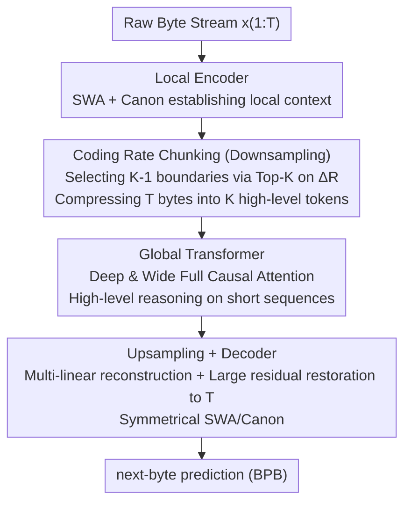

# ByteFlow: Language Modeling through Adaptive Byte Compression without a Tokenizer

**Conference**: ICLR 2026  
**arXiv**: [2603.03583](https://arxiv.org/abs/2603.03583)  
**Code**: Not disclosed  
**Area**: NLP / tokenizer-free LM (Categorized under segmentation)  
**Keywords**: byte-level LM, tokenizer-free, coding rate, hierarchical architecture, self-tokenization  

## TL;DR
The authors propose ByteFlow Net, a hierarchical byte-level language model that operates without a tokenizer. It utilizes the information-theoretic metric of coding rate to adaptively compress raw byte streams into semantic units, outperforming BPE-based baselines and existing byte-level architectures in both pre-training loss and downstream tasks.

## Background & Motivation

**Background**: Modern Large Language Models (LLMs) are built upon fixed BPE tokenizers. Once a tokenizer is trained, the model is restricted to operating at this fixed level of granularity.

**Limitations of Prior Work**: Fixed tokenization exhibits fragile or counter-intuitive behaviors in scenarios involving counting, arithmetic, structured data, and multilingual processing. More fundamentally, tokenization remains the only non-learnable stage in the pipeline, effectively splitting language modeling into two disconnected phases. Existing tokenizer-free solutions have their own shortcomings: pure byte-level models (e.g., MambaByte) face sequences spanning thousands of steps, making all-to-all attention prohibitively expensive; heuristic chunking (e.g., fixed step sizes or space boundaries) introduces strong human inductive biases; and dynamic chunking methods (e.g., BLT, which uses pre-trained entropy models with global thresholds) require multi-stage training rather than being truly end-to-end.

**Key Challenge**: To enable the model to learn "where to cut," a principled criterion is needed for online boundary determination that does not disrupt the static computation graph—otherwise, jittering sequence lengths within a batch would lead to inconsistent memory allocation or Out-of-Memory (OOM) errors.

**Goal**: This work aims to propose a fully end-to-end hierarchical byte-level language model that requires no tokenizer or external entropy model. It uses the coding rate from information theory to adaptively compress raw bytes into semantic units, concentrating the bulk of the computational budget on the compressed short sequences.

## Method

### Overall Architecture

ByteFlow Net aims to address the limitation of hardcoded modeling granularity by allowing the model to decide byte boundaries online. It employs a five-stage hierarchical pipeline: raw bytes are first processed by a Local Encoder for byte-level contextualization, followed by coding rate chunking (Downsampling) that compresses $T$ bytes into $K \ll T$ high-level tokens. These are then passed to a deep and wide Global Transformer for semantic-level reasoning. Finally, an Upsampling stage restores the sequence to byte granularity, and a symmetrical Decoder performs next-byte prediction. Two core principles guide this design: first, concentrating most FLOPs on the shortened compressed sequences while keeping the byte-level entry and exit points lightweight; second, replacing heuristic boundaries with an information-theoretic coding rate to identify high-information positions worthy of being promoted to high-level tokens.

### Key Designs

**1. Local Encoder: Establishing Local Context with Minimal Overhead**

Since byte sequences are extremely long, the $O(T^2)$ cost of full attention is prohibitive. The Local Encoder uses a shallow, narrow Transformer that restricts attention to a sliding window (SWA), reducing complexity to $O(T \cdot w_{local})$. To address the connectivity issues of SWA—where information theoretically requires $T/w_{local}$ layers to traverse the sequence—a Canon Layer (Allen-Zhu, 2025) is inserted into each layer. This is essentially a causal 1D convolution with kernel size 4:

$$Canon(h_t) = w_0 \odot h_t + w_1 \odot h_{t-1} + w_2 \odot h_{t-2} + w_3 \odot h_{t-3}$$

It supplements adjacent byte mixing with negligible parameters and compute, allowing the shallow network to rapidly form reliable local representations for chunking.

**2. Coding Rate Chunking: Formulating "Where to Cut" as Information-Theoretic Optimization**

This is the core innovation of the paper. Given the byte features from the Local Encoder, the lossy coding rate is defined as:

$$R_\varepsilon(h_{1:T}) = \frac{1}{2} \log \det\!\Big(I + \frac{d_{local}}{\varepsilon^2} h_{1:T} h_{1:T}^\top\Big)$$

where $\varepsilon^2$ is the noise variance controlling sensitivity. This metric measures the number of independent directions the features occupy in the representation space; a higher coding rate indicates more information content. The marginal coding rate is calculated as $\Delta R_t = R_\varepsilon(h_{1:t}) - R_\varepsilon(h_{1:t-1})$, representing the information gain of the $t$-th byte relative to the preceding context. Positions with high gain are treated as natural semantic breakpoints. In practice, the first position (BOS) is fixed, and $K-1$ positions with the largest $\Delta R_t$ are selected via **Top-K** and sorted chronologically to form $K$ chunks. High-level tokens are then generated from these chunks. The authors use Top-K instead of a global threshold for two reasons: thresholds are difficult-to-tune "magic numbers," and Top-K ensures a fixed output length $K$, maintaining a static computation graph. Visualizations show that the model assigns higher scores to word initials and key entities, and lower scores to predictable intra-word characters, effectively discovering information density peaks automatically.

**3. Global Transformer: High-level Reasoning on Compressed Sequences**

After chunking, the sequence length is reduced from $T$ to $K$, allowing for a deep ($G$ layers) and wide ($d_{global} \gg d_{local}$) full causal attention Transformer $g_{1:K} = \text{Transformer}_{global}(z_{1:K})$. Although this stage accounts for the majority of the calculation ($\approx O(G \cdot K^2 \cdot d_{global}^2)$), the absolute cost remains much lower than performing equal-depth attention on raw bytes. This hierarchical design allocates model capacity to the most important abstract levels.

**4. Upsampling + Decoder: Restoring Global Semantics to Bytes**

Upsampling restores $K$ global tokens to $T$ byte positions using multi-linear reconstruction. Each byte position falls into one of $B=16$ bins based on its relative position within its chunk. A corresponding projection matrix $W_{bin(t)}$ maps the global representation back to byte granularity. A large residual connection $s_t = h_t + \tilde{s}_t$ merges local details from the Local Encoder with global upsampled information to mitigate compression loss. The Decoder, symmetrical to the Local Encoder (SWA + Canon), then performs next-byte prediction.

### Loss & Training

The model is trained using standard next-byte cross-entropy, normalized as Bits-Per-Byte (BPB) for fair comparison across different granularities. The optimizer is AdamW with a learning rate of 1e-3, gradient clipping of 1.0, and a batch size of 8. The sequence length follows a schedule of 8192→3200→8192. Pre-training was conducted on FineWeb-Edu-100B (approximately 500B bytes).

## Key Experimental Results

### Main Results

| Model (1.3B, 500B tokens) | HellaSwag | WinoGrande | BoolQ | PIQA | ARC-e | ARC-c | Avg |
|---|---|---|---|---|---|---|---|
| LLaMA (BPE) | 54.12 | 53.74 | 73.26 | 70.43 | 72.38 | 36.95 | 60.15 |
| MambaByte | 49.21 | 52.97 | 72.48 | 69.67 | 71.53 | 36.42 | 58.71 |
| SpaceByte | 48.76 | 53.15 | 72.04 | 69.18 | 71.12 | 36.05 | 58.38 |
| AU-Net | 50.34 | 54.12 | 73.85 | 74.87 | 72.91 | 37.43 | 60.59 |
| **ByteFlow Net** | **55.42** | **56.93** | **76.48** | **74.25** | **75.87** | **40.36** | **63.19** |

### Ablation Study

| Chunking Strategy | BPB | Avg Score | Description |
|---------|-----|-----------|------|
| Fixed Step | 0.75 | 57.2 | MegaByte style |
| Space-based | 0.73 | 58.4 | SpaceByte style |
| Cosine Similarity | 0.71 | 60.1 | H-Net style |
| **Coding Rate (Ours)** | **0.68** | **63.2** | Information-theory driven (Optimal) |

### Key Findings
- ByteFlow Net at 1.3B scale not only outperforms all byte-level methods but also exceeds the BPE-based LLaMA baseline (+3.04 average score).
- Superior Scaling behavior: The performance gain from 600M to 1.3B is more significant compared to other methods.
- Coding rate chunking significantly outperforms heuristic chunking in ablations (+3-6 points), proving that information-theory-driven segmentation yields better semantic units.
- The Top-K selection strategy ensures consistent memory allocation during training, avoiding the OOM issues common in dynamic chunking.

## Highlights & Insights
- **Principle-based Chunking**: The coding rate provides a theoretically grounded metric for information—boundaries are determined because "information theory dictates they should be," not because of arbitrary "feeling."
- **Fully End-to-End**: The pipeline is integrated from bytes to prediction without requiring pre-trained tokenizers or external entropy models.
- **Computational Efficiency**: The hierarchical design concentrates FLOPs on global representations, keeping byte-level processing lightweight.
- **Manifold Preservation**: Analysis reveals that the coding rate objective uniquely preserves the latent manifold of data representations, avoiding the fragmentation issues seen in other chunking methods.

## Limitations & Future Work
- Validated only at academic scales (≤1.3B, 500B tokens); whether the gap with industrial BPE-based LLMs narrows at larger scales remains unknown.
- Pre-trained only on FineWeb-Edu; performance across multilingual, code, and structured data scenarios requires further verification.
- Coding rate calculation involves $log det$ operations ($O(T^3)$ or approximations), the actual training overhead and approximation errors are not detailed.
- Downstream evaluation covers only 6 zero-shot tasks, lacking broader benchmarks like MMLU or GSM8K.
- Fixed Top-K compression might not be optimal for all inputs—information-dense passages and redundant segments might require different compression ratios.

## Related Work & Insights
- **vs MegaByte/SpaceByte/AU-Net**: These are heuristic chunking methods using fixed steps or space boundaries; ByteFlow's coding rate chunking is the first principle-based solution.
- **vs BLT**: BLT uses a pre-trained entropy model for dynamic chunking with global thresholds—a two-stage, non-end-to-end approach—whereas ByteFlow is fully end-to-end.
- **vs H-Net (Concurrent work)**: H-Net uses cosine similarity for adaptive chunking. ByteFlow utilizes information-theoretic coding rates, which better preserve manifold geometry.
- **vs MambaByte**: A pure byte-level SSM without hierarchical structure; ByteFlow's hierarchical design is more efficient.

## Rating
- Novelty: ⭐⭐⭐⭐⭐ The coding-rate-driven self-segmentation is elegant in both theory and practice.
- Experimental Thoroughness: ⭐⭐⭐ Small scale (≤1.3B) and limited downstream benchmarks; larger-scale validation is needed.
- Writing Quality: ⭐⭐⭐⭐ Clear and systematic with strong theoretical motivation.
- Value: ⭐⭐⭐⭐ A significant advancement in tokenizer-free LM research that may shift the basic paradigm of language models.

<!-- RELATED:START -->

## Related Papers

- [\[CVPR 2026\] Masked Representation Modeling for Domain-Adaptive Segmentation](../../CVPR2026/segmentation/mrm_masked_representation_modeling_domain_adaptive.md)
- [\[ICLR 2026\] Salient Object Ranking via Cyclical Perception-Viewing Interaction Modeling](salient_object_ranking_via_cyclical_perception-viewing_interaction_modeling.md)
- [\[ICLR 2026\] Detective SAM: Adaptive AI-Image Forgery Localization](detective_sam_adaptive_ai-image_forgery_localization.md)
- [\[ECCV 2024\] GiT: Towards Generalist Vision Transformer through Universal Language Interface](../../ECCV2024/segmentation/git_towards_generalist_vision_transformer_through_universal_language_interface.md)
- [\[ICLR 2026\] Enhancing Image-Conditional Coverage in Segmentation: Adaptive Thresholding via Differentiable Miscoverage Loss](enhancing_image-conditional_coverage_in_segmentation_adaptive_thresholding_via_d.md)

<!-- RELATED:END -->
