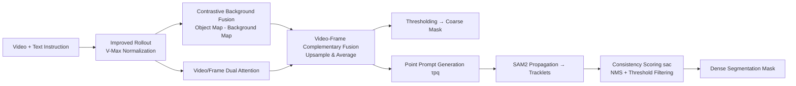

# Decomposed Attention Fusion in MLLMs for Training-free Video Reasoning Segmentation

**Conference**: ICLR 2026  
**OpenReview**: [https://openreview.net/forum?id=79SSF3ppjS](https://openreview.net/forum?id=79SSF3ppjS)  
**Code**: [https://github.com/HYUNJS/DecAF](https://github.com/HYUNJS/DecAF)  
**Area**: Video Segmentation / Multimodal Reasoning  
**Keywords**: video reasoning segmentation, MLLM, attention rollout, training-free, SAM2, referring VOS  

## TL;DR
This work reconfigures video reasoning segmentation into a video QA task, extracting localization cues directly from the MLLM attention rollout. It purifies noisy attention maps into clean object masks through "Contrastive Background Removal" and "Video-Frame Complementarity" fusion. Finally, attention-guided SAM2 generates fine-grained masks. The entire process is training-free and achieves performance comparable to supervised methods.

## Background & Motivation
**Background**: Multimodal Large Language Models (MLLMs) have demonstrated strong temporal understanding and complex reasoning in video QA, suggesting they internally "know" the location of target objects. Video reasoning segmentation requires localizing and segmenting objects based on textual descriptions involving complex reasoning (world knowledge and temporal logic beyond mere appearance), serving as a benchmark for this implicit localization capability.

**Limitations of Prior Work**: Conventional approaches jointly fine-tune MLLMs and segmentation backbones (SAM/SAM2) using LoRA (e.g., LISA, VISA, VideoLISA, GLUS), which requires model-specific training, simultaneous optimization of two backbones, high computational costs, and limited generalization. The only training-free approach, Loc-Head, uses spatial entropy to select "localization heads" in the image domain. It assumes a single object and relies on heuristics to suppress visual attention sinks (regions that always receive high scores regardless of the instruction), leading to performance degradation in multi-object and temporal video scenarios.

**Key Challenge**: Directly using MLLM attention rollout as a segmentation map is hindered by two types of contamination: diffuse noise from aggregating all heads/layers, and visual attention sinks that maintain high activation independent of the instruction. Raw attention maps lack alignment with object boundaries and are dominated by irrelevant regions, making them unsuitable for simple thresholding.

**Goal**: To purify MLLM attention maps into usable object localization signals without any training or structural modifications, ensuring stable performance across multiple MLLM families.

**Core Idea**: **[Task as Video QA]** The model is prompted to answer which object the expression refers to, and the rollout captures the last token's attention toward visual tokens. **[Decomposition & Fusion Denoising]** Instead of heuristic head selection, noise and sinks are systematically canceled through a dual-path "contrastive/complementary" fusion system. **[Attention-guided SAM2]** Coarse attention maps are converted into point prompts for SAM2, followed by consistency scoring to filter false positives.

## Method

### Overall Architecture
DecAF is a two-stage pipeline. The first stage treats the task as video QA within the MLLM, extracting raw localization maps via an improved attention rollout. These are purified into clean spatio-temporal attention maps through two fusions (Contrastive Background Removal and Video-Frame Complementarity), yielding rough masks via thresholding. The second stage converts coarse maps into point prompts, uses SAM2 to generate dense mask tracklets, and filters false tracklets on background regions using "attention consistency scores."

### Key Designs

**1. Vision-aware Normalized Attention Rollout (V-Max Rollout)**: Aggregation is biased toward heads that actually attend to the image. Standard rollout multiplies head-averaged attention per layer and adds a residual identity term: $\hat{A}^{(l)}=(\bar{A}^{(l)}+I)/2$, $R^{(l)}=\hat{A}^{(l)}R^{(l-1)}$. Simple averaging dilutes object signals with noise. DecAF weights heads by their attention intensity on visual tokens: extracting visual block $A_v^{(l)}\in\mathbb{R}^{h\times N\times N_v}$ from the attention tensor, taking the max across visual tokens $m^{(l)}=\max_{j} A_v^{(l)}[:,:,j]$, and averaging across tokens to get weights $w^{(l)}\in\mathbb{R}^h$. Weights are normalized to $\max_h w^{(l)}_h=1$ before weighted aggregation. This amplifies heads responsible for localization. Ablations show V-Max (75.2) outperforms original rollout (68.4) and Rollout-Max (72.9) on Ref-DAVIS, with optimal results starting rollout from the middle layer (e.g., layer 14 of 28).

**2. Contrastive Object-Background Fusion**: Subtraction is used to remove attention sinks. Visual attention sinks receive high scores that thresholding cannot suppress. DecAF runs two rollouts with complementary prompts: an object map from "What is the main object referred to in the given expression?" and a background map from "Describe the background scene of the video." To prevent the background prompt from accidentally including the target, the identified category name $o_{name}$ is explicitly excluded in the template. Both maps are reshaped to $(T,H_p,W_p)$ and Gaussian-smoothed. The contrastive map $V_{ctr}$ is obtained by subtracting the background map from the object map, clamping negative values, and applying min-max normalization. Sinks appearing in both prompts are canceled, highlighting the target. This fusion improved IVL3's SAM mask on Ref-DAVIS from 50.8 to 62.8.

**3. Video-Frame Complementary Fusion**: Multi-scale fusion balances temporal and spatial precision. Due to softmax, attention is spread thin across numerous tokens in video input (sparse but temporally contextual), whereas in image input, it concentrates on fewer tokens (fine-grained but temporally inconsistent). DecAF runs the same rollout for both video and frame-wise paths. Frame-level normalization is performed per-frame, while video-level is global across frames. After aligning resolutions, the two are averaged. This supports multi-scale processing where the frame modality can use higher resolutions (e.g., doubling QwenVL dimensions), upsampling the video map before fusion.

**4. Attention-guided SAM2 Prompting & Consistency Filtering**: This transforms coarse localization into fine masks while removing false detections. Visual tokens with scores above $\tau_{pq}$ are selected, and their center coordinates serve as point prompts $P=\{(t,y+o_y,x+o_x)\mid V_{t,y,x}\ge\tau_{pq}\}$ for SAM2. For redundancy reduction, tracklets are assigned an object score $s^{obj}_i=V_{p_i}+s^{SAM}_i$ followed by NMS (IoU>0.7). To eliminate SAM false positives on backgrounds, an attention consistency score $s^{ac}$ is introduced: $s^{ac}_i=\langle\tilde{M}_i,\hat{V}\rangle/\langle M^{Attn},\hat{V}\rangle$, where $\tilde{M}_i$ is the mask and $\hat{V}$ is the filtered attention map. Tracklets with an average score $s^{trk}_i \ge \tau_{trk}$ are retained.

## Key Experimental Results

### Main Results (Direct Attention Masks, No SAM, J&F)

| Method | MLLM | Ref-DAVIS | ReasonVOS | ReVOS (Overall) |
|---|---|---|---|---|
| Loc-Head | Qwen2.5VL-7B | 19.1 | 10.7 | 14.1 |
| **DecAF** | Qwen2.5VL-7B | **25.3** | **20.6** | **20.2** |
| TAM | Qwen2.5VL-7B | 3.5 | 3.7 | 4.0 |
| **DecAF** | InternVL3-8B | 20.7 | 18.4 | 16.7 |

### Main Results (With SAM2 Dense Masks vs. Supervised Methods, J&F)

| Method | Type | MLLM | Ref-DAVIS | ReasonVOS | ReVOS (Overall) |
|---|---|---|---|---|---|
| VISA | Training-based | ChatUniVi-7B | 69.4 | - | 46.9 |
| VideoLISA | Training-based | LLaVA-Phi-3-V | 68.8 | 47.5 | - |
| Veason-R1(RL)| Training-based | Qwen2.5VL-7B | - | 59.9 | 61.3 |
| Loc-Head | Training-free | Qwen2.5VL-7B | 64.6 | 41.1 | 47.0 |
| **DecAF** | Training-free | Qwen2.5VL-7B | **75.2** | **63.9** | 54.2 |

DecAF outperforms VISA/VideoLISA on Ref-DAVIS by 5.8/6.4 J&F. On ReasonVOS, it surpasses Veason-R1 (which uses RL on the same Qwen2.5VL) despite using only uniform sampling without a trained keyframe selection module.

### Ablation Study (Qwen2.5VL-7B SAM Mask J&F)

| Configuration | Ref-DAVIS | ReasonVOS |
|---|---|---|
| Object Attention Only | 61.9 | 58.4 |
| + Contrastive BG Removal | 75.2 | 63.9 |
| Video Attention Only | 65.9 | 58.6 |
| Frame Attention Only | 67.4 | 58.2 |
| Video + Frame Complementary | 75.2 | 63.9 |
| w/o Multi-scale | 72.4 | 60.5 |
| Rollout Original / Max / **V-Max** | 68.4 / 72.9 / **75.2** | 56.8 / 60.9 / **63.9** |

### Key Findings
- Attention mask boundary precision (F) is significantly lower than region similarity (J), opposite to the trend in specialized segmentation models. This indicates that low-resolution attention maps provide "coarse localization" sufficient to guide SAM2.
- TAM performs poorly (J&F 2-4) under object-focused prompts due to its heavy reliance on predicting specific word tokens, highlighting the robustness of the rollout approach.
- Loc-Head performs well on simple referring data but lags behind on ReasonVOS, confirming the generalization limitations of heuristic head selection.

## Highlights & Insights
- **Repurposing Segmentation as QA**: Instead of using segmentation supervision, localization cues are derived indirectly from MLLM video QA capabilities.
- **Subtraction for Sink Removal**: Visual attention sinks are a major issue in MLLM attention. DecAF cancels these by subtracting background maps from object maps where the same sinks persist.
- **Complementarity Analysis**: The trade-off between sparse temporal video attention and concentrated fine-grained frame attention is derived from softmax constraints and addressed through multi-scale fusion.
- **Superior Training-free Performance**: Surpassing trained methods demonstrates high utility for rapid adaptation to new MLLMs without computational overhead.

## Limitations & Future Work
- Low native resolution of attention maps necessitates heavy reliance on SAM2 for details; failure of SAM2 results in poor overall performance.
- High inference cost per video due to multiple MLLM passes (Object vs. Background, Video vs. Frame).
- Dependency on accurate category identification for background prompts; errors in classification can pollute contrastive maps.
- Multiple hyperparameters ($\tau_{pq}, \tau_{trk}$, rollout layer) may require adjustment across different datasets or models.

## Related Work & Insights
- **Training-based RVOS**: LISA, VISA, VideoLISA, GLUS, etc., optimize MLLMs and SAM using LoRA or full fine-tuning. DecAF operates on the opposite, training-free path.
- **Attention Rollout Localization**: VL-SAM and TAM use rollout for image-domain localization; Loc-Head selects specific heads. DecAF improves normalization and introduces decomposition fusions for temporal multi-object scenarios.
- **Insight**: Internal MLLM attention is a "free localization gold mine." The "contrastive prompt subtraction" paradigm for sink removal could be extended to grounding, detection, and interpretability tasks.

## Rating
- Novelty: ⭐⭐⭐⭐ Reaches a training-free framework via QA reconfiguration and decomposed fusion.
- Experimental Thoroughness: ⭐⭐⭐⭐ Extensive testing across three MLLM families and five datasets.
- Writing Quality: ⭐⭐⭐⭐ Clear motivation derived from softmax constraints and sink issues.
- Value: ⭐⭐⭐⭐ Achieves state-of-the-art results without training, offering high practical value for MLLM adaptation.

## Related Papers

- [\[CVPR 2026\] Live Interactive Training for Video Segmentation](../../CVPR2026/segmentation/live_interactive_training_for_video_segmentation.md)
- [\[ICCV 2025\] SAM2Long: Enhancing SAM 2 for Long Video Segmentation with a Training-Free Memory Tree](../../ICCV2025/segmentation/sam2long_enhancing_sam_2_for_long_video_segmentation_with_a.md)
- [\[CVPR 2026\] ReAttnCLIP: Training-Free Open-Vocabulary Remote Sensing Image Segmentation via Re-defined Attention in CLIP](../../CVPR2026/segmentation/reattnclip_training-free_open-vocabulary_remote_sensing_image_segmentation_via_r.md)
- [\[CVPR 2025\] ResCLIP: Residual Attention for Training-free Dense Vision-language Inference](../../CVPR2025/segmentation/resclip_residual_attention_for_training-free_dense_vision-language_inference.md)
- [\[CVPR 2026\] INSID3: Training-Free In-Context Segmentation with DINOv3](../../CVPR2026/segmentation/insid3_training-free_in-context_segmentation_with_dinov3.md)

<!-- RELATED:END -->

<!-- RELATED:START -->

## Related Papers

- [\[CVPR 2026\] ReAttnCLIP: Training-Free Open-Vocabulary Remote Sensing Image Segmentation via Re-defined Attention in CLIP](../../CVPR2026/segmentation/reattnclip_training-free_open-vocabulary_remote_sensing_image_segmentation_via_r.md)
- [\[CVPR 2025\] ResCLIP: Residual Attention for Training-free Dense Vision-language Inference](../../CVPR2025/segmentation/resclip_residual_attention_for_training-free_dense_vision-language_inference.md)
- [\[CVPR 2026\] INSID3: Training-Free In-Context Segmentation with DINOv3](../../CVPR2026/segmentation/insid3_training-free_in-context_segmentation_with_dinov3.md)
- [\[CVPR 2026\] Live Interactive Training for Video Segmentation](../../CVPR2026/segmentation/live_interactive_training_for_video_segmentation.md)
- [\[ICCV 2025\] SAM2Long: Enhancing SAM 2 for Long Video Segmentation with a Training-Free Memory Tree](../../ICCV2025/segmentation/sam2long_enhancing_sam_2_for_long_video_segmentation_with_a.md)

<!-- RELATED:END -->
