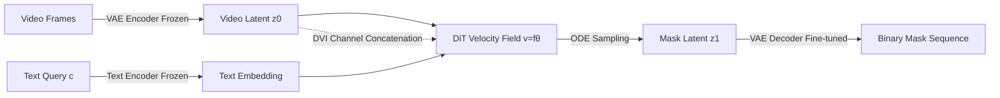

# Deforming Videos to Masks: Flow Matching for Referring Video Segmentation

**Conference**: ICLR 2026  
**OpenReview**: [https://openreview.net/forum?id=3KaIcArMAB](https://openreview.net/forum?id=3KaIcArMAB)  
**Code**: [https://github.com/xmz111/FlowRVS](https://github.com/xmz111/FlowRVS)  
**Area**: Referring Video Segmentation / Generative Segmentation / Flow Matching  
**Keywords**: RVOS, Flow Matching, Text-to-Video Models, End-to-End Segmentation, Temporal Consistency  

## TL;DR
This work formalizes Referring Video Object Segmentation (RVOS) as an ODE flow problem that continuously deforms video latent representations into masks under language guidance. By fine-tuning the pre-trained text-to-video (T2V) model Wan2.1 and employing three strategies focused on the trajectory starting point, the method achieves SOTA performance on MeViS, Ref-YouTube-VOS, and Ref-DAVIS17.

## Background & Motivation
**Background**: RVOS aims to segment corresponding objects frame-by-frame in a video based on a natural language description. The core challenge lies in anchoring abstract linguistic concepts into a dynamic, fine-grained pixel space. Prevailing methods follow a "locate-then-segment" cascaded pipeline: first grounding the text into a coarse geometric prompt (box/point) using query-based (e.g., ReferFormer) or VLM-based (e.g., LISA, VISA, ReferDINO) models, then passing it to an independent segmenter to generate masks frame-by-frame.

**Limitations of Prior Work**: This cascaded design has two structural flaws. First is the **information bottleneck**—compressing rich semantics into coarse geometric intermediate representations like boxes or points discards holistic scene understanding. Second is **temporal fragmentation**—although each frame's segmentation is constrained by conditions, they do not originate from a unified spatio-temporal deformation process, leading to poor temporal consistency. Even approaches that use T2V models as frozen feature extractors (VD-IT, HCD) remain two-stage designs where the generative model's dynamic capabilities are decoupled from the final task, requiring an independent decoder to reconstruct temporal relationships from isolated features.

**Key Challenge**: T2V generation is a **divergence** process—mapping from a simple noise prior to a set of possible videos, exploring a wide space. In contrast, RVOS is a **convergence** task—it must map a high-entropy, complex video to a unique, low-entropy mask. This is a deterministic, guided information contraction where the text query acts not as a creative prompt, but as a "selector" to precisely lock onto targets (e.g., distinguishing a "small monkey" from a "large monkey") from rich visual inputs. Directly applying the T2V paradigm leads to inherent mismatch.

**Goal**: Transform the generation process itself into a discriminative task by learning a language-guided continuous deformation flow from video pixels to masks, thereby circumventing the information bottleneck of cascaded pipelines.

**Core Idea**: **[Paradigm Reconstruction]** Instead of "generating masks from noise" or "single-step direct mask prediction," the model learns a velocity field $v(z_t, c, t)$ that deforms the video latent representation $z_0$ into the mask latent representation $z_1$ along an ODE path. **[Start-point Reinforcement]** Addressing the asymmetry of convergence tasks where "the first step is most critical and errors are irrecoverable," three collaborative strategies are used to specifically fortify the trajectory start.

## Method

### Overall Architecture
FlowRVS is built upon Wan2.1 (1.3B parameter DiT). It formalizes RVOS as a text-conditioned continuous flow. During training, the text encoder and VAE encoder are frozen, while the DiT is fine-tuned to learn the velocity field using boundary-biased temporal sampling. During inference, an ODE solver deterministically deforms the video latent representation into the target mask latent representation, which is then restored to pixel-level binary masks via a specifically fine-tuned VAE decoder.

### Key Designs

**1. RVOS as Convergence Flow: Shifting from noise/single-step prediction to video-to-mask multi-step deformation.** Traditional RVOS is treated as a single-step discriminative mapping $M=f_\theta(V,c)$, which is inherently ill-posed as it requires collapsing high-dimensional dynamic video into precise masks in one transform. This paper adopts a continuous deformation governed by an ODE: $\frac{dz_t}{dt}=v(z_t,c,t)$, with boundary conditions $z_0\sim P_{video}$ and $z_1\sim P_{mask}$. The learning objective is thus simplified from "mastering a complex global function" to "learning a simple local velocity field," where the text query $c$ serves as a disambiguating force at each step. Ablations show this change is highly effective: switching the target from "predicting absolute state" to "predicting residual velocity" increases J&F by +14.6 in single-step settings.

**2. Boundary-Biased Sampling (BBS): Concentrating gradient power at the trajectory start.** Since the deformation from video to mask is asymmetric—high certainty/structure at the start and low certainty/sparsity at the end—uniform sampling of timesteps wastes resources on non-critical regions. BBS is a curriculum learning strategy that over-samples timesteps near $t=0$, forcing the model to accurately learn the "initial thrust calculated based on the text query." This is crucial for stabilizing the multi-step flow: the base flow (uniform sampling) achieves only 47.9 J&F; adding BBS with $p=0.5$ increases this to 57.9 (+10.0), proving that mastering the initial text-guided velocity is the most critical factor for success.

**3. Start-Point Augmentation (SPA) + Direct Video Injection (DVI): Fortifying the start from both sides.** SPA applies random encoding and normalization perturbations to the initial video latent $z_0$ during training, presenting the model with a locally continuous distribution of starting points. This acts as a regularizer, forcing the model to learn a velocity field that is robust not just on the manifold but also within its neighborhood. DVI concatenates the original video latent $z_0$ with the current state $z_t$ along the channel dimension, changing the velocity prediction from $v(z_t, t)$ to $v([z_t, z_0], t)$. This ensures the global source context remains accessible throughout the contraction trajectory, preventing drift and improving fine-grained accuracy with near-zero extra cost.

**4. Task-Specific VAE Decoder Fine-Tuning: Bridging the domain gap between continuous video latent space and binary masks.** Pre-trained VAEs are optimized for natural videos; using them directly to reconstruct binary masks causes a domain gap. This work freezes the VAE encoder and fine-tunes the VAE decoder on the MeViS dataset, specializing it in restoring high-quality masks from the latent space. Experiments show that while a frozen decoder supports competitive performance (60.0 J&F), fine-tuning further enhances reconstruction quality and yields an additional +0.9 J&F.

## Key Experimental Results

### Main Results
Comparison with "locate-then-segment" methods on three RVOS benchmarks (J&F, higher is better):

| Method | Paradigm | MeViS J&F | Ref-YT-VOS J&F | Ref-DAVIS17 J&F |
|------|------|-----------|----------------|-----------------|
| ReferFormer [CVPR'22] | locate-then-seg | 31.0 | 62.9 | 61.1 |
| VISA [ECCV'24] | VLM-based | 43.5 | 61.5 | 69.4 |
| SAMWISE [CVPR'25] | VLM+SAM | 49.5 | 69.2 | 70.6 |
| ReferDINO [ICCV'25] | grounding-based | 49.3 | 69.3 | 68.9 |
| **FlowRVS (Ours)** | **One-stage Generative** | **51.1** | **69.6** | **73.3** |

Compared to Prev. SOTA: MeViS +1.6, Ref-DAVIS17 (zero-shot) +2.7; outperforms VISA-13B by 7.0 points on MeViS.

### Ablation Study
Ablation on the MeViS validation set (J&F):

| Configuration | BBS(p) | SPA | DVI | WI | J&F |
|------|--------|-----|-----|----|----|
| (a) Multi-step Noise→Mask Flow | – | – | ✓ | ✓ | 32.3 |
| (b) Single-step Mask Prediction | – | – | – | ✓ | 38.9 |
| (c) Single-step Velocity Prediction | – | – | – | ✓ | 50.8 |
| Base Flow (Uniform Sampling) | 0.0 | – | – | ✓ | 47.9 |
| + BBS | 0.25 | – | – | ✓ | 55.2 |
| + BBS | 0.50 | – | – | ✓ | 57.9 |
| + SPA | 0.50 | ✓ | – | ✓ | 58.6 |
| + DVI (Final Default) | 0.50 | ✓ | ✓ | ✓ | **60.6** |
| − WI (Train from Scratch) | 0.50 | ✓ | ✓ | ✗ | 21.1 |

### Key Findings
- **Residual Velocity > Absolute State**: Single-step velocity prediction (50.8) is +14.6 higher than single-step mask prediction (38.9), validating that the flow-based objective is more stable.
- **Stabilizing Multi-step Flow is Mandatory**: Naive uniform sampling in multi-step base flow (47.9) is worse than single-step velocity prediction. BBS is the key to unlocking multi-step potential, with the greatest gain at $p=0.5$ (+10.0).
- **Pre-trained Weights are Essential**: Performance collapses to 21.1 without Wan initialization, indicating this method is designed to "leverage and adapt generative foundation model priors" rather than being a generic training trick.
- **Strong Zero-shot Generalization**: Achieves 73.3 J&F on Ref-DAVIS17 without any fine-tuning, surpassing many methods specifically trained on high-quality data of that type.

## Highlights & Insights
- **Clear Paradigm Insight**: The contradiction that "generation is divergent while discrimination is convergent" is articulated profoundly. This leads to the principle that "the first step is most critical," which all designs (especially BBS) serve.
- **Cohesive Adaptation Strategies**: BBS (sampling), SPA (start-point perturbation), and DVI (sustained injection) are not isolated tricks but work in synergy to fortify the flow's starting point.
- **Full Utilization of T2V Native Capabilities**: It leverages pixel-level synthesis (fine-grained control), text-conditioned generation (multi-modal alignment), and video-native architectures (spatio-temporal reasoning) more thoroughly than two-stage schemes using frozen extractors.
- **Solid Analysis of Alternative Paradigms**: Fairness is maintained by comparing "Direct Mask Prediction / Noise→Mask Flow / Single-step Velocity Prediction" using the same Wan2.1, VAE, and training settings.

## Limitations & Future Work
- **Dependency on Large-scale T2V Pre-training**: The method's effectiveness is heavily tied to foundation model priors like Wan2.1; applicability in scenarios without strong T2V pre-training remains unclear.
- **Inference Requires Multi-step ODE Sampling**: Compared to single-step prediction, multi-step deformation incurs higher inference overhead. The speed/latency trade-off is not discussed in depth.
- **Dataset-specific VAE Decoder Tuning**: The decoder is trained separately on MeViS. Whether it requires re-adaptation across datasets or works for labels beyond binary masks (e.g., instances/multi-class) is yet to be verified.
- **Minor Numerical Inconsistencies**: Some figures in the text (e.g., MeViS 50.7 vs. 51.1 in Table 1) require alignment.

## Related Work & Insights
- **Evolution of Generative Segmentation**: Contrasts with VD-IT and HCD (frozen features) and differs from parallel works like ReferEverything (REM) by emphasizing "fine-tuning the entire generative process to learn deformation flows."
- **Textualization of Flow Matching**: Similar to DepthFM (video-to-video for depth estimation) but distinguishes itself by using natural language queries as a core conditional force modulating the entire ODE path.
- **Rethinking ControlNet-style Conditions**: While ControlNet adds external guidance to "divergent noise→image" processes, this work learns "convergent, discriminative transforms starting from the video source itself."
- **Inspiration**: The approach of "reframing discriminative tasks as text-constrained convergence flows with asymmetric reinforcement of the starting point" could be generalized to other video understanding tasks requiring high-entropy input collapse (e.g., VIS, action localization).

## Rating
- **Novelty**: ⭐⭐⭐⭐⭐ Reframing RVOS as a text-conditioned video-to-mask continuous deformation flow is a principled reversal of the generative paradigm for discriminative tasks.
- **Experimental Thoroughness**: ⭐⭐⭐⭐ Comprehensive SOTA across three benchmarks and strong zero-shot results. Detailed ablation of the three strategies. Slightly lacks inference overhead analysis and cross-task validation.
- **Writing Quality**: ⭐⭐⭐⭐ Logic and paradigm analysis are clear; diagrams are helpful. Minor numerical inconsistencies in reporting.
- **Value**: ⭐⭐⭐⭐⭐ Provides a reusable methodology and a strong baseline for adapting T2V foundation models to discriminative video understanding.

<!-- RELATED:START -->

## Related Papers

- [\[CVPR 2026\] FlowDIS: Language-Guided Dichotomous Image Segmentation with Flow Matching](../../CVPR2026/segmentation/flowdis_language-guided_dichotomous_image_segmentation_with_flow_matching.md)
- [\[ICLR 2026\] AMLRIS: Alignment-aware Masked Learning for Referring Image Segmentation](amlris_alignment-aware_masked_learning_for_referring_image_segmentation.md)
- [\[ICLR 2026\] Matting Anything 2: Towards Video Matting for Anything](matting_anything_2_towards_video_matting_for_anything.md)
- [\[CVPR 2025\] LiVOS: Light Video Object Segmentation with Gated Linear Matching](../../CVPR2025/segmentation/livos_light_video_object_segmentation_with_gated_linear_matching.md)
- [\[ICLR 2026\] VINCIE: Unlocking In-context Image Editing from Video](vincie_unlocking_in-context_image_editing_from_video.md)

<!-- RELATED:END -->
