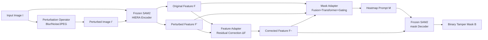

# Detective SAM: Adaptive AI-Image Forgery Localization

**Conference**: ICLR 2026  
**OpenReview**: [https://openreview.net/forum?id=GKJHPHNFIx](https://openreview.net/forum?id=GKJHPHNFIx)  
**Code**: Open-source (GitHub, includes pretrained weights + AutoEditForge + evaluation scripts)  
**Area**: Image Forgery Localization / AIGC Tampering Detection / Segmentation  
**Keywords**: Image Forgery Localization, SAM2, Diffusion Edit, Adapter, Continual Fine-tuning, Data Generation  

## TL;DR
A set of lightweight adapters is attached to SAM2 to automatically convert "post-perturbation feature distribution shift" forensics cues into heatmap prompts for segmenting tampered areas in diffusion edits. Combined with an AutoEditForge pipeline for automatic data generation, the locator can continually adapt to evolving image editing models.

## Background & Motivation
**Background**: Image Forgery Localization (IFL) aims not just to judge the authenticity of an image, but to identify "where it was modified" at a pixel level. Traditional methods rely on forensic traces like camera patterns or JPEG compression to catch splicing and copy-move operations, performing well on legacy Photoshop manipulations.

**Limitations of Prior Work**: Local editing in the diffusion era (replacing, removing, or adding objects) is "repainted" through a generative process. These edits are semantically coherent and realistic, lacking traditional traces left by cameras or compression, which causes legacy methods to fail. Localization accuracy drops significantly on new diffusion datasets; more critically, generative models update every few months (e.g., DALL-E → FLUX → QWEN → NanoBanana), making them a moving target.

**Key Challenge**: The authors identify three persistent issues in existing IFL systems: ① Existing methods struggle to characterize forensic cues of modern edits, wasting priors within foundation models; ② Architectures lack an efficient adaptation mechanism to absorb new editing data without catastrophic forgetting; ③ Systems collapse on newly released strong editors, necessitating a continuous refresh of training and evaluation data.

**Goal**: To build a practical IFL framework that utilizes diffusion-specific forensic cues, enables lightweight continual fine-tuning, and provides an automated data supply.

**Core Idea**: **Automated Forensic Signal Prompting** — Foundation models (SAM2’s HIERA encoder) exhibit observable distribution shifts in embeddings for diffusion-edited regions after input perturbations like Gaussian blur, noise, or JPEG compression. By treating this shift as a localization prior and converting it into a heatmap to feed the SAM2 decoder, the system uses lightweight adapters to transform SAM2 from "object segmenter" to "tamper segmenter" while keeping the backbone frozen. **Automatic Data Supply** — The accompanying AutoEditForge pipeline automatically generates training pairs using the latest editors, allowing the framework to stay up-to-date through periodic fine-tuning.

## Method

### Overall Architecture
Detective SAM trains only three types of lightweight modules on top of a frozen SAM2 backbone (HIERA encoder + prompt encoder + mask decoder): **feature adapters** that use "perturbed features" to perform residual correction on "original features," focusing the decoder on forgery localization; **mask adapters** that fuse all features into a heatmap prompt to drive the decoder; and the **AutoEditForge** offline pipeline for a continuous supply of training samples from new editors. The entire model contains approximately 1 million parameters (feature adapter: 81k, mask adapter: 887k) and can be trained on a single H100 in two hours.

### Key Designs

**1. Perturbation-Driven Forensic Feature Flow: Converting "Distribution Shifts" into Localization Cues.** Given an input image $I$, a set of simple image-space operators (Gaussian blur, Gaussian noise, JPEG compression) is used to create $N$ perturbed images $I'_i = \text{Perturb}_i(I;\theta)$. Both $I$ and $I'_i$ are fed into the frozen HIERA encoder to obtain features $\{F^I_s, F^{I'_i}_s\}$ at three scales $S=\{32,64,128\}$. This is based on phenomena observed in works like RIGID/BLUR: embeddings of diffusion-generated regions shift more significantly under perturbation. Thus, the difference between original and perturbed features naturally carries tampering information, grafting training-free detection signals into a segmentable framework.

**2. Feature Adapter Residual $\Delta F$ Correction: Transforming SAM2 from Object to Tamper Segmentation.** The decoder was originally trained for general object segmentation, which is not directly suitable for forgery localization. The authors use three single-layer $1\times1$ convolution adapters $A_s$ (corresponding to the three HIERA scales) that take the concatenated original and perturbed features to produce a residual correction injected into the decoder:

$$\tilde{F}_s = F^I_s + \Delta F_s,\quad \Delta F_s = A_s\big(\{F^I_s,\, F^{I'_1}_s\}\big)$$

By fine-tuning with residuals rather than retraining the decoder, the model preserves the strong image priors of SAM2 while "warping" it toward the forgery localization task with minimal parameter overhead. Ablations show this step provides the largest performance gain.

**3. Mask Adapter for Automatic Prompting: Replacing Human Clicks with Heatmaps.** SAM2 is inherently promptable (via points, boxes, or heatmaps). The authors choose heatmaps as they reflect the spatial structure of forensic signals. The mask adapter upsamples all features $\{F^I_s, F^{I'_1}_s, \tilde{F}_s\}$ to a fine grid for cross-scale/cross-flow fusion to obtain $F_{\text{fuse}}$. A low-resolution lightweight Transformer then applies global self-attention to aggregate context and suppress spatially inconsistent forgery estimates, outputting coarse logits $L_{\text{coarse}}$ and an uncertainty map $U$. Simultaneously, two convolution layers derive fine logits $L_{\text{refine}}$ from $F_{\text{fuse}}$, with final linear fusion via a spatial gate $g$:

$$M = g\, L_{\text{refine}} + (1-g)\, L_{\text{coarse}}$$

The gate $g$ is a $1\times1$ convolution + sigmoid taking $[L_{\text{coarse}}, U]$ as input, down-weighting the refinement where the coarse mask is already confident (or excessively uncertain) to avoid over-sharpening in unedited regions. The generated heatmap $M$ and corrected features $\tilde{F}_s$ are upsampled to $256\times256$ and fed to the frozen decoder to produce final logits, which are thresholded at 0.5 to generate the binary mask $B$. Training follows the SAM2 composite objective $L = L_{\text{Dice}} + \lambda_{\text{focal}} L_{\text{focal}}^{\alpha,\gamma} + \lambda_{\text{IoU}} L_{\text{IoU}}$.

**4. AutoEditForge Data Pipeline: Keeping the Locator Up-to-Date.** This is an offline data generation system symbiotic with the model, separating "lightweight analysis" from "heavyweight editing." The first pass uses Florence-2 for dense captioning and object detection, followed by an LLM (Gemma 3 12B) to select editing strategies based on scene context across four types: Replace (semantic replacement, e.g., Golden Retriever to Labrador), Remove (deletion with context infilling), Add (placing objects in semantically appropriate spaces), and Change Partially (modifying texture/style while preserving identity). The second pass uses SAM2 to derive masks from Florence-2 boxes and applies instructional diffusion editing models to create images, with post-processing (hole filling, connected component analysis, size filtering) to ensure mask quality. It can utilize the latest SOTA editors (FLUX, QWEN, NanoBanana) to supply Detective SAM with precisely annotated pairs for periodic fine-tuning, creating a lifelong learning loop.

## Key Experimental Results

### Main Results (OOD Evaluation on Six Benchmarks, IoU↑ / F1↑)
Training set includes SIDA (10k) + MagicBrush (8807); CoCoGLIDE, AutoSplice, and NanoBanana are entirely OOD for all models.

| Model | CoCoGLIDE | UltraEdit | AutoSplice | NanoBanana | **Avg OOD** |
|---|---|---|---|---|---|
| SAFIRE [2024] | 42.22/46.38 | 18.41/24.00 | 18.71/24.53 | 11.39/15.25 | 22.68/27.54 |
| Mesorch [2024] | 36.45/44.50 | 5.45/7.51 | 27.53/38.72 | 10.22/13.85 | 19.91/26.15 |
| TruFor [2023] | 37.76/45.82 | 16.15/22.35 | 43.34/58.87 | 2.59/3.19 | 24.96/32.55 |
| SIDA-7B [2025] | 13.24/15.53 | 3.29/4.45 | 39.31/48.28 | 0.09/0.02 | 13.98/17.07 |
| FakeShield-23B [2025] | 13.72/14.99 | 12.98/18.32 | 23.75/29.53 | 9.57/10.75 | 15.01/18.40 |
| PSCC-Net [2022] | 31.55/37.60 | 10.06/15.43 | 36.68/42.43 | 12.73/13.26 | 22.76/27.18 |
| **Ours** | **44.74/51.50** | **27.74/35.54** | **46.90/60.30** | **19.34/20.77** | **34.68/42.03** |

Average OOD IoU shows a relative improvement of **38.94%** over the strongest baseline (TruFor 24.96). Detective SAM's ID and OOD scores remain stable (MagicBrush 46.48, SIDA 54.55), whereas baseline scores fluctuate wildly across datasets.

### Ablation Study

| Ablation Dimension | Key Finding |
|---|---|
| Perturbation Type | Gaussian blur alone is effective; blur + noise is better; adding JPEG further improves results, validating explicit perturbation signals (blur + noise used finally to align with prior work). |
| Mask Adapter Design | Complete design (downsampled Transformer + uncertainty + spatial gating) outperforms direct CNNs; **Feature adapter provides the largest gain.** |
| Removing Mask Decoder | Localization performance drops significantly when using heatmaps without the SAM2 decoder, proving the value of SAM2's image priors. |

### Key Findings
- **SOTA Editors Cause Collapse**: All methods, including strong baselines, fail on FLUX-Bench, QWEN-Bench, and NanoBanana (e.g., TruFor scores only 2.59 IoU on NanoBanana), indicating that performance on old benchmarks does not transfer to the latest diffusion edits.
- **Lightweight Fine-tuning Restores Performance**: Fine-tuning with just 1,000 samples (500 each from FLUX and QWEN generated by AutoEditForge) allows Detective SAM$_{\text{SOTA}}$ to recover IoU to 43.08/41.44, with Avg OOD rising to 35.57/42.03.
- **Edit Type Variance**: "Remove" edits are significantly harder to detect than "Replace" (e.g., 10.58 vs 22.95 IoU on QWEN-Bench), suggesting datasets must move beyond simple inpainting.
- **Efficiency**: Compared to SIDA (7B), FakeShield (23B), or SAFIRE (256 SAM passes per sample), our method uses only ~1M parameters and trains in 2 hours.

## Highlights & Insights
- **Grafting Training-free Signals into a Segmentable Framework**: The perturbation-shift signals from works like RIGID/BLUR, originally for binary classification, are upgraded into spatial heatmap prompts to drive SAM2 for pixel-level masks.
- **Frozen Backbone + Lightweight Adapters for "Updates"**: The architecture choice addresses the reality of constantly updating generative models. Training only 1M parameters with replay fine-tuning is fast and resistant to forgetting.
- **Symbiosis of Model and Data**: AutoEditForge is not just an add-on but a supply line that keeps the framework from becoming obsolete, revealing that benchmark success does not equate to true generalization.

## Limitations & Future Work
- **Reactive Nature**: The framework requires generating new data and fine-tuning after a new editor is released; it is not a zero-shot solution for entirely new generative paradigms.
- **Weakness in Specific Edits**: Detection of "Remove" edits (pure context completion) significantly lags behind other types.
- **Dependence on Perturbation Assumptions**: The method relies on edited regions having larger perturbation shifts. If future models mitigate this (e.g., via adversarial robustness), the cue may fail.
- **JPEG Robustness**: Robustness to JPEG compression is on par with baselines and may degrade in high-compression scenarios.

## Related Work & Insights
- **SAM for IFL**: SAFIRE (256 parallel SAM passes + 16×16 grid), IMDPrompter (learnable prompts but retrains the decoder). Our work differs by using explicit perturbation signals and a lightweight adapter route that avoids retraining the decoder.
- **Diffusion Forensics**: RIGID, BLUR, and MINDER use embedding shifts in foundation models (like DINOv2) for training-free detection; our work extends this from detection to localization.
- **MLLM Locators**: SIDA and FakeShield use text-to-image properties for localization and explanation, but suffer from massive parameter counts (7B/23B) and instability on diffusion edits.

## Rating
- **Novelty**: ⭐⭐⭐⭐ Automating forensic signal prompting for SAM2 and using a data pipeline for adaptation addresses the real pain points of the diffusion era.
- **Experimental Thoroughness**: ⭐⭐⭐⭐ Comprehensive evaluation across eight datasets, seven baselines, and OOD/fine-tuning regimes.
- **Writing Quality**: ⭐⭐⭐⭐ Logical flow from pain points to design solutions with clear correspondence between figures and text.
- **Value**: ⭐⭐⭐⭐ Provides open-source weights and tools while highlighting the need for periodic adaptation in practical deployments.

<!-- RELATED:START -->

## Related Papers

- [\[ICLR 2026\] SAM-Veteran: An MLLM-based Human-like SAM Agent for Reasoning Segmentation](sam-veteran_an_mllm-based_human-like_sam_agent_for_reasoning_segmentation.md)
- [\[ICLR 2026\] Enhancing Image-Conditional Coverage in Segmentation: Adaptive Thresholding via Differentiable Miscoverage Loss](enhancing_image-conditional_coverage_in_segmentation_adaptive_thresholding_via_d.md)
- [\[ICLR 2026\] SAM 3: Segment Anything with Concepts](sam_3_segment_anything_with_concepts.md)
- [\[CVPR 2026\] Detecting AI-Generated Forgeries via Iterative Manifold Deviation Amplification](../../CVPR2026/segmentation/detecting_ai-generated_forgeries_via_iterative_manifold_deviation_amplification.md)
- [\[AAAI 2026\] SAM-DAQ: Segment Anything Model with Depth-guided Adaptive Queries for RGB-D Video Salient Object Detection](../../AAAI2026/segmentation/sam-daq_segment_anything_model_with_depth-guided_adaptive_queries_for_rgb-d_vide.md)

<!-- RELATED:END -->
