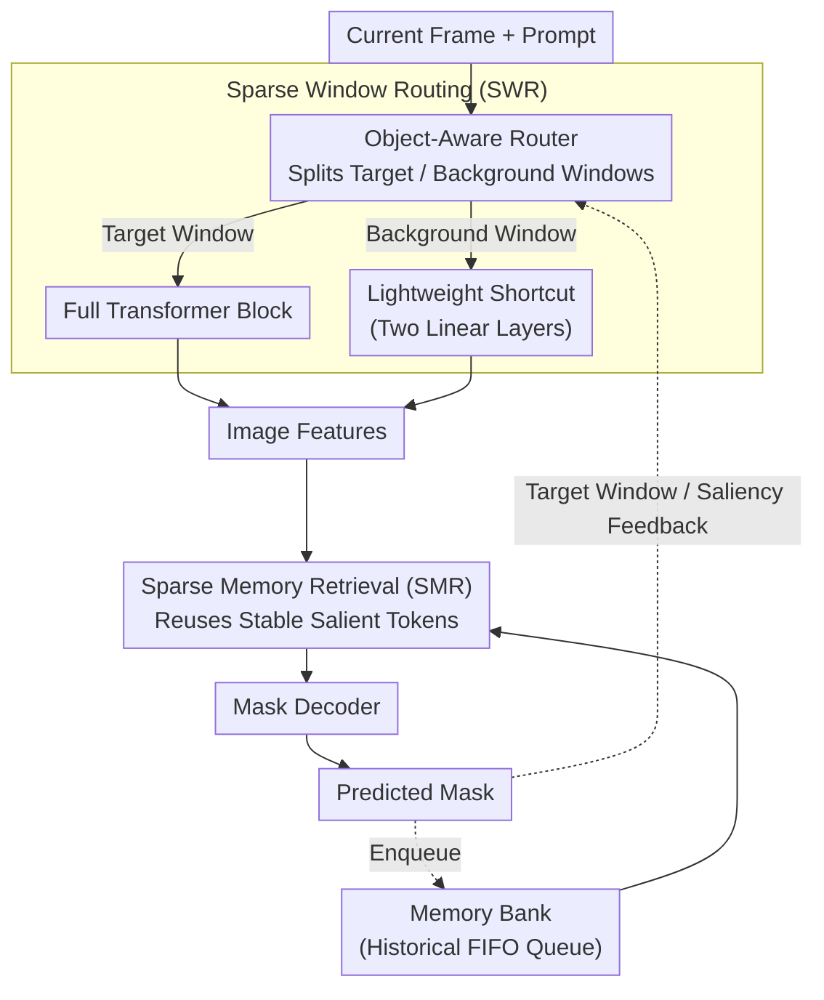

# Efficient-SAM2: Accelerating SAM2 with Object-Aware Visual Encoding and Memory Retrieval

**Conference**: ICLR 2026  
**arXiv**: [2602.08224](https://arxiv.org/abs/2602.08224)  
**Code**: [GitHub](https://github.com/jingjing0419/Efficient-SAM2)  
**Area**: Video Segmentation / Model Acceleration  
**Keywords**: SAM2, video object segmentation, post-training acceleration, sparse window routing, memory compression  

## TL;DR
The study identifies that SAM2 exhibits sparse perception patterns similar to biological vision (the decoder focuses on the foreground while the encoder computes globally; only a few tokens in memory frames are effective and remain temporally consistent in saliency). Based on this, Efficient-SAM2 is proposed, eliminating redundant computation through Object-Aware Sparse Window Routing (SWR) and Sparse Memory Retrieval (SMR). This achieves a 1.68× end-to-end acceleration on SAM2.1-L with only a 1% accuracy loss.

## Background & Motivation

**Background**: SAM2 achieves superior performance in Video Object Segmentation (VOS) through its streaming memory mechanism. However, the computational overhead from the large-scale visual backbone and frame-by-frame memory interactions is extremely high, failing to meet real-time video processing requirements.

**Limitations of Prior Work**: EdgeTAM achieves edge-level efficiency by distilling lightweight models and compressing memory with spatial perceivers, but it incurs high training costs and significant performance degradation. General token merging methods like ToMe are incompatible with SAM2's hierarchical window attention architecture, leading to severe precision loss in segmentation tasks.

**Key Observation — Sparse Perception Patterns**: The authors identify two key sources of redundancy by visualizing attention matrices:
   - **Encoder-Decoder Attention Inconsistency**: The prompt-to-image attention of the mask decoder is highly concentrated on foreground objects and potential distractors. Conversely, the upstream image encoder, unaware of the prompt interest, distributes attention broadly, generating substantial useless computation on the background.
   - **Temporal Consistency of Memory Sparsity**: In memory attention, when the same memory frame is repeatedly accessed by different query frames, attention consistently focuses on the same few tokens (cosine similarity near 1.0). Recomputing all tokens every time is unnecessary.

**Key Insight**: Instead of modifying the SAM2 architecture, this work leverages SAM2's inherent sparsity for post-training acceleration, maximizing compatibility and deployment convenience.

## Method

### Overall Architecture
Efficient-SAM2 maintains the original SAM2 network structure while addressing the two primary latency bottlenecks identified through sparse perception patterns. During frame-by-frame streaming processing, each frame passes through the image encoder, memory attention, and mask decoder. For the encoder bottleneck, Sparse Window Routing (SWR) identifies background windows and routes them to a lightweight bypass, executing the full Transformer only on target windows. For the memory attention bottleneck, Sparse Memory Retrieval (SMR) retrieves only the temporally stable salient tokens. Both modules are independent, stackable, and follow a post-training acceleration path that requires almost no retraining of the original model. Predicted masks from the decoder provide feedback for the next frame to define target windows for SWR and salient memory frames for SMR.

### Key Designs

**1. Sparse Window Routing (SWR): Focusing the Encoder on Foreground Windows**

The encoder's bottleneck is its uniform global computation. SWR uses an object-aware router to split the current frame into "target-related" and "background" windows, running the full Transformer only on the former. Target windows are the union $\mathcal{W}_{obj} = \mathcal{W}_{pred} \cup \mathcal{W}_{salient}$, where $\mathcal{W}_{pred}$ covers the region of the previous frame's predicted mask (with dilation to handle fast motion). $\mathcal{W}_{salient}$ acts as a safeguard; when the tracking confidence $s_{obj}$ falls below a threshold ($\theta_{obj}=5$), windows with cumulative saliency exceeding a threshold from the decoder's cross-attention are added. Background windows are routed to a minimal shortcut consisting of two linear layers with parameters $\approx d^2+2d$, which is negligible compared to the full block's $12d^2+13d$.

**2. Sparse Memory Retrieval (SMR): Reusing Stable Salient Tokens in Memory Frames**

SMR exploits the temporal consistency where different query frames attend to nearly identical tokens in a given memory frame. When a memory frame $M_{t-1}$ is first accessed, the Top-$\lfloor(1-s)K\rfloor$ tokens are identified per layer $l$ based on average attention weights $A_{t-1}^l$ to form a saliency pattern $S_{t-1}^l$, stored in a FIFO queue. For the next $m+1$ steps, only these salient tokens participate in computation. The layer complexity is reduced from $O((m+1)NKd)$ to $O(2NKd + (m-1)Nkd)$, where $k=\lfloor(1-s)K\rfloor \ll K$. With a sparsity rate $s=0.95$ (retaining only 5% of tokens), the retrieval is training-free.

### Loss & Training
The SWR shortcut branch is trained using a reconstruction loss $\mathcal{L} = \|F_M^s - F_M^t\|_2^2$ to align its output with the original memory-conditioned features. Memory-conditioned features are chosen as targets because they retain sufficient background information for the shortcut while avoiding the heavy background suppression found in decoder features. Training utilizes 30 unlabeled samples from the SA-V dataset and takes approximately 1 hour on an A6000. SMR requires no training.

## Key Experimental Results

### Main Results (SAM2.1-B+, Δt=1)

| Method | Acceleration Module | SA-V test J&F | Speedup |
|------|---------|---------------|--------|
| SAM2.1-B+ Original | - | 77.7 | 1.00× |
| ToMe | Encoder | 55.3 | 1.36× |
| ALGM | Encoder | 71.9 | 1.05× |
| **SWR (Ours)** | Encoder | **75.0** | **1.69×** |
| MemPool | Memory | 72.3 | 2.14× |
| SMR-random | Memory | 76.7 | 1.73× |
| **SMR (Ours)** | Memory | **77.8** | **1.82×** |
| EdgeTAM (Distilled) | Both | 72.1 | 1.63× |
| **Efficient-SAM2** | Both | **75.5** | **1.74×** |

### SAM2.1-L Model Results

| Method | SA-V test J&F | DAVIS 2017 | End-to-End Speedup |
|------|---------------|------------|----------|
| Original | 79.2 | 89.9 | 1.00× |
| SWR | 77.5 | 89.7 | 1.83× |
| SMR | 79.3 | 89.9 | 1.78× |
| **SWR+SMR** | **78.2** | **89.5** | **1.68×** |

### Key Findings
- SWR significantly outperforms token merging methods (ToMe 55.3 vs. SWR 75.0) because window-level routing naturally matches SAM2's window attention.
- SMR maintains performance even at 95% sparsity (77.8 vs. 77.7), validating the temporal consistency of memory frame saliency.
- In DAVIS 2017, Efficient-SAM2 shows almost no performance drop, though it decreases by 1-3 points on more challenging datasets like SA-V and MOSE.
- Compared to EdgeTAM, Efficient-SAM2 provides higher performance (75.5 vs. 72.1) without large-scale retraining.

## Highlights & Insights
- **Post-training Acceleration Paradigm**: It requires no end-to-end retraining, needing only 1 hour on 30 samples, significantly lowering deployment barriers.
- **Perception-Driven Design**: Rather than forced model pruning, it follows the model's internal behavior to eliminate redundancy.
- **Saliency Caching**: The SMR strategy effectively utilizes temporal consistency with an elegant, zero-overhead design.
- **Cross-Module Feedback**: SWR utilizes saliency feedback from the decoder to guide computation allocation in the encoder.

## Limitations & Future Work
- SWR relies on the previous frame's mask quality; tracking failures or fast motion could lead to error propagation.
- Hyperparameters like $s=0.95$ and $\theta_{obj}=5$ are manually set; adaptive adjustment could offer further gains.
- Validation is limited to semi-supervised VOS; applicability to interactive segmentation or multi-object tracking is unknown.
- The extremely lightweight shortcut branch may lose critical information in complex dynamic backgrounds.

## Related Work & Insights
- **vs. EdgeTAM**: Distillation requires full training, whereas this post-training approach is more flexible and higher-performing.
- **vs. ToMe/ALGM**: General ViT methods fail on SAM2's window architecture; window-level routing is the appropriate granularity.
- **vs. MemPool**: Simple pooling loses fine-grained details (72.3), while SMR’s selective retention is more precise (77.8).

## Rating
- Novelty: ⭐⭐⭐⭐ Unique perspective on acceleration based on SAM2's sparse perception patterns.
- Experimental Thoroughness: ⭐⭐⭐⭐ Validated across 4 VOS benchmarks, two model scales, and extensive baselines.
- Writing Quality: ⭐⭐⭐⭐ Clear correspondence between observations and solutions with intuitive diagrams.
- Value: ⭐⭐⭐⭐⭐ Highly practical, meeting widespread industrial demand for SAM2 acceleration.

<!-- RELATED:START -->

## Related Papers

- [\[CVPR 2025\] A Distractor-Aware Memory for Visual Object Tracking with SAM2](../../CVPR2025/segmentation/a_distractor-aware_memory_for_visual_object_tracking_with_sam2.md)
- [\[AAAI 2026\] RS2-SAM2: Customized SAM2 for Referring Remote Sensing Image Segmentation](../../AAAI2026/segmentation/rs2-sam2_customized_sam2_for_referring_remote_sensing_image_segmentation.md)
- [\[ICLR 2026\] AMLRIS: Alignment-aware Masked Learning for Referring Image Segmentation](amlris_alignment-aware_masked_learning_for_referring_image_segmentation.md)
- [\[ICLR 2026\] Decomposed Attention Fusion in MLLMs for Training-free Video Reasoning Segmentation](decomposed_attention_fusion_in_mllms_for_training-free_video_reasoning_segmentat.md)
- [\[CVPR 2026\] V²-SAM: Marrying SAM2 with Multi-Prompt Experts for Cross-View Object Correspondence](../../CVPR2026/segmentation/v2-sam_marrying_sam2_with_multi-prompt_experts_for_cross-view_object_corresponde.md)

<!-- RELATED:END -->
