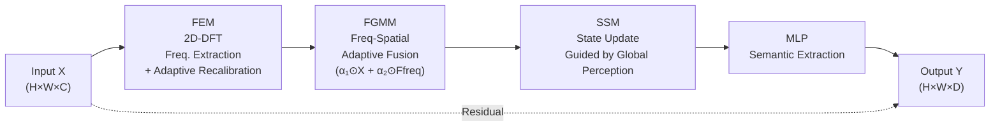

# Enabling True Global Perception in State Space Models for Visual Tasks

**Conference**: ICLR 2026  
**Code**: [Xinmu-Tantai/GMamba-GSSM](https://github.com/Xinmu-Tantai/GMamba-GSSM)  
**Area**: Semantic Segmentation / Object Detection  
**Keywords**: State Space Model, Mamba, Global Perception, Frequency Domain Modulation, Discrete Fourier Transform

## TL;DR

The authors axiomatically define "image global modeling" for the first time using gradient lower bound axioms and design the GSSM module based on 2D-DFT frequency domain modulation. They theoretically prove and experimentally verify that SSMs can achieve true global perception while maintaining linear-logarithmic complexity.

## Background & Motivation

**Background**: Global context modeling is a core requirement for visual tasks. Existing solutions follow two paths: Self-attention in Transformers and State Space Models (SSM) in Mamba.  
**Limitations of Prior Work**: Transformers offer global perception but have quadratic complexity. Mamba has linear complexity but is fundamentally based on recursive step-by-step state updates. The long-range influence coefficients decay exponentially at a rate of $|K_d| \le |C||\bar{A}|^d|\bar{B}|$. Furthermore, there is a structural contradiction between the lack of causal order in pixels and the modeling assumptions of SSMs. More fundamentally, the academic community has never provided a provable or verifiable mathematical definition for "global modeling," relying instead on ablation studies or feature visualization for post-hoc judgments.  
**Key Challenge**: The recursive mechanism of SSMs makes it impossible to simultaneously satisfy "gradient lower bound > 0 for all pixels" and "no sequence order constraints," leading to the theoretical impossibility of achieving true global perception.  
**Goal**: Construct an axiomatic definition for image global modeling and design efficient modules that satisfy this definition.  
**Key Insight**: Every frequency component of the DFT naturally depends on all spatial positions with uniform contribution magnitude ($|\partial\hat{X}/\partial x_n| = 1$). By using 2D-DFT for front-end frequency domain modulation of SSM inputs, global semantics can be injected into the SSM state update process, bypassing the recursive bottleneck of SSMs and achieving theoretically provable true global perception.

## Method

### Overall Architecture

The input image is first partitioned into a sequence of patches and fed into the **GMamba Block**. Within the block, the **GSSM module** performs global context modeling, followed by an MLP for semantic extraction, and finally restored to a spatial feature map. GMamba is a plug-and-play module that can be inserted into any stage of a CNN via residual connections without modifying the backbone architecture.

### Key Designs

**1. Axiomatic Definition of Image Global Modeling: Elevating Empirical Attributes to Provable Architectural Properties**

The paper provides a rigorous mathematical definition for the first time: For a differentiable function $f:\mathbb{R}^{H\times W\times C}\to\mathbb{R}^{H\times W\times C}$, if there exists a global influence function $I(i,j,c)>0$ such that for all pixels $(i,j,c)$, $\|\partial f(X)/\partial X_{i,j,c}\|_F \ge I(i,j,c)$ holds, and $\inf I \ge \tau > 0$, then $f$ possesses "global gradient dependence"; additionally, $f$ must not impose sequence order constraints (non-causal constraint) on the input. This definition transforms "globality" from an empirical attribute dependent on ablation studies into a theoretical property that can be rigorously analyzed and guaranteed during the architectural design phase. Under this definition: Self-attention is global only if the learned weights happen to satisfy $\tau>0$ (not forced by architecture); pure SSMs cannot satisfy both conditions due to causal assumptions.

**2. Frequency Domain Modulation Endows SSM with True Global Perception: Theoretical Basis and Implementation of GSSM**

SSMs are essentially dynamic convolutional filters ($y_t = \sum_k K_k u_{t-k}$). Their frequency domain transfer function $H(\omega)=C(e^{j\omega}I-\bar{A})^{-1}\bar{B}$ and the convolution kernel $K_k$ form a Fourier transform pair, which ensures information fidelity and reversibility of frequency domain operations. Since 2D-DFT satisfies the global property ($\partial\hat{X}/\partial X_{i,j,c} = e^{-j(\omega_1 i+\omega_2 j)}\ne 0$, with magnitude 1 everywhere), it can be proven that if 2D-DFT is used to modulate the SSM input, the gradient of the GSSM output with respect to any input pixel satisfies $\|\partial Y_{p,q}/\partial X_{i,j,c}\|_F \ge \min(\alpha_1,\alpha_2)\cdot\tau > 0$, which is position-independent and strictly satisfies the definition. The implementation consists of two steps: FEM (Frequency Encoding Module) performs 2D-DFT on the input, separates high/low frequencies, applies adaptive recalibration with learnable weights, followed by IDFT to output $F_\text{freq}$ rich in global semantics. FGMM (Frequency-Guided Modulation Module) derives adaptive weights $\alpha_1,\alpha_2\in(0,1)$ using $F_\text{global}=\text{Concat}[X, F_\text{freq}]$, then feeds the modulated features $X_\text{modulated} = \alpha_1\odot X + \alpha_2\odot F_\text{freq}$ into the SSM.

**3. Unidirectional Scanning is Sufficient; Complex Scanning Strategies are Counterproductive**

Ablation studies (Table 6) show that introducing bidirectional or four-way scanning within the GSSM framework does not provide improvements; instead, it increases parameters and FLOPs (78.50M/91.00G for four-way vs. 71.06M/85.66G for unidirectional), while mIoU slightly decreases (85.98% vs. 86.00%). This experimentally validates the theory: frequency domain pre-modulation already provides global perception, so the recursive mechanism of the SSM only needs to handle sequence modeling and does not need to rely on multi-directional scanning to compensate for locality. This distinguishes it from works like Vim or VMamba that "enhance globality by changing scanning strategies"—the direction was wrong, and the fundamental problem remained unsolved.

## Key Experimental Results

### Main Results

**Remote Sensing Semantic Segmentation (Vaihingen Dataset, UNet Baseline)**

| Backbone | Module | Params(M) | mIoU(%) | mF1(%) | OA(%) |
|----------|------|-----------|---------|--------|-------|
| ResNet34 | Baseline | 25.33 | 81.65 | 89.24 | 91.86 |
| ResNet34 | +Swin×7 | 35.81 | 83.24 | 90.63 | 93.08 |
| ResNet34 | +VMamba×7 | 32.45 | 83.24 | 90.62 | 93.04 |
| ResNet34 | +GMamba×7 | **30.96** | **84.74** | **91.56** | **93.72** |
| ConvNeXt(S) | Baseline | 58.42 | 83.11 | 90.19 | 92.30 |
| ConvNeXt(S) | +GMamba×7 | 71.06 | **86.00** | **92.31** | **93.99** |

**MS-COCO Object Detection (Faster R-CNN, ResNet50)**

| Module | AP | AP50 | AP75 | Params(M) |
|------|----|------|------|-----------|
| Baseline | 37.2 | 57.8 | 40.4 | 43.80 |
| +VMamba×3 | 37.6 | 58.8 | 40.8 | 65.00 |
| +GMamba×3 | **38.5** | **59.6** | **42.2** | 61.40 |

**MS-COCO Instance Segmentation (Mask R-CNN, Swin-T)**

| Module | AP | AP50 | AP75 | APL |
|------|----|------|------|-----|
| Baseline | 38.7 | 61.3 | 41.5 | 56.7 |
| +SwinV2×3 | 39.1 | 61.9 | 42.0 | 57.4 |
| +FreqMamba×3 | 39.2 | 61.4 | 42.2 | 57.2 |
| +GMamba×3 | **39.8** | **62.7** | **42.8** | **58.0** |

### Ablation Study

| Configuration | Params(M) | mIoU(%) | Description |
|------|-----------|---------|------|
| Baseline (ConvNeXt-S+UNet) | 58.42 | 83.11 | No global module |
| +SSM only | 68.31 | 84.01 | No freq modulation |
| +FEM+SSM | 70.80 | 85.30 | Freq encoding is effective |
| +DFT+FGMM+SSM (no adaptive FEM) | 68.62 | 84.79 | Adaptive recalibration is essential |
| +GSSM (Full) | **71.06** | **86.00** | FEM+FGMM synergy is optimal |

### Key Findings

- GMamba comprehensively leads across 9 comparison global modeling modules, with parameters comparable to TinyViM and significantly lower than Swin/VMamba.
- Consistent Gains across four remote sensing datasets (Vaihingen/Potsdam/LoveDA/UAVid) and three backbones (ResNet/Swin/ConvNeXt) with no degradation.
- Unidirectional scanning + frequency modulation outperforms multi-directional scanning, proving that "directional diversity" is not the key to global modeling.

## Highlights & Insights

- **Theory-First**: Elevates "global perception" from post-hoc visualization to a provable architectural property, representing foundational work rather than just another tuning trick.
- **Orthogonal Fusion of Frequency and Spatial Domains**: FEM provides global low-frequency semantics, while SSM retains local dynamic convolution capabilities. They complement rather than replace each other, explaining why GSSM significantly outperforms "SSM only."
- **Plug-and-play**: GMamba can be inserted into any stage of a CNN via residual connections (validated at 7 positions), requires no backbone retraining, and is engineering-friendly.

## Limitations & Future Work

- Experiments are concentrated on remote sensing segmentation and MS-COCO; generalization has yet to be verified on ImageNet classification or video understanding tasks.
- Complexity is $O(n\log n)$ (cost of DFT), slightly higher than the $O(n)$ of pure SSM, which may reduce its advantage in extremely long sequence scenarios.
- The partition of frequency components in FEM (high/low frequency) is still coarse-grained; adaptive frequency band segmentation might provide further improvements.

## Related Work & Insights

- **vs Mamba/SSM (ViM, VMamba, TinyViM)**: These works alleviate locality by changing scanning directions (bidirectional, four-way, zigzag). This paper proves that this approach addresses symptoms rather than the root cause. GSSM solves the problem fundamentally via frequency domain pre-modulation with fewer parameters and better performance.
- **vs FreqMamba**: Both combine frequency domain with SSM, but FreqMamba lacks axiomatic definition support and hasn't strictly proven globality. The adaptive modulation in GSSM (FEM+FGMM) also outperforms the simple frequency injection of FreqMamba.
- **vs Non-local Operations (Non-local Networks)**: The paper notes a formal analogy between DFT and non-local operations (output = weighted sum of all positions), but the globality of DFT is analytically guaranteed with significantly lower complexity.

## Rating

- Novelty: ⭐⭐⭐⭐ Axiomatic definition of "global modeling" and resolving SSM locality from a frequency perspective is clear and theoretically supported.
- Experimental Thoroughness: ⭐⭐⭐⭐ Multiple datasets, tasks, backbones, and comprehensive ablation studies with a wide range of comparison modules.
- Writing Quality: ⭐⭐⭐⭐ Complete theoretical derivations, consistent logic from definition to proof to implementation, and good readability.
- Value: ⭐⭐⭐⭐ Plug-and-play and theoretically interpretable, offering valuable insights for the SSM vision community.

<!-- RELATED:START -->

## Related Papers

- [\[CVPR 2025\] GroupMamba: Efficient Group-Based Visual State Space Model](../../CVPR2025/segmentation/groupmamba_efficient_group-based_visual_state_space_model.md)
- [\[CVPR 2025\] DefMamba: Deformable Visual State Space Model](../../CVPR2025/segmentation/defmamba_deformable_visual_state_space_model.md)
- [\[ICLR 2026\] How Well Does GPT-4o Understand Vision? Evaluating Multimodal Foundation Models on Standard Computer Vision Tasks](how_well_does_gpt-4o_understand_vision_evaluating_multimodal_foundation_models_o.md)
- [\[CVPR 2026\] RS-SSM: Refining Forgotten Specifics in State Space Model for Video Semantic Segmentation](../../CVPR2026/segmentation/rs-ssm_refining_forgotten_specifics_in_state_space_model_for_video_semantic_segm.md)
- [\[CVPR 2026\] MARSS: Radar Semantic Segmentation via Modular Attention and State Space Models](../../CVPR2026/segmentation/marss_radar_semantic_segmentation_via_modular_attention_and_state_space_models.md)

<!-- RELATED:END -->
