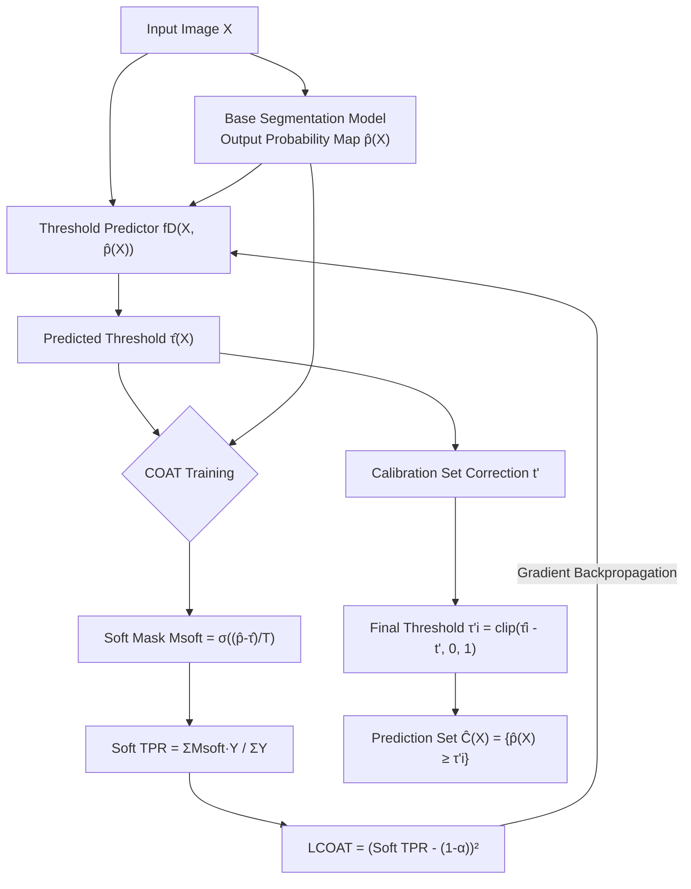

# Enhancing Image-Conditional Coverage in Segmentation: Adaptive Thresholding via Differentiable Miscoverage Loss

**Conference**: ICLR 2026  
**Code**: [bjbbbb/Conditional-Optimization-for-Adaptive-Thresholding](https://github.com/bjbbbb/Conditional-Optimization-for-Adaptive-Thresholding)  
**Area**: segmentation  
**Keywords**: conformal prediction, image-conditional coverage, adaptive thresholding, differentiable miscoverage loss, uncertainty quantification

## TL;DR

The COAT framework is proposed to learn image-adaptive threshold predictors end-to-end using a differentiable sigmoid soft TPR approximation as a loss function, significantly reducing the per-image Coverage Gap in Conformal Risk Control for image segmentation.

## Background & Motivation

**Background**: Conformal Risk Control (CRC) provides marginal statistical guarantees for image segmentation by searching for a single threshold $\tau'$ on a calibration set to control the False Negative Rate (FNR). **Limitations of Prior Work**: A single global threshold applies a "one-size-fits-all" approach—"easy" images are over-covered while "hard" images are severely under-covered. This leads to a high Coverage Gap (the mean difference between per-image TPR and the target coverage $1-\alpha$). Furthermore, the relationship between thresholds and coverage is non-monotonic and discontinuous (as shown in Figure 2), preventing direct gradient computation on coverage. **Key Challenge**: Marginal guarantees (average FNR $\le \alpha$) $\neq$ conditional guarantees (FNR for each image $\le \alpha$). While CRC solves the former, the latter is the actual requirement in high-risk scenarios such as medicine and autonomous driving. **Goal**: To learn an image-adaptive threshold $\hat{\tau}(X)$ for each image so that its per-image coverage closely matches the target $1-\alpha$. **Core Idea**: Replace hard threshold binarization with a soft mask using a sigmoid function, making TPR differentiable with respect to $\hat{\tau}$. This allows defining an end-to-end optimizable miscoverage loss, bypassing the tedious process of pre-computing optimal thresholds.

## Method

### Overall Architecture

The paper proposes two progressive schemes: **AT** (supervised regression baseline) and **COAT** (end-to-end differentiable optimization). Both share the same threshold predictor $f_D$, which takes image $X$ and the base segmentation model's probability map $\hat{p}(X)$ as inputs. The difference lies in the training objective: AT is supervised by pre-calculated optimal hard thresholds, while COAT directly optimizes conditional coverage using soft TPR. After training, both compute a global correction value $t'$ on a calibration set to maintain marginal guarantees.

### Key Designs

**1. AT: Supervised Threshold Regression — Foundation of the Adaptive Framework**

AT treats threshold prediction as supervised regression. For each image $(X_i, Y_i)$ in the training set, an "ideal threshold" $\tau^*(X, Y)$ is pre-computed via binary search such that the TPR exactly equals $1-\alpha$. Then, $f_D$ is trained using MSE loss:

$$\mathcal{L}_\text{AT} = \mathbb{E}_{(X,Y)\sim D_\text{train}}\left[(\hat{\tau}(X) - \tau^*(X,Y))^2\right]$$

AT directly regresses a threshold scalar, which is simple and effective but relies on pre-computation and suffers from errors when the threshold-coverage relationship is non-monotonic.

**2. COAT: Differentiable Miscoverage Loss — Direct Optimization of Conditional Coverage**

The core insight of COAT is that hard threshold binarization $\mathbf{1}[\hat{p}_j \geq \hat{\tau}]$ is non-differentiable. By replacing it with a sigmoid, a soft mask is obtained:

$$M_\text{soft}(X) = \sigma\!\left(\frac{\hat{p}(X) - \hat{\tau}(X)}{T}\right)$$

where the temperature parameter $T > 0$ controls the steepness of the sigmoid ($T \to 0$ approaches a hard threshold). The soft TPR is:

$$\widetilde{\text{TPR}}(X, Y, \hat{\tau}) = \frac{\sum_j M_\text{soft}(X)[j] \cdot Y[j]}{\sum_j Y[j] + \epsilon}$$

The loss function directly penalizes the difference between the soft TPR and the target coverage:

$$\mathcal{L}_\text{COAT} = \mathbb{E}\left[\left(\widetilde{\text{TPR}}(X, Y, \hat{\tau}(X)) - (1-\alpha)\right)^2\right]$$

Gradients flow from $\mathcal{L}_\text{COAT}$ through $M_\text{soft}$ back to the parameters of $f_D$, requiring no intermediate supervised labels.

**3. Post-hoc Calibration Correction — Layering Marginal Guarantees on Adaptive Thresholds**

COAT training only optimizes conditional coverage. Marginal guarantees are fulfilled by the calibration set. A global correction $t'$ is computed on $D_\text{cal}$:

$$t' = \inf\!\left\{t \;\middle|\; R(t) \geq \frac{|D_\text{cal}|+1}{|D_\text{cal}|}(1-\alpha)\right\}$$

where $R(t)$ is the empirical coverage after shifting all calibration image thresholds by $-t$. The final test threshold is $\tau'_i = \text{clip}(\hat{\tau}_i - t', 0, 1)$. This step grants AT/COAT finite-sample marginal guarantees (Theorem 1, inherited from CRC theory).

**4. Threshold Predictor Architecture**

$f_D$ takes the concatenated tensor of image $X$ and probability map $\hat{p}(X)$ as input and outputs a single scalar $\hat{\tau}(X) \in [0,1]$. This architecture is independent of the base segmentation model and can be flexibly replaced (compatible with DeepLab v3+, UNet, PSPNet, and SINet in experiments).

## Key Experimental Results

### Main Results

The following table compares different methods under the Polyp dataset, PSPNet base model, and $\alpha=0.1$ (mean ± SD over 20 random splits):

| Method | Marginal Coverage | Coverage Gap ↓ |
|------|-------------------|----------------|
| CRC | 0.906 (0.019) | 0.150 (0.015) |
| AA-CRC | 0.908 (0.018) | 0.119 (0.016) |
| AT | 0.899 (0.018) | 0.119 (0.014) |
| **COAT** | **0.894 (0.016)** | **0.110 (0.015)** |

For Polyp+SINet with $\alpha=0.1$: COAT Coverage Gap is 0.102 vs. CRC 0.149 (31% reduction). For Skin+DeepLab v3+ with $\alpha=0.2$: COAT 0.073 vs. CRC 0.107 (32% reduction). COAT **consistently achieves the best Coverage Gap** across 24 experimental groups (3 datasets × 4 models × 2 $\alpha$ values).

### Ablation Study

| Configuration | Coverage Gap (Polyp, PSPNet, α=0.1) | Description |
|------|--------------------------------------|------|
| CRC (Non-adaptive) | 0.150 | Global single threshold baseline |
| AT (Supervised) | 0.119 | Adaptive but relies on pre-computed hard thresholds |
| COAT (Differentiable Loss) | 0.110 | End-to-end direct optimization of conditional coverage |

Ablation of temperature $T$ (Appendix A.5): When $T$ is too small, it approaches hard thresholds and gradients vanish; when $T$ is too large, the over-softening deviates from the target. A medium temperature is optimal.

### Key Findings

- COAT achieves the best Coverage Gap in all experimental combinations while still satisfying marginal coverage (≈ target $1-\alpha$); the two are not in conflict.
- The COAT training loss converges quickly and stably near 0 across four different base segmentation models (Figure 5).
- Qualitative visualization (Figure 3/4): While CRC shows an FNR as high as 0.613 on hard images, COAT controls almost all images near the target FNR.
- The improvement is relatively smaller on the Fire dataset (due to lower variance in image difficulty), highlighting that the method's advantages are more prominent on highly heterogeneous datasets.

## Highlights & Insights

- **Clean Differentiability**: Replacing the non-differentiable indicator function with a sigmoid soft mask is simple yet enables differentiability for the entire TPR, turning "direct coverage optimization" from a theoretical possibility into an engineering reality.
- **Complete Theoretical Guarantees**: COAT does not abandon marginal guarantees—it uses the post-hoc calibration correction $t'$ to recover CRC's finite-sample theory, achieving "conditional coverage optimization + marginal guarantee layering."
- **Model Agnosticism**: $f_D$ takes the probability maps of any segmentation model as input. It requires no changes to the base model and can serve as a plug-and-play post-processing module.
- **Introduction of the Coverage Gap Metric**: Measuring the quality of conditional coverage using the difference between per-image coverage and target coverage provides a finer granularity than marginal coverage and is worth adopting.

## Limitations & Future Work

- Training $f_D$ requires an independent $D_2$ (separated from $D_1$ used for training the base model), increasing data partitioning complexity and data volume requirements.
- The temperature $T$ is a hyperparameter requiring additional tuning; its optimal value depends on the dataset and model, and an adaptive determination scheme is lacking.
- Currently limited to binary segmentation (foreground/background); the extension of conditional coverage to multi-class semantic segmentation remains to be explored.
- Theoretical proofs for conditional validity (Appendix A.1) rely on strong distributional assumptions, and the actual guarantee strength is weaker than marginal guarantees.

## Related Work & Insights

- **vs. CRC (Angelopoulos et al., 2024)**: CRC is the foundation of this work and provides marginal guarantees; COAT adds image-level adaptation on top of it to bridge the gap in conditional coverage.
- **vs. AA-CRC (Blot et al., 2025)**: AA-CRC also attempts adaptive thresholding but does not use differentiable optimization; COAT further reduces the Coverage Gap through end-to-end training.
- **vs. SACP (Bereska et al., 2025)**: SACP adapts in the spatial dimension (pixel neighborhoods), while COAT adapts in the image dimension (whole-image thresholds); the two are complementary.
- **Insights for Segmentation Uncertainty Estimation**: The soft-thresholding idea can be extended to other tasks requiring differentiable coverage control, such as conditional coverage control for object detection bounding boxes.

## Rating

- Novelty: ⭐⭐⭐⭐ The construction of a differentiable miscoverage loss is novel, advancing coverage optimization from "calibration post-processing" to a "training objective."
- Experimental Thoroughness: ⭐⭐⭐⭐ Comprehensive coverage of 24 groups across 3 datasets, 4 models, and 2 $\alpha$ values, with intuitive qualitative visualizations.
- Writing Quality: ⭐⭐⭐⭐ Problem modeling is clear, the progression from AT to COAT is logical, and the algorithm pseudocode is complete.
- Value: ⭐⭐⭐⭐ Directly applicable for uncertainty quantification in high-risk segmentation scenarios like medical imaging and autonomous driving.

<!-- RELATED:START -->

## Related Papers

- [\[ICLR 2026\] Detective SAM: Adaptive AI-Image Forgery Localization](detective_sam_adaptive_ai-image_forgery_localization.md)
- [\[CVPR 2025\] Task-driven Image Fusion with Learnable Fusion Loss](../../CVPR2025/segmentation/task-driven_image_fusion_with_learnable_fusion_loss.md)
- [\[CVPR 2026\] Differentiable Laplacian Matrix Guided Superpixel Segmentation](../../CVPR2026/segmentation/differentiable_laplacian_matrix_guided_superpixel_segmentation.md)
- [\[CVPR 2026\] Boundary-Responsive Differentiable Gating for Superpixel-Based Segmentation](../../CVPR2026/segmentation/boundary-responsive_differentiable_gating_for_superpixel-based_segmentation.md)
- [\[CVPR 2026\] SegGBC: Justifiable Coarse-to-Fine Granular-Ball Computing for Enhancing Clustering Image Segmentation](../../CVPR2026/segmentation/seggbc_justifiable_coarse-to-fine_granular-ball_computing_for_enhancing_clusteri.md)

<!-- RELATED:END -->
