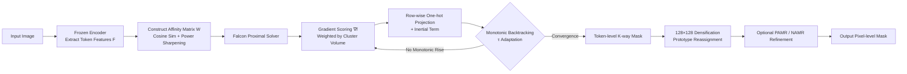

# Falcon: Fast Proximal Linearization of Normalized Cuts for Unsupervised Image Segmentation

**Conference**: ICLR 2026  
**OpenReview**: [https://openreview.net/forum?id=PvWHzAf9qp](https://openreview.net/forum?id=PvWHzAf9qp)  
**Code**: [https://github.com/ZhangXLaurence/Falcon-Seg](https://github.com/ZhangXLaurence/Falcon-Seg)  
**Area**: Unsupervised Image Segmentation / Training-free Zero-shot Segmentation / Graph Cut  
**Keywords**: Normalized Cut, Proximal Gradient, Discrete Optimization, KL Convergence, Vision Foundation Models, Zero-shot Segmentation  

## TL;DR
Falcon reformulates the classic Normalized Cut (NCut) in zero-shot unsupervised segmentation—moving away from the traditional "spectral relaxation + recursive bisection + rounding" routine—into a **solver that directly performs proximal linearization on discrete K-way one-hot labels**. This approach ensures linear convergence under the KL framework, improves inference speed by nearly an order of magnitude, and achieves new SOTA results across six segmentation benchmarks.

## Background & Motivation
- **Background**: The mainstream approach for training-free zero-shot segmentation involves extracting token features from frozen vision foundation models (DINO, Diffusion models, etc.) and using classic graph cut principles to cluster tokens into semantic regions. Methods like TokenCut, MaskCut, and DiffCut follow this path, generating competitive unsupervised masks through "strong features + NCut."
- **Limitations of Prior Work**: Current NCut-based pipelines are hindered by three issues: ① **Slow**—recursive bisection requires a new eigen-decomposition for every cut, leading to explosive costs for large token graphs; ② **Inaccurate**—they optimize a continuous problem after spectral relaxation and then round the solution back to discrete labels; these successive approximations cause the final segmentation to deviate from the true discrete NCut objective; ③ **Unstable**—recursive bisection provides no principled guarantee for producing stable K-way segmentations, and its heuristic components lack convergence guarantees.
- **Key Challenge**: NCut itself is an elegant combinatorial optimization objective, but practical engineering uses a patchwork "relaxation-rounding-recursion" process. A **systematic gap exists between the objective and the solver**, which is the root cause of these three pain points.
- **Goal**: To **directly optimize the discrete K-way NCut objective** with convergence guarantees while significantly accelerating the process, without bypassing via spectral relaxation.
- **Core Idea**: **Model NCut as a composite objective of a "smooth term + one-hot indicator function" and solve it via forward-backward proximal gradient iteration.** Each step uses the exact gradient of the objective to calculate token-to-cluster scores, then projects each row back onto valid one-hot labels. Inertial terms and monotonic backtracking ensure the objective increases monotonically and converges under the KL framework.

## Method

### Overall Architecture
The Falcon pipeline consists of three stages: ① **Feature Extraction**—frozen encoders (SSD-1B diffusion model / DINOv3) extract tokens to construct a dense affinity matrix $W$ between tokens; ② **Fast Proximal Linearization of NCut**—the core solver that iteratively updates the discrete K-way assignments $X$ until convergence; ③ **Optional Mask Densification and Refinement**—upsampling token-level coarse masks to an intermediate resolution and applying a lightweight pixel-level refiner (PAMR / NAMR). The second stage is the primary contribution, while the third is a plug-and-play post-processing step added to align with evaluation protocols.

### Key Designs

**1. Composite Objective Modeling: Embedding Discrete Feasibility into Non-smooth Terms.** Falcon does not relax the one-hot constraints. Instead, it formulates the problem as $\min_{X\in\mathbb{R}^{N\times K}}\Phi(X)=h(X)+g(X)$, where the smooth term $h(X)=-f(X)$ comes from the normalized association $f(X)=\sum_{k=1}^{K}\frac{x_k^\top W x_k}{x_k^\top D x_k}$ (minimizing NCut is equivalent to maximizing $f$, since $\mathrm{Ncut}(X)=K-f(X)$). The non-smooth term $g(X)=\iota_{\mathcal V}(X)$ is the indicator function for the row-wise one-hot feasible set $\mathcal V=\{X\in\{0,1\}^{N\times K}:X\mathbf 1=\mathbf 1\}$. Discreteness is thus exactly encoded into $g$. Since $h$ is $C^1$ smooth in the neighborhood where $v_k=x_k^\top D x_k>0$, a proximal framework—taking a forward smooth gradient step and a backward discrete projection—is naturally applicable, **eliminating the need for heuristic rounding**.

**2. Closed-form Gradient Scoring + Row-wise One-hot Proximal Projection.** Each iteration caches three quantities: $G=WX$, $q_k=x_k^\top W x_k$ (intra-cluster association), and $v_k=x_k^\top D x_k$ (cluster volume). The exact gradient is obtained via the quotient rule: $\nabla f(X)=2\big(G v^{-T}-(DX)\rho^\top\big)$, where $\rho_k=q_k/v_k^2$. After approximating $f$ with a quadratic lower bound at the current point $X^{(t)}$, the maximization over the discrete set $\mathcal V$ is **row-wise separable**. Since each row is one-hot, $\|y_i\|_2^2$ is constant, leaving only the cross terms. Thus, the update has a closed-form solution:
$$x_i^{(t+1)}=e_{\arg\max_{k}\;\mu_{ik}^{(t)}+\tau_t X_{ik}^{(t)}},\quad \mu^{(t)}=\nabla f(X^{(t)}).$$
Here, $\mu_{ik}$ is the first-order gain of assigning token $i$ to cluster $k$, while $\tau_t X_{ik}^{(t)}$ is an **inertial reward**: it prefers retaining the current label unless an alternative assignment is significantly better, thereby avoiding unnecessary label flips. The entire update remains discretely feasible and fully vectorized, which is why it is an order of magnitude faster than recursive eigen-decomposition.

**3. Monotonic Backtracking to Guarantee Non-decreasing Objective.** Since the Lipschitz constant $L_t$ is unknown and varying, Falcon employs Armijo-type backtracking. Starting from $\tau_t=\tau_0$, if the acceptance condition $f(X^{(t+1)})\ge f(X^{(t)})+\delta\frac{\tau_t}{2}\|X^{(t+1)}-X^{(t)}\|_F^2$ is met, the update is accepted. Otherwise, $\tau_t \leftarrow \gamma \tau_t$ ($\gamma > 1$) and the step is recalculated. This "sufficient ascent" rule **ensures $f$ increases monotonically and backtracking terminates in finite steps**, and is equivalent to the sufficient descent of $\Phi$.

**4. Convergence Guarantee under the KL Framework.** Falcon uses a forward-backward format with monotonic backtracking. The update is a proximal step for $g=\iota_{\mathcal V}$ driven by the linearization of $h=-f$. Since the discrete NCut objective consists of polynomials of the affinity matrix with one-hot constraints, it is a **semi-algebraic function** and automatically satisfies the Kurdyka–Łojasiewicz (KL) property. Under standard conditions (bounded sub-level sets, local Lipschitz $\nabla f$), it can be proven that the sequence of iterations is finite in length and converges to a critical point. When the KL exponent $\theta \le \frac{1}{2}$, the local convergence rate is at least linear. Note: "convergence" here refers to reaching a stationary point, not the global optimum of the NP-hard NCut objective.

**5. Densification and Plug-and-play Refinement (PAMR / NAMR).** The solver provides coarse labels $\ell$ on the token grid. Falcon first performs a reassignment on a $128 \times 128$ intermediate grid using nearest-neighbor label upsampling and bilinear feature upsampling, based on the **prototype** (mean embedding) of each cluster: $\ell^*_{u,v}=\arg\max_k z_{u,v}^\top p_k$, original artifacts from tokenization are reduced. Subsequently, one can optionally apply PAMR (linear, single-temperature edge-aware diffusion) or the newly proposed NAMR (non-linear affinity with multi-temperature averaging; low temperature for edge preservation, high temperature for smoothing). The authors emphasize that the refinement module is **independent of the solver** and can be PAMR, DenseCRF, or none, proving Falcon’s gains stem from the solver itself.

## Key Experimental Results

### Main Results Table
Unsupervised segmentation mIoU on six benchmarks (Encoder: SSD-1B + PAMR; † denotes strong baselines reproduced by the authors):

| Method | VOC | Context | COCO-Object | COCO-Stuff-27 | Cityscapes | ADE20K |
|------|-----|---------|-------------|---------------|------------|--------|
| MaskCut | 53.80 | 43.40 | 30.10 | 41.70 | 18.70 | 35.70 |
| DiffSeg | 49.80 | 48.80 | 23.20 | 44.20 | 16.80 | 37.70 |
| DiffCut (Official) | 65.20 | 56.50 | 34.10 | 49.10 | 30.60 | 44.30 |
| AutoSC† | 77.57 | 57.27 | 61.56 | 49.39 | 25.72 | 40.10 |
| DiffCut† | 71.68 | 58.17 | 61.65 | 49.18 | 30.77 | 44.40 |
| **Ours (Falcon)** | **78.40** | 57.15 | **61.80** | **50.37** | **33.69** | **45.17** |

Compared to the strongest official baseline DiffCut, Falcon improves VOC by +13.2, COCO-Object by +27.7, Cityscapes by +3.1, COCO-Stuff-27 by +1.3, and ADE20K by +0.9 (Pascal Context is comparable). It achieves the best results in 17 out of 18 benchmark–encoder combinations.

### Ablation Study Table
Robustness across encoders and refiners (mIoU, selected):

| Benchmark | Method | No Refiner | PAMR | NAMR |
|------|------|--------|------|------|
| VOC (SSD-1B) | DiffCut† | 68.40 | 71.68 | 71.94 |
| VOC (SSD-1B) | **Ours** | **79.15** | 78.40 | 78.83 |
| Cityscapes (SSD-1B) | DiffCut† | 28.35 | 30.77 | 30.95 |
| Cityscapes (SSD-1B) | **Ours** | 30.56 | **33.69** | 33.50 |
| COCO-Object (DINOv3-B) | DiffCut† | 52.71 | 59.11 | 60.55 |
| COCO-Object (DINOv3-B) | **Ours** | **62.19** | 59.69 | 60.78 |

Runtime (End-to-end, single RTX 4094090, DINOv3-B / Cityscapes): Falcon reduces total time from DiffCut's 784.04s to **87.47s**, and Mask Generation from 747.97s to **52.49s**.

### Key Findings
- **The Solver is the Source of Gain**: Falcon consistently outperforms DiffCut across all encoders and refinement choices, proving that the improvements stem from the solver directly optimizing the discrete objective rather than a specific backbone or post-processing.
- **Object-centric Scenes Require No Refinement**: On VOC, Falcon achieves 79.15 mIoU without refinement (refining slightly decreases it), indicating that the discrete solution already has very clean boundaries.
- **Greater Speedup with More Tokens**: While recursive NCut costs explode at high resolutions or high token counts, Falcon remains fully vectorized and typically converges in very few outer iterations, widening its speed advantage as resolution increases.
- **Hyperparameter Insensitivity**: The power parameter $\alpha$ and the spectral threshold $\kappa$ (used to estimate $K$) have a gentle impact on mIoU within reasonable ranges.

## Highlights & Insights
- **Returning Engineering Patchwork to Principled Optimization**: For a long time, the NCut pipeline was an empirical combination of "relaxation-rounding-recursion." Falcon provides the first solver that iterates directly on discrete one-hot labels with convergence proofs, bridging the gap between an "elegant combinatorial objective" and the "actual process."
- **Maintaining Discrete Feasibility Throughout**: Every iteration yields a valid one-hot assignment, avoiding the mismatch inherent in relax-and-round approaches. This is the root of its accuracy gains.
- **Speed Derived from Theory**: The linear convergence in KL theory manifests in practice as "converging in very few outer iterations," translating theoretical guarantees into engineering speed.
- **Refiner-agnostic Honest Design**: The authors deliberately treat refinement as a plug-and-play module and conduct controlled experiments, avoiding attributing post-processing gains to the solver. This makes the conclusions highly credible.

## Limitations & Future Work
- **Affinity is Still $O(N^2)$**: The quadratic complexity of dense token affinity is not eliminated; Falcon is simply more memory-scalable. Extremely large token grids remain a challenge.
- **$K$ Depends on Spectral Heuristic**: The number of segments $K$ is determined via a single eigen-decomposition of the normalized affinity and counting eigenvalues below a threshold $\kappa$. Since $\kappa$ is per-dataset rather than per-image, it may not be adaptive enough for scenes with vast differences in annotation granularity.
- **Convergence to Stationary Points**: NCut is NP-hard. The theory only guarantees reaching a critical point; issues with initialization and local optima persist.
- **Dependency on Strong Foundation Model Features**: As a training-free solver, the performance ceiling is determined by the feature quality of the frozen encoders (SSD-1B / DINOv3).

## Related Work & Insights
- **Linkage to Graph Cut Lineage**: From Shi & Malik's original Normalized Cut to recent works like TokenCut / MaskCut / AutoSC / DiffCut that use self-supervised Transformer features—all have been constrained by recursive bisection and hard segmentation constraints. Falcon serves as a direct upgrade to the solver for this lineage.
- **Proximal Gradient and KL Theory**: The $O(1/k^2)$ rate of FISTA, its monotonic variants, and the characterization of non-convex prox-linear convergence by Attouch–Bolte in the KL framework form the mathematical foundation of Falcon. The inertial extension (Ochs et al.) corresponds to its inertial term design.
- **Vision Foundation Models**: The strong features provided by DINO / DINOv3 and Diffusion models (SSD-1B, SD2.1) are the prerequisite for training-free segmentation. Falcon pairs "strong features" with a "principled NCut solver" to narrow the gap between unsupervised and supervised segmentation.
- **Inspiration**: Directly connecting a "classic combinatorial objective" with "modern foundation model features" using a discrete optimizer with convergence guarantees is a strategy that can be extended to other graph-aware tasks (clustering, community detection, point cloud segmentation).

## Rating
- **Novelty**: ⭐⭐⭐⭐⭐ Reformulating NCut from a spectral relaxation paradigm to a direct discrete proximal solver with KL convergence proof is a substantial methodological innovation.
- **Experimental Thoroughness**: ⭐⭐⭐⭐ Solid results across six benchmarks, three encoders, and three refiners, including runtime and sensitivity analyses. Excellent comparisons with self-reproduced strong baselines.
- **Writing Quality**: ⭐⭐⭐⭐ Clear structure addressing three pain points. Rigorous Method and convergence analysis, though the density of formulas might be high for readers without an optimization background.
- **Value**: ⭐⭐⭐⭐⭐ High accuracy and speed (nearly 10x faster). Being training-free and plug-and-play makes it highly valuable for the unsupervised/zero-shot segmentation community.

<!-- RELATED:START -->

## Related Papers

- [\[NeurIPS 2025\] Towards Unsupervised Domain Bridging via Image Degradation in Semantic Segmentation](../../NeurIPS2025/segmentation/towards_unsupervised_domain_bridging_via_image_degradation_in_semantic_segmentat.md)
- [\[ICLR 2026\] AMLRIS: Alignment-aware Masked Learning for Referring Image Segmentation](amlris_alignment-aware_masked_learning_for_referring_image_segmentation.md)
- [\[ICML 2026\] Geometry-Preserving Unsupervised Alignment for Heterogeneous Foundation Models](../../ICML2026/segmentation/geometry-preserving_unsupervised_alignment_for_heterogeneous_foundation_models.md)
- [\[ICLR 2026\] Enhancing Image-Conditional Coverage in Segmentation: Adaptive Thresholding via Differentiable Miscoverage Loss](enhancing_image-conditional_coverage_in_segmentation_adaptive_thresholding_via_d.md)
- [\[ICLR 2026\] VINCIE: Unlocking In-context Image Editing from Video](vincie_unlocking_in-context_image_editing_from_video.md)

<!-- RELATED:END -->
