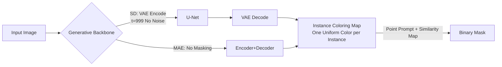

# gen2seg: Generative Models Enable Generalizable Instance Segmentation

**Conference**: ICLR 2026  
**OpenReview**: [https://openreview.net/forum?id=cSpjHOf04S](https://openreview.net/forum?id=cSpjHOf04S)  
**Code**: [reachomk.github.io/gen2seg](https://reachomk.github.io/gen2seg)  
**Area**: Instance Segmentation / Generative Model Transfer  
**Keywords**: Instance Segmentation, Generative Prior, Stable Diffusion, MAE, Zero-shot Generalization, Class-agnostic Segmentation  

## TL;DR
By fine-tuning Stable Diffusion or MAE as "instance colorers" using synthetic mask supervision from only two narrow domains—indoor furniture and vehicles—this method achieves zero-shot generalization to unseen object categories and styles (e.g., humans, animals, artistic paintings, X-rays). Its performance approaches, and on fine structures even exceeds, SAM models supervised by 1.1 billion masks.

## Background & Motivation
- **Background**: The benchmark for class-agnostic instance segmentation is SAM, which was trained on SA-1B (11M images, 1.1B masks) using 256 A100 GPUs to achieve zero-shot promptable segmentation through "large-scale data coverage." Mainstream segmentation architectures (DETR/Mask2Former families) typically encode images into low-resolution features and learn a mask predictor from scratch for upsampling.
- **Limitations of Prior Work**: This "broad-coverage supervision" approach is extremely costly. Furthermore, since the mask predictor is learned from scratch, discriminative models (e.g., SimpleClick, DINO) often fail when encountering object types with masks unseen during training, as they cannot group pixels into novel objects.
- **Key Challenge**: Human children can recognize zebras and giraffes as independent objects even if they have only interacted with cups and chairs. This suggests the visual system learns a **transferable "grouping mechanism"** rather than a "category dictionary." Existing discriminative pipelines essentially learn the latter.
- **Goal**: To investigate whether a model can learn from an extremely narrow visual slice (only two object types) and yet generalize to completely unseen mask types and styles under a strict zero-shot setting.
- **Key Insight**: **Generative priors are grouping priors.** To synthesize coherent images from text or corrupted inputs, generative models must implicitly understand object boundaries, parts, and scene compositions. By "redirecting" this prior to segmentation, generalization stems from pre-training rather than the breadth of supervision.

## Method

### Overall Architecture
gen2seg reformulates instance segmentation as an **image-to-image translation** task. Given an input image, the model outputs an RGB image where each instance is painted with a unique, internally uniform color, and the background is black. This eliminates the need for task-specific heads, reusing the natural $R^{W\times H\times 3}\to R^{W\times H\times 3}$ interface of generative models. For Stable Diffusion, the image is encoded into the latent space but **no noise is added**; the model is fixed to the noisiest timestep $t=999$, allowing the U-Net and VAE to deterministically solve the coloring map in one step. For MAE, the encoder and decoder are used without masking. Inference is single-step and deterministic.

### Key Designs
**1. Instance Coloring Loss: Replacing fixed color mapping with "soft constraints."** A major difficulty in encoding masks as colors is that an infinite number of valid color assignments exist for any given image (e.g., which instance is red or blue is arbitrary). Therefore, a fixed color cannot be directly regressed. The authors anchor the RGB segmentation map to two essential properties: low color variance within a mask and the absence of that color outside the mask. Let $S_i$ be the set of pixels for the $i$-th instance, and its representative color be the mean $\mu_{i,c}=\frac{1}{|S_i|}\sum_{j\in S_i}p_{j,c}$, with the background forced to black $\mu_{0,c}=0$. The loss consists of three terms:
- **Intra-class Variance Loss**: $L_{var}=\sum_i\frac{1}{|S_i|}\sum_{j\in S_i}\sum_c L_s(p_{j,c},\mu_{i,c})$ uses smooth $\ell_1$ (which converges better than $\ell_2$ and does not over-penalize outliers) to pull each pixel toward the instance mean.
- **Inter-class Separation Loss**: $L_{sep}=\sum_i\frac{1}{\sqrt{|S_i|}|T_i|}\sum_{j\in T_i}\frac{1}{1+\sum_c(p_{j,c}-\mu_{i,c})^2}$ pushes the colors of pixels $T_i=\Omega\setminus S_i$ outside the mask away from the instance mean. The $\sqrt{|S_i|}$ term increases the weight of small objects, and the term saturates with distance to prevent distant pixels from dominating.
- **Mean-level Separation Loss**: $L_{mean}=\frac{1}{n(n+1)}\sum_{i<j}\frac{1}{1+\sum_c(\mu_{i,c}-\mu_{j,c})^2}$ further separates the centroid colors of different instances.
The total loss is $L_{IC}=L_{var}+\lambda_{sep}L_{sep}+\lambda_{mean}L_{mean}$. This design is simple, intuitive, and architecture-agnostic, essentially mapping the concept of supervised feature clustering into the pixel color space.

**2. Forcing Generative Models to be Optimal Pixel-level Performers.** Generative backbones are chosen over discriminative ones because encoders like SAM's discard low-level details, necessitating an FPN to recover them via upsampling. In contrast, the output features of SD/MAE are already at the original image resolution. To synthesize sharp edges and part-whole relationships during pre-training, these models are forced to model these components. The authors demonstrate that both VAE and MAE decoders can decode these colored mask maps almost losslessly. Consequently, the segmentation quality directly inherits federal generative priors, manifesting as sharper boundaries than SAM and the ability to segment fine structures (e.g., thin wires) that SAM misses.

**3. Point-Prompted Segmentation without a Mask Decoder.** To prove that output features themselves encode instance shapes, the authors intentionally avoid training an independent mask decoder. Given a prompt point $p$, a query vector $q_p$ is obtained by averaging neighboring colors with a Gaussian weight (std $0.01(W,H)$). A similarity map $S_p(x,y)=\min(1,\frac{1}{\|F(x,y)-q_p\|_2})$ is calculated, normalized, and smoothed using joint bilateral filtering (guided by $F$). Binary masks are obtained by thresholding the pixel-wise maximum across multiple prompt points. This "nearest-neighbor" probe proves that shape information resides within the color features.

## Key Experimental Results
Training utilizes only synthetic data: Hypersim (indoor scenes, 66k images) + Virtual Kitti 2 (driving scenes, cars only, 20k images), totaling ~86k images with low diversity (Hypersim uses only 457 scenes; VK2 uses 5 clips of ~15 seconds). The strongest model was trained for 29 hours on 4 RTX6000 Ada GPUs, compared to 68 hours on 256 A100s for SAM. Evaluation spans five high-variance datasets: COCO (novel classes only), DRAM (art), EgoHOS (first-person), iShape (fine structures), and PIDRay (X-rays).

### Main Results (Zero-shot mIoU with Single Point Prompt)

| Model | COCO-L | COCO-M | DRAM | EgoHOS | iShape | PIDRay |
| :--- | :---: | :---: | :---: | :---: | :---: | :---: |
| SAM (1B Mask Supervision) | 57.0 | 59.5 | 50.2 | 56.4 | 16.8 | 44.2 |
| SimpleClick | 1.4 | 0.6 | 2.4 | 1.6 | 1.6 | 1.5 |
| DINO-B | 35.0 | 11.0 | 29.4 | 14.8 | 27.4 | 14.9 |
| gen2seg (MAE-B) | 44.6 | 17.8 | 34.3 | 28.9 | 31.1 | 21.6 |
| gen2seg (MAE-H) | 50.0 | 23.2 | 40.3 | 31.9 | 34.9 | 24.1 |
| **gen2seg (SD)** | **57.6** | 38.8 | 48.2 | 40.0 | **51.4** | 30.9 |

The SD version matches or exceeds SAM on large objects and **outperforms SAM by over 3x** on iShape (51.4 vs 16.8). Discriminative baselines like SimpleClick fail completely, confirming that generalization is unique to the generative approach.

### Ablation Study (Different Training Domains, MAE-H/SD)

| Training Data | DRAM | iShape | PIDRay |
| :--- | :---: | :---: | :---: |
| Original (Hypersim+VK2) | 40.3/48.2 | 34.9/51.4 | 24.1/30.9 |
| COCO | 48.1/51.2 | 33.4/41.2 | 25.7/31.9 |
| ClevrTex | 23.5/28.0 | 27.6/32.1 | 22.2/23.7 |
| Only 10 Classes | 40.1/45.1 | 33.0/53.6 | 17.6/22.8 |
| Only 5 Classes | 34.2/38.2 | 28.5/48.5 | 15.2/19.4 |

### Key Findings
- **Diversity is not mandatory**: Reducing categories from 33+ to 10 has almost no impact on performance, indicating generalization comes from the generative prior rather than data diversity. However, reducing to 5 classes or using the overly simple ClevrTex causes performance drops, suggesting a **minimum threshold of complexity** is required.
- **Sharper boundaries stem from priors**: On BSDS500, SD achieves an Edge AP of 93.4, significantly higher than SAM's 79.0. Even when trained on noisy COCO polygon edges, the model ignores the noise and predicts smooth, perceptually aligned boundaries.
- **MAE effectiveness**: MAE, pre-trained only on unlabeled ImageNet-1K (no internet-scale data or text supervision), also shows strong generalization. This suggests the generative "grouping mechanism" does not rely on massive pre-training datasets.

## Highlights & Insights
- **Paradigm Reframing**: Rewriting "predicting N binary masks" as "coloring each instance" via image-to-image translation allows generative models to be used without structural modification, providing a simple and elegant solution.
- **Strong Evidence Chain**: Using DINO+VAE (discriminative features + generative decoder) as a control group proves that generalization comes from **generative features** rather than the VAE decoder. Comparisons with SimpleClick using the same backbone and data prove the bottleneck lies in discriminative architectures.
- **Emergent Part Compositionality**: Without any part-level supervision, the model paints related parts with similar hues (e.g., Vader's cape and body) and unrelated parts with different colors, implying that generative models learn hierarchical scene representations.

## Limitations & Future Work
- **Weaknesses in small/medium objects**: The model lags significantly behind SAM on COCO-M/S, suggesting instance-level representations for small targets need improvement.
- **Point prompts as "probes" rather than a product**: The authors deliberately avoided training a mask decoder to prove feature quality, which restricts prompt-based segmentation precision. Training a high-resolution promptable mask decoder on these features is left for future work.
- **Reliance on synthetic training data**: Currently, the model has only been validated on synthetic and narrow-domain real-world transfers. It has not yet been integrated with self-supervised approaches based on pseudo-labels (e.g., NCut), which remains a promising direction.

## Related Work & Insights
- **Generation as Perception** (traceable to Hinton 2007): Early GAN/inpainting/colorization pretext tasks were once overtaken by discriminative pre-training; this paper reinvigorates the idea for instance segmentation.
- **Diffusion for Perception**: Diffusion has been applied to depth, normals, flow, correspondence, and semantic/amodal segmentation. While prior works (Fan 2024, Zhao 2025) sought "competitiveness through big data," this work focuses on the unique perspective of **generalization**.
- **Insight**: For critical fields such as robotics, medical imaging, and autonomous driving, this suggests a low-cost pathway: rather than collecting massive annotations, utilize the inherent grouping priors of existing generative models.

## Rating
- **Novelty**: ⭐⭐⭐⭐⭐ — The proposition that "generative prior = grouping prior" is validated through a simple instance coloring loss. The control experiments are rigorous and the conclusions are impactful.
- **Experimental Thoroughness**: ⭐⭐⭐⭐ — Comprehensive evidence across 5 cross-domain datasets and ablation studies on data/category counts. A lack of comparison with SAM at a similar training scale is a minor omission.
- **Writing Quality**: ⭐⭐⭐⭐⭐ — Clear motivation (children at the zoo), well-derived methodology, and highly persuasive visualizations (part compositionality, SAM failure cases).
- **Value**: ⭐⭐⭐⭐⭐ — Approaching SAM's performance while exceeding it on fine structures with a fraction of the compute provides a powerful paradigm for low-cost universal perception.

<!-- RELATED:START -->

## Related Papers

- [\[CVPR 2026\] GKD: Generalizable Knowledge Distillation from Vision Foundation Models for Semantic Segmentation](../../CVPR2026/segmentation/gkd_generalizable_knowledge_distillation_vfm.md)
- [\[ICCV 2025\] Can Generative Geospatial Diffusion Models Excel as Discriminative Geospatial Foundation Models?](../../ICCV2025/segmentation/can_generative_geospatial_diffusion_models_excel_as_discriminative_geospatial_fo.md)
- [\[ICLR 2026\] S3OD: Towards Generalizable Salient Object Detection with Synthetic Data](s3od_towards_generalizable_salient_object_detection_with_synthetic_data.md)
- [\[CVPR 2025\] Foveated Instance Segmentation](../../CVPR2025/segmentation/foveated_instance_segmentation.md)
- [\[ICLR 2026\] TRACE: Your Diffusion Model is Secretly an Instance Edge Detector](trace_your_diffusion_model_is_secretly_an_instance_edge_detector.md)

<!-- RELATED:END -->
