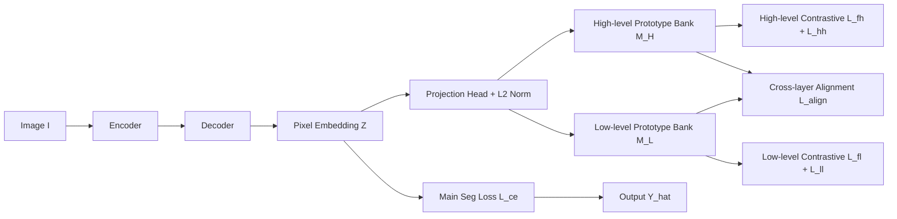

# Hierarchical Prototype Learning for Semantic Segmentation

**Conference**: ICLR 2026  
**OpenReview**: [https://openreview.net/forum?id=wHMuQ9HgUo](https://openreview.net/forum?id=wHMuQ9HgUo)  
**Code**: To be confirmed  
**Area**: Semantic Segmentation / Hierarchical Semantics / Prototypical Contrastive Learning  
**Keywords**: Hierarchical Prototypes, Contrastive Learning, Coarse-to-fine, Training-time Augmentation, Zero Inference Cost  

## TL;DR
HiPoSeg attaches a "high-level + low-level" category prototype memory bank to the output of a segmentation model. It employs hierarchical contrastive learning and cross-layer margin alignment to organize the representation space following the human visual approach of "identifying the whole before distinguishing parts." As a pure training-time plugin with zero inference overhead, it achieves an average +3.07%p mIoU gain across four benchmarks.

## Background & Motivation
**Background**: Semantic segmentation aims to assign a category label to each pixel. Mainstream methods (DeepLabV3+, OCRNet, ProtoSeg, etc.) treat it as a **flat classification** problem, where each pixel is directly mapped to a predefined category, and classes are independent of each other.

**Limitations of Prior Work**: The flat assumption ignores the inherent hierarchical structure between categories. When visually similar parts belong to different objects (e.g., "horse leg" vs. "cow leg"), the model lacks top-down constraints like "this is a horse, so its parts should be horse-related," leading to frequent misjudgments in fine-grained parts, rare classes, and boundary confusion areas. Existing hierarchical segmentation methods (HSSN, LogicSeg) introduce hierarchical reasoning but primarily fuse signals at the **probability/logit level** or treat hierarchy as fixed auxiliary loss terms, failing to **structure the representation space itself**.

**Key Challenge**: While hierarchical priors can narrow the candidate space and regularize fine-grained decisions using global context, current practices only patch the output probabilities. The representation space remains flat, and cross-layer consistency is not guaranteed.

**Goal**: Elevate hierarchy from a "loss add-on" to a "design principle for the representation space," allowing various parts of the same object to share global context in the embedding space while being stably distinguished, all without adding any inference cost.

**Core Idea**: **[Hierarchical Prototypes + Alignment Constraint]** Maintain two levels of category prototype memory banks (high and low). Use hierarchical contrastive learning to pull pixel features toward correct hierarchical prototypes and push them away from incorrect ones. A cross-layer margin alignment is then added to force low-level prototypes to stay close to their parent high-level prototypes while ensuring different high-level prototypes remain separable, thereby replicating a "coarse-to-fine" recognition curriculum in the embedding space.

## Method

### Overall Architecture
HiPoSeg (Hierarchical Prototype Segmentation) is attached to the output of any encoder-decoder segmentation model. After the decoder produces pixel embeddings, they are grouped according to low-level labels and their high-level mappings to construct and momentum-update two prototype buffers: $M_H$ (high-level) and $M_L$ (low-level). During training, a set of hierarchical contrastive losses and cross-layer alignment losses shape the embedding space, activated gradually through a phased curriculum. During inference, the entire structure is removed, leaving only the original segmentation model with zero additional parameters, computation, or latency.

### Key Designs

**1. Hierarchical Prototype Space Construction: Moving the label tree into the embedding space.** Assuming labels have two layers (coarse and fine), a fixed mapping $\pi: Y_L \to Y_H$ assigns each low-level label $y$ to its high-level parent class $y' = \pi(y)$. Pixel embeddings pass through a projection head $g_\phi$ and $\ell_2$ normalization to obtain $\tilde{z}$, and are then averaged by label to form prototypes: the high-level prototype $h_i$ is the mean of all normalized features with high-level label $i$, and the low-level prototype $l^i_j$ is the mean of features with low-level label $j$. Both are $\ell_2$ normalized to the unit sphere. The memory banks are momentum-updated $h_i \leftarrow m\,h_i + (1-m)\,\hat{h}_i$ (with $m=0.9$) to maintain stability under small batch sizes and avoid noisy features biasing the class centers.

**2. Hierarchical Contrastive Learning: "Pull positive, push negative" at both levels.** All similarities are derived from the negative squared Euclidean distance $s(a,b) = -\|a-b\|_2^2$. At the high level, the feature-prototype loss $L_{fh}$ uses softmax to pull pixels toward the correct high-level prototype and push them away from others, paired with a prototype repulsion term $L_{hh}$ to prevent high-level prototypes from collapsing:

$$L_{fh} = -\frac{1}{|N^*|}\sum_{k,n}\log\frac{\exp(s(\tilde{z}^n_k, h_{y'^*})/\tau)}{\sum_{y'\in Y_H}\exp(s(\tilde{z}^n_k, h_{y'})/\tau)}$$

The low level similarly employs $L_{fl}$ (pulling toward the correct low-level prototype) and $L_{ll}$ (mutual repulsion of low-level prototypes). This naturally forms a coarse-to-fine discrimination where high-level categories narrow down candidates (e.g., "horse"), and the low-level distinguishes parts within that category.

**3. Cross-layer Margin Alignment: Locking hierarchical topology with dual thresholds.** Relying solely on separate contrastive learning at high and low levels can lead to mutual interference and prototype drift. HiPoSeg adds an alignment constraint: "align-in" forces each low-level prototype $l^i_j$ to be within a small margin $\sigma_1$ of its parent high-level prototype $h_i$, i.e., $\max(0, \delta(l^i_j, h_i) - \sigma_1)$; "align-out" forces the distance between different high-level prototypes to be at least a large margin $\sigma_2$, i.e., $\max(0, \sigma_2 - \delta(h_i, h_k))$. With $\sigma_1=0.25 < \sigma_2=1$, the topology where "parts of the same parent cluster together, different parents stay apart" is strictly enforced, suppressing probability leakage and preventing gradient conflict between contrastive losses.

**4. Phased Curriculum Scheduling: Stabilizing coarse semantics before fine-tuning details.** The total loss is $L = \lambda_1 L_{ce} + \lambda_2 L_{fh} + \lambda_3 L_{hh} + \lambda_4 L_{fl} + \lambda_5 L_{ll} + \lambda_6 L_{align}$, but components are activated gradually. Training follows a top-down curriculum: the first 7.5% of iterations learn only feature representations; high-level prototype learning starts after 7.5%; low-level prototype learning is added after 22.5%; and the cross-layer alignment loss is activated after 37.5%. This sequence replicates the human recognition process of "identifying a horse before identifying its legs" and ensures training stability.

## Key Experimental Results

### Main Results
Using DeepLabV3+ (ResNet-101) as the baseline across four hierarchical annotation benchmarks: Cityscapes, ADE20K, Mapillary Vistas 2.0, and PASCAL-Part-108.

| Dataset | DeepLabV3+ Baseline | HSSN | LogicSeg | HiPoSeg (Ours) |
|---|---|---|---|---|
| Cityscapes | 73.55 | 83.02 | 83.20 | **84.04 (+10.49)** |
| ADE20K | 44.48 | 47.69 | 48.46 | **48.99 (+4.51)** |
| Mapillary Vistas 2.0 | 31.65 | 40.16 | 40.72 | **41.42 (+9.77)** |
| PASCAL-Part-108 | 46.90 | 48.32 | 48.46 | **49.33 (+2.43)** |

Ours achieves SOTA on all four benchmarks, with an average Gain of +3.07%p mIoU over competitors. Notably, HiPoSeg with ResNet-101 outperforms several methods using stronger HRNet-W48 backbones (e.g., ProtoSeg, Contextrast).

### Ablation Study
Ablation of loss components (Cityscapes val, Table 5):

| Configuration | mIoU (%) |
|---|---|
| Only $L_{ce}$ (Baseline) | 73.55 |
| + High-level Contrastive $L_{fh}+L_{hh}$ | 80.96 |
| + Low-level Contrastive $L_{fl}+L_{ll}$ | 81.04 |
| High + Low (No alignment) | 79.16 |
| All (Including $L_{align}$) | **84.04** |

Hierarchical prototype ablation (Table 6) shows that adding either high-level or low-level prototypes alone yields gains of 5-7 points, but **using both simultaneously** achieves maximum performance across all four datasets.

### Key Findings
- **Alignment loss is "glue," not optional**: Simple addition of high and low contrastive losses (without alignment) drops performance to 79.16, lower than single-layer versions, indicating gradient interference. The jump to 84.04 with alignment proves its decisive role in preventing prototype drift.
- **Complementarity**: Individual high or low levels provide moderate gains; their synergy triggers qualitative improvement, validating the necessity of the coarse-to-fine structure.
- **Strong gains with zero inference overhead**: All improvements originate from the training phase. At test time, the prototype mechanism is removed, adding no parameters or latency.

## Highlights & Insights
- **Elevating hierarchy to a representation design principle**: Unlike HSSN/LogicSeg which patch the logit layer, HiPoSeg directly reshapes the geometry in the embedding space using prototypes and margins, which is more fundamental.
- **Clever dual-threshold margin ($\sigma_1 < \sigma_2$)**: One threshold governs "part clustering" while the other manages "parent separation," hard-coding the label tree topology into the distance space via two simple hinge functions.
- **Plug-and-play + zero overhead**: This is a key selling point for deployment, as it can be seamlessly attached to any existing backbone/decoder.
- **Phased curriculum**: Translates the cognitive intuition of "coarse-to-fine" into an actionable training schedule, avoiding instability when multiple losses are introduced simultaneously.

## Limitations & Future Work
- **Reliance on predefined label hierarchies**: The method requires a $\pi$ mapping (high-level concepts) provided by the dataset; for datasets without existing hierarchical labels, a hierarchy tree must be constructed manually.
- **Unified two-layer structure**: Experiments flattened the three-layer structures of ADE20K and Mapillary into two layers; recursive extension to deeper hierarchies (>2 layers) remains unverified.
- **Backbone/Decoder validation**: Primarily verified on DeepLabV3+/ResNet-101; compatibility with Transformer-based segmentors (e.g., Mask2Former) requires further experimentation.
- **Hyperparameter complexity**: Six loss weights $\lambda$, two margins, temperatures $\tau/\kappa$, momentum $m$, and four scheduling ratios must be tuned; the cost of cross-dataset migration needs evaluation.

## Related Work & Insights
- **Hierarchical Semantic Segmentation**: OCRNet (object-region representation), HSSN, and LogicSeg perform hierarchical reasoning at the logit/probability layer; Ours pushes hierarchy down into the representation space.
- **Prototypical Segmentation**: ProtoSeg and Prototypical Networks use class centers to anchor features; Ours extends this to a dual-level hierarchical prototype memory bank.
- **Contrastive Learning for Segmentation**: ContrastSeg, RegionSeg, and Contextrast construct pixel/region pairs to expand decision margins but assume a flat label space; Ours fills this gap with hierarchical prototype banks and hierarchy-aware margin alignment.
- **Inspiration**: The cognitive prior of "identifying the whole before parts" can generalize to any dense prediction task with hierarchical labels (e.g., panoptic segmentation, medical multi-organ segmentation), and the paradigm of "shaping representations during training, discarding during inference" is highly attractive for zero-overhead deployment.

## Rating
- **Novelty**: ⭐⭐⭐⭐ Elevating hierarchical priors to the representation space via dual-threshold alignment is innovative; although individual components aren't entirely new, the integration is well-conceived.
- **Experimental Thoroughness**: ⭐⭐⭐⭐ Comprehensive validation across four benchmarks and solid ablation studies clearly demonstrate the role of alignment; however, testing is limited to ResNet-101 and lacks comparison with Transformer segmentors.
- **Writing Quality**: ⭐⭐⭐⭐ Clear motivation, complete formulas, and effective diagrams; the ablation logic is self-consistent.
- **Value**: ⭐⭐⭐⭐ High practical value due to its nature as a training-time plugin with zero inference cost and plug-and-play capability for existing systems.

<!-- RELATED:START -->

## Related Papers

- [\[AAAI 2026\] Bridging Granularity Gaps: Hierarchical Semantic Learning for Cross-Domain Few-Shot Segmentation](../../AAAI2026/segmentation/bridging_granularity_gaps_hierarchical_semantic_learning_for_cross-domain_few-sh.md)
- [\[CVPR 2026\] Hyperbolic Prototype Learning with Uncertainty-Aware Consistency for Continual Test-Time Segmentation](../../CVPR2026/segmentation/hyperbolic_prototype_learning_with_uncertainty-aware_consistency_for_continual_t.md)
- [\[CVPR 2026\] Bootstrap Your Own AV-Proxies: Adaptive Contrastive and Prototype Learning for Audio-Visual Segmentation](../../CVPR2026/segmentation/bootstrap_your_own_av-proxies_adaptive_contrastive_and_prototype_learning_for_au.md)
- [\[CVPR 2026\] Towards Robust Multi-Modal Semantic Segmentation with Teacher-Student Framework and Hybrid Prototype Distillation](../../CVPR2026/segmentation/towards_robust_multi-modal_semantic_segmentation_with_teacher-student_framework_.md)
- [\[CVPR 2026\] GeoGuide: Hierarchical Geometric Guidance for Open-Vocabulary 3D Semantic Segmentation](../../CVPR2026/segmentation/geoguide_hierarchical_geometric_guidance_for_open-vocabulary_3d_semantic_segment.md)

<!-- RELATED:END -->
