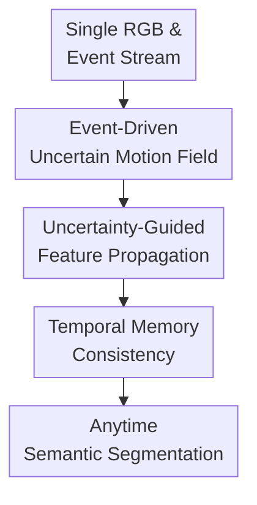

# LiFR-Seg: Anytime High-Frame-Rate Segmentation via Event-Guided Propagation

**Conference**: ICLR2026  
**OpenReview**: [https://openreview.net/forum?id=9oS7DHIg7f](https://openreview.net/forum?id=9oS7DHIg7f)  
**Code**: To be confirmed  
**Area**: Semantic Segmentation  
**Keywords**: Event Cameras, Anytime Segmentation, High-Frame-Rate Perception, Feature Propagation, Uncertainty Modeling

## TL;DR
LiFR-Seg propagates semantic features from low-frame-rate RGB images to arbitrary intermediate time points using high-frequency motion fields estimated from event streams. By employing uncertainty weighting and temporal memory to mitigate event sparsity and long-interval degradation, it allows low-frame-rate hardware to approach or even exceed the performance of high-frame-rate RGB segmentation at night.

## Background & Motivation
**Background**: Autonomous driving, UAVs, and robotics require continuous and dense scene understanding. Semantic segmentation usually relies on standard RGB cameras producing frame-by-frame outputs. Mainstream video semantic segmentation utilizes temporal consistency between adjacent frames or uses optical flow to propagate keyframe features, but most of these methods assume the input itself is a high-frame-rate video stream.

**Limitations of Prior Work**: Standard cameras have limited frame rates (e.g., 20Hz), providing a frame every 50ms. In high-speed scenarios, the rapid movement of pedestrians, vehicles, or the robot itself may occur between frames. During this "blind period," the system lacks new RGB images and must rely on stale results. While high-frame-rate RGB cameras can mitigate this, they are significantly more expensive and power-hungry; examples in the appendix show that high-speed RGB cameras cost and consume much more than event cameras.

**Key Challenge**: Event cameras record brightness changes with microsecond temporal resolution and excel at capturing motion, but the data is spatially sparse with weak texture and semantics. RGB images provide rich semantics but are temporally sparse. The challenge lies not in simply combining RGB and events, but in using the motion information from events to reliably propagate dense semantics extracted from RGB to any target moment.

**Goal**: The authors propose Anytime Interframe Semantic Segmentation: given a single past RGB frame $I_t$ and the event stream $E_{t-\Delta t\to t+\delta t}$ from the past to the target moment, predict the semantic segmentation map for any $t+\delta t$ without using future RGB frames. This requires both causality and anytime predictability rather than outputting only at fixed frame intervals.

**Key Insight**: The observation is that while event streams are semantically weak, they provide high-frequency motion cues. By extracting deep semantic features from RGB frames and propagating them via motion fields estimated from events, the "semantics from RGB" and "timing from events" can be processed separately. This is less affected by reconstruction blur than pixel-level interpolation and has a clearer geometric inductive bias than direct multimodal fusion.

**Core Idea**: Use event-driven motion fields and explicit confidence scores to propagate deep semantic features, supplemented by temporal memory to compensate for long intervals and occlusions, thereby filling the semantic perception gap between low-frame-rate camera frames.

## Method
The pipeline of LiFR-Seg is straightforward: semantic features are extracted from low-frame-rate RGB frames, while motion fields and confidence scores for the target moment are estimated from the event stream. Multi-scale semantic features are then splatted to the target moment based on the motion field, and temporal memory attention is used to incorporate long-term context. It does not generate target RGB images for segmentation or directly fuse event and image features; instead, it treats events as the motion basis for "how to transport semantics."

### Overall Architecture
Input consists of an RGB frame $I_t$ and the event stream $E_{t-\Delta t\to t+\delta t}$ up to the target moment. The output is a dense semantic map at $t+\delta t$. The framework uses an image encoder to obtain multi-scale semantic features $F_t$, voxelizes the event stream, and feeds it into an event-based optical flow network to obtain the motion field $\hat{M}_{t\to t+\delta t}$. Simultaneously, ScoreNet predicts a log-precision confidence map $S$. Softmax Splatting weights the propagation contributions using $\exp(S)$, and finally, RefineNet, temporal memory attention, and a segmentation decoder generate the target segmentation.

### Key Designs
**1. Event-Driven Uncertain Motion Field: Estimating both motion and reliability**

Event streams are first discretized into event voxels. For pixel $u=(x,y)$ and time bin $b$, the voxel value is the weighted accumulation of event polarities within the window, formulated as $E(u,b)=\sum_j p_j [u_j=u]\max(0,1-|t_j^*-b|)$. This organizes asynchronous events into a $B\times H\times W$ representation suitable for convolutional networks while preserving relative temporal positions.

For motion estimation, LiFR-Seg adopts an event flow network similar to RAFT: two event voxels are encoded to build a correlation volume, which is iteratively updated from zero flow to obtain $\hat{M}_{t\to t+\delta t}$. Crucially, optical flow alone is insufficient because flow in sparse, low-texture, or noisy regions is inherently unstable. The authors introduce ScoreNet, which concatenates event voxel features and motion field features to regress a single-channel log-precision map $S$. Higher $S$ indicates more reliable motion estimation, while lower $S$ reduces the contribution of that flow vector during propagation.

**2. Uncertainty-Guided Feature Propagation: Propagating deep semantics instead of images or labels**

LiFR-Seg propagates multi-scale deep features $F_t$ from the RGB backbone. This is critical: propagating raw images turns the task into image reconstruction or interpolation, which favors visual smoothness over semantic boundaries. Propagating final segmentation maps discretizes the data too early, making boundary errors difficult to recover. Deep features retain semantics while maintaining enough spatial structure for the decoder to refine.

The propagation operator uses Softmax Splatting with the confidence from ScoreNet as log-space importance weights:

$$
F_{t+\delta t}=\frac{\overrightarrow{\Sigma}(\exp(S_{t\to t+\delta t})\cdot F_t,\hat{M}_{t\to t+\delta t})}{\overrightarrow{\Sigma}(\exp(S_{t\to t+\delta t}),\hat{M}_{t\to t+\delta t})}.
$$

This can be understood as "forward transport with voting weights": a target position may receive features splatted from multiple source positions; features from reliable flow fields receive higher weights, while unreliable ones are suppressed. A lightweight RefineNet follows to fix local spatial inconsistencies and reduce holes or artifacts caused by splatting.

**3. Temporal Memory Consistency: Resisting degradation over long intervals and occlusions**

Propagating once from $t$ to $t+\delta t$ is essentially a Markovian operation. Over long intervals or during occlusions, features derived from a single propagation gradually degrade. LiFR-Seg incorporates a memory bank to store deep semantic features from historical key moments.

Specifically, the deepest feature from the current propagation serves as a query to perform cross-attention with historical features in the memory bank. This produces enhanced features fused with long-term context, which are then written back to the memory bank. This attention is only performed on the deepest semantic layer to capture category-level information while controlling computational costs.

### Loss & Training
The model uses SegFormer-B2 as the unified backbone. LiFR-Seg is trained end-to-end using OhemCrossEntropy loss to mitigate class imbalance.

Since ground truth labels are only available at discrete RGB frame times $t+\Delta t$, the model propagates $F_t$ to an intermediate $t+\delta t$, and then uses a second warp to push features to $t+\Delta t$ for supervision against $Seg_{t+\Delta t}$. During inference, there is no such restriction; the model can output a segmentation for any target time given the corresponding event segment.

Implementation uses AdamW with a learning rate of $1\times10^{-4}$ and weight decay of $5\times10^{-3}$, following a polynomial decay with a 10-epoch warm-up over 200 epochs on two RTX 4090 GPUs.

## Key Experimental Results

### Main Results
The main experiments compare five paradigms: ideal high-frame-rate (HFR) RGB upper bound, low-frame-rate (LFR) RGB baseline, interpolation-based segmentation, direct RGB-event fusion, and the proposed event-guided propagation. LiFR-Seg is the only strong method that satisfies both causality and anytime prediction.

| Dataset | Metric | Ours (LiFR-Seg) | Prev. SOTA (Comparable) | Gain/Gap |
|---------|--------|------------------|-------------------------|----------|
| DSEC | mIoU | 73.82 | HFR Ideal 73.91 | -0.09 from upper bound |
| DSEC | mIoU | 73.82 | CMNeXt 70.13 | +3.69 |
| SHF-DSEC | mIoU | 64.80 | HFR Ideal 65.40 | -0.60 from upper bound |
| M3ED-Drone | mIoU | 64.28 | CMNeXt 59.56 | +4.72 |
| M3ED-Quadruped | mIoU | 68.89 | CMNeXt 65.52 | +3.37 |
| DSEC-Night | mIoU | 41.86 | HFR Ideal 41.83 | +0.03 (Exceeds RGB!) |

Key findings: On DSEC, LiFR-Seg nearly matches the HFR ideal without seeing target RGB frames. In zero-shot DSEC-Night tests, event-guided propagation slightly outperforms the HFR RGB upper bound, demonstrating the robustness provided by the high dynamic range of events when image quality degrades.

### Ablation Study

| Configuration | Dataset / Interval | Metric | Note |
|---------------|-------------------|--------|------|
| w/o Score | DSEC | 72.74 mIoU | Erroneous flow directly affects propagation |
| Ours | DSEC | 73.82 mIoU | ScoreNet contributes +1.08 |
| Image Warping | DSEC 50ms | 72.37 mIoU | Better than interpolation, worse than feature warping |
| Seg. Warping | DSEC 50ms | 71.63 mIoU | Discrete label warping is hard to refine |
| Feature Warping | DSEC 50ms | 73.82 mIoU | Deep features are the optimal domain |
| Ours w/o Mem | DSEC 800ms | 57.33 mIoU | Significant feature decay over time |
| Ours w/ Mem | DSEC 800ms | 59.55 mIoU | Memory gives +2.22 for long intervals |

### Key Findings
- **ScoreNet as a filter**: Provides stable gains by filtering risks in sparse event regions.
- **Feature Propagation Superiority**: Deep features are more suitable than pixels or labels for semantic transport.
- **Temporal Memory**: Crucial for long intervals (800ms), though negligible for short intervals (50ms).
- **Efficiency**: LiFR-Seg-Lite reaches 65.6 FPS with 40.43 GFLOPs, proving it is suitable for real-time deployment.

## Highlights & Insights
- **Precise Task Definition**: Emphasizes causality and anytime prediction, avoiding unfair comparisons with non-causal interpolation methods.
- **Semantic alignment over Visual reconstruction**: Avoiding the "good-looking frame" requirement focuses the model on correctly aligning semantic information, solving the paradox where PSNR increases but mIoU decreases in interpolation.
- **Explicit Uncertainty**: ScoreNet learns "where not to trust the flow," a strategy transferable to other event-guided tasks like depth or occupancy prediction.
- **Nighttime Performance**: Proves event cameras are not just cheap sensors but can provide superior signals in low-light and high-dynamic-range scenes.

## Limitations & Future Work
- Data for high-speed dynamic objects remains limited; extreme non-linear deformations or severe source-frame blur are not fully addressed.
- Dependence on flow quality; while ScoreNet mitigates errors, significant calibration issues or extremely sparse events may still cause systematic offsets.
- Supervision is still mainly tied to discrete RGB timestamps; ground truth labels for intermediate points in real data remain rare.
- Potential extensions include applying event-guided feature propagation to depth estimation, panoptic segmentation, and dynamic occupancy grids for power-constrained edge devices.

## Related Work & Insights
- **vs Video Semantic Segmentation**: Standard methods often use future frames for propagation or aim for efficiency between existing frames; LiFR-Seg predicts blind zones using only past data.
- **vs Image Interpolation**: Interpolation usually lacks causality. LiFR-Seg skips pixel reconstruction to propagate in semantic feature space.
- **vs RGB-Event Fusion (e.g., CMNeXt)**: Direct fusion methods lack explicit geometric constraints; LiFR-Seg uses event flow to explicitly determine how semantics move.

## Rating
- Novelty: ⭐⭐⭐⭐⭐ 
- Experimental Thoroughness: ⭐⭐⭐⭐⭐ 
- Writing Quality: ⭐⭐⭐⭐ 
- Value: ⭐⭐⭐⭐⭐

<!-- RELATED:START -->

## Related Papers

- [\[ICLR 2026\] WOW-Seg: A Word-Free Open World Segmentation Model](wow-seg_a_word-free_open_world_segmentation_model.md)
- [\[CVPR 2025\] Generative Video Propagation](../../CVPR2025/segmentation/generative_video_propagation.md)
- [\[ICCV 2025\] Temporal Rate Reduction Clustering for Human Motion Segmentation](../../ICCV2025/segmentation/temporal_rate_reduction_clustering_for_human_motion_segmentation.md)
- [\[CVPR 2026\] PCA-Seg: Revisiting Cost Aggregation for Open-Vocabulary Semantic and Part Segmentation](../../CVPR2026/segmentation/pca-seg_revisiting_cost_aggregation_for_openvocabulary_semantic_and_part_segmentat.md)
- [\[ECCV 2024\] Un-EVIMO: Unsupervised Event-based Independent Motion Segmentation](../../ECCV2024/segmentation/un-evimo_unsupervised_event-based_independent_motion_segmentation.md)

<!-- RELATED:END -->
