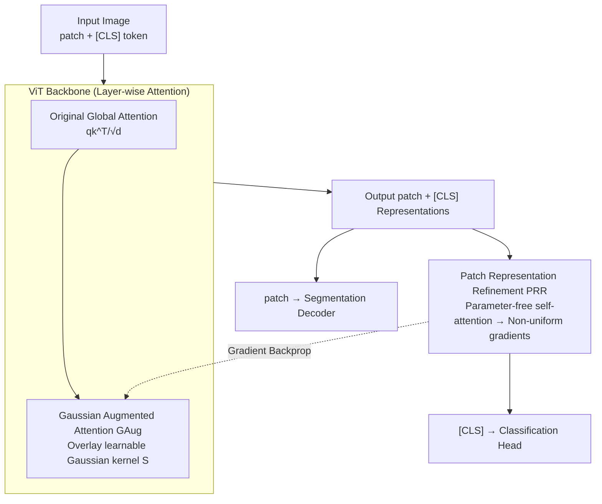

# Locality-Attending Vision Transformer

**Conference**: ICLR 2026  
**arXiv**: [2603.04892](https://arxiv.org/abs/2603.04892)  
**Code**: [GitHub](https://github.com/sinahmr/LocAtViT/)  
**Area**: Segmentation  
**Keywords**: Vision Transformer, Local Attention, Gaussian Kernel, Patch Representation Refinement, Dense Prediction, Segmentation Improvement

## TL;DR

This paper proposes the LocAt modular plugin (GAug + PRR), which focuses attention on local neighborhoods and refines patch representations through learnable Gaussian kernel biases. Without modifying the training objective, it improves ViT performance on ADE20K segmentation by over 6% while simultaneously maintaining or increasing classification accuracy.

## Background & Motivation

1.  **Global attention in ViT favors classification but hinders segmentation**: While the global self-attention mechanism of ViT excels at capturing long-range dependencies for classification, it performs poorly on dense prediction tasks (e.g., semantic segmentation) that require precise localization and fine-grained spatial details. Global attention tends to dilute local cues.
2.  **Classification training neglects patch-level representation quality**: Standard ViT classification uses only the output of the [CLS] token to calculate loss. Patch position outputs lack direct supervision, leading to the degradation of spatial token representations in the final layers—patch tokens gradually align with the [CLS] token and lose unique local structural information.
3.  **Existing improvements break the original ViT architecture**: Hierarchical ViTs (like Swin) introduce window attention and multi-stage designs, while convolution-hybrid schemes add extra convolutional modules. These methods improve dense prediction but change the ViT architecture, reducing compatibility with foundation models like CLIP.
4.  **Limitations of GAP as a classification head**: Global Average Pooling (GAP) applies uniform gradients to all patches, forcing background regions to align with classification targets, which is detrimental to segmentation (reducing performance in Base models).

## Method

### Overall Architecture

LocAt does not replace the ViT but attaches two complementary lightweight plugins. The data flow remains "Input Image → ViT Backbone → Classification Head / Segmentation Decoder," with hooks placed at two locations. First, inside the backbone: GAug (Gaussian Augmented Attention) overlays a learnable Gaussian kernel during the calculation of attention logits in each layer, softly pulling each token's attention back to its local neighborhood. Second, at the output: PRR (Patch Representation Refinement) is inserted before the classification head. This parameter-free self-attention layer allows the previously unsupervised patch positions to receive gradients. Crucially, these two modules are synergistic—the PRR gradient path propagates back to the GAug parameters in the final layer; without it, GAug would struggle to learn effectively in the deeper layers.

### Key Designs

**1. Gaussian Augmented Attention (GAug): Soft-focusing attention to local regions via data-adaptive kernels**

GAug addresses the conflict within the backbone: global attention dilutes local cues, yet hard window attention breaks architectural universality. It adds a supplementary matrix $\mathbf{S}$ to the original attention logits: $\mathbf{Z} = \text{softmax}\left(\frac{\mathbf{q}\mathbf{k}^\top}{\sqrt{d}} + \mathbf{S}\right)\mathbf{v}$, where $\mathbf{S}$ is generated by a Gaussian kernel. The kernel's "width" is predicted by the network: it calculates anisotropic 2D variance $\mathbf{\Sigma} = f(\mathbf{q}_{sp}\mathbf{W}^\sigma) \in \mathbb{R}_+^{hw \times 2}$ from spatial queries. A small variance results in a sharp kernel focusing on the neighborhood, while a large variance makes the kernel flat, reverting to global attention. The Gaussian weight is computed as $\mathbf{G}_{pt} = \exp\left(-\frac{1}{2}\sum_{m=1}^{2}\frac{\mathbf{D}_{ptm}}{\mathbf{\Sigma}_{pm}}\right)$, where $\mathbf{D}$ is the squared coordinate-wise distance between patches. A scaling coefficient $\bm{\alpha} = \text{softplus}(\mathbf{q}_{sp}\mathbf{W}^\alpha)$ balances the original logits and the Gaussian bias. Since precision and intensity are query-dependent, the network can choose "local vs. global" per patch and per layer. The [CLS] token, lacking spatial coordinates, does not participate in Gaussian biasing.

**2. Patch Representation Refinement (PRR): Distributing classification gradients non-uniformly via parameter-free self-attention**

PRR addresses the lack of supervision at the output. Standard ViT uses only [CLS] for loss, causing patch tokens to lose local structure as they align with [CLS]. Conversely, GAP applies uniform gradients even to background patches. PRR introduces a parameter-free self-attention layer $\mathbf{x}_i^+ = \text{softmax}\left(\frac{\mathbf{x}_i \mathbf{x}_i^\top}{\sqrt{d}}\right)\mathbf{x}_i$ before the classification head, sending the refined [CLS] position $\mathbf{x}_0^+$ to the head. This creates **content-dependent, non-uniform** attention weights between [CLS] and patches, allowing classification gradients to flow back to each patch according to its content, encouraging distinctive representations. Moreover, this gradient path delivers signals to the GAug parameters in the final block, making the two components interdependent.

The overhead is minimal: only two small matrices $\mathbf{W}^\sigma \in \mathbb{R}^{d \times 2}$ and $\mathbf{W}^\alpha \in \mathbb{R}^{d \times 1}$ per layer. For the Base model, this adds only 2,340 parameters (0.003%), with almost no change in FLOPs (17.58G → 17.64G).

## Key Experimental Results

### Experimental Setup

- **Pre-training**: ImageNet-1K for 300 epochs, AdamW optimizer, batch size 1024.
- **Segmentation Evaluation**: Frozen backbone with a 1-layer MLP decoder (20K iterations) on ADE20K, PASCAL Context, and COCO Stuff.
- **Backbone Sizes**: Tiny (6M), Small, Base (86M).
- **Baselines**: ViT, Swin, RegViT (ViT+registers), RoPEViT, Jumbo.

### Main Results

| Method | ADE mIoU | P-Context mIoU | C-Stuff mIoU | ImageNet Top-1 | Param(M) |
|---|---|---|---|---|---|
| ViT-Tiny | 17.30 | 33.71 | 20.29 | 72.39 | 6 |
| **LocAtViT-Tiny** | **23.47 (+6.17)** | **38.57 (+4.86)** | **26.15 (+5.86)** | **73.94 (+1.55)** | 6 |
| Swin-Tiny | 25.58 | 36.78 | 28.34 | 81.18 | 28 |
| + LocAt | 26.52 (+0.94) | 37.65 (+0.87) | 29.09 (+0.75) | 81.43 (+0.25) | 28 |
| RegViT-Tiny | 15.98 | 33.45 | 19.58 | 72.90 | 6 |
| + LocAt | 24.39 (+8.41) | 39.90 (+6.45) | 27.38 (+7.80) | 74.08 (+1.18) | 6 |
| ViT-Base | 28.40 | 43.10 | 30.43 | 80.99 | 86 |
| **LocAtViT-Base** | **32.64 (+4.24)** | **45.35 (+2.25)** | **33.62 (+3.19)** | **82.31 (+1.32)** | 86 |
| RegViT-Base | 27.93 | 41.81 | 28.99 | 80.71 | 86 |
| + LocAt | 32.71 (+4.78) | 46.14 (+4.33) | 34.12 (+5.13) | 82.19 (+1.18) | 86 |

### Ablation Study

| Configuration | ADE (Tiny) | ADE (Base) | ImageNet (Tiny) | ImageNet (Base) |
|---|---|---|---|---|
| ViT Baseline | 17.30 | 28.40 | 72.39 | 80.99 |
| + GAug | 18.98 (+1.68) | 30.26 (+1.87) | 73.16 (+0.77) | 82.00 (+1.01) |
| + PRR | 21.60 (+4.30) | 29.89 (+1.49) | 73.71 (+1.32) | 82.19 (+1.20) |
| + GAug + PRR (LocAt) | **23.47 (+6.17)** | **32.64 (+4.24)** | **73.94 (+1.55)** | **82.31 (+1.32)** |
| ViT + GAP | 19.65 | 27.99 | 72.50 | 81.84 |
| ViT - Pos. Emb. | 15.13 | 24.59 | 69.36 | 79.39 |
| LocAtViT - Pos. Emb. | 22.69 | 29.73 | 73.10 | 82.17 |

### Key Findings

1.  **Significant and universal segmentation gains**: LocAt consistently improves segmentation across 5 baselines and 3 sizes, with a maximum gain of +8.41% (RegViT-Tiny on ADE).
2.  **Increased classification performance**: ImageNet Top-1 accuracy remained stable or improved (up to +1.55%), proving that locality bias does not conflict with global modeling.
3.  **GAug and PRR are synergistic**: While effective individually (GAug +1.68, PRR +4.30), their combination reaches +6.17, highlighting that gradient routing (PRR) is vital for GAug parameter learning.
4.  **LocAt encodes spatial information beyond positions**: LocAtViT without positional embeddings still outperformed standard ViT with them (ADE 22.69 vs 17.30).
5.  **Effective in self-supervised scenarios**: Replacing ViT-S with LocAtViT-S in DINO improved linear classification by +2.13% and k-NN by +2.27%.

## Highlights & Insights

- Simple design with high impact: Adds only 3 extremely small weight matrices per layer; PRR is parameter-free, and FLOPs are virtually unchanged.
- Plug-and-play modularity: Can be added to any ViT variant without changing training objectives or data augmentation.
- Insightful analysis of gradient flow: Identifies the root cause of poor ViT segmentation as representation degradation due to lack of patch supervision.
- Data-adaptive local/global balance: Queries predict Gaussian kernel variance, offering more flexibility than fixed window attention.

## Limitations & Future Work

- Segmentation evaluation was limited to frozen backbones with 1-layer MLP decoders; integration with full heads like UPerNet was not tested.
- Validation was restricted to natural images; applicability to medical or satellite imagery is unexplored.
- Lack of validation on large-scale foundation models (e.g., CLIP) due to computational constraints.
- Anisotropic 2D Gaussian kernels are only independent along axes, without considering more flexible spatial structures like rotation.

## Rating

| Dimension | Rating |
|---|---|
| Novelty | ⭐⭐⭐⭐ |
| Effectiveness | ⭐⭐⭐⭐⭐ |
| Reproducibility | ⭐⭐⭐⭐⭐ |
| Value | ⭐⭐⭐⭐ |

## Related Papers

- [\[ECCV 2024\] Rotary Position Embedding for Vision Transformer](../../ECCV2024/segmentation/rotary_position_embedding_for_vision_transformer.md)
- [\[ICLR 2026\] Revisiting \[CLS\] and Patch Token Interaction in Vision Transformers](revisiting_cls_and_patch_token_interaction_in_vision_transformers.md)
- [\[CVPR 2025\] MambaVision: A Hybrid Mamba-Transformer Vision Backbone](../../CVPR2025/segmentation/mambavision_a_hybrid_mamba-transformer_vision_backbone.md)
- [\[CVPR 2025\] Revisiting Audio-Visual Segmentation with Vision-Centric Transformer](../../CVPR2025/segmentation/revisiting_audio-visual_segmentation_with_vision-centric_transformer.md)
- [\[ECCV 2024\] GiT: Towards Generalist Vision Transformer through Universal Language Interface](../../ECCV2024/segmentation/git_towards_generalist_vision_transformer_through_universal_language_interface.md)

<!-- RELATED:END -->

<!-- RELATED:START -->

## Related Papers

- [\[ICLR 2026\] How Well Does GPT-4o Understand Vision? Evaluating Multimodal Foundation Models on Standard Computer Vision Tasks](how_well_does_gpt-4o_understand_vision_evaluating_multimodal_foundation_models_o.md)
- [\[ICLR 2026\] Urban Socio-Semantic Segmentation with Vision-Language Reasoning](urban_socio-semantic_segmentation_with_vision-language_reasoning.md)
- [\[ICLR 2026\] Salient Object Ranking via Cyclical Perception-Viewing Interaction Modeling](salient_object_ranking_via_cyclical_perception-viewing_interaction_modeling.md)
- [\[ICLR 2026\] Benchmarking Open-ended Segmentation](benchmarking_open-ended_segmentation.md)
- [\[ICLR 2026\] LiFR-Seg: Anytime High-Frame-Rate Segmentation via Event-Guided Propagation](lifr-seg_anytime_high-frame-rate_segmentation_via_event-guided_propagation.md)

<!-- RELATED:END -->
