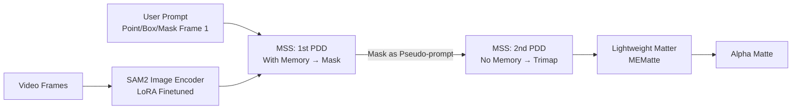

# Matting Anything 2: Towards Video Matting for Anything

**Conference**: ICLR 2026  
**OpenReview**: [https://openreview.net/forum?id=6K08FPo2cf](https://openreview.net/forum?id=6K08FPo2cf)  
**Code**: Matting-Anything-2 (Open source claimed in paper)  
**Area**: Video Matting / Segmentation  
**Keywords**: Video Matting, SAM2, Trimap, Promptable Decoder, Temporal Consistency, Transparent Objects  

## TL;DR
MAM2 is a universal video matting model built on SAM2, driven by point/box/mask prompts. It addresses the cross-frame collapse of transparent objects through a "dual-modal decoder predicting mask and trimap simultaneously" and a "memory-separated siamese mechanism," extending matting capabilities from portraits to arbitrary natural objects like flames, bubbles, and water.

## Background & Motivation
**Background**: Video matting (extracting alpha mattes frame-by-frame) is crucial for film synthesis, virtual backgrounds, and AR. Recent mainstream methods follow either automatic routes (no interaction, but target cannot be specified) or semi-supervised VOS paradigms (requiring a first-frame mask).

**Limitations of Prior Work**: ① **Narrow Domain**: Most models are human-centric and fail on natural objects like smoke or water; benchmarks for cross-domain generalization are lacking. ② **Dependence on First-Frame Mask**: VOS paradigms require high-quality masks, which are extremely difficult for humans to draw for transparent objects. Coarse interactions like boxes or points are more efficient.

**Key Challenge**: Trimap-guided methods handle complex objects well but have high interaction costs. Promptable models like SAM2 are user-friendly but only produce binary masks. **How to enable a promptable model to automatically generate high-quality trimaps while maintaining temporal stability** is the key to universal video matting.

**Goal**: Build a universal video matting model inheriting SAM2’s interaction capabilities (point/box/mask) that handles arbitrary objects, especially transparent ones, with only first-frame interaction.

**Core Idea**: **SAM2 backbone + LoRA fine-tuning**. The decoder predicts mask and trimap **simultaneously** (using stable mask semantics to guide the trimap). To prevent temporal collapse for transparent objects, a **Memory-Separated Siamese (MSS)** mechanism is proposed to isolate trimap decoding from distracting mask memories.

## Method

### Overall Architecture
MAM2 is a progressive decoding pipeline requiring only first-frame interaction. A LoRA-finetuned SAM2 image encoder extracts features. The **Memory-Separated Siamese (MSS)** mechanism uses serial **Promptable Dual-modal Decoders (PDD)** to obtain masks and trimaps. Finally, a lightweight trimap-based matter (MEMatte) predicts the alpha matte. A **selective supervision scheme** allocates heterogeneous data (image/video matting/VOS) to appropriate losses.

### Key Designs

**1. Promptable Dual-modal Decoder (PDD): Let masks teach trimaps.** SAM2's original decoder only predicts binary masks. Trimaps represent different semantics. PDD injects stable mask predictions as strong guidance into the trimap branch: predicted masks are normalized via sigmoid and convolution to create "mask augment features." These are fused with original features to enhance trimap generation. Formally: $(M^t, T^t) = f_{\text{PDD}}(F^t, P)$. This design yields 24-29% gains on benchmarks.

**2. Memory-Separated Siamese (MSS): Rescuing trimaps from mask memory.** PDD exhibits "temporal collapse" on transparent objects: accurate in the first frame, but "unknown" areas are misclassified as foreground from the second frame onward. SAM2 embeds the previous frame's mask memory into features to replace prompts, which shifts the feature space and interferes with trimap decoding. MSS solves this via **siamese dual decoding**: first, decode the mask from memory features $F^t_{\text{mem}}$; then, use this mask as a **pseudo-prompt** to decode the trimap from **pre-saved non-memory features** $F^t_{\text{non-mem}}$. This aligns trimap decoding with the ideal "non-memory feature + prompt" configuration while inheriting temporal consistency from the mask.

**3. Selective Supervision Scheme: Utilizing heterogeneous data.** Training splits into two stages. Stage 1 optimizes backbone parameters $\theta_{\text{main}}$ using $L_{\text{main}} = \mathbb{I}_{\text{VOS}} \cdot L_{\text{mask}} + (\mathbb{I}_{\text{VM}} + \mathbb{I}_{\text{IM}}) \cdot L_{\text{trimap}}$. Stage 2 optimizes matter parameters $\theta_{\text{matter}}$ using $L_{\text{matter}} = \mathbb{I}_{\text{IM}} \cdot L_{\alpha}$. High-fidelity alpha supervision is restricted to image matting (IM) data due to its superior annotation quality over video data.

## Key Experimental Results

### Main Results: Interactive Video Matting (First-frame Prompt)

| Method | Prompt | NOVM MAD↓ | NOVM MSE↓ | NOVM GRAD↓ | YoutubeMatte MAD↓ | MSE↓ |
|------|------|-----------|-----------|------------|-------------------|------|
| FTP-VM | Trimap | 37.98 | 19.90 | 78.06 | 2.26 | 1.10 |
| MaGGIe | Mask | 50.04 | 35.23 | 108.01 | 2.37 | 0.98 |
| MatAnyone | Mask | 39.44 | 25.63 | 89.60 | 2.05 | 0.76 |
| **MAM2** | Mask | **15.19** | **4.27** | **26.45** | **1.16** | **0.24** |
| **MAM2** | Box & Point | **14.72** | **3.70** | **23.54** | **1.16** | **0.24** |

In the natural object benchmark (NOVM), MAD dropped from 39.44 to 14.72 (~63% reduction). It also outperforms specialized portrait models, demonstrating general strength. Performance remains state-of-the-art even with point/box prompts instead of masks.

### Ablation Study (Table 5)

| Configuration | NOVM MAD↓ | NOVM MSE↓ | Youtube MAD↓ |
|------|-----------|-----------|--------------|
| Parallel (Naive Branch) | 26.19 | 13.21 | 1.54 |
| PDD | 18.55 | 6.77 | 1.16 |
| PDD + MCS (Memory Consistency) | 20.23 | 8.59 | 1.18 |
| PDD + MSS | **14.72** | **3.70** | 1.16 |

### Key Findings
- **PDD vs. Naive Parallel**: NOVM MAD 26.19 → 18.55, validating mask guidance for trimap quality.
- **MSS Value**: The MCS control group (double decoding on memory features) saw no gain; only MSS (using non-memory features) reached 14.72. This confirms "mask memory interference" as the root cause.
- **Unified Parameters**: The same model achieves MSE 4.24 on AIM-500 (image matting), outperforming dedicated methods like SDMatte.
- Total trainable parameters: 44.7M (SAM2 LoRA + ViT-Small matter).

## Highlights & Insights
- **Scalability**: Upgrades "Segment Anything" to "Matting Anything" by using stable masks to support unstable trimap prediction.
- **Root Cause Diagnosis**: The authors precisely identified feature space shift from memory embedding as the cause of trimap degradation.
- **Zero Additional Parameters**: The siamese structure reuses PDD weights, providing robustness for transparent objects at negligible cost.
- **New Benchmark**: NOVM covers diverse categories (animals, clouds, fire, frost), serving as critical infrastructure for non-human video matting.

## Limitations & Future Work
- **Interaction Model**: Still relies on first-frame interactions; robustness in long videos with reappearing targets is not fully explored.
- **Matter Dependency**: Final precision is capped by the lightweight matter; trimap errors are catastrophically amplified during alpha prediction.
- **Dataset Bias**: NOVM uses synthetic backgrounds, which may differ from real-world lighting or motion blur.
- **Occlusions**: Systematic evaluation of multi-object scenes with semi-transparent overlaps is missing.

## Related Work & Insights
- **VOS Lineage**: MAM2 leverages SAM2's promptable capabilities and memory mechanisms.
- **Matting Lineage**: Bridges the gap between high-accuracy trimap-guided methods and low-interaction-cost VOS paradigms.
- **SAM-based Matting**: Improves upon SEMatte's naive parallel branches via mask-guided PDD.
- **Insight**: When base model mechanisms (memory) conflict with new task requirements (trimap), the "Isolation + Siamese Reuse" paradigm offers a low-cost solution for adding heterogeneous heads.

## Rating
- **Novelty**: ⭐⭐⭐⭐ — Original PDD and MSS designs based on deep failure analysis.
- **Experimental Thoroughness**: ⭐⭐⭐⭐ — Extensive cross-benchmark testing and rigorous ablation.
- **Writing Quality**: ⭐⭐⭐⭐ — Clear logic from diagnosis to solution.
- **Value**: ⭐⭐⭐⭐ — Versatile model for both image and video matting with new benchmark value.

<!-- RELATED:START -->

## Related Papers

- [\[ICCV 2025\] ZIM: Zero-Shot Image Matting for Anything](../../ICCV2025/segmentation/zim_zero-shot_image_matting_for_anything.md)
- [\[CVPR 2026\] MatAnyone 2: Scaling Video Matting via a Learned Quality Evaluator](../../CVPR2026/segmentation/matanyone_2_scaling_video_matting_via_a_learned_quality_evaluator.md)
- [\[ICLR 2026\] SAM 3: Segment Anything with Concepts](sam_3_segment_anything_with_concepts.md)
- [\[CVPR 2025\] MatAnyone: Stable Video Matting with Consistent Memory Propagation](../../CVPR2025/segmentation/matanyone_stable_video_matting_with_consistent_memory_propagation.md)
- [\[AAAI 2026\] Segment Anything Across Shots: A Method and Benchmark](../../AAAI2026/segmentation/segment_anything_across_shots_a_method_and_benchmark.md)

<!-- RELATED:END -->
