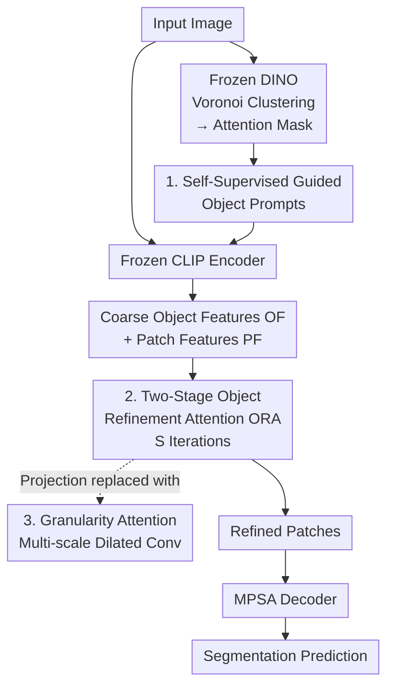

# Object-Centric Refinement for Enhanced Zero-Shot Segmentation

**Conference**: ICLR 2026  
**OpenReview**: [https://openreview.net/forum?id=oeWqDrTb38](https://openreview.net/forum?id=oeWqDrTb38)  
**Code**: https://github.com/confupload/OC-ZSS  
**Area**: Semantic Segmentation / Zero-Shot Segmentation / Vision-Language Models  
**Keywords**: Zero-Shot Segmentation, CLIP, Object-Centric Representation, Self-Supervised Prompting, Cross-Attention Refinement

## TL;DR
Aiming at the limitation where CLIP patch features "lack object structure and are difficult to cluster into coherent semantic regions," OC-ZSS injects "object prompts" guided by DINO clustering into the frozen CLIP encoder. It then iteratively refines patch features into object-centric representations using two-stage Object Refinement Attention (ORA) coupled with multi-scale granularity attention, achieving SOTA across inductive, transductive, and cross-domain zero-shot segmentation settings.

## Background & Motivation
**Background**: Zero-shot semantic segmentation (ZSS) aims to segment unseen classes at a pixel level without mask annotations. Predominant approaches use CLIP as a frozen backbone to align text embeddings and visual features, focusing on decoder enhancements—such as adding prompts in ZegCLIP, using cascaded decoders in Cascade-CLIP, or replacing standard attention with Sinkhorn attention in OTSeg.

**Limitations of Prior Work**: These methods focus exclusively on "how to modify the decoder" while neglecting a more fundamental issue—CLIP patch features themselves are "object-agnostic." CLIP's alignment is primarily established at the global image-text embedding level; its patch tokens do not naturally aggregate into semantically coherent object regions. Weak visual grounding results in poor fine-grained localization, especially for unseen classes.

**Key Challenge**: Accurate segmentation requires patch features to possess an object-centric structure. However, to obtain object structures, traditional methods either retrain the encoder (which breaks CLIP's image-text alignment and is expensive) or generate group tokens like Slot Attention (which creates an issue as ZSS requires alignment between patches and text classes, not group tokens). The key lies in injecting object information into patches without modifying the encoder.

**Goal**: Using a frozen CLIP, the goal is to (1) locate object positions unsupervised, (2) extract object-level features, and (3) use these features to refine patches into object-centric representations that are robust to various object scales.

**Key Insight**: The authors observe that features from self-supervised models like DINO naturally exhibit good local grouping properties. However, instead of mimicking or distilling DINO features (unlike CLIP-DINOiser or ProxyCLIP), they use DINO only to "point the way"—guiding object prompts as to which patches to attend to.

**Core Idea**: A set of "object prompts" is guided by attention masks generated from DINO clustering to capture coarse object features within the frozen CLIP encoder. Subsequently, a two-stage cross-attention module iteratively refines object and patch features against each other, transforming CLIP's patches into object-centric representations.

## Method

### Overall Architecture
OC-ZSS takes an image as input and outputs a pixel-wise segmentation map. The entire pipeline operates on a **frozen CLIP ViT-B/16**. The core objective is to transform "object-agnostic patches into object-centric patches" through three stages:

First, a frozen DINO encoder performs Voronoi clustering on the image to obtain $n_o$ coarse object regions, creating an attention mask. This mask is fed into the CLIP encoder, guiding $n_o$ **frozen object prompts** $O$ to attend only to their respective regions, producing coarse object features $OF = O^L$ at the final layer, while CLIP outputs standard patch features $PF = H^L$. Next, $OF$ and $PF$ enter the **Object Refinement Attention (ORA)** module for $S$ iterations: each round refines objects using patches, then refines patches using objects, with both directions utilizing **multi-scale granularity attention** for projections. Finally, the refined $PF$ serves as K/V for the MPSA decoder (adopting OTSeg's multi-prompt Sinkhorn decoding with Dice/focal loss) to output segmentation predictions.

### Key Designs

**1. Self-Supervised Guided Object Prompts: Telling frozen CLIP "where objects are" without labels**

The pain point is direct: object-centric refinement requires knowing object locations, but ZSS lacks mask labels and prohibits encoder retraining. While CLIP-RC uses fixed grid region prompts, these fail to capture non-rigid or irregularly shaped objects. Instead, the authors append $n_o$ **frozen** object prompts $O^l = \{O^l_1, \dots, O^l_{n_o}\}$ to each CLIP Transformer layer and use a customized attention mask $\text{Attn\_mask} \in \mathbb{R}^{(1+n_p+n_o+M)\times(1+n_p+n_o+M)}$ to restrict each prompt to specific patches.

The mask is generated by feeding image patches into a frozen DINO to get features $X_s$, followed by Voronoi clustering to group patches into $n_o$ sets $C = \{c_1, \dots, c_{n_o}\} = \text{voronoi\_clustering}(X_s)$. The mask entries for object prompt $j$ and its corresponding patch subset $c_j$ are set to 0, while others are set to $-\infty$ to block self-attention: $\text{Attn\_mask}[1+n_p+M+j,\, 1+n_p+i] = 0,\ \forall i \in c_j$ (and vice-versa). Applied across all $L$ layers, each object prompt aggregates information only from its region, making the final $OF = O^L$ a coarse object feature. The key difference is that DINO only "points the way" (mask generation); CLIP itself extracts features and performs alignment, preserving its image-text alignment while fitting real object shapes better than fixed grids.

**2. Two-Stage Object Refinement Attention (ORA): Iterative polishing of objects and patches**

Since DINO clustering is unsupervised, the $OF$ from object prompts is coarse and does not directly improve the patch features used for segmentation. ORA addresses this by alternating two stages over $S$ iterations. The **Object Refinement Stage** lets object features attend to patch features: $OF\_Ref = \text{Cross\_Attention\_OR}(OF, PF)$, then aggregates new and old object features via a GRU: $OF = \text{GRU}(OF\_Prev, OF\_Ref)$. The **Patch Refinement Stage** reverses the direction, letting patches attend to the updated object features: $PF\_Ref = \text{Cross\_Attention\_PR}(PF, OF)$, followed by a GRU: $PF = \text{GRU}(PF\_Prev, PF\_Ref)$.

Two points are critical: First, $OF$ is initialized from object prompts rather than randomly—Slot Attention methods show that random initialization can lead to refinement collapse; object prompts provide semantically meaningful starting values. Second, the GRU updates maintain continuity of object representations across iterations. Unlike Slot Attention which only extracts group tokens, ORA is a **bidirectional mutual refinement**: it updates object features while enriching patch semantics, facilitating tighter object-level grouping and better image-text alignment. The final $PF$ replaces the original $H$ as K/V for the decoder.

**3. Granularity Attention: Robustness to object scale variation**

The K/V/Q in ORA's cross-attention are typically obtained via linear projections from patch features. However, linear projections aggregate context at a single spatial resolution, failing for objects with large scale variations. The authors replace these with a lightweight **multi-scale feature extractor**: four parallel depth-wise dilated convolutions with different rates $d_1, d_2, d_3, d_4$ and a global average pooling branch. Their outputs are concatenated and passed through a $1\times1$ convolution to compress channels from $5D$ back to $D$:

$$X_{in} = \text{Concat}\big(\text{DW\_Conv}(3{\times}3, r{=}d_1), \dots, \text{DW\_Conv}(3{\times}3, r{=}d_4),\ \text{GAP}\big)$$
$$X_{gran} = \text{Conv}(1{\times}1,\ 5D \to D)(X_{in})$$

This produces granular representations $\text{Gran\_K}_{or}, \text{Gran\_V}_{or}$ (for object refinement) and $\text{Gran\_Q}_{pr}$ (for patch refinement). By substituting these scale-aware representations into ORA, the module explicitly models structural differences during iteration, making both patch and object features more discriminative.

### Loss & Training
The decoder and training strictly follow OTSeg: a 3-layer Multi-Prompt Sinkhorn Attention (MPSA) decoder, using relation descriptors $\hat{T} = \text{concat}(T \odot g, T)$ as queries. Besides the main prediction $Y$, an auxiliary prediction $\tilde{Y} = \text{Upsample}(\text{Sigmoid}(\text{MPS}(\hat{T}H^T)))$ is generated. The total loss is $L_{tot} = L_{seg}(Y, Y_{gt}) + L_{seg}(\tilde{Y}, Y_{gt})$, where $L_{seg}$ is Dice + Focal loss. The backbone is CLIP ViT-B/16 (with VPT), while DINO-B/16 and the text encoder are frozen. VOC/COCO use 6 object prompts, Context uses 8, with 4 ORA iterations; AdamW optimizer, LR 2.5e-5, batch 16.

## Key Experimental Results

### Main Results
Evaluation on PASCAL VOC 2012, PASCAL Context, and COCO-Stuff 164K using unseen mIoU(U), seen mIoU(S), and harmonic mIoU (hIoU).

Inductive Setting (unseen class names unknown during training):

| Dataset | Metric | OC-ZSS | OTSeg | CLIP-RC |
|--------|------|--------|-------|---------|
| VOC 2012 | hIoU | **89.2** | 87.1 | 85.8 |
| VOC 2012 | mIoU(U) | **85.3** | 81.6 | 80.7 |
| PASCAL Context | hIoU | **58.7** | 57.7 | 51.9 |
| COCO-Stuff 164K | hIoU | **42.5** | 41.5 | 41.2 |

Transductive Setting (unseen class names known during training, but no masks):

| Dataset | Metric | OC-ZSS | OTSeg | SPT-SEG |
|--------|------|--------|-------|---------|
| VOC 2012 | hIoU | **95.2** | 94.4 | 93.4 |
| PASCAL Context | hIoU | **61.9** | 59.8 | 59.9 |
| COCO-Stuff 164K | hIoU | **51.5** | 49.8 | 49.7 |

Cross-domain (COCO training → Evaluation on others): Under inductive setting, Context 49.6 / VOC 94.2. Transductive 54.0 / 94.5, both exceeding OTSeg. Efficiency (Table 4): OC-ZSS has 27.2M parameters, 64.0 GFLOPs, 3.35G VRAM, similar to OTSeg (13.8M / 61.9 GFLOPs) and far lower than CLIP-RC (36.9M) or ZSSeg (61.1M / 1916 GFLOPs).

### Ablation Study
PASCAL VOC 2012 / PASCAL Context, inductive setting, component stacking (Table 6, mIoU(U)):

| Configuration | VOC U | Context U | Description |
|------|-------|-----------|------|
| Baseline | 80.6 | 59.4 | No ORA / prompts / granularity attention |
| + ORA (Random Init) | 82.0 (+1.4) | 61.4 (+2.0) | Two-stage refinement only |
| + DINO-Guided Prompts | 84.0 | 61.7 | Semantic initialization |
| + Granularity Attention (Full) | **85.3** | **62.1** | Complete model |

Mask strategy comparison (Table 7, hIoU): DINO-B/16 **89.2** > DINOv2-B/14 89.1 > DINO-B/8 88.4 > CLIP Features 87.6 > Fixed Region Prompts 87.2 > No Mask 87.1.

### Key Findings
- **All three components are essential**: ORA alone brings +1.4/+2.0 (unseen) gains. DINO prompts provide good initialization for further gains, and granularity attention delivers the best results—confirming the synergy of "good initialization + bidirectional refinement + multi-scale."
- **Self-supervised mask > Fixed grid > No mask**: Using DINO/DINOv2 clustering masks significantly outperforms CLIP's own features, CLIP-RC's fixed region prompts, and random initialization. DINO-B/16 slightly outperforms DINOv2, and higher resolution (B/8) is not necessary.
- **Robustness in low-annotation scenarios**: With only 25% of classes as seen in VOC, OC-ZSS achieves 49.8 unseen mIoU, far exceeding CLIP-RC (28.8) and OTSeg (17.7). Object-centric refinement is more advantageous when supervision is scarce.
- **Qualitative Clarity**: Visualization show that without ORA, patch clusters are scattered and lack structure; with ORA, clusters are localized around real objects.

## Highlights & Insights
- **"Borrowing DINO's guidance without copying DINO's features" is the cleverest part**: While previous open-vocabulary methods (CLIP-DINOiser, ProxyCLIP) force CLIP to mimic DINO's local features, Ours uses DINO only for attention masks, keeping CLIP's features intact. This gains object grouping priors without destroying image-text alignment.
- **Object prompts as "initializers" rather than "outputs"**: It transforms the Slot Attention problem (vulnerability to initialization/collapse) by using in-encoder prompts to provide semantic starting values, a concept transferable to other iterative refinement tasks.
- **Moving multi-scale from decoder to refinement**: Traditionally, semantic segmentation puts dilated convolutions in the decoder. Ours puts them in the cross-attention projections during refinement, making scale-awareness an integral part of representation polishing.
- **Significant gains at almost zero cost**: Being only slightly larger than OTSeg but leading in all settings suggests the bottleneck was indeed the "object-agnostic patch structure" rather than model capacity.

## Limitations & Future Work
- **Dependency on external SSL backbones**: Object cues come from DINO, adding extra computation and potential bias if the mask mismatches the objects. Difficult cases like highly overlapping or blurry objects remain challenging.
- **Fixed hyperparameters**: The number of object prompts and ORA iterations are fixed globally. They do not adapt to the image or dynamic splitting of masks during refinement.
- **Observation**: DINO-B/16 slightly outperforms DINOv2-B/14 for reasons not fully explored, potentially related to patch granularity and clustering fit.
- **Mechanism Improvements**: Exploring SSL-free object prompt guidance (e.g., directly from CLIP attention maps) or letting masks update iteratively alongside refinement to form a "localization-refinement" loop.

## Related Work & Insights
- **vs OTSeg**: OTSeg modifies the decoder with Sinkhorn attention but leaves patches object-agnostic. OC-ZSS reuses the MPSA decoder but shifts innovation to the encoder side, leading to superior performance with similar overhead.
- **vs CLIP-RC**: CLIP-RC uses fixed grid region prompts and simple fusion. OC-ZSS uses dynamic non-rigid regions from DINO and ORA to rewrite patch representations.
- **vs OVSegmentor / Slot Attention**: These usually require end-to-end training and produce group tokens. OC-ZSS freezes CLIP, does not use group tokens, and introduces multi-scale refinement into the slot-like framework.
- **vs CLIP-DINOiser / ProxyCLIP**: These methods distill DINO features into CLIP. OC-ZSS only uses DINO for mask guidance, making it more lightweight and less dependent on specific features of the SSL backbone.

## Rating
- Novelty: ⭐⭐⭐⭐ Combination of "DINO guidance + bidirectional ORA + multi-scale refinement" is novel.
- Experimental Thoroughness: ⭐⭐⭐⭐⭐ Comprehensive across triple benchmarks, inductive/transductive/cross-domain, low-annotation, efficiency, and ablation.
- Writing Quality: ⭐⭐⭐⭐ Clear motivation and differentiation from prior work. 
- Value: ⭐⭐⭐⭐ Correctly identifies and solves the structural patch bottleneck in ZSS with low cost.

<!-- RELATED:START -->

## Related Papers

- [\[CVPR 2026\] DSS: Discover, Segment, and Select for Zero-shot Camouflaged Object Segmentation](../../CVPR2026/segmentation/discover_segment_and_select_a_progressive_mechanism_for_zero-shot_camouflaged_ob.md)
- [\[ECCV 2024\] Efficient and Versatile Robust Fine-Tuning of Zero-shot Models](../../ECCV2024/segmentation/efficient_and_versatile_robust_fine-tuning_of_zero-shot_models.md)
- [\[ICCV 2025\] ZIM: Zero-Shot Image Matting for Anything](../../ICCV2025/segmentation/zim_zero-shot_image_matting_for_anything.md)
- [\[AAAI 2026\] Otter: Mitigating Background Distractions of Wide-Angle Few-Shot Action Recognition with Enhanced RWKV](../../AAAI2026/segmentation/otter_mitigating_background_distractions_of_wide-angle_few-shot_action_recogniti.md)
- [\[AAAI 2026\] Guideline-Consistent Segmentation via Multi-Agent Refinement](../../AAAI2026/segmentation/guideline-consistent_segmentation_via_multi-agent_refinement.md)

<!-- RELATED:END -->
