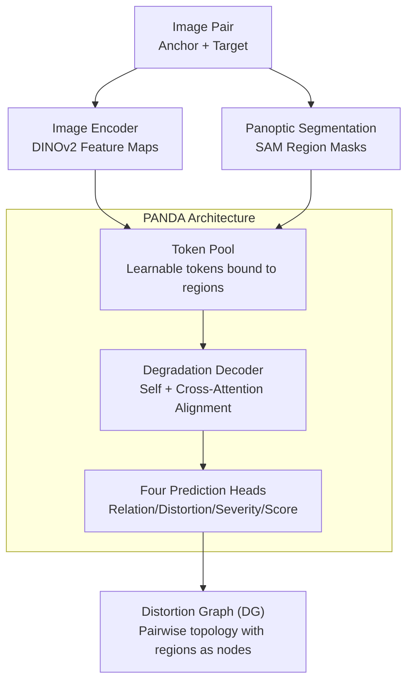

# Panoptic Pairwise Distortion Graph

**Conference**: ICLR 2026  
**OpenReview**: [https://openreview.net/forum?id=VDfF7NqJJl](https://openreview.net/forum?id=VDfF7NqJJl)  
**Project Page**: [aismartperception.github.io/distortion-graph](https://aismartperception.github.io/distortion-graph/)  
**Code**: TBD  
**Area**: Panoptic Segmentation / Image Quality Assessment / Multimodal VLM  
**Keywords**: Distortion Graph, Region-level Evaluation, Pairwise Comparison, Panoptic Segmentation, MLLM

## TL;DR
This paper generalizes scene graphs from "intra-image" to "inter-image" by proposing the **Distortion Graph (DG)**—a structured representation using regions as atomic nodes. It introduces PANDASET (a region-level distortion dataset of 500k image pairs), PANDABENCH (a benchmark with three difficulty levels), and PANDA (a DETR-style lightweight architecture). Experiments demonstrate that frontier MLLMs perform near random chance in region-level distortion comparison, while PANDA leads across all difficulties. Furthermore, feeding predicted DGs to MLLMs as a Chain-of-Thought (CoT) triggers an emergent performance gain of approximately 15%.

## Background & Motivation
**Background**: Image Quality Assessment (IQA) and distortion understanding have recently shifted towards Multimodal Large Language Models (MLLM) like Q-Instruct, Co-Instruct, and DepictQA. These works use instruction tuning to enable models to provide distortion types, severity, quality scores, or natural language descriptions for one or more images. The common paradigm is **top-down whole-image analysis**, treating the entire image as a global object for judgment.

**Limitations of Prior Work**: A whole-image perspective inherently lacks support for fine-grained understanding. When users care about "which region is poorly compressed" or "which region is clearer than the other image," existing MLLMs struggle even when explicitly provided with region information (names, descriptions, bounding boxes). They either miss regions, output generic templates ("medium quality, some blur"), or are constrained by context length, failing to process numerous regions stably. As shown in Figure 2, models like Co-Instruct lose instruction-following capability when faced with region-level new instructions.

**Key Challenge**: The fundamental cause is the **lack of a region-based, structured representation designed for image pairs**. Distortion information is intrinsically local and comparable, but existing methods are neither region-first nor comparative-by-design, forcing region understanding to be "implicitly" compressed into whole-image judgments.

**Goal**: To explicitly model "dense distortion information of image pairs" as a compact, interpretable, and machine-learnable graph structure, such that (i) each region independently carries distortion type/severity/quality score, (ii) clear comparison edges exist between corresponding regions across images, and (iii) these region-level judgments naturally aggregate into a whole-image conclusion.

**Key Insight**: The authors draw inspiration from scene graphs that represent intra-image object relationships but extend this from intra-image to inter-image. Nodes are regions, and edges are cross-image "which is better" comparison predicates. The authors argue this is promising because region-level information can aggregate into whole-image judgments, but the reverse is not true, making region-first a more fundamental representation.

**Core Idea**: Replace "whole-image scoring" with a "Distortion Graph (DG) of image pairs," making the region the atomic unit of assessment, and providing the dataset, benchmark, and efficient architecture to learn this task.

## Method

### Overall Architecture
The approach consists of three layers: **Task Definition** (what a DG is and its properties), **Data Generation** (how to generate region-level labels and comparison relationships for PANDASET/PANDABENCH), and **Architecture Design** (how PANDA predicts a DG from a pair of images).

The PANDA inference pipeline is straightforward: Input an anchor image $I_A$ and a target image $I_T$ into two paths—one uses a pretrained encoder (e.g., DINOv2) to extract feature maps $F_j$, and the other uses panoptic segmentation (e.g., SAM) to cut each image into $N_R$ aligned region masks. These are bound into region features in the **Token Pool** via "learnable tokens + region masks + image features." These region features enter the **Degradation Decoder**, which uses self-attention to digest whole-image context and cross-attention to align regions in one image with their counterparts in the other. Finally, four MLP prediction heads output comparison relations, distortion types, severity, and quality scores, assembling the DG.

### Key Designs

**1. Distortion Graph (DG): Generalizing Scene Graphs to Image Pair Topologies**

To address the lack of a region-first, comparative structure, the authors formalize DG as a quadruple $G=(O_{I_A}, O_{I_T}, E_D, E_S)$. Here, $O_{I_A}, O_{I_T}$ are region sets for the anchor and target images, $E_D$ represents cross-image **distortion comparison edges**, and $E_S$ represents optional scene relationship edges. Each node $o_i^j=(c_i^j, m_i^j, I_j, A_{D,i}, A_{S,i})$ carries class, binary mask, image ID, and distortion attributes. The DG is constrained by three properties: **validity** (edges only connect matching anchor-target pairs $(o_i^A, r, o_i^T)$), **directionality** (relations are written as "anchor relative to target"), and **functional comparability** (each matching pair is labeled with exactly one relation $r$). This definition encodes "which region, what distortion, how severe, and which is better" into an interpretable graph.

**2. PANDASET and TOPIQ-based Labeling: Making Region-level Pairwise Distortion Supervised**

Since no existing dataset satisfies "region-first + pairwise comparison + dense distortion labels," the authors built PANDASET based on PSG and Seagull-100w. They sampled 2200 high-quality images, with a variable number of regions per image (max 112, mean 18). Distortions include 14 categories (adding weather effects like rain/snow/fog to DepictQA's 11 types). Each region has an 80% chance of being degraded. Quality scores are calculated using **Full-Reference TOPIQ** between degraded and clean regions. Comparison relations (predicates) are derived from TOPIQ score differences: differences $<|0.1|$ are labeled *same*, $\pm[0.1,0.3)$ as *slightly better/worse*, and $>0.3$ as *significantly better/worse*. This generated approximately 528K pairs.

**3. PANDA Architecture: Token Pool Binding + Degradation Decoder Alignment**

To handle variable regions efficiently, **Token Pool** maintains learnable tokens that are Hadamard-multiplied with masks $h_i^j=m_i^j\odot t_i^j$, then fused with image features $\hat{H}^j=\mathrm{Conv}(H^j)\odot F^j$. The **Degradation Decoder** is an $L$-layer Transformer: it performs self-attention on image features and cross-attention where region features $\hat{H}_j$ act as queries to "find" corresponding regions in the other image. Four 3-layer MLPs then output results. Compared to 7B MLLMs, PANDA is not limited by context length and handles variable regions without hallucination.

**4. DG as Chain-of-Thought Context: Boosting MLLM Emergence**

The predicted DG can serve as a "structural prompt." Feeding the DG into GPT-5 Mini as a CoT prompt resulted in a ~15% improvement in region-level understanding. Notably, the MLLM does not blindly copy the DG; it can correct DG errors (e.g., mislabeling a region as clean) based on pixel evidence, demonstrating a "structural clue + pixel adjudication" synergy.

### Loss & Training
The total loss is a weighted sum: $L=\lambda_1 L^{rel}_{CE}+\lambda_2 L^{dist}_{CE}+\lambda_3 L^{sev}_{CE}+\lambda_4 L^{score}_{1}$. Classification heads use Cross-Entropy, and the score regression head uses L1. It uses the AdamW optimizer with a learning rate of $1\times10^{-4}$, weight decay of 0.01, trained for 30 epochs.

## Key Experimental Results

### Main Results
PANDABENCH is divided into Easy / Medium / Hard levels. Metrics include Accuracy/F1 for classification and SRCC (SR)/PLCC (PL) for scores.

| Setup | Method | Relation F1 | Distortion F1 | Severity F1 | Quality SRCC/PLCC |
|------|------|--------|--------|----------|------------------|
| Easy | DepictQA† (7B, fine-tuned) | 0.42 | 0.76 | 0.48 | 0.78 / 0.77 |
| Easy | GPT-5 Mini (Frontier) | 0.26 | 0.44 | 0.29 | 0.52 / 0.54 |
| Easy | Random | 0.19 | 0.06 | 0.25 | 0.00 / 0.00 |
| Easy | **Ours (PANDA)** | **0.56** | **0.79** | **0.59** | **0.79 / 0.83** |
| Hard | DepictQA† | 0.19 | 0.09 | 0.22 | 0.18 / 0.17 |
| Hard | GPT-5 Mini | 0.15 | 0.09 | 0.20 | 0.09 / 0.13 |
| Hard | **Ours (PANDA)** | **0.24** | **0.19** | **0.33** | **0.36 / 0.38** |

PANDA achieves the best results across all tasks. Large MLLMs like DepictQA (7B) lag behind due to the lack of region-first design and context limitations.

### Ablation Study

| Dimension | Key Findings |
|------|---------|
| Easy→Hard Trend | All methods drop significantly, validating benchmark discriminability. |
| PANDA Robustness | Smallest performance drop, highlighting the value of region-first architecture. |
| Severity (Hard) | Many strong models perform worse than random, exposing a systemic flaw in severity understanding. |
| DG-CoT (Easy) | Comparison accuracy 0.31→0.52; Score 0.52→0.78. |
| DG-CoT (Hard) | Average gain of ~15%. |

### Key Findings
- **Large Scaling ≠ Region-level Mastery**: 27B Gemma-3 and frontier closed-source MLLMs are near random in region comparison, suggesting a need for region-first structural representation rather than more parameters.
- **Structural Clues vs. Pixel Evidence**: In DG-CoT mode, MLLMs can override DG when pixels conflict and trust DG otherwise.
- **Complexity Widens the Gap**: PANDA’s advantage is most pronounced in the Hard level, proving the value of dedicated region processing under dense mixed distortions.

## Highlights & Insights
- **Modeling "Assessment" as a "Graph"**: Reconstructing pairwise IQA through scene graph paradigms makes regions atomic, comparable units.
- **Dual-Purpose TOPIQ Labeling**: Using TOPIQ for both absolute scoring and generating comparison predicates avoids expensive manual pairwise annotation.
- **Token Pool handles "Variable Regions"**: Hadamard binding of tokens and masks allows efficient context borrowing without context length issues.
- **DG as Plug-and-Play MLLM Clue**: A practical paradigm where "small models provide structure, and large models provide language."

## Limitations & Future Work
- **Synthetic Data Bias**: PANDASET primarily uses parametric degradation; generalization to real-world complex distributions is not fully verified.
- **Reliance on TOPIQ**: Labels depend on TOPIQ scores and manual thresholds; TOPIQ bias propagates as annotation noise.
- **Segmentation Dependencies**: Assumes aligned regions and reliable panoptic segmentation; handling unaligned regions is not discussed.
- **Underutilized Scene Edges**: While DG includes scene relations $E_S$, the implementation omits a scene prediction head.
- **Low Absolute Accuracy**: Hard-level results (F1 0.19~0.33) indicate that dense region-level distortion understanding remains an open challenge.

## Related Work & Insights
- **Compare to Q-Instruct / Co-Instruct**: These focus on whole-image analysis and suffer from template-like outputs and context limits; PANDA is region-first and comparative.
- **Compare to DepictQA / M-BAPPS**: These offer pairwise comparison but lack region-first design and dense region labeling.
- **Compare to Seagull / Q-Ground**: These perform region-level grounding in **single-image** settings; this paper extends grounding to **cross-image comparison**.
- **Compare to Set-of-Mark**: Token Pool is spiritually similar but specialized for pairwise alignment via DETR-style cross-attention.

## Rating
- Novelty: ⭐⭐⭐⭐⭐ 
- Experimental Thoroughness: ⭐⭐⭐⭐ 
- Writing Quality: ⭐⭐⭐⭐ 
- Value: ⭐⭐⭐⭐⭐ 

<!-- RELATED:START -->

## Related Papers

- [\[CVPR 2026\] DSFlash: Comprehensive Panoptic Scene Graph Generation in Realtime](../../CVPR2026/segmentation/dsflash_panoptic_scene_graph_realtime.md)
- [\[CVPR 2025\] Learning 4D Panoptic Scene Graph Generation from Rich 2D Visual Scene](../../CVPR2025/segmentation/learning_4d_panoptic_scene_graph_generation_from_rich_2d_visual_scene.md)
- [\[ECCV 2024\] OpenPSG: Open-set Panoptic Scene Graph Generation via Large Multimodal Models](../../ECCV2024/segmentation/openpsg_open-set_panoptic_scene_graph_generation_via_large_multimodal_models.md)
- [\[ICML 2026\] Functional Attention: From Pairwise Affinities to Functional Correspondences](../../ICML2026/segmentation/functional_attention_from_pairwise_affinities_to_functional_correspondences.md)
- [\[ICCV 2025\] SPADE: Spatial-Aware Denoising Network for Open-vocabulary Panoptic Scene Graph Generation](../../ICCV2025/segmentation/spade_spatial-aware_denoising_network_for_open-vocabulary_panoptic_scene_graph_g.md)

<!-- RELATED:END -->
## Related Papers

- [\[CVPR 2026\] DSFlash: Comprehensive Panoptic Scene Graph Generation in Realtime](../../CVPR2026/segmentation/dsflash_panoptic_scene_graph_realtime.md)
- [\[CVPR 2025\] Learning 4D Panoptic Scene Graph Generation from Rich 2D Visual Scene](../../CVPR2025/segmentation/learning_4d_panoptic_scene_graph_generation_from_rich_2d_visual_scene.md)
- [\[ECCV 2024\] OpenPSG: Open-set Panoptic Scene Graph Generation via Large Multimodal Models](../../ECCV2024/segmentation/openpsg_open-set_panoptic_scene_graph_generation_via_large_multimodal_models.md)
- [\[ICML 2026\] Functional Attention: From Pairwise Affinities to Functional Correspondences](../../ICML2026/segmentation/functional_attention_from_pairwise_affinities_to_functional_correspondences.md)
- [\[ICCV 2025\] SPADE: Spatial-Aware Denoising Network for Open-vocabulary Panoptic Scene Graph Generation](../../ICCV2025/segmentation/spade_spatial-aware_denoising_network_for_open-vocabulary_panoptic_scene_graph_g.md)

<!-- RELATED:END -->
