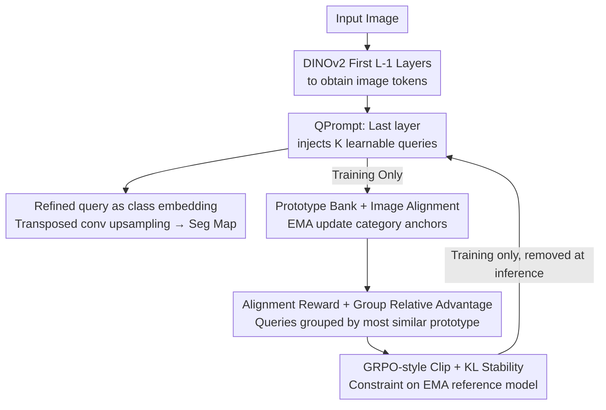

# QPrompt-R1: Real-Time Reasoning for Domain-Generalized Semantic Segmentation via Group-Relative Query Alignment

**Conference**: ICLR 2026  
**OpenReview**: [https://openreview.net/forum?id=Vttn6pCwut](https://openreview.net/forum?id=Vttn6pCwut)  
**Code**: https://github.com/ (Paper labeled "QPrompt-R1", official address pending ⚠️)  
**Area**: Semantic Segmentation / Domain Generalization / Real-Time Inference  
**Keywords**: Domain Generalized Segmentation, Real-Time Segmentation, Visual Foundation Models, Query Prompt, Group-Relative Optimization

## TL;DR
Addressing the challenge of achieving both real-time performance and cross-domain robustness in semantic segmentation, this paper identifies that the bottleneck of slow DGSS lies in the heavy segmentation head rather than the VFM backbone. By injecting learnable queries only into the final layer of the VFM (QPrompt), the authors achieve a lightweight architecture approximating query-decoding. Combined with Group-Relative Query Alignment (GRQA) active only during training, the method unlocks generalization capabilities and approaches heavy DGSS performance at 54 FPS.

## Background & Motivation
**Background**: Safety-critical scenarios such as autonomous driving and robot navigation impose two strict requirements on semantic segmentation: real-time inference (low latency for obstacle avoidance/navigation) and domain generalization robustness (resilience against changes in weather, lighting, and terrain). However, the academic community has long treated these as independent tracks: Domain Generalized Semantic Segmentation (DGSS) relies on Visual Foundation Models (VFM, e.g., DINOv2) + Parameter-Efficient Fine-Tuning (REIN, SoMA, FADA) for robustness, while Real-Time Semantic Segmentation (RTSS) relies on lightweight CNNs (PIDNet, BiSeNet) or efficient Transformers (RTFormer, SeaFormer) for speed.

**Limitations of Prior Work**: DGSS methods are generally too slow—they follow the Mask2Former-style query-based head, utilizing a pixel encoder + multi-layer transformer decoder, resulting in FPS ranging from single digits to the teens (M2F 11, MFuser 3). Conversely, although RTSS methods are fast, they use fixed category embeddings that fail to leverage VFM generalization benefits and lack the ability to adapt to context, collapsing under domain shifts (GCNet achieves only 24.5 mIoU in GTAV→Real).

**Key Challenge**: The authors perform a critical diagnosis: the slow bottleneck of DGSS is not the VFM backbone but the complex segmentation head. Replacing the query-based head with a simple MLP head boosts FPS significantly, but generalization performance drops because the MLP head loses the ability for queries to interact with image tokens and adapt to context. The problem becomes: can the adaptive advantages of query-based methods be retained without the overhead of a full decoder?

**Goal**: Formally propose the independent research setting of RT-DGSS (Real-Time Domain-Generalized Semantic Segmentation) and build an architecture that is both fast and robust.

**Key Insight**: Queries are effective because they enable in-context learning through fusion with image tokens. Can a single layer of interaction approximate the effect of a multi-layer decoder? While a single layer is efficient, it lacks sufficient supervision and exhibits weak robustness, requiring additional training signals.

**Core Idea**: Use "Last-Layer Query Injection" (QPrompt) instead of a full heavy decoder for real-time speed. Then, leverage the group-relative optimization concepts from GRPO to design a GRQA loss (active only during training) to extract the generalization potential of the VFM with zero extra overhead during inference.

## Method

### Overall Architecture
QPrompt-R1 consists of two parts: the lightweight **QPrompt** architecture used during inference and the **GRQA** optimization objective used only during training. For an input image, it first passes through the first $L-1$ Transformer blocks of DINOv2 to obtain image tokens. Before the final block, $K$ learnable queries are concatenated with the token sequence to pass through the last layer, allowing queries to interact once with image tokens. The refined queries act as adaptive class embeddings, which are compared with image tokens via similarity calculations, followed by a lightweight transposed convolution upsampling head to output the segmentation map. During training, an EMA-updated Prototype Bank is maintained; query-prototype similarity is used to construct rewards for group-relative advantage estimation, followed by GRPO-style clip + KL stabilization. This branch provides denser supervision for queries and is entirely disabled during testing.

### Key Designs

**1. QPrompt: Injecting queries only into the VFM last layer to approximate query-decoding**

This design directly addresses the bottleneck of slow DGSS heads. Traditional query-based heads (Mask2Former) require a pixel encoder followed by $M$ transformer decoder layers, with a complexity of $O(M(N+K)^2 d)$, where $N$ is the number of image tokens, $K$ is the number of queries, and $M$ is the number of decoder layers. QPrompt reduces this to "adding $K$ extra tokens in the last layer": taking the output $x_{L-1}$ from the first $L-1$ layers and concatenating it with learnable queries $Q\in\mathbb{R}^{K\times d}$ to form $\tilde{x}_{L-1}=[Q, x_{L-1}]$, which is fed into the last block $B_L$ to get $[Q_L, x_L]=B_L(\tilde{x}_{L-1})$. The refined query $Q_L$ directly predicts category logits and generates pixel-wise results by attending to image tokens, followed by two transposed convolutions (each ×2, total ×4 upsampling) to recover boundary details lost during patchification. Complexity is reduced to $O((N+K)^2 d)$, and FPS increases from 11 (M2F) to 54. It retains the adaptive fusion of queries and image tokens while being simpler than EoMT's mask attention + annealing—the latter's train-test inconsistency hurts generalization, whereas QPrompt's consistency ensures stability.

**2. Prototype Bank and Image Alignment: Providing stable category anchors for queries**

By compressing interaction into a single layer, supervision signals become sparse, necessitating stable references to guide query learning. The authors maintain a momentum-updated Prototype Bank $P=\{P_c\}_{c=1}^{C}$, where $P_c\in\mathbb{R}^d$ is the prototype for class $c$. For each training image, image-wise prototypes $f_c$ are obtained by average pooling $\ell_2$-normalized pixel embeddings within the ground truth region of class $c$, and global prototypes are updated via EMA: $P_c \leftarrow \mathrm{norm}(\alpha P_c + (1-\alpha) f_c)$, where $\alpha$ controls the update rate. To reduce intra-class variance, an image alignment regularization term is added: $L_{img}=\frac{1}{|C_b|}\sum_{c\in C_b}\|f_c - P_c\|_2^2$ ($C_b$ is the set of classes in the current batch). This encourages image-wise prototypes to stay close to global anchors, stabilizing training and enhancing feature consistency for the subsequent query-prototype rewards.

**3. Alignment Reward + Group Relative Advantage: Supervising all queries rather than just one**

This is the core of GRQA, targeting the issue where Hungarian matching assigns only one query to each class while others are assigned to the background and never trained—a single query failure under domain shift leaves no backup. Borrowing from GRPO, the authors allow multiple queries of the same class to learn together. Refined queries are normalized as $Q=\mathrm{norm}(Q_L)$, and a similarity matrix $S=QP^\top$ is computed ($S_{i,j}=\langle Q_i, P_j\rangle$). For each query $i$, the most similar class $c_i=\arg\max_j S_{i,j}$ is identified, and the similarity $r_i=S_{i,c_i}$ serves as the alignment reward. The $K$ queries are partitioned into $G$ groups where queries in a group share the same most similar prototype. For each group, the mean $\mu_g$ and standard deviation $\sigma_g$ are used as a baseline to calculate the group-relative advantage:

$$A_i = \frac{r_i - \mu_g}{\sigma_g + \varepsilon}.$$

An $A_i>0$ indicates the query performs better than the group average in fusing relevant prototypes and is rewarded; $A_i<0$ is penalized. Contrary to Hungarian matching's "one query per class," group-relative advantage enables mutual supervision and joint optimization, ensuring multiple queries possess segmentation capabilities to withstand domain shifts. Experiments show GRQA increases the number of activated queries (those not assigned to background) by 45%/48%/52% across three test sets.

**4. GRPO-style Clip + KL Stability: Keeping group updates conservative**

While group-relative advantage provides dense supervision, its high variance can cause divergent updates. The authors apply a GRPO/PPO-style clipping objective plus a KL regularization against an EMA reference model. A reference model $\theta_{ref}$ (EMA of current parameters) is maintained. Similarity matrices $S_\theta=QP^\top$ and $S_{ref}=Q_{ref}P^\top$ are converted via softmax into class distributions per query $\pi_\theta(i,j)$ and $\pi_{ref}(i,j)$. Defining the importance ratio $\rho_i=\pi_\theta(i,c_i)/\pi_{ref}(i,c_i)$, the clipped objective is:

$$L_{GR} = -\frac{1}{K}\sum_{g=1}^{G}\sum_{i\in G_g}\min\!\big(\rho_i A_i,\ \mathrm{clip}(\rho_i, 1-\epsilon, 1+\epsilon)\,A_i\big),$$

where clipping limits $\rho_i$ near 1 to prevent drastic updates. Forward KL $D_{KL}[\pi_\theta\|\pi_{ref}]$ is added to prevent sudden behavioral shifts. The final loss is $L_{GRQA}=L_{GR}+\beta D_{KL}[\pi_\theta\|\pi_{ref}]$. This mechanism ensures query alignment improves steadily and smoothly.

### Loss & Training
The total training objective sums the standard segmentation loss, image alignment loss, and GRQA alignment loss:

$$L_{total} = L_{seg} + \lambda_{img} L_{img} + \lambda_{grqa} L_{GRQA}.$$

Training proceeds in two stages: the first 2/3 of epochs use only $L_{seg}$ to train a base model, followed by the final 1/3 of epochs which activate GRQA and EMA reference model updates. The backbone is DINOv2-L, the head consists of two transposed convolutions, and images are sliding-window cropped to $512\times512$ patches. Inference speed is reported on an RTX 4090 with batch=1 at $512\times1024$ resolution. All GRQA auxiliary components are disabled at test time, resulting in zero extra inference overhead.

## Key Experimental Results

### Main Results
Comparison between DGSS (Heavy) and RTSS (Lightweight) across three benchmarks, mIoU(%) / FPS:

| Setting | Ours | Best RT Baseline (EoMT) | Strong DGSS Ref | FPS |
|------|------|------|------|------|
| GTAV→Real (Avg) | 64.1 | 61.0 (+3.1) | REIN 64.3 / SoMA 68.2 | 54 |
| Real→Real (Avg) | 67.8 | 66.1 (+1.7) | M2F 67.1 | 54 |
| Real→ACDC (Avg) | 69.4 | 66.4 (+3.0) | FADA 71.5 | 54 |
| Cityscapes-C L5 (Avg) | 69.8 | — | REIN 60.0 (+9.8) | 54 |

QPrompt-R1 maintains 54 FPS (5× faster than REIN) while approximating the accuracy of heavy DGSS methods and significantly leading on corruption benchmarks (especially in Noise/Blur, e.g., Gauss noise 60.4 vs. REIN 6.2).

### Ablation Study
Step-by-step ablation (GTAV→Cityscapes) and module contributions:

| Configuration | mIoU | FPS | Description |
|------|------|-----|------|
| Mask2Former | 63.7 | 11 | Heavy query head baseline |
| → w/o Pixel Dec | 62.9 | 25 | Removing pixel decoder increases speed |
| → w/o Transformer Dec | 61.3 | 55 | Switching to MLP head boosts speed but hurts accuracy |
| → QPrompt | 63.6 | 54 | Single-layer query injection restores accuracy |
| → QPrompt-R1 | 66.1 | 54 | Adding GRQA gains +2.5 |

| GRQA Breakdown | Avg | Gain |
|------|------|------|
| MLP-Head | 59.9 | - |
| + QPrompt | 62.3 | +2.4 |
| + Image Alignment | 62.6 | +0.3 |
| + Reward (Advantage) | 63.7 | +1.1 |
| + KL | 64.1 | +0.4 |

### Key Findings
- **Bottleneck is the head, not the backbone**: Replacing the transformer decoder jumped FPS from 11 to 55, confirming the heavy decoder is the speed bottleneck. QPrompt restored accuracy from 61.3 (MLP) to 63.6 at 54 FPS.
- **Reward (Group Relative Advantage) is the primary driver of GRQA**: Image alignment alone only added +0.3, while rewards added +1.1 and KL added +0.4—supervision density contributes more than stability.
- **GRQA is Plug-and-Play**: Grafting GRQA onto SOTA DGSS as a training strategy improved REIN by +1.2 and SoMA by +0.6 without increasing inference cost. It also worked across backbones (CLIP-L +1.5, SAM-H +1.7), proving generalizability.
- **Reward Design**: Compared to others, GRQA (64.1) outperformed "w/o reward" (62.3) and DINO-R1 style (62.9) rewards, showing group-relative alignment is superior for segmentation.

## Highlights & Insights
- **"Bottleneck Diagnosis" precedes "Architecture Design"**: The authors first used controlled experiments to locate the DGSS speed bottleneck in the head rather than the VFM, and then targeted it by retaining only single-layer interaction—a "diagnosis-first" approach is more compelling than blind module stacking.
- **Translating RL Group Optimization to Dense Prediction**: GRPO was originally an LLM post-training tool; here, mapping "multiple queries of the same class" to group-relative advantage solves the structural defect of Hungarian matching where "one class only trains one query."
- **Training-time Enhancement, Zero-cost Inference**: All GRQA auxiliary components are removed during testing, ensuring RT performance is unaffected—this "expensive training, cheap inference" pattern is transferable to any real-time deployment task.
- **Reusable Trick**: GRQA can be directly applied to improve REIN/SoMA, acting as a general training trick for query-based DGSS.

## Limitations & Future Work
- **Accuracy still lags behind the strongest DGSS**: On GTAV→Real, 64.1 is lower than SoMA's 68.2 or MFuser's 68.2. The selling point is "speed approximating accuracy" rather than "SOTA accuracy" at any cost.
- **Dependence on Strong VFM Backbones**: The method relies on powerful pre-trained VFMs like DINOv2. When using weaker backbones (CLIP-L at 53.2), absolute accuracy drops significantly, as much of the generalization benefit stems from the backbone itself.
- **GRQA introduces extra hyperparameters and training stages**: $\epsilon$, $\beta$, $\lambda_{img}$, $\lambda_{grqa}$, and the prototype EMA rate $\alpha$ all require tuning. The two-stage training (SFT then GRQA) is also more complex than pure SFT.
- **Sensitivity to query count $K$ and grouping**: Group-relative advantage depends on queries being grouped by the most similar prototype, and this partitioning changes dynamically. More thorough discussion on $K$ and partitioning stability is needed.

## Related Work & Insights
- **vs. REIN / SoMA / FADA (Heavy DGSS)**: These rely on PEFT of VFM for robustness but use heavy heads with single-digit FPS. This work uses QPrompt for real-time speed and shows that adding GRQA to them can further improve their performance.
- **vs. EoMT (Efficient Query Segmentation)**: EoMT uses mask attention + annealing with train-test inconsistency that hurts generalization; QPrompt is simpler and consistent, outperforming it (64.1 vs 61.0 on GTAV→Real).
- **vs. GRPO / DINO-R1 (Group Optimization)**: GRPO is used for LLM reasoning and DINO-R1 for detection query supervision. This work is the first to apply group-relative advantage to query-image alignment in semantic segmentation with an EMA prototype bank for stable anchoring.

## Rating
- Novelty: ⭐⭐⭐⭐ Innovative combination of RL group optimization for segmentation query alignment and single-layer query injection with clear diagnosis.
- Experimental Thoroughness: ⭐⭐⭐⭐ Covers four settings, multiple backbones, plug-and-play tests, and component-wise ablation, though $K$ sensitivity could be more comprehensive.
- Writing Quality: ⭐⭐⭐⭐ Clear motivation progression with complete formulas and diagrams.
- Value: ⭐⭐⭐⭐ Directly relevant to real-time deployment through the practical RT-DGSS setting and the zero-cost GRQA trick.

<!-- RELATED:START -->

## Related Papers

- [\[AAAI 2026\] Causal-Tune: Mining Causal Factors from Vision Foundation Models for Domain Generalized Semantic Segmentation](../../AAAI2026/segmentation/causal-tune_mining_causal_factors_from_vision_foundation_mod.md)
- [\[CVPR 2025\] Golden Cudgel Network for Real-Time Semantic Segmentation](../../CVPR2025/segmentation/golden_cudgel_network_for_real-time_semantic_segmentation.md)
- [\[ICLR 2026\] Urban Socio-Semantic Segmentation with Vision-Language Reasoning](urban_socio-semantic_segmentation_with_vision-language_reasoning.md)
- [\[AAAI 2026\] Do We Need Perfect Data? Leveraging Noise for Domain Generalized Segmentation](../../AAAI2026/segmentation/do_we_need_perfect_data_leveraging_noise_for_domain_generalized_segmentation.md)
- [\[ICLR 2026\] AMLRIS: Alignment-aware Masked Learning for Referring Image Segmentation](amlris_alignment-aware_masked_learning_for_referring_image_segmentation.md)

<!-- RELATED:END -->
