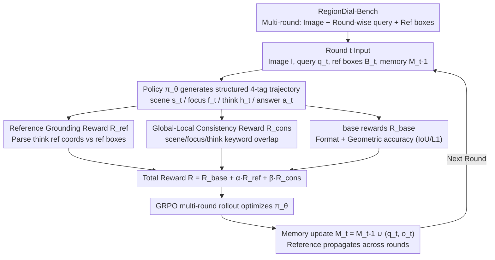

# RegionReasoner: Region-Grounded Multi-Round Visual Reasoning

**Conference**: ICLR 2026  
**arXiv**: [2602.03733](https://arxiv.org/abs/2602.03733)  
**Code**: [RegionReasoner](https://github.com/wenfangsun/RegionReasoner)  
**Area**: Image Segmentation  
**Keywords**: multi-round reasoning, region grounding, reinforcement-learning, GRPO, VLM, referring segmentation

## TL;DR
RegionReasoner is proposed as a multi-round visual reasoning framework based on reinforcement learning. By utilizing reference grounding rewards and global-local consistency rewards, the model is compelled to explicitly reference coordinates of specified regions and maintain semantic coherence throughout reasoning trajectories. This results in significant improvements in multi-round localization and segmentation accuracy on the newly constructed RegionDial-Bench.

## Background & Motivation

Most visual reasoning in existing VLMs is confined to single-step processes or pure text spaces. While VisionReasoner introduced a single-round structured reasoning paradigm (using base rewards for format and geometry), it lacks the mechanism to propagate region references across rounds. Conversely, SegLLM supports multi-round interactive segmentation but lacks verifiable reasoning trajectories and RL learning signals. Simply stacking single-round reasoning into multi-round setups exposes two critical flaws: first, reference propagation is fragile—models are not required to explicitly refer to previous reference boxes, leading to ambiguous credit assignment and undetectable coordinate hallucinations; second, rewards typically only target the final box/point and label validity, placing almost no constraints on the "reasoning process itself." As dialogues deepen, semantic drift occurs between global scene descriptions and local evidence.

A more practical obstacle lies in evaluation: there has been a lack of benchmarks capable of round-by-round, verifiable measurement of localization accuracy and consistency. This makes it impossible to quantify "reference propagation capability" and "error accumulation." RegionReasoner is designed specifically to address these two gaps: verifiable multi-round reasoning and a corresponding benchmark.

## Method

### Overall Architecture

RegionReasoner reformulates multi-round referring localization/segmentation as a verifiable reinforcement learning problem. In each round, given the image $I$, current query $q_t$, an optional set of reference boxes $\mathcal{B}_t^{ref}$, and dialogue memory $\mathcal{M}_{t-1}$, the policy $\pi_\theta$ produces a structured trajectory consisting of four tags: `<scene>`, `<focus>`, `<think>`, and `<answer>`. The `<answer>` tag provides detected bboxes or 2D segmentation points directly in JSON format without task-specific heads. Once generated, this trajectory is scored by three reward streams: the Reference Grounding Reward $R_{ref}$ checks if the coordinates referenced in `<think>` actually fall within the reference boxes; the Consistency Reward $R_{cons}$ checks the semantic self-consistency across scene, focus, and think components; and the base rewards check format and geometric accuracy. These are weighted into a total reward to optimize the policy via GRPO. At the end of each round, $(q_t, o_t)$ is written back to memory $\mathcal{M}_t$, allowing reference boxes to propagate across rounds for continued reasoning.

This design ensures that reasoning is no longer just "self-talking text" but must explicitly ground itself in historical reference coordinates and align with global/local descriptions, thereby curbing coordinate hallucinations and semantic drift that accumulate over rounds. For example, if a query is "behind R1 on the left" or "next to R2," the model must first restate the coordinates of R1/R2 in `<think>` before localizing, ensuring stable reference propagation from early to later rounds.

### Key Designs

**1. Structured Four-Tag Output: Deconstructing "Where to look, what to think, what to answer" into parsable trajectories**

When stacking single-round reasoning, cross-round region references are easily lost, and reasoning content cannot be audited. RegionReasoner requires each round to generate `<scene>` (global scene), `<focus>` (local description bound to a reference box, optional), `<think>` (reasoning process, explicitly referencing coordinates and spatial relations), and `<answer>` (JSON output: bboxes for detection, point_2d for segmentation) in a fixed order. This format, without task-specific heads, allows detection and segmentation to share the same framework—structural validity and geometric accuracy are categorized under `<answer>`, while localization fidelity and global-local consistency fall under `<think>`, forming a jointly optimizable closed loop. During inference, constrained decoding enforces label schema and `<answer>` JSON validity, while scene/focus/think allow free language. This exposes "reasoning" as an automatically parsable object, providing a computational handle for the two subsequent rewards.

**2. Reference Grounding Reward $R_{ref}$: Forcing the model to "actually look where it claims to look"**

The most fatal issue in multi-round scenarios is coordinate hallucination—where `<think>` fabricates a reference box. This design compares the set of reference coordinates $\mathcal{S}(h_t)$ parsed from `<think>` with the required reference boxes $\mathcal{B}_t^{ref}$ for the current round. Correct references receive positive scores, while any coordinate outside the set (hallucination) triggers a penalty coefficient $\eta=0.5$:

$$R_{ref}(t) = \lambda\,\mathrm{kw}(h_t) + \mu\,\frac{|\mathcal{S}(h_t) \cap \mathcal{B}_t^{ref}|}{\max(|\mathcal{S}(h_t)|,\,1)}, \quad \lambda=\mu=1.0$$

(If no reference box is required for the current round, $R_{ref}=1$ is given directly, with the final value clipped to $[0,2]$.) Consequently, every conclusion has traceable spatial evidence, credit assignment is precise, and references propagate stably across rounds, making region reuse and correction more reliable; ablation shows that adding this reward alone raises RefCOCO+ average AP from 74.8 to 77.5.

**3. Global-Local Consistency Reward $R_{cons}$: Preventing semantic drift between scene, local, and reasoning**

When spatial cues are weak, `<scene>`, `<focus>`, and `<think>` might deviate from each other. This design uses a deterministic process to extract keyword sets (lowercasing, stopword removal, lemmatization, noun/object filtering) from all three, calculating asymmetric overlap $\mathrm{Ov}(\cdot,\cdot)$ of `<think>` with `<scene>` and `<focus>`, plus a manual spatial/comparative/positional word prior $\ell(h_t)$ (e.g., left, right, inside, overlap, next to; capped at 1):

$$R_{cons}(t) = w_s\,\mathrm{Ov}(s_t, h_t) + w_f\,\mathbb{1}[\mathcal{B}_t^{ref} \neq \varnothing]\,\mathrm{Ov}(f_t, h_t) + w_\ell\,\ell(h_t)$$

The key is placing the alignment point on `<think>` rather than just correcting the final answer, providing finer-grained RL signals. It complements the grounding reward—grounding ensures "looking at the right place," while consistency ensures "consistent thinking"—together raising AP further to 80.7.

**4. RegionDial-Bench: The first multi-round reasoning benchmark covering both detection and segmentation**

Multi-round reasoning has lacked evaluation sets capable of round-by-round, verifiable measurement of accuracy and consistency. The authors concatenated multiple referring expressions of the same image from RefCOCO+/RefCOCOg into dialogues and rewrote subsequent rounds to explicitly refer to previously localized boxes. This resulted in RefCOCO+ Multi-turn (715 images / 2355 rounds) and RefCOCOg (1580 images / 4405 rounds). Training dialogues use ground-truth reference propagation, while test dialogues use model-predicted references (errors in early rounds propagate), supporting both AP50 for detection and gIoU for segmentation. Evaluating by round clearly illustrates reference propagation capability and error accumulation at rounds 5, 6, and 7.

### Loss & Training

The policy is optimized using GRPO (suitable for VLM RL fine-tuning) over multi-round rollouts. The total reward per round is $R(t) = R_{base}(t) + \alpha\,R_{ref}(t) + \beta\,R_{cons}(t)$. Base rewards include Thinking/Answer Format, Non-Repeat, Bboxes IoU/L1, and Points L1, with each component normalized to $[0,2]$. The episode return is $\sum_t R(t)$. The model is initialized with Qwen2.5-VL-7B and converges in approximately 10 hours on 4×H100s.

## Key Experimental Results

### 7-Round Detection (RefCOCO+ Multi-turn, AP↑)

| Method | R1 | R2 | R3 | R4 | R5 | R6 | R7 | Avg |
|------|-----|-----|-----|-----|-----|-----|-----|-----|
| Qwen2.5-VL-7B | 65.5 | 49.0 | 48.1 | 36.5 | 30.0 | 38.2 | 25.9 | 49.9 |
| Seg-Zero-7B | 90.5 | 71.2 | 73.6 | 59.6 | 48.8 | 58.2 | 48.2 | 73.1 |
| VisionReasoner-7B | 88.3 | 74.7 | 75.8 | 64.2 | 56.3 | 57.3 | 47.0 | 74.8 |
| **RegionReasoner-7B** | 89.3 | **83.2** | **81.6** | **69.6** | **61.9** | **69.1** | **64.7** | **80.7** |

### 7-Round Segmentation (RefCOCO+ Multi-turn, gIoU↑)

| Method | R1 | R2 | R3 | R4 | R5 | R6 | R7 | Avg |
|------|-----|-----|-----|-----|-----|-----|-----|-----|
| Seg-Zero-7B | 78.6 | 62.8 | 64.0 | 51.6 | 42.4 | 50.8 | 46.7 | 64.0 |
| SegLLM-7B | 71.1 | 71.7 | 70.4 | 58.7 | 41.9 | 39.2 | 30.3 | 60.7 |
| VisionReasoner-7B | 75.6 | 65.0 | 65.9 | 54.9 | 46.6 | 48.9 | 40.8 | 64.3 |
| **RegionReasoner-7B** | 76.4 | **73.1** | **72.0** | **58.8** | **51.3** | **59.4** | **54.6** | **69.6** |

### Ablation Study

| Reward Configuration | RefCOCO+ AP Avg | RefCOCOg gIoU Avg | Description |
|---------|----------------|-------------------|------|
| Base rewards only | 74.8 | 64.3 | VisionReasoner baseline |
| + Grounding Reward $R_{ref}$ | 77.5 | 66.8 | Reduces coordinate hallucinations |
| + Consistency Reward $R_{cons}$ | 76.9 | 66.2 | Stabilizes weak spatial scenes |
| **+ Both Combined** | **80.7** | **69.6** | Best complementary effect |

### Key Findings
- **Superiority in Later Rounds**: On R5/R6/R7, detection AP gains were +5.6/+11.8/+17.7 vs. VisionReasoner, indicating that reference propagation and consistency constraints effectively curb error accumulation.
- **Reward Complementarity**: The grounding reward primarily reduces coordinate hallucinations and improves region reuse/correction; the consistency reward stabilizes reasoning semantics in scenes with weak spatial cues.
- **SegLLM Performance**: SegLLM performs well in R1-R3 but degrades sharply by R7 (30.3 gIoU), as the lack of structured reasoning trajectories leads to loss of control in long dialogues.
- **Efficiency**: Training with 4×H100 takes about 10 hours; inference uses constrained decoding to ensure format validity.

## Highlights & Insights
- **Verifiable Reasoning Trajectories**: Bbox references in reasoning can be automatically parsed and audited—every conclusion has traceable spatial evidence.
- **Precise Reward Complementarity**: The grounding reward ensures the model "looks where it says it looks," while the consistency reward ensures "scene description, local description, and reasoning are semantically aligned."
- **Multi-round Stability**: Performance decay is significantly lower than all baselines; RegionReasoner maintains 64.7 AP at R7 (compared to 47.0 for VisionReasoner).
- **Unified Detection and Segmentation**: No task-specific heads; detection uses bbox JSON, and segmentation uses point_2d JSON, all within the same framework and training.
- **RegionDial-Bench**: The first multi-round reasoning benchmark covering both detection and segmentation, supporting round-by-round evaluation and reference propagation.

## Limitations & Future Work
- The benchmark scale is relatively small (RefCOCO+ is only 715 images/2355 rounds); generalization to larger, more diverse scenarios remains to be verified.
- The keyword matching method (lemmatization + stopword removal + noun filtering) is somewhat coarse and might miss true consistency in semantically rich but vocabulary-diverse scenes.
- Testing was only conducted at the 7B scale; larger models (like 72B) might achieve multi-round stable reasoning without such structured constraints.
- Constrained decoding increases inference complexity, and mandatory enforcement of JSON formats and tag schemas may limit generation flexibility.
- The spatial relation vocabulary prior (left, right, inside, overlap, etc.) is manually defined and may have insufficient coverage.

## Related Work & Insights
- **vs. VisionReasoner**: A strong baseline for single-round structured reasoning; RegionReasoner extends this to multi-round while inheriting its tag structure and base rewards.
- **vs. SegLLM**: Focuses on multi-round interactive segmentation with conversational supervision but lacks explicit reasoning trajectories and RL signals—ours fills these gaps.
- **vs. Vision-R1/VLM-R1/Pixel Reasoner**: Parallel works on RL-enhanced VLM reasoning, but mostly single-round; RegionReasoner focuses on multi-round and region grounding.
- **vs. GRPO**: The policy optimization algorithm used, which is better suited for RL fine-tuning of large models than PPO.

## Rating
- Novelty: ⭐⭐⭐⭐ The combination of grounding-based reasoning and global-local consistency rewards is novel and practical.
- Experimental Thoroughness: ⭐⭐⭐⭐ Detection + segmentation, round-by-round analysis, ablation, and multi-baseline comparisons.
- Writing Quality: ⭐⭐⭐⭐ Complete formalization and clear pipeline descriptions.
- Value: ⭐⭐⭐⭐ New direction for multi-round visual reasoning with independent contributions in both benchmark and methodology.

<!-- RELATED:START -->

## Related Papers

- [\[ICCV 2025\] VEGGIE: Instructional Editing and Reasoning Video Concepts with Grounded Generation](../../ICCV2025/segmentation/veggie_instructional_editing_and_reasoning_video_concepts_with_grounded_generati.md)
- [\[ICLR 2026\] Urban Socio-Semantic Segmentation with Vision-Language Reasoning](urban_socio-semantic_segmentation_with_vision-language_reasoning.md)
- [\[ICLR 2026\] SAM-Veteran: An MLLM-based Human-like SAM Agent for Reasoning Segmentation](sam-veteran_an_mllm-based_human-like_sam_agent_for_reasoning_segmentation.md)
- [\[ICCV 2025\] Region-based Cluster Discrimination for Visual Representation Learning](../../ICCV2025/segmentation/region-based_cluster_discrimination_for_visual_representation_learning.md)
- [\[ACL 2025\] Pixel-Level Reasoning Segmentation via Multi-turn Conversations](../../ACL2025/segmentation/pixel-level_reasoning_segmentation_via_multi-turn_conversations.md)

<!-- RELATED:END -->
