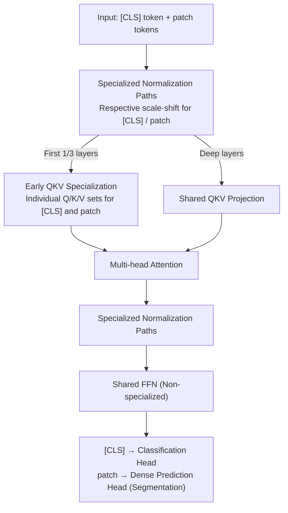

# Revisiting [CLS] and Patch Token Interaction in Vision Transformers

**Conference**: ICLR 2026  
**arXiv**: [2602.08626](https://arxiv.org/abs/2602.08626)  
**Code**: None  
**Area**: Image Segmentation / Vision Transformer  
**Keywords**: Vision Transformer, [CLS] token, patch token, normalization layer, dense prediction

## TL;DR
This paper analyzes the interaction friction between the [CLS] global token and local patch tokens in Vision Transformers. It observes that normalization layers implicitly differentiate these two token categories. By introducing specialized processing paths in normalization layers and early QKV projections, the authors achieve a segmentation performance gain of over 2 mIoU with only an 8% increase in parameters, while maintaining classification accuracy.

## Background & Motivation
Vision Transformer (ViT) has become a powerful, scalable, and general-purpose visual representation learner. In the standard ViT architecture, a learnable [CLS] class token is prepended to the patch token sequence to aggregate global information for classification. Despite the distinct semantic roles—[CLS] capturing global features and patches handling local features—they are **treated identically** throughout the model: passing through the same attention layers, the same FFN, and the same normalization layers.

This "one-size-fits-all" approach suffers from fundamental friction:

**Global vs. Local Competition**: The [CLS] token needs to aggregate global semantics from all patches, while each patch token needs to preserve its local spatial information. In shared attention calculations, these two objectives may interfere with each other.

**Implicit Bias in Normalization**: Standard LayerNorm/RMSNorm normalizes the entire token sequence, but the statistical properties (mean, variance) of [CLS] and patches can be inherently different. Uniform normalization may prevent both from achieving optimal representations.

**Limited Dense Prediction Performance**: When ViT is used for dense prediction tasks like segmentation or detection, this friction can degrade the quality of patch representations.

Key Insight: By analyzing the behavior of normalization layers in ViT, the authors found that these layers already **implicitly** differentiate [CLS] and patch tokens through systematic differences in normalization statistics. Since implicit differentiation already exists, can **explicit specialized processing** amplify this effect to optimize both global and local representations simultaneously?

## Method

### Overall Architecture
This work does not redesign the architecture but performs surgical fine-tuning on standard ViTs (ViT-S/B/L, etc.). The core premise is that the [CLS] token's goal of global aggregation and the patch tokens' goal of spatial preservation are contradictory, yet they are treated identically. After proving this friction through statistical analysis, the authors split two specific friction points into specialized paths: the **normalization layers shared by both tokens** are entirely separated, and the **QKV projections** in attention are specialized only for the first 1/3 of the layers. Meanwhile, the FFN, residual connections, and deep QKV projections remain shared. After modification, [CLS] is still fed to the classification head, and patch tokens are fed to the dense prediction head, increasing parameters by only ~8% while keeping inference FLOPs unchanged.

### Key Designs

**1. Discovery of Implicit Differentiation in Normalization: Diagnosing Friction Before Modification**

The methodology begins with a diagnosis rather than empirical trial and error. The authors examined ViTs under various pre-training regimes (Supervised, DINO, DINOv2, MAE) and measured the statistics of [CLS] and patch tokens within normalization layers. The results are clear: in standard LayerNorm, the mean and variance of [CLS] systematically deviate from the patch averages, and this deviation increases with depth. LayerNorm forces a single set of statistics and affine parameters $\gamma, \beta$ onto the entire sequence, effectively "flattening" existing differences and suppressing optimal individual representations. This finding suggested that providing **explicit specialized normalization** paths is the logical fix.

**2. Specialized Normalization Paths: Tuning Scales Separately**

Addressing the primary friction point, the authors split the sequence at the normalization layer in every block. They assign independent affine parameters $\gamma_{cls}, \beta_{cls}$ and $\gamma_{patch}, \beta_{patch}$ for each path. [CLS] learns normalization scales suitable for global aggregation, while patches learn scales that preserve local spatial details. Since this change only affects affine parameters, the computational complexity remains constant. Ablations show this single change accounts for most of the mIoU gains.

**3. Early QKV Projection Specialization: Diversifying Attention Early**

The Query-Key-Value (QKV) projections in attention serve as the second friction point. However, the authors restrict specialization **only to the first 1/3 of layers** (near the input). In these shallow layers, separate QKV matrices are used: the [CLS] Query learns how to "ask questions" to aggregate global info, while patch Queries learn to interact with neighbors for spatial coherence. Beyond the shallow layers, representations are already sufficiently differentiated by specialized normalization, making further QKV separation redundant. This addition, combined with specialized normalization, costs only ~8% extra parameters but adds another +1 mIoU. Consistent with Discovery 1, the FFN remains shared as specializing it yielded no benefits.

### Loss & Training
The modifications can be seamlessly embedded into any ViT pre-training or fine-tuning pipeline without additional loss terms or hyperparameters. It can be enabled during pre-training (e.g., within the DINOv2 framework) or adapted to existing standard ViTs during fine-tuning. The training pipeline remains unchanged, following original protocols (DINO self-distillation, MAE reconstruction, etc.).

## Key Experimental Results

### Main Results
Specialization brings consistent and significant gains on standard segmentation benchmarks:

| Task/Dataset | Metric | Prev. SOTA (Standard) | Ours | Gain |
|-----------|------|---------|----------|------|
| Semantic Seg. (ADE20K) | mIoU | baseline | +2+ mIoU | > 2 mIoU |
| Semantic Seg. (Other) | mIoU | baseline | Consistent | > 2 mIoU |
| Image Classification | Top-1 Acc | baseline | Stable | No loss |

Key Finding: A gain of >2 mIoU in segmentation is a substantial improvement, while classification accuracy remains unaffected or slightly improved, indicating that specialization does not trade off classification for segmentation.

### Ablation Study

| Config | Segmentation Perf. | Classification Perf. | Param Increase | Function |
|------|---------|---------|---------|------|
| Norm Specialization Only | Significant gain | Stable | ~4% | Core contribution |
| QKV Specialization Only | Moderate gain | Stable | ~4% | Complementary |
| Norm + QKV | Optimal | Stable/Slight Rise | ~8% | Combined effect |
| All layers QKV vs. Early | Early layers better | — | — | Deep sharing suffices |
| Different Scales | Consistent | Consistent | — | Effective for S/B/L |
| Different Frameworks | Consistent | Consistent | — | Supervised/SSL valid |

### Key Findings
- **Normalization layers are the primary source of friction**: Most performance gains are achieved by simply specializing normalization, confirming uniform normalization as the key bottleneck.
- **Early QKV specialization provides complementary gains**: Combined with normalization specialization, it further boosts performance.
- **QKV specialization is only needed early**: Gains diminish in deep layers, where representations are already successfully branched.
- **Generalization across scales and frameworks**: Effective from ViT-S to ViT-L and across supervised/DINOv2/MAE settings.
- **Parameter efficiency**: ~8% parameter increase yields 2+ mIoU gain with zero increase in inference FLOPs.

## Highlights & Insights
- **Analysis-Driven Design**: The design is not based on heuristics but on a diagnosis of normalization statistics.
- **Minimal Intervention Principle**: Specialization is introduced only where it matters (Norm and early QKV), keeping FFN and residuals shared.
- **Win-Win for Classif. and Dense Prediction**: Reveals that standard ViT classification does not require high-quality patch tokens, but dense prediction does. Specialization benefits segmentation much more than classification.
- **New Understanding of Norm Layers as "Information Bottlenecks"**: Highlights that normalization layers influence the representation development paths of different token types, not just training stability.

## Limitations & Future Work
- Evaluation is currently limited to segmentation and classification; performance on other dense tasks like depth estimation or optical flow is unknown.
- Lack of deep analysis on how representation geometry (isotropy, clustering) changes after specialized normalization.
- Not directly applicable to ViT variants without [CLS] tokens (e.g., those using global average pooling).
- The impact on non-ViT Transformers (e.g., Swin Transformer’s window attention) remains unexplored.
- Scaling to extremely large models (ViT-G) needs verification despite the low percentage increase in parameters.

## Related Work & Insights
- **DINOv2**: The specialization scheme can be integrated into DINOv2 pre-training to boost dense prediction capabilities.
- **ViT-Adapter**: Contrasts with "Internal Specialization"; while adapters add external modules, this method differentiates internal components.
- **Register Tokens**: Complements the role of [CLS] by adding non-semantic tokens to absorb attention noise, potentially intersecting with the friction issues identified here.
- **Layer by layer, module by module**: Complements this work’s module-level analysis by seeking properties like OOD robustness.

## Rating
- Novelty: ⭐⭐⭐⭐
- Experimental Thoroughness: ⭐⭐⭐⭐⭐
- Writing Quality: ⭐⭐⭐⭐⭐
- Value: ⭐⭐⭐⭐⭐

<!-- RELATED:START -->

## Related Papers

- [\[ICLR 2026\] Locality-Attending Vision Transformer](locality-attending_vision_transformer.md)
- [\[NeurIPS 2025\] Vision Transformers with Self-Distilled Registers](../../NeurIPS2025/segmentation/vision_transformers_with_self-distilled_registers.md)
- [\[CVPR 2025\] Revisiting Audio-Visual Segmentation with Vision-Centric Transformer](../../CVPR2025/segmentation/revisiting_audio-visual_segmentation_with_vision-centric_transformer.md)
- [\[ICLR 2026\] Salient Object Ranking via Cyclical Perception-Viewing Interaction Modeling](salient_object_ranking_via_cyclical_perception-viewing_interaction_modeling.md)
- [\[CVPR 2026\] The Missing Point in Vision Transformers for Universal Image Segmentation](../../CVPR2026/segmentation/the_missing_point_in_vision_transformers_for_universal_image_segmentation.md)

<!-- RELATED:END -->
