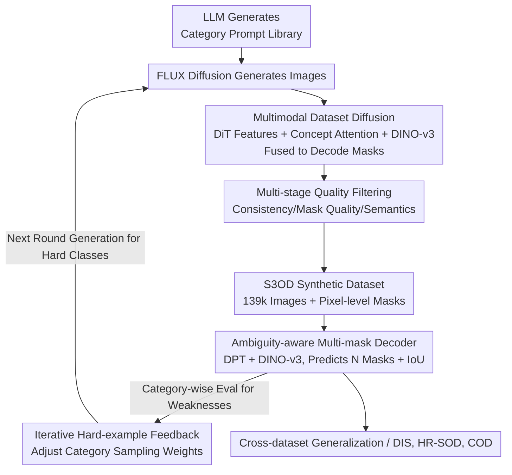

# S3OD: Towards Generalizable Salient Object Detection with Synthetic Data

**Conference**: ICLR 2026  
**OpenReview**: [https://openreview.net/forum?id=QdCp9VTOlO](https://openreview.net/forum?id=QdCp9VTOlO)  
**Paper**: [Project Page](https://s3odproject.github.io)  
**Code**: https://s3odproject.github.io (Project Page)  
**Area**: Salient Object Detection / Synthetic Data / Diffusion Models / Semantic Segmentation  
**Keywords**: Salient Object Detection, Multimodal Diffusion Labeling, Iterative Data Generation, Multi-mask Ambiguity Modeling, Cross-dataset Generalization

## TL;DR
To address the issues of expensive labeling, data scarcity, and fragmented sub-tasks (DIS / HR-SOD) in Salient Object Detection (SOD), this paper proposes a multimodal diffusion pipeline to simultaneously generate images and pixel-level masks. By incorporating iterative generation with hard-example feedback, the authors create S3OD, a high-resolution synthetic dataset of 139,000 images. Coupled with an ambiguity-aware multi-mask decoder, models trained solely on synthetic data reduce cross-dataset errors by 20–50% and achieve SOTA results on DIS and HR-SOD after fine-tuning.

## Background & Motivation

**Background**: Salient Object Detection aims to extract the "most attention-worthy" objects in an image as pixel-level masks, serving as a fundamental step for AR/VR, 3D reconstruction, and image editing. Recently, two demanding sub-tasks have emerged: DIS (Dichotomous Image Segmentation, pursuing extremely fine boundaries) and HR-SOD (2K–8K high-resolution salient detection). Prevailing approaches involve training specialized models for each sub-task/benchmark using complex architectures (e.g., multi-view fusion, iterative refinement, bilateral references).

**Limitations of Prior Work**: SOD is a typically "data-constrained" task—a single pixel-level precision label for a high-resolution sample can take up to 10 hours to create. Consequently, public datasets are small (DIS-5K has only 5K images, HRSOD only 2K). Small data sizes combined with domain gaps cause models to overfit specific sub-tasks rather than learning generalizable segmentation principles. Existing structural innovations offer only incremental gains without solving cross-domain generalization. Furthermore, "what is salient" is inherently subjective; different annotators may provide different masks for the same image. Deterministic single-output models are forced to "average" these potential solutions, leading to blurry regions with low confidence.

**Key Challenge**: The bottleneck lies in data scale and inherent data ambiguity rather than model complexity. However, supplementing data with synthetic samples faces traditional obstacles: pseudo-labeling is capped by the teacher model's capability (often sharing visual encoders with the student, locking the performance ceiling); methods generating masks directly from diffusion models suffer from noisy diffusion features and poor consistency; and mask-conditioned generation (e.g., MaskFactory) lacks diversity as it only varies slightly around the training set.

**Goal**: To unify DIS and HR-SOD into a single "high-fidelity salient segmentation" task while solving both ① data scarcity and ② inherent ambiguity.

**Key Insight**: The authors observe that large Diffusion Transformers (FLUX, 12B) already encode rich spatial and semantic information during the generation process. Instead of discarding these latent representations to use external teacher models, it is better to "read" supervision signals directly from within the generation process. Simultaneously, ambiguity should be explicitly handled using multi-branch predictions rather than forced averaging.

**Core Idea**: Extract multimodal features from within the diffusion process to decode pixel-level masks (bypassing teacher bottlenecks) + iteratively expand the library with hard-example feedback + multi-mask ambiguity modeling. Generalization is achieved through "data generation" rather than "structural stacking."

## Method

### Overall Architecture

S3OD consists of two interlocking pipelines: "data generation" and "model training." In the data generation pipeline: An LLM generates a diverse prompt library based on the ImageNet category system, which drives the FLUX diffusion model to generate images. Simultaneously, three complementary modalities are extracted from the diffusion process (DiT feature maps, concept attention maps, and DINO-v3 features from the decoded image). These are fused to decode high-quality masks strictly aligned with the images. After multi-stage filtering to remove poor samples, the S3OD dataset is formed. In the model training pipeline: A network based on DPT with a DINO-v3 backbone is used, where the prediction head is modified to output $N$ candidate masks and their respective IoU prediction scores to handle ambiguity via "multiple-choice learning." The two pipelines are closed via **iterative feedback**: the trained SOD model is evaluated category-by-category, and poorly performing categories are weighted more heavily in the next round of generation, allowing the dataset to evolve toward the model's weaknesses.

### Key Designs

**1. Multimodal Dataset Diffusion: Reading Pixel-level Supervision from Within, Bypassing Teacher Bottlenecks**

This design targets the pain point where synthetic labels are capped by external teachers and direct diffusion masks are noisy. The authors do not treat FLUX as a black box. Instead, they extract three complementary signals during generation: ① **DiT Feature Maps**—Features are taken from 4 single-stream Transformer blocks (layers {4, 16, 27, 36}) as image tokens $\mathbb{R}^{B\times L_I\times 3072}$, projected to 768 dimensions to encode multi-scale spatial layouts. ② **Concept Attention Maps**—Instead of averaging all text tokens (which is semantically vague), they use a fixed concept set. For each sample, they calculate the attention between the image patches and two specific concept tokens: "main object category name" and "background," $A_{concept}(x)=\mathrm{softmax}(o_x\cdot o_c^{\top})$, resulting in consistent and interpretable $\{A_{object}, A_{background}\}$. ③ **DINO-v3 Visual Features**—ViT-L semantic features are extracted from the decoded image to provide fine-grained object-level representation. These three paths are projected to a 256-dimensional space. FLUX and concept features are bilinearly upsampled to align with DINO-v3 resolution, concatenated, passed through two convolutional layers ($3\times3$ then $1\times1$), and residually added back to DINO-v3 features. This is fed into a DPT decoder, supervised by DIS-5K/HR-SOD/UHRSOD/DUTS to learn to decode multi-source signals into fine masks. Generative features (knowing "what" and "where" to draw) and discriminative features (robust semantics from DINO-v3) complement each other, ensuring strong image-mask alignment and removing the teacher model's ceiling. Ablations show that removing DINO-v3 causes a collapse (DIS $F_m$ drops from 0.917 to 0.710), while diffusion and concept features provide critical gains for difficult ambiguous samples.

**2. Multi-stage Quality Filtering: Using Consumer-grade Discriminators + VLM to Filter Synthetic Noise**

Synthetic data naturally contains "bad" samples that can pollute supervision. The authors use three gates: ① **Consistency Filtering**—A model trained independently (without FLUX features) predicts the original and horizontally flipped images. Samples with IoU below $\tau=0.8$ are removed (if even a robust model cannot provide consistent predictions, the image-mask pair is likely flawed). ② **Mask Quality Assessment**—A Gemma-3 VLM identifies severe artifacts like fragmentation or noise, keeping masks with cohesive white regions (≤5 principal components). ③ **Semantic Verification**—The VLM checks the "image + mask overlay" to confirm a clear salient object exists and the mask covers >70% of the main object. This process removes only 6.8% of samples but raises data quality to near-human levels while maintaining scale.

**3. Iterative Hard-example Feedback Generation: Evolving the Dataset Toward Model Weaknesses**

Static one-time generation wastes budget on simple classes the model already masters. The authors implement a closed-loop: after training on round $r$ data $D^{(r)}$, the model is evaluated per category $c_i$ on a hold-out set. For each image, they calculate $\kappa(I_j)$ (average IoU across augmentations like flipping; higher means more stable), then find the intra-class mean $\bar\kappa_i$. In the next round, category weights are amplified inversely to performance: $w_i^{(r+1)}=w_{min}+w_{new}e^{-\alpha(\bar\kappa_i-\beta)}$ (with $\alpha=8, \beta=0.5$). Poorly performing categories are oversampled, while good ones maintain a baseline weight. Three iterations were conducted (initial 100 images per class, then 25k prioritized hard class images in rounds 2 and 3), leading to a 3.6% $F_m$ gain on DIS and 5.3% on DUT-OMRON, proving that "targeting weaknesses" is more effective than static sampling.

**4. Ambiguity-aware Multi-mask Decoder: Explicitly Handling "Saliency Ambiguity" via Multiple-choice Learning**

To address the issue where single-output models produce blurry regions by averaging reasonable solutions, the authors modify the DPT-based prediction head to output $N$ soft masks $m_i\in(0,1)^{H\times W}$ and their respective predicted IoU scores $s_i$. Training utilizes multiple-choice learning: for each image with one ground truth (GT) $y$, the primary loss is backpropagated only to the branch $i^*$ that best matches the GT (highest IoU). To prevent other branches from degenerating, a relaxed assignment with decaying weights is used: $L=L_{i^*}+\lambda e^{-\gamma t}\sum_i^N L_i$ (where $t$ is the current epoch). ⚠️ Note: The original text denotes the best branch as $i^*=\arg\min_i \mathrm{IoU}(m_i, y)$, but semantically "best prediction" usually implies $\arg\max$; we follow the paper's notation. During inference, the model selects the mask with the highest predicted IoU score $s_i$ (trained via MSE against real IoU). Ablations show $N=3$ branches perform best ($F_m$ 0.914 vs. $N=1$ at 0.909). Oracle evaluation ($\mathrm{S3OD}^\star$), choosing the best match among three masks using GT, shows even higher gains, proving task inherent ambiguity.

### Loss & Training

The mask loss combines Focal Loss (handling foreground-background imbalance, $\tau=2$) and IoU Loss (region-level accuracy): $L_{mask}(m_i)=\lambda_{mask}L_{focal}(m_i)+L_{IoU}(m_i, y)$, with $\lambda_{mask}=10$. The total objective includes the mask loss of the best branch, the IoU score loss for all branches, and a decaying regularization across all masks:
$$L_{mask}(m_{i^*})+\sum_{i=1}^{N}\lambda_{score}L_{score}(s_i)+\lambda_{reg}e^{-\gamma t}L_{mask}(m_i)$$
where $\lambda_{score}=0.05, \lambda_{reg}=0.1, \gamma=0.2$. The student model uses a ViT-B backbone. FLUX uses 25-step inference to generate images with randomly sampled aspect ratios. Training on S3OD takes approximately 2 days on 8×H200 GPUs.

## Key Experimental Results

### Main Results

**Cross-dataset Generalization (Table 2)**: Models were trained on DIS-5K and evaluated on SOD benchmarks (and vice versa). S3ODNet trained *only* on synthetic S3OD data achieved superior generalization, reducing MAE by 50.0% / 46.7% / 20.7% / 42.9% / 34.4% across five datasets compared to training on DIS-5K, without touching any real training data.

| Training Data | DIS Overall $F_m$↑ | DIS Overall MAE↓ | DUTS-TE $F_m$↑ | DUT-OMRON $F_m$↑ |
|:---|:---:|:---:|:---:|:---:|
| InSpyreNet (DUTS) | .811 | .065 | — | — |
| BiRefNet (SOD) | .825 | .058 | — | — |
| S3ODNet (SOD) | .863 | .049 | — | — |
| **S3ODNet (S3OD Synthetic)** | **.881** | **.039** | .937 | .860 |

**SOTA Comparison (Fine-tuned, Table 4)**: S3OD pre-trained models were fine-tuned on DIS-5K / SOD combinations. On DIS-5K, the error rates across four levels were reduced by 14.0% / 7.3% / 20.6% / 17.1%, setting a new SOTA. Robust generalization is best shown on **DUT-OMRON** (never seen during training): error rates dropped by 24.8% / 13.6% / 26.9% / 15.8% compared to BiRefNet.

**Cross-task to Camouflaged Object Detection (COD, Table 6)**: The model trained solely on S3OD synthetic data outperformed models trained on SOD/DIS/MaskFactory when zero-shot evaluated on COD10K/CAMO/NC4K. After fine-tuning on COD, it reached $F_m=0.911$ on COD10K (vs. BiRefNet 0.888) and $F_m=0.923$ on NC4K (vs. 0.909).

### Ablation Study

| Configuration | Key Metric | Description |
|:---|:---:|:---|
| Full Tri-modal (DINO-v3 + DiT + Concept) | DIS $F_m$ .917 | Complete model, optimal |
| w/o DINO-v3 | DIS $F_m$ .710 | Significant performance collapse |
| w/o DiT Feature Maps | DIS $F_m$ .913 | Slight drop, affects hard ambiguous samples |
| w/o Concept Attention Maps | DIS $F_m$ .914 | Slight drop |
| Backbone Swin-B ($N{=}1$) | DIS $F_m$ .884 | DINO-v3 ($N{=}1$) improves this to .909 |
| Multi-mask $N{=}3$ | DIS $F_m$ .914 | Optimal branches (vs $N{=}1$ at .909) |
| Iteration Round 1 → Round 3 | DIS $F_m$ +3.6% | DUT-OMRON +5.3% |
| Prompt: Class names → GPT | IS 67.8 → 98.1 | Inception Score +44.7%, CLIP .399→.434 |

### Key Findings
- **DINO-v3 is the foundation, Diffusion features are the supplement**: Removing DINO-v3 makes the model nearly unusable ($F_m$ 0.710), but relying solely on it suffers from train-test distribution gaps on generated images. DiT and concept features provide critical complementary gains for hard, ambiguous samples.
- **Data Scale > Structural Complexity**: Various methods yield similar results on DIS-5K (only 3k images), indicating sub-task overfitting stems from data volume. Moving BiRefNet/MVANet to S3OD training improved generalization for all, confirming "data generation" benefits the entire field.
- **Benchmarks are Saturated**: On small sets like UHRSD and DAVIS-S (92 images), results for major Transformer models converge, supporting the author's claim that cross-task generalization is the true measure.
- **Ambiguity is Real**: The oracle $\mathrm{S3OD}^\star$ significantly outperforms the single-selection version, quantifying that the task's inherent diversity is worth modeling.

## Highlights & Insights
- **Repurposing "Intermediate Products":** DiT activations and concept attention inside the generation process are usually discarded. The authors fuse them with DINO-v3 to decode masks, bypassing teacher ceilings and ensuring high image-mask alignment—a "generation is labeling" strategy applicable to other dense prediction tasks.
- **Closed-loop Reinforced Data Generation:** Using downstream model performance to adjust sampling distributions allows the dataset to "self-evolve," making production much more efficient than static generation.
- **Explicitly Handling Ambiguity:** Instead of forcing a single output to "average" conflicting labels, multiple branches provide reasonable solutions. This simplifies the architecture (lighter than multi-view fusion) and treats saliency ambiguity as a model capability rather than an error.

## Limitations & Future Work
- **Dependency on Large Models:** The pipeline is tied to FLUX-12B, DINO-v3, Gemma-3 VLM, and GPT, resulting in high computational barriers and quality dependence on upstream models.
- **Sim-to-Real Gap:** DINO-v3 encounters a train-test gap on synthetic images. While synthetic data is powerful, absolute SOTA still requires fine-tuning on real data; synthetic data currently cannot fully replace human labels.
- **Oracle Evaluation Cost:** The oracle $\mathrm{S3OD}^\star$ requires GT to select the best mask, making it not directly comparable to other deterministic methods.
- **Future Directions:** Categorization is currently based on ImageNet; exploring open-world or long-tail prompts could be beneficial. Systematic trade-offs between $N$, iterations, and budget also warrant research.

## Related Work & Insights
- **vs. DatasetDM / Diffusion Masks:** These rely on attention means, often resulting in noisy labels and poor boundaries in multi-object scenes. S3OD uses static concept attention + multimodal fusion for cleaner, aligned labels.
- **vs. MaskFactory (Mask-conditioned):** MaskFactory performs rigid transformation on DIS-5K masks then generates images, limiting diversity to variants of the training set. S3OD generates complex scenes from free-form prompts, yielding much stronger cross-benchmark generalization.
- **vs. Teacher Distillation:** These are capped by the teacher's capability. S3OD extracts supervision from the generative process itself.
- **vs. BiRefNet / MVANet / InSpyreNet:** These rely on complex structural designs for precision but are bound by small data and deterministic outputs. S3OD uses a lighter multi-mask DPT with large-scale synthetic data to solve scarcity and ambiguity simultaneously.

## Rating
- Novelty: ⭐⭐⭐⭐⭐ Fusing internal multimodal diffusion signals + iterative feedback + ambiguity modeling is a fresh approach in SOD.
- Experimental Thoroughness: ⭐⭐⭐⭐⭐ Extensive cross-dataset, SOTA fine-tuning, COD cross-task, and five ablation tables provide a complete chain of evidence.
- Writing Quality: ⭐⭐⭐⭐ Clear motivation and execution; some minor notation ambiguities (argmin/argmax) require careful reading.
- Value: ⭐⭐⭐⭐⭐ Addressing "data scarcity" as the core bottleneck provides a reusable synthetic data paradigm for dense prediction tasks.

<!-- RELATED:START -->

## Related Papers

- [\[CVPR 2026\] Generalizable Co-Salient Object Detection via Mixed Content-Style Modulation](../../CVPR2026/segmentation/generalizable_co-salient_object_detection_via_mixed_content-style_modulation.md)
- [\[ICLR 2026\] Salient Object Ranking via Cyclical Perception-Viewing Interaction Modeling](salient_object_ranking_via_cyclical_perception-viewing_interaction_modeling.md)
- [\[CVPR 2026\] Synthetic Object Compositions for Scalable and Accurate Learning in Detection, Segmentation, and Grounding](../../CVPR2026/segmentation/synthetic_object_compositions_for_scalable_and_accurate_learning_in_detection_se.md)
- [\[ICML 2026\] What Makes Synthetic Data Effective in Image Segmentation](../../ICML2026/segmentation/what_makes_synthetic_data_effective_in_image_segmentation.md)
- [\[CVPR 2026\] Uncertainty-Aware Modality Fusion for Unaligned RGB-T Salient Object Detection](../../CVPR2026/segmentation/uncertainty-aware_modality_fusion_for_unaligned_rgb-t_salient_object_detection.md)

<!-- RELATED:END -->
