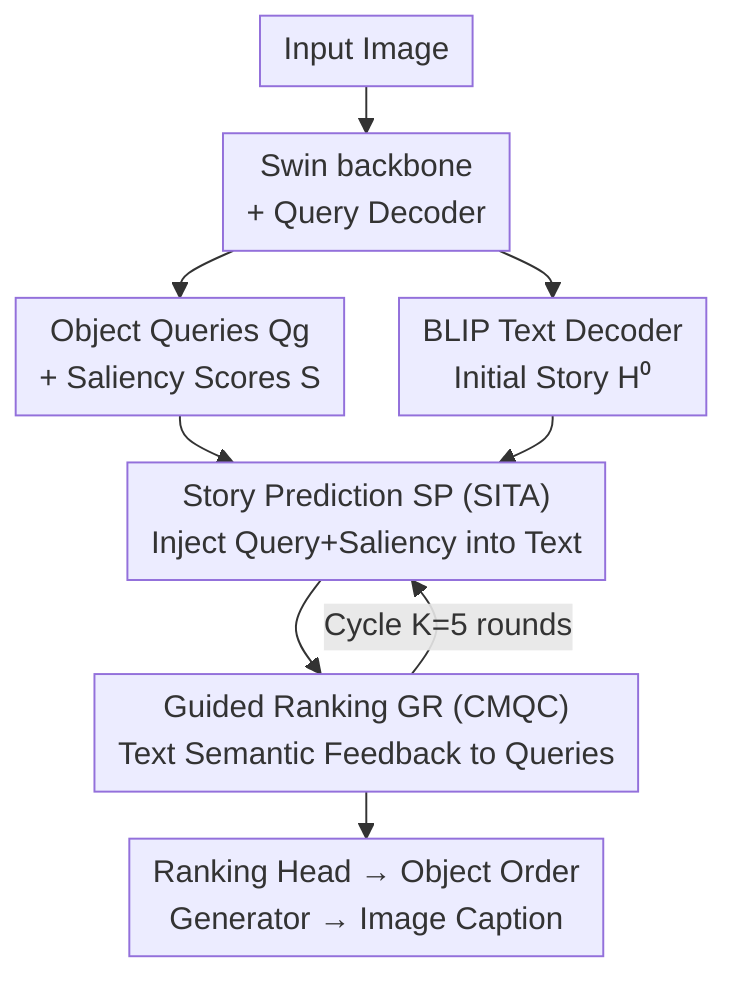

# Salient Object Ranking via Cyclical Perception-Viewing Interaction Modeling

**Conference**: ICLR 2026  
**OpenReview**: [https://openreview.net/forum?id=RDOlvzwSyF](https://openreview.net/forum?id=RDOlvzwSyF)  
**Code**: Yes (Annotated as "Codes are available here", refer to the original paper for the repository address)  
**Area**: Salient Instance Segmentation / Salient Object Ranking  
**Keywords**: Salient Object Ranking, Top-down Cognition, Image Captioning, Cyclical Interaction, Object Query

## TL;DR
Addressing the long-standing reliance of Salient Object Ranking (SOR) on bottom-up image features, this paper proposes to explicitly model the top-down cognitive process through "Cyclical Perception-Viewing Interaction." By allowing an image captioning module (SP) and a salient ranking module (GR) to iteratively exchange results for $K$ rounds, the model achieves SA-SOR scores of 0.787 / 0.624 on the ASSR and IRSR benchmarks, outperforming the previous SOTA, QAGNet.

## Background & Motivation
**Background**: Salient Object Ranking (SOR) aims to predict the order in which human attention shifts among multiple salient objects during free viewing. It requires both detecting salient instances and assigning a "viewing order." Mainstream approaches like RSDNet, ASRNet, and more recent SeqRank, QAGNet, DSGNN, PoseSOR, and others extract various cues from images: object coordinates, inter-object graph relationships, spatial/object attention, foveal-peripheral vision, scene graphs, object shapes/textures, and even human poses.

**Limitations of Prior Work**: These cues are predominantly **bottom-up**, originating purely from image pixels or semantic features. In semantically complex scenes, low-level visual cues can be unreliable. For example, in Fig.1 of the paper, PoseSOR incorrectly prioritizes a television because the poses of two people are oriented toward it. Methods relying solely on "intrinsic image" cues like shape and pose often fail to replicate actual human attention shifts.

**Key Challenge**: Cognitive science research indicates that during free viewing, the brain instinctively performs **scene perception** to maximize understanding, focusing fixations on objects most critical to the global scene context. In other words, human attention shifts are driven by an **evolving scene-level understanding (story)**—a **top-down** cognitive pathway that existing SOR methods almost entirely ignore. Perception and viewing interact **cyclically**: a prediction of the "story" is formed by viewing key objects, which in turn guides where to look next, and the new content subsequently updates the story until a stable state is reached.

**Goal**: To explicitly model this "Perception $\leftrightarrow$ Viewing" cyclical cognitive pathway within SOR, allowing the model to utilize semantic scene understanding during ranking and leverage current ranking results to understand the scene.

**Core Idea**: Conceptualize "scene understanding" as an **image captioning** task. A Story Prediction (SP) module and a Guided Ranking (GR) module are used in a dual-branch, mutually conditional, and iterative manner. The SP module generates or completes image descriptions based on current ranking results, while the GR module refines the viewing order of salient objects based on the current description, achieving synergistic self-correction.

## Method

### Overall Architecture
The model is a **dual-branch + cyclical iterative** multi-task framework that jointly performs "salient ranking" and "image captioning," with each feeding results to the other. Given an input image, it outputs masks and ranks for salient instances, along with a caption describing the scene.

Specific workflow: The image passes through a Swin Transformer backbone to extract feature pyramids $\text{feats}_i \in \mathbb{R}^{C_i \times H_i \times W_i}$. A set of learnable object queries $Q_0 \in \mathbb{R}^{N \times D}$ absorbs multi-scale object features through $L$ layers of a Transformer Query Decoder, aggregating into global queries $Q_g$. A ranking head then produces saliency scores $S = \text{Linear}(Q_g)$. Simultaneously, backbone visual features are projected into image embeddings $E_{img}$ as cross-modal context, and a pre-trained BLIP text decoder autoregressively generates initial textual features $H^{(0)}$ from a `[BOS]` token.

The core lies in the **cyclical interaction**: In round $k$, the SP module utilizes Saliency-Infused Textual Augmentation (SITA) to inject queries and saliency scores into textual features $H^{(k)} = \text{SITA}(Q_g^{(k-1)}, S^{(k-1)}, H^{(k-1)})$. The GR module then feeds the enhanced textual features back into the global queries via Cross-Modal Query Contextualization (CMQC), $Q_g^{(k)} = \text{CMQC}(Q_g^{(k-1)}, H^{(k)})$. This repeats for $K$ rounds (default $K=5$), with $Q_g^{(K)}$ producing the final ranking and $H^{(K)}$ decoding the final caption. SP implements the "Viewing $\rightarrow$ Perception" pathway, while GR implements the "Perception $\rightarrow$ Viewing" pathway, forming a complete perception-viewing loop.

### Key Designs

**1. Cyclical Perception-Viewing Interaction: Closing the Loop on Top-Down Cognition**

This is the framework's backbone, directly addressing the missing top-down pathway in existing methods. Instead of treating ranking as a one-pass forward prediction, "scene understanding" and "attention ranking" are updated alternately and conditionally over $K$ rounds. Formally, this involves two nested update equations: $H^{(k)} = \text{SITA}(Q_g^{(k-1)}, S^{(k-1)}, H^{(k-1)})$ and $Q_g^{(k)} = \text{CMQC}(Q_g^{(k-1)}, H^{(k)})$. The first equation allows "which salient objects are currently seen" to shape the "understanding of the scene story," while the second uses the "updated story" to guide "where to look and how to rank."

This mechanism is effective because it replicates "active perception / predictive coding" in cognitive science: an observer fixates on key objects to form a story prediction, which guides further attention shifts, and the new content subsequently refines the story until convergence. An example in the paper shows that when the scene contains the "video games" perception clue, the model correctly focuses on the TV and then the person playing; PoseSOR, looking only at pose, is misled. Disabling the interaction (Table 3, Setting I, "First" ranking before interaction) causes SA-SOR to plummet from 0.767 to 0.531, validating the closed loop as the primary source of gain.

**2. Story Prediction Module (SP) and SITA: Enhancing Scene Descriptions via Salient Objects**

The SP module implements the "Viewing $\rightarrow$ Perception" pathway, explicitly formulating scene understanding as image captioning and using saliency information to modulate textual features. The core is SITA (Saliency-Infused Textual Augmentation). It weights global queries by saliency scores and averages them across the object dimension to produce a compact salient visual context vector $V_{sal} = \frac{1}{N}\sum_{i=1}^{N}(Q_g[i] \odot S[i])$, where $\odot$ denotes element-wise multiplication. This vector is projected to align with text dimension $D_t$ and broadcast across the text sequence to obtain $V_{sal}^{align}$.

A **gating** mechanism then controls the injection of saliency information into the text: a gate $G = \sigma(\text{GELU}(V_{sal}^{align}W_1 + b_1)W_2 + b_2)$ dynamically scales the MLP output of the original textual features, while retaining a residual connection: $H^{(k)} = \text{MLP}(H^{(k-1)}) \odot G + H^{(k-1)}$. Residuals preserve basic linguistic patterns, while the gating allows saliency to permeate "as needed"—described by the authors as mimicking neural gain modulation, where attention adaptively scales features. This ensures captions are grounded in visually salient regions rather than being generic descriptions. Table 4 shows that as iterations increase, caption CIDEr rises from 0.362 to 0.462 and SPICE from 0.114 to 0.161.

**3. Guided Ranking Module (GR) and CMQC: Guiding Viewing Order via Scene Stories**

The GR module implements the "Perception $\rightarrow$ Viewing" pathway, refining object queries using linguistic features to determine ranking. The core is CMQC (Cross-Modal Query Contextualization). High-dimensional textual features $H \in \mathbb{R}^{L_s \times D_t}$ are mapped via a learnable linear transformation with LayerNorm to a latent space of the same dimension as the queries, performing cross-modal alignment while preserving linguistic structure. **Multi-head cross-attention** then allows object queries to interact with textual features via scaled dot-product, updating iteratively through residuals: $Q_g^{(k+1)} = Q_g^{(k)} + \text{MultiHeadAttn}(Q_g^{(k)}, H^{(k)})$.

This step allows queries to "match" relevant linguistic cues—for instance, aligning a query related to clothing with a token like "striped shirt," thereby integrating scene semantics into the ranking criteria while suppressing irrelevant linguistic noise. The residual structure maintains spatial priors, and the iterative process is likened to predictive coding: residual updates minimize the prediction error between "current query values" and "expected values guided by text." Finally, $Q_g^{(K)}$ passes through the ranking head to produce saliency scores for final ranking.

### Loss & Training
The model is trained end-to-end with a total loss $L = L_{task} + L_{rank} + L_{lm}$. $L_{task} = L_{mask} + L_{cls}$ follows the Mask2Former configuration, where $L_{mask}$ uses binary cross-entropy + Dice loss for instance mask prediction, and $L_{cls}$ uses cross-entropy to determine instance saliency. $L_{rank}$ is the saliency ranking loss as used in IRSR. $L_{lm}$ is the cross-entropy loss between generated and ground truth captions. Implementation uses a Swin Transformer pre-trained on MS-COCO as the backbone and a pre-trained BLIP text decoder to generate $H^{(0)}$. For each image, one of its five COCO captions is randomly selected as ground truth. Hyperparameters: $N=200, K=5, D=256$, input resize to $1024\times1024$. Training via AdamW on 4x RTX 3090 for 24,000 iterations. At inference, objects with confidence > 0.7 are considered salient instances.

## Key Experimental Results

### Main Results
Comparison with various SOD / SID / Instance Segmentation / SOR methods on ASSR and IRSR benchmarks (all methods retrained for fairness). Metrics: SA-SOR↑ (ranking score with detection penalty), SOR↑ (Spearman rank correlation), MAE↓ (mask pixel error).

| Dataset | Metric | Ours | Prev. SOTA (QAGNet) | Gain |
|---------|--------|------|--------------------|------|
| ASSR | SA-SOR ↑ | **0.787** | 0.771 | +1.95% |
| ASSR | SOR ↑ | **0.869** | 0.857 | Superior |
| ASSR | MAE ↓ | **5.28** | 5.78 | -8.65% |
| IRSR | SA-SOR ↑ | **0.624** | 0.616 | Superior |
| IRSR | SOR ↑ | **0.822** | 0.818 | Superior |
| IRSR | MAE ↓ | **6.89** | 6.71 | Slightly Inferior |

Ours achieves SOTA on the strictest SA-SOR metric across both benchmarks, with SOR and MAE generally leading (though MAE on IRSR is slightly behind QAGNet’s 6.71).

### Ablation Study
Incremental component addition (ASSR), where $S^{(k)}$ denotes saliency scores of object queries at each step:

| Configuration | Component | SA-SOR↑ | SOR↑ | MAE↓ | Description |
|---------------|-----------|---------|------|------|-------------|
| I | baseline (direct scoring) | 0.697 | 0.841 | 7.71 | No interaction |
| II | + caption supervision | 0.722 | 0.847 | 6.83 | Multi-task captioning |
| III | + CMQC | 0.729 | 0.849 | 6.62 | Text-to-query feedback |
| IV | + SITA (re-weighting) | 0.734 | 0.847 | 6.21 | Adding $S^{(k)}$ only |
| V | + SITA (gating) | 0.748 | 0.854 | 6.27 | Adding Gate only |
| VI | Full SITA | **0.752** | **0.861** | **5.99** | Combined re-weighting + Gate |

Iteration steps ablation (Table 3): Scoring before interaction (Setting I) yields an SA-SOR of only 0.531, which jumps to 0.747 upon enabling interaction. From steps 3$\rightarrow$4$\rightarrow$5, SA-SOR increases 0.747$\rightarrow$0.754$\rightarrow$0.767. $K=5$ is optimal, as $K=6$ drops to 0.764 and MAE saturates.

### Key Findings
- **Cyclical interaction is the primary source of gain**: Disabling the interaction (using pre-interaction queries) drops SA-SOR from 0.767 to 0.531, proving that the perception-viewing loop itself, rather than simple multi-tasking, is core.
- **SITA's re-weighting and gating are complementary**: Adding them individually (IV/V) provides gains, but the combination (VI) yields the best SA-SOR of 0.752 and lowest MAE of 5.99, indicating non-redundant paths.
- **Sweet spot for iterations**: $K=5$ is the optimal point for both ranking and captioning (CIDEr 0.462); beyond this, marginal returns become negative, suggesting a convergence of the loop.
- **Performance scales with semantic density**: Defining semantic density $\rho = \text{round}(\text{caption word count} / \text{salient object count})$, the Pearson correlation between $\rho$ and SA-SOR across 600 ASSR test images is 0.714 ($p=0.00416$). This confirms the method's advantage in semantically rich scenes, aligning with the "top-down understanding" motivation.

## Highlights & Insights
- **Explicitly linking scene understanding to the ranking loop**: The most insightful aspect is grounding abstract "scene understanding" into image captioning and making it mutually conditional with ranking. This provides SOR with a trainable, interpretable top-down signal rather than just more intrinsic image cues.
- **Bi-directional injection via distinct mechanisms**: Viewing $\rightarrow$ Perception uses "saliency weighting + gated residual" (SITA), while Perception $\rightarrow$ Viewing uses "cross-modal cross-attention residual" (CMQC). Both directions are tailored to their modal characteristics rather than using simple symmetric concatenation.
- **Cognitive science motivation translated to formula**: Gating maps to neural gain modulation and residual updates map to predictive coding. This alignment between motivation and mechanism is transferable to other vision tasks requiring top-down guidance like gaze prediction or VQA attention.
- **Semantic density analysis defines boundary conditions**: Using a simple ratio to clarify where the method excels is a practical and reusable analytical trick.

## Limitations & Future Work
- **Reliance on caption ground truth and pre-trained decoders**: Training requires MS-COCO captions, and initialization depends on BLIP. Transfer costs to domains without high-quality descriptions (e.g., medical, remote sensing) are unknown.
- **Limited gain in low-semantic/simple scenes**: SA-SOR is significantly lower in images with low $\rho$ (e.g., the $\rho=7$ group only reaches 0.629), indicating that in scenes with few objects and no "story," top-down signals might be unhelpful or even noisy.
- **Inference overhead from iterations**: $K=5$ cycles + autoregressive captioning incurs a computational cost compared to single-pass methods (refer to original Table 7 for FPS analysis).
- **Lower MAE on IRSR**: On IRSR, the MAE of 6.89 is higher than QAGNet's 6.71, suggesting mask precision might not be superior in scenes with more objects (up to 8).

## Related Work & Insights
- **vs PoseSOR / DSGNN / QAGNet (Bottom-up SOR)**: These methods model object-context relationships via human pose, shape/texture graph edges, or hyper-graphs/nested GNNs, all mining clues from the image itself. Ours introduces top-down "scene story" guidance, avoiding misdirection by low-level cues (e.g., not incorrectly focusing on a TV due to pose).
- **vs Liu et al. 2025 (Implicit order in LVLM descriptions)**: While both use language, that work uses implicit ordering in LVLM descriptions as external supervision. Ours treats captioning as an endogenous, iteratively refined branch coupled bi-directionally with ranking.
- **vs Mask2Former / QueryInst (Instance Segmentation backbones)**: $L_{task}$ in this paper directly adopts Mask2Former’s mask/classification losses as a detection foundation, then overlays the cyclical interaction of ranking and captioning, effectively "cognitivizing" a general instance segmentation framework.

## Rating
- Novelty: ⭐⭐⭐⭐⭐ First to explicitly formulate top-down "perception-viewing cycles" as a bi-directional caption$\leftrightarrow$ranking loop, well-supported by cognitive science.
- Experimental Thoroughness: ⭐⭐⭐⭐ Solid across two benchmarks with component ablations, iteration/density/efficiency analysis, though IRSR MAE is not a clean sweep.
- Writing Quality: ⭐⭐⭐⭐ Clear mapping between motivation and mechanism; cognitive analogies are consistent, though some module details require checking the appendix.
- Value: ⭐⭐⭐⭐ Provides a paradigm for trainable top-down signals in SOR; semantic density analysis characterizes clear boundary conditions.

<!-- RELATED:START -->

## Related Papers

- [\[ICLR 2026\] S3OD: Towards Generalizable Salient Object Detection with Synthetic Data](s3od_towards_generalizable_salient_object_detection_with_synthetic_data.md)
- [\[ICLR 2026\] Revisiting \[CLS\] and Patch Token Interaction in Vision Transformers](revisiting_cls_and_patch_token_interaction_in_vision_transformers.md)
- [\[CVPR 2026\] Uncertainty-Aware Modality Fusion for Unaligned RGB-T Salient Object Detection](../../CVPR2026/segmentation/uncertainty-aware_modality_fusion_for_unaligned_rgb-t_salient_object_detection.md)
- [\[CVPR 2026\] Generalizable Co-Salient Object Detection via Mixed Content-Style Modulation](../../CVPR2026/segmentation/generalizable_co-salient_object_detection_via_mixed_content-style_modulation.md)
- [\[ICLR 2026\] ByteFlow: Language Modeling through Adaptive Byte Compression without a Tokenizer](byteflow_language_modeling_through_adaptive_byte_compression_without_a_tokenizer.md)

<!-- RELATED:END -->
